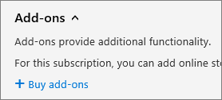
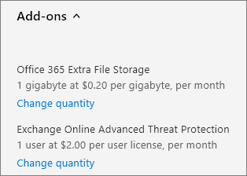
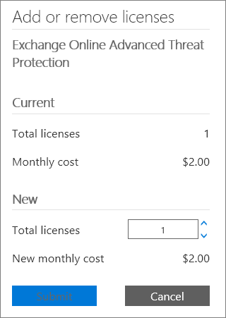

# Buy or manage add-ons

::: moniker range="o365-21vianet"

> [!NOTE]
> The admin center is changing. If your experience doesn't match the details presented here, see 
[About the new Microsoft 365 admin center](https://docs.microsoft.com/microsoft-365/admin/microsoft-365-admin-center-preview?view=o365-21vianet&preserve-view=true).

::: moniker-end

Many Microsoft 365 for business plans have add-ons that you can buy for your subscriptions. Add-ons provide additional features to enhance your subscription experience.

There are two types of add-ons:

1. **Traditional add-ons** are linked to a specific subscription. If you cancel the subscription, the associated add-on is also canceled.
2. **Standalone add-on subscriptions** appear as a separate subscription on the **Your products** page and have their own expiration date. Unlike traditional add-ons, standalone add-on subscriptions aren’t linked to a specific subscription. You manage a standalone add-on subscription the same way that you manage any other subscription.

## Before you begin

You must be a Global or Billing admin to do the steps described in this article. For more information, see [About admin roles](../admin/add-users/about-admin-roles.md).

## Buy an add-on

Use the following steps to find and buy add-ons. The list only includes add-ons that are available to you. This list is based on your currently active subscriptions, and any other existing add-ons you already have. If an add-on isn’t on the list, it’s not available to buy.

For information about Skype for Business add-ons, see [Skype for Business and Microsoft Teams add-on licensing](https://docs.microsoft.com/SkypeForBusiness/skype-for-business-and-microsoft-teams-add-on-licensing/skype-for-business-and-microsoft-teams-add-on-licensing).

::: moniker range="o365-worldwide"

1. In the admin center, go to the **Billing** \> <a href="https://go.microsoft.com/fwlink/p/?linkid=868433" target="_blank">Purchase services</a> page.
2. At the bottom of the **Purchase services** page, select **Add-ons**.
3. On the **Purchase services** page, select the add-on that you want to buy.
4. On the product details page, select **Buy**.
5. If needed, complete any additional order information. This information might include selecting the subscription the add-on is for. When you’re finished, select **Check out now**.
6. If needed, review the order and pricing information, then select **Next**.
7. Choose a payment method, or add a new one, then select **Place order** > **Go to Admin Home**.

::: moniker-end

::: moniker range="o365-germany"

1. In the admin center, go to the **Billing** \> <a href="https://go.microsoft.com/fwlink/p/?linkid=847745" target="_blank">Subscriptions</a> page.
2. On the **Subscriptions** page, select the subscription for which you want to buy an add-on.
3. On the bottom-left corner of the subscription details, select **Add-ons** \> **Buy add-ons**.
    
4. On the **Purchase services** page, mouse over or tap the add-on subscription that you want to buy, and then select **Buy now**.
5. Enter the number of licenses that you need, and choose whether to pay each month or for the whole year. Choose whether to automatically assign licenses to everyone who doesn't currently have one. If shown, select a base subscription.
6. Select **Check out now**.
7. Review the pricing information, and then select **Next**.
8. Provide your payment information, and then select **Place order** \> **Go to Admin Home**.

::: moniker-end

::: moniker range="o365-21vianet"

1. In the admin center, go to the **Billing** \> <a href="https://go.microsoft.com/fwlink/p/?linkid=850626" target="_blank">Subscriptions</a> page.
2. On the **Subscriptions** page, select the subscription for which you want to buy an add-on.
3. On the bottom-left corner of the subscription details, select **Add-ons** \> **Buy add-ons**.
    
4. On the **Purchase services** page, mouse over or tap the add-on subscription that you want to buy, and then select **Buy now**.
5. Enter the number of licenses that you need, and choose whether to pay each month or for the whole year. Choose whether to automatically assign licenses to everyone who doesn't currently have one. If shown, select a base subscription.
6. Select **Check out now**.
7. Review the pricing information, and then select **Next**.
8. Provide your payment information, and then select **Place order** \> **Go to Admin Home**.

::: moniker-end

## Manage an add-on

You manage a standalone add-on subscription the same way that you manage any other subscription – on the **Your products** page. For example, you can [buy or remove licenses](licenses/buy-licenses.md), [manage recurring billing](subscriptions/renew-your-subscription.md), and [edit or replace payment methods](billing-and-payments/manage-payment-methods.md) for standalone add-on subscriptions.

You manage a traditional add-on by going to the subscription that contains it and making changes there. Use the following steps to manage a traditional add-on.
  
::: moniker range="o365-worldwide"

1. In the admin center, go to the **Billing** \> <a href="https://go.microsoft.com/fwlink/p/?linkid=842054" target="_blank">Your products</a> page.
2. On the **Products** tab, select the subscription that contains the add-on that you want to update.
3. On the subscription details page, the **Add-ons** section lists the add-ons that you bought. Select **Manage add-ons**.
4. In the **Manage add-ons** pane, from the **Add-on** drop-down list, select the add-on that you want to change.
5. Enter a quantity change for the add-on, then select **Save**.

::: moniker-end

::: moniker range="o365-germany"

1. In the admin center, go to the **Billing** \> <a href="https://go.microsoft.com/fwlink/p/?linkid=847745" target="_blank">Subscriptions</a> page.
2. On the **Subscriptions** page, select the subscription for which you want to update an add-on.
3. Select **Add-ons**.
    The add-ons that you have purchased are shown and each of the add-ons will have a **Change quantity** link below it.
4. Select the **Change quantity** link for the add-on that you want to update.\
    
5. Enter the number of user licenses that you need in the box, and then select **Submit**.
    > [!TIP]
    > You can also use the up-arrow and down-arrow to change the quantity of user licenses or just enter the number you want in the box.

    

::: moniker-end

::: moniker range="o365-21vianet"

1. In the admin center, go to the **Billing** \> <a href="https://go.microsoft.com/fwlink/p/?linkid=850626" target="_blank">Subscriptions</a> page.
2. On the **Subscriptions** page, select the subscription for which you want to update an add-on.
3. Select **Add-ons**.
    The add-ons that you have purchased are shown and each of the add-ons will have a **Change quantity** link below it.
4. Select the **Change quantity** link for the add-on that you want to update.\
    
5. Enter the number of user licenses that you need in the box, and then select **Submit**.
    > [!TIP]
    > You can also use the up-arrow and down-arrow to change the quantity of user licenses or just enter the number you want in the box.
  
    

::: moniker-end

## Remove an add-on

To remove a standalone add-on subscription, you [cancel the subscription](subscriptions/cancel-your-subscription.md), just like any other subscription. Or you can [turn off Recurring billing](subscriptions/renew-your-subscription.md).

You can’t remove a traditional add-on. If you want to remove a traditional add-on, [contact support for help](../admin/contact-support-for-business-products.md).
  
## Related content

[Add storage space for your subscription](add-storage-space.md) (article)\
[Buy or remove subscription licenses](licenses/buy-licenses.md) (article)\
[Turn Recurring billing off or on](subscriptions/renew-your-subscription.md#turn-recurring-billing-off-or-on) (article)\
[Manage payment methods](billing-and-payments/manage-payment-methods.md) (article)