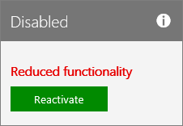

# Reactivate your subscription

::: moniker range="o365-21vianet"

> [!NOTE]
> The admin center is changing. If your experience doesn't match the details presented here, see 
[About the new Microsoft 365 admin center](https://docs.microsoft.com/microsoft-365/admin/microsoft-365-admin-center-preview?view=o365-21vianet).

::: moniker-end

You can reactivate your subscription in the admin center if: the subscription expired, was disabled by Microsoft, or if you canceled it in the middle of a subscription term.
  
## Before you begin

You must be a Global or Billing admin to reactivate a subscription. For more information, see [About admin roles](../../admin/add-users/about-admin-roles.md).

**Not an admin?** Contact your administration to reactivate your subscription.

## Reactivate a subscription

::: moniker range="o365-worldwide"

1. In the admin center, go to the **Billing** \> <a href="https://go.microsoft.com/fwlink/p/?linkid=842054" target="_blank">Your products</a> page.
2. On the **Products** tab, find the subscription that you want to reactivate. Select **More actions** (three dots), then select **Reactivate this subscription**.\
    If you don't see **Reactivate this subscription**, [contact support](../../admin/contact-support-for-business-products.md).
3. In the **Reactivate this subscription** pane, select a payment method from the drop-down list, or select **Add payment method**.
4. Select **Save**.

::: moniker-end

::: moniker range="o365-germany"
  
1. In the admin center, go to the **Billing** \> <a href="https://go.microsoft.com/fwlink/p/?linkid=847745" target="_blank">Subscriptions</a> page.

2. Find the subscription that you want to reactivate, then select **Reactivate**.

    
  
    If you don't see **Reactivate** as an available action, [call Support](../../admin/contact-support-for-business-products.md) to reactivate your subscription.

3. Enter your payment details. You can update your existing payment information here.

   If your subscription was expired, then after you submit your payment details, your subscription returns to an active state, and the **Next billing** date extends by either one month or one year, depending on your current subscription commitment. If you pay by credit card or bank account, your credit card or bank account will be charged for the extension. If you pay by invoice, you'll see the extension reflected on your next invoice. To make sure that your subscription doesn't expire again, [turn on Recurring billing](renew-your-subscription.md#turn-recurring-billing-off-or-on).

   > [!NOTE]
   > The ability to pay by bank account isn't available in some countries or regions.
  
   If your subscription was canceled, or was disabled because a payment wasn't received, it returns to an active state, and your **Next billing** date stays the same.

::: moniker-end

::: moniker range="o365-21vianet"
  
1. In the admin center, go to the **Billing** \> <a href="https://go.microsoft.com/fwlink/p/?linkid=850626" target="_blank">Subscriptions</a> page.

2. Find the subscription that you want to reactivate, then select **Reactivate**.

    
  
    If you don't see **Reactivate** as an available action, [call Support](../../admin/contact-support-for-business-products.md) to reactivate your subscription.

3. Enter your payment details. You can update your existing payment information here.

   If your subscription was expired, then after you submit your payment details, your subscription returns to an active state, and the **Next billing** date extends by either one month or one year, depending on your current subscription commitment. If you pay by credit card or bank account, your credit card or bank account will be charged for the extension. If you pay by invoice, you'll see the extension reflected on your next invoice. To make sure that your subscription doesn't expire again, [turn on Recurring billing](renew-your-subscription.md#turn-recurring-billing-off-or-on).

   > [!NOTE]
   > The ability to pay by bank account isn't available in some countries or regions.
  
   If your subscription was canceled, or was disabled because a payment wasn't received, it returns to an active state, and your **Next billing** date stays the same.

::: moniker-end

## Related content

[Try or buy a Microsoft 365 for business subscription](../try-or-buy-microsoft-365.md) (article)\
[Renew Microsoft 365 for business](renew-your-subscription.md) (article)\
[Cancel your subscription](cancel-your-subscription.md) (article)
