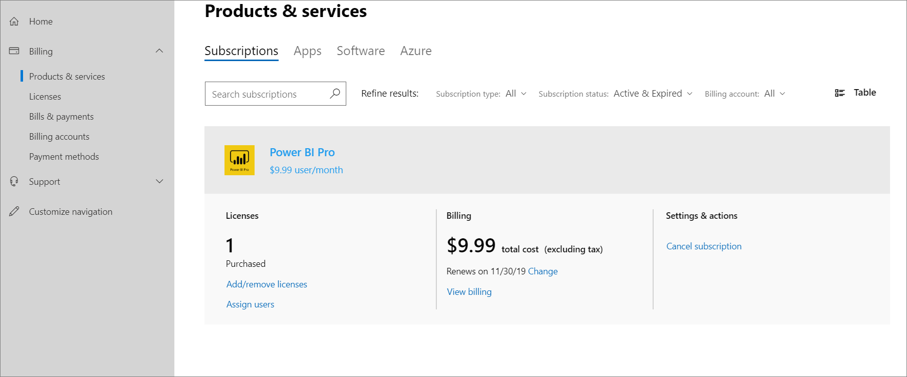

# Self-service purchase FAQ

> [!NOTE]
> The information in this article only applies to Microsoft Power Platform (Power BI, Power Apps and Power Automate) subscriptions.

Self-service purchases are now available for Power Platform in the United States.

## General

### What changes did Microsoft announce around self-service purchases for the Power Platform products?

On November 19, we provided IT admins a way to turn off self-service purchasing on a per product basis via PowerShell. To learn how to use it, see [Use AllowSelfServicePurchase for the MSCommerce PowerShell module](allowselfservicepurchase-powershell.md).

To provide more time to prepare for this change, we're updating the launch for self-service purchase capabilities for Power Platform products to start with Power BI on January 14 for all commercial cloud customers.  

Beginning January 14, 2020, self-service purchase, subscription, and license management capabilities for Power Platform products (Power BI, Power Apps, and Power Automate) will be available for commercial cloud customers in the United States. Self-service purchase gives users a chance to try out new technologies and lets them develop solutions that will ultimately benefit their larger organizations. This capability will not be available to tenants in the US that are government, nonprofit, or education, at this time. Central procurement and IT teams will have visibility to all users buying and deploying self-service purchase solutions through the <a href="https://go.microsoft.com/fwlink/p/?linkid=2024339" target="_blank">Microsoft 365 admin center</a>, and will be able to turn off self-service purchasing on a per product basis via PowerShell.

### Why is Microsoft adding a self-service purchase option for the Power Platform products?

In today’s world, end users and departments are increasingly seeking out and buying technology solutions on their own. We’ve received numerous requests from these customers to enable self-service purchase of Power Platform products. We’re responding to this customer need while also balancing the needs of IT administrators, who often times lose visibility and control when individuals within their organization adopt third-party solutions without their knowledge. With the upcoming self-service capability for Power Platform products, IT admins will have complete visibility to all self-service purchases taking place within their organization, and data governance policies set at the organizational level will accrue to subscriptions purchased via self-service. Admins can also assign existing licenses, or purchase additional subscriptions, of Power Platform products through existing agreements and pricing for users assigned to self-service purchases. After assigning these centrally purchased licenses, admins can then request that the purchasers cancel their existing subscriptions. Microsoft is exploring ways to simplify and streamline this process for admins in the future.

### Which Power Platform products are available for self-service purchase?

Microsoft has launched self-service purchase for Power Platform (Power BI, Power Apps, and Power Automate) to customers in the United States, with additional markets becoming available in the coming months. This capability will not be available to tenants in the US that are government, nonprofit, or education, at this time.

### Will self-service purchase be enabled for services beyond the Power Platform products?

At this time, only the Power Platform family products is being offered through self-service purchase.

## Making a self-service purchase

### How does a customer make a self-service purchase?

Customers will be able to make a self-service purchase online from the Microsoft Power BI, Power Apps, and Power Automate websites. Customers will first be asked to enter an email address to ensure they’re a user in an existing Azure Active Directory (AD) tenant. Then they’ll be directed to log in by using their Azure AD credentials. After signing in, the customer will be asked to select how many subscriptions they want to purchase and provide credit card payment. When the purchase is complete, they’ll be able to start using their subscription. The purchaser will also be able to access a limited view of the <a href="https://go.microsoft.com/fwlink/p/?linkid=2024339" target="_blank">Microsoft 365 admin center</a> where they can enable other people in their organization to use the product.

### What are the payment options for self-service purchases?

Currently, credit card is the only available payment method. Payment through invoicing is not supported.

### Who can buy through self-service purchase?

Any user with a non-guest user account in a managed Azure AD tenant can buy. This capability will not be available to tenants that are government, nonprofit, or education, at this time. If this applies to your organization, then no additional action is required to control self-service purchase, at this time.

Users in organizations or markets who are not eligible for self-service purchase will see a message asking them to contact their IT admin as they do today.

### Can guest users buy through self-service purchase?

No, guest users cannot complete a self-service purchase in a tenant in which they’re a guest.

### Can users synced from an on-premises Active Directory buy through self-service purchase?

If a user has an active user account in an eligible Azure AD tenant, they can complete a self-service purchase.

### Who can self-service purchasers assign licenses to?

Self-service purchasers will only be able to assign licenses to users in the same Azure AD tenant. The purchaser will be able to access a limited view of the <a href="https://go.microsoft.com/fwlink/p/?linkid=2024339" target="_blank">Microsoft 365 admin center</a> to assign licenses. They’ll only have visibility and can assign licenses to those products that they’ve bought through self-service purchase, and they’ll only be able to assign those licenses to users in the same Azure AD tenant.

### Where does the self-service purchaser see and manage their purchases?

Self-service purchasers can manage their purchases in the limited view of the <a href="https://go.microsoft.com/fwlink/p/?linkid=2024339" target="_blank">Microsoft 365 admin center</a>. Purchasers can always get to the admin center from the **Admin** tile in the Office 365 app launcher built into all Office 365 and Dynamics online apps. They can view the purchases they’ve made, buy additional subscriptions to the same service, and assign licenses for those subscriptions to other users in their organization. Additionally, purchasers can view and pay their bill, update their payment method, and cancel their subscription.

**View of the limited Microsoft 365 admin center for self-service purchasers:**

## Pricing

### What is the pricing for self-service purchases?

Pricing for each of the Power Platform products for self-service purchases will be available on the Microsoft website and is also displayed as part of the checkout experience while making a self-service purchase. These prices may differ from the prices an organization pays when making central purchases or prices offered through a partner.

### Who is responsible for payment?

The person who buys the subscription through self-service purchase will be billed and is responsible for payment based on the terms and pricing of the purchase.

## Admin capabilities

### What capabilities does an admin have for self-service purchases?

Admins can view all self-service purchases made in their organization in the <a href="https://go.microsoft.com/fwlink/p/?linkid=2024339" target="_blank">Microsoft 365 admin center</a>. They can see the product, purchaser name, subscriptions purchased, expiry date, order history, purchase price, and assigned users for each self-service purchase. In the Power Platform Admin Center, admins can also view self-service purchases capacity. If required for their organization, admins will be able to turn off self-service purchasing on a per product basis via PowerShell. Admins have the same data management and access policies over products bought through self-service purchase or centrally.

Admins can also control whether users in their organization can make self-service purchases. For more information, see [Use AllowSelfServicePurchase for the MSCommerce PowerShell module](allowselfservicepurchase-powershell.md).

### How is Microsoft respecting data governance and compliance by enabling self-service purchase?

Admins maintain control over what services and products are enabled within their tenant based upon their data governance and compliance requirements. Additionally, all data management and access policies, which your organization has enabled, will apply to self-service purchased enabled services.

### Who owns the product data created from self-service purchases?

Data created from products bought through self-service purchase is owned and controlled by the organization.

### How do I centralize the purchases made through self-service purchase?

Admins can assign existing licenses or purchase additional subscriptions of Power Platform products (Power BI, Power Apps, and Power Automate) through existing agreements and pricing for users assigned to self-service purchases. After assigning these centrally purchased licenses, admins can then request that the purchasers cancel their existing subscriptions. Microsoft is exploring ways to simplify and streamline this process for admins in the future.

### Where does the admin see self-service purchases?

Global and billing admins can see subscriptions bought through self-service purchase in **Billing** > **Products & services** in the <a href="https://go.microsoft.com/fwlink/p/?linkid=2024339" target="_blank">Microsoft 365 admin center</a> together with all other subscriptions purchased through central procurement. They can filter the list to just the subscriptions purchased through central procurement or include subscriptions bought through self-service purchase.

Admins can see the product, purchaser name, subscription purchased, expiry date, order history, the purchase price, and assigned users.

## Support and training

### Are customers’ IT departments or partners expected to support products bought through self-service purchase?

IT departments and partners aren’t expected to provide support for products bought through self-service purchase. Microsoft will provide standard support for self-service purchasers.

### If a self-service purchaser calls support, will they use the customer’s Premier support incidents?

Self-service purchasers won’t use a customer’s Premier support incidents for receiving support for their self-service purchases.

### How are users expected to receive training on the products they buy through self-service purchase?

Extensive training for users is provided on the Microsoft Power BI, Power Apps, and Power Automate websites. The products have guided learning, documentation, samples, and strong communities to get answers and tips directly from other users.

### What happens to a self-service purchase if a user leaves the organization?

Valid users will continue to have full use of the self-service purchase for the duration of the subscription. The subscription remains active until the purchaser directly cancels it or an admin requests that the subscription be canceled through customer support. Admins may also choose to assign a centrally purchased license to users of the canceled subscription.

## Partners

### What’s the role of Microsoft’s partners in self-service purchases?

Partners who have delegated administration privileges can see self-service purchases in the <a href="https://go.microsoft.com/fwlink/p/?linkid=2024339" target="_blank">Microsoft 365 admin center</a>, just like an admin. Partners can help support an organization that wants to centralize products bought through self-service purchases. Additionally, partners may offer solutions to extend the capabilities of a self-service purchase.