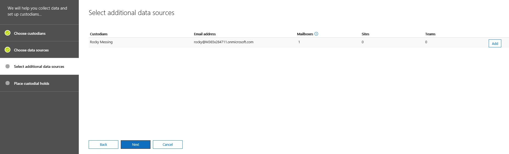
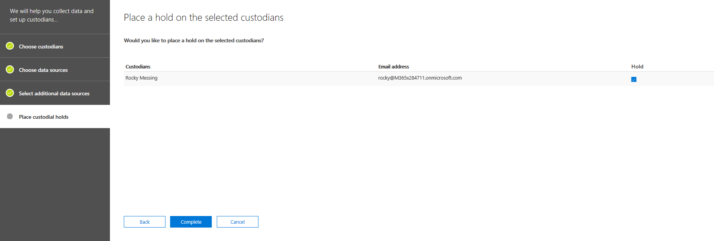

# Add custodians to an Advanced eDiscovery case

Use the built-in custodian management tool in Advanced eDiscovery to coordinate your workflows around managing custodians and identifying relevant, custodial data sources associated with a case. When you add a custodian, the system can automatically identify and place a hold on their Exchange mailbox and OneDrive for Business account. During the discovery process of your investigation, you might also identify additional data sources (such as mailboxes, sites, or Teams) that a custodian accessed or contributed to. In this situation, you can use the custodian management tool to associate those data sources will a specific custodian. After you add custodians to a case and associate other data source with them, you can quickly preserve data and search the custodial data.

Use the following workflow to add and manage custodians in Advanced eDiscovery cases. 

## Before you begin

To add custodians to a case, you must be a member of the eDiscovery Manager role group. This will provide you with the necessary permissions to add custodians to a case and place a hold on the custodial data sources.

## Step 1: Add potential custodians

The first step is to identify and add custodians to the case.

1. On the **Advanced eDiscovery** home page, click the case that you want to add custodians to. 
 
2. Click the **Custodians** tab and then click **+ Add custodians**.

3. Find the custodians to add  to the case. Type the first part of a person's name to display users from your organization's Azure Active Directory. When you find the correct person, click their name to add them to the list.

   
 
4. After added all the relevant custodians, click **Next** to select the custodians' primary data sources.
  
## Step 2: Select custodian data sources

After adding custodians, the custodian tool will help you identify the primary data sources owned by each custodian. These data locations are the custodian's Exchange mailbox and OneDrive account. 

To identify custodian data sources: 

1. To select the Exchange mailbox for all custodians, select the **Exchange** check box at the top of the column. You can then clear the check box for any specific custodian to remove a mailbox as a custodial location. Alternatively, you can leave the **Exchange** check box at the top of the column unselected and then select the check box for individual custodians. 
 
   
 
2. Repeat the same thing for the custodians' OneDrive accounts. 

    After you select the custodian data sources, the system automatically attempts to identify and verify these data sources, and then adds them to the case as data sources associated with the custodians.
 
4. Click **Next** to begin associating additional data sources to the custodians in the case.

## Step 3: Associate additional data sources to a custodian

Depending on the case you're investigating, you may also need to search (and preserve content in) mailboxes that a specific custodian may have accessed, Office 365 groups that a custodian is currently a member of, or sites that a custodian has also accessed. So in addition to the primary custodian data sources that you specified in the previous step, you can also associate additional Office 365 data sources with a custodian in the case. 

To map mailboxes, sites, or teams to a specific custodian:

1. On the **Select additional data sources** page, click **Add** in the row for the specific custodian. 
  
   

2. On the flyout page, you can specify a data source from any of the following Office 365 services:
  
   -  **Exchange email** - Click **Choose users, groups, or Teams** and then click **Choose users, groups, or teams** again. Use the search box to find mailboxes to associate with the custodian. To specify mailboxes to assign to the selected custodian, use the search box to find user mailboxes and distribution groups. You can also assign the associated mailbox for an Office 365 group or a Microsoft Team. Select the user, group, team check box, click **Choose**, and then click **Done**.

        > [!NOTE]
        > When you click Choose users, groups, or teams to specify mailboxes, the mailbox picker that's displayed is empty. This is by design to enhance performance. To add mailbox to this list, type a name or alias (a minimum of 3 characters) in the search box.
     
     - **SharePoint sites** - Click **Choose sites** and then click **Choose sites** again to display a list of SharePoint sites in your organization. To associate a site with the custodian, you can select a site in the list or you can type the URL of a different site or a site associated with an Office 365 group, Microsoft Team, or a OneDrive account.
     
     - **Teams** – Click **Choose teams** and then click **Choose teams** again to display a list of Microsoft Teams that the custodian is currently a member of. Select the Teams that you would like to add to your custodian. Once selected, the system will automatically identify & select the associated SharePoint site and Group Mailbox associated to that Microsoft Team. Click **Choose**, and then click **Done**.

       
        
      > [!NOTE]
      > To associate an additional team with a custodian, you have to separately add the mailbox and site associated with the team by using the **Exchange mail** and **SharePoint sites** locations.

After you've finished associating additional data sources with the custodians, you can view the total number of mailboxes, sites, and teams associated with each custodian on the **Select additional data sources page**. When you've finalized the relevant data sources for a specific custodian, this association will be maintained and used during the collection, processing, and review stages in eDiscovery workflow.

## Step 4: Place custodians on hold

After you've finalized the custodians and data sources to add to the case, you can optionally place some or all of the custodians on hold. When you place a custodian on hold, all content in all content locations that are associated with the custodian is preserved until you remove the hold or release the custodian from the hold. In some cases, you may want to add custodians to a case without placing them on hold.

To place the custodians and data sources on hold:

1. On the **Place a hold on the selected custodians** page, select the **Hold** check box at the top of the column to place all custodians on hold. You can then clear the check box for any specific custodian to remove from the hold. Alternatively, you can leave the **Hold** check box at the top of the column unselected and then select the check box for individual custodians. 
 
   

2. Verify the custodian hold selections and then click **Complete**.

If you don't place a hold on a custodian, the custodian and their associated data sources will be added to the case but the content in those data sources won't be placed on hold.

After a custodian is placed on hold, a custodian hold policy that contains all custodial sources will be automatically created. To view this policy:

1. On the **Home** page of the case, click the **Holds** tab and then click **CustodianHold-Guid**,  

2. On the flyout page, click **Edit hold** to view all the custodian data sources that are placed on hold.

