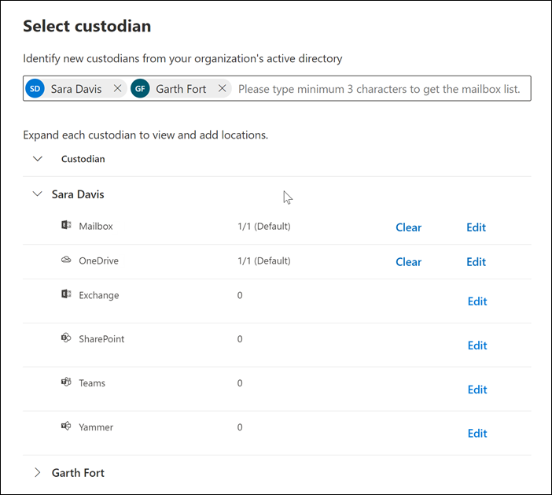
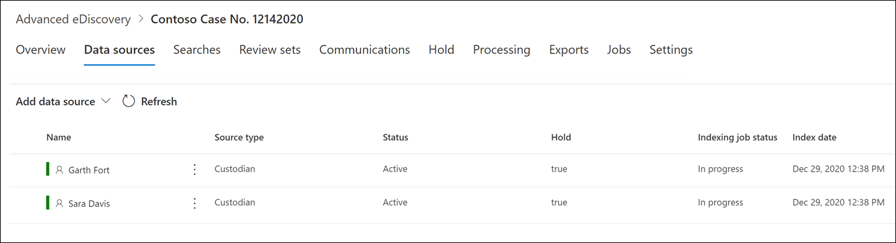

# Add custodians to an Advanced eDiscovery case

Use the built-in custodian management tool in Advanced eDiscovery to coordinate your workflows around managing custodians and identifying relevant, custodial data sources associated with a case. When you add a custodian, the system can automatically identify and place a hold on their Exchange mailbox and OneDrive for Business account. During the discovery process of your investigation, you might also identify other data sources (such as mailboxes, sites, or Teams) that a custodian accessed or contributed to. In this situation, you can use the custodian management tool to associate those data sources will a specific custodian. After you add custodians to a case and associate other data source with them, you can quickly preserve data and search the custodial data.

You can add and manage custodians in Advanced eDiscovery cases in four steps:

1. Identify the custodians.

2. Choose custodian data locations.

3. Configure hold settings.

4. Review the custodians and complete the process.

   

## Make sure you have the necessary permissions

To add custodians to a case, you must be a member of the eDiscovery Manager role group. This provides you with the necessary permissions to add custodians to a case and place a hold on the custodial data sources. For more information, see [Assign eDiscovery permissions](get-started-with-advanced-ediscovery.md#step-2-assign-ediscovery-permissions).

## Step 1: Identify custodians

1. Go to [https://compliance.microsoft.com](https://compliance.microsoft.com) and sign in with a user account that has been assigned the appropriate eDiscovery permissions.

2. In the left navigation pane of the Microsoft 365 compliance center, click **Show all**, and then click **eDiscovery > Advanced**.

3. On the **Advanced eDiscovery** page, click the **Cases** tab, and then select the case that you want to add custodians to.

4. Click the **Data sources** tab and then click **Add data source** > **Add new custodians**.

5. Add one or more users in your organization as custodians to the case by typing the first part of a person's name or alias. After you find the correct person, select their name to add them to the list.

## Step 2: Choose custodian data locations

After you select custodians, the system automatically attempts to identify and verify these users and their data sources. After adding custodians to the list, the tool automatically includes the primary mailbox and OneDrive account for each custodian. You can choose not to include these data sources when adding custodians to the case.

In addition to a custodian's mailbox and OneDrive account, you can also associate other data locations to a custodian, such as SharePoint site or a Microsoft Team the custodian is a member of. This allows you to preserve, collect, analyze, and review content in other data sources associated with the custodians of the case.

To deselect the primary mailbox and OneDrive account for a custodian:

1. Expand the custodian to view the primary data locations that have been automatically associated to each custodian.

2. Select **Clear** next to **Mailbox** or **OneDrive** to remove a custodian's mailbox or OneDrive account from being associated as a data location for this custodian.

   

To associate other mailboxes, sites, Teams, or Yammer groups to a specific custodian:

1. Expand a custodian to display the following services to associate data locations with the custodian. Click **Edit** next to a service to add a data location.

   - **Exchange**: Use to associate other mailboxes to the custodian. Type into the search box the name or alias (a minimum of three characters) of user mailboxes or distribution groups. Select the mailboxes to assign to the custodian and then click **Add**.

   - **SharePoint**: Use to associate SharePoint sites to the custodian. Select a site in the list or search for a site by typing a URL in the search box. Select the sites to assign to the custodian and then click **Add**.

   - **Teams**: Use to assign the Microsoft Teams the custodian is currently a member of. Select the teams to assign to the custodian and then click **Add**. After you add a team, the system automatically identifies and locates the SharePoint site and group mailbox associated to that team and assigns them to the custodian.

   - **Yammer**:  Use to assign the Yammer groups the custodian is currently a member of. Select the groups to assign to the custodian and then click **Add**. After you add a team, the system automatically identifies and locates the SharePoint site and group mailbox associated to that group and assigns them to the custodian.

   > [!NOTE]
   > You can use the **Exchange** and **SharePoint** location pickers to associate other teams or Yammer groups (that a custodian is not a member of) to a custodian. To do this, you have to add both the mailbox and site associated with each team or Yammer group.

2. You can view the total number of mailboxes, sites, Teams, and Yammer groups assigned to each custodian by expanding each custodian in the table. When you've finalized the assigned data locations for each custodian, these associations will be maintained and used during the collection, processing, and review stages in the Advanced eDiscovery workflow.

3. After adding custodians and configuring their data locations, click **Next** to go to the **Hold settings** page.  

## Step 3: Configure hold settings

 After you've finalized the custodians and their data locations, you can place some or all of the custodians on hold. When you place a custodian on hold, all content in all content locations that are associated with the custodian is preserved until you remove the hold or release the custodian from the hold. In some cases, you may want to add custodians to a case without placing them on hold.

To place the custodians and data sources on hold:

1. On the **Hold settings** page, you can apply a hold to individual custodians by selecting the checkbox under the **Hold** column.

   Alternatively, you can place all custodians on hold by selecting the **Hold** checkbox at the top of the column.

2. Verify the custodian hold selections and then click **Next**.

   > [!NOTE]
   > If you don't place a hold on a custodian, the custodian and their associated data sources will be added to the case but the content in those data sources won't preserved by the hold that associated with the case.

## Step 4: Review the custodians and complete the process

Before you actually add the custodians to the case, you can review the list of custodians, the data locations assigned to them, and the hold settings.

1. Verify and review all the data sources count and the hold setting associated with each custodian in the table. If necessary, go back to the **Identify custodian** or **Hold settings** pages to make any changes.

2. Click **Submit** to add custodians and their data locations to the case and apply all custodial hold settings.

   The new custodians are added to the case and displayed on the **Data sources** tab.

   
