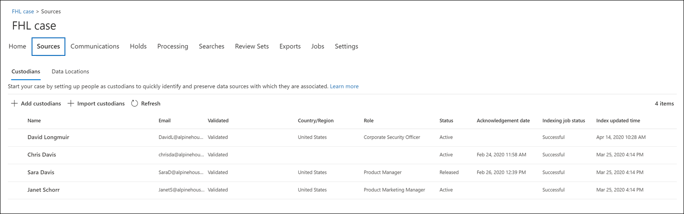

# Add custodians to an Advanced eDiscovery case

Use the built-in custodian management tool in Advanced eDiscovery to coordinate your workflows around managing custodians and identifying relevant, custodial data sources associated with a case. When you add a custodian, the system can automatically identify and place a hold on their Exchange mailbox and OneDrive for Business account. During the discovery process of your investigation, you might also identify additional data sources (such as mailboxes, sites, or Teams) that a custodian accessed or contributed to. In this situation, you can use the custodian management tool to associate those data sources will a specific custodian. After you add custodians to a case and associate other data source with them, you can quickly preserve data and search the custodial data.

You can add and manage custodians in Advanced eDiscovery cases in four steps:

1. Identify the custodians

2. Choose custodian data locations

3. Configure hold settings

4. Review the custodians and complete the process

## Make sure you have the necessary permissions

To add custodians to a case, you must be a member of the eDiscovery Manager role group. This provides you with the necessary permissions to add custodians to a case and place a hold on the custodial data sources.

## Step 1: Identify custodians

1. Go to [https://compliance.microsoft.com](https://compliance.microsoft.com) and sign in with a user account that has been assigned the appropriate eDiscovery permissions.

2. In the left navigation pane of the Microsoft 365 compliance center, click **Show all**, and then click **eDiscovery > Advanced**.

3. On the **Advanced eDiscovery** page, click the **Cases** tab, and then select the case that you want to add custodians to.

4. Click the **Data sources** tab and then click **Add data source** > **Add new custodians**.

5. Add one or more users in your organization as custodians to the case by typing the first part of a person's name or alias. After you find the correct person, select their name to add them to the list.

## Step 2: Choose custodian data locations

After you select custodians, the system automatically attempts to identify and verify these users and their data sources. After adding custodians to the list, the tool will automatically identify and add the primary mailbox and OneDrive account for each custodian. Additionally, 

In addition to a custodian's mailbox and OneDrive account, you may also need to associate additional data locations to a custodian in order to search and preserve mailboxes, sites, or groups that a custodian may have accessed or is currently a member of. These associations will be maintained and used during the collection, processing, and review stages within eDiscovery workflow.

To deselect the primary mailbox and OneDrive to be added to a custodian: 

1. Expand a custodian to view the primary data locations that have been automatically associated to each custodian.

2. Select **Clear** next to Mailboxes or OneDrive to deselect/remove a custodian's mailbox or OneDrive account from being associated as a data location for this custodian.

To associate other mailboxes, sites, Teams, or Yammer groups to a specific custodian: 

   1. Expand a custodian and click **Edit** next to any of the following services:

      - **Exchange email**: Click **Edit** next to Exchange to specify mailboxes to assign to the selected custodian. Type into the search box the name or alias (a minimum of 3 characters) of user mailboxes or distribution groups. Select the mailboxes that you would like to assign to this custodian and click **Add**.

      - **SharePoint sites** - Click **Edit** next to SharePoint to associate a site with the custodian. Select a site in the list or you can search for a site by typing the URL of the site in the search bar. Select the sites that you would like to assign to this custodian and click **Add**.

      - **Teams**: Click **Edit** next to Teams to display a list of Microsoft Teams that the selected custodian is currently a member of. Select the Teams that you would like to add to your custodian and click **Add**. Once added, the system will automatically identify & select the associated SharePoint site and Group Mailbox associated to that Microsoft Team and associate them to the custodian. 

      - **Yammer**: Click **Edit** next to Yammer to display a list of Yammer groups the custodian is currently a member of. Select the groups that you would like to add to the custodian and then click **Add**. The system will add the SharePoint site and group mailbox for each selected Yammer group and associate them to the custodian.

      > [!NOTE]
      > You can use the SharePoint and Exchange pickers to associate an additional Team or Yammer with a custodian, you have to separately add the mailbox and site associated with the team by using the **Exchange mail** and **SharePoint sites** locations.

   2. You can view the total number of mailboxes, sites, yammer and teams associated with each custodian by expanding each custodian in the table. When you've finalized the relevant data locations for each custodian, these associations will be maintained and used during the collection, processing, and review stages in eDiscovery workflow. Click **Next** to go to **Hold settings** for these custodians.  

## Step 3: Configure hold settings

 After you've finalized the custodians and their data locations, you can optionally place some or all of the custodians on hold. When you place a custodian on hold, all content in all content locations that are associated with the custodian is preserved until you remove the hold or release the custodian from the hold. In some cases, you may want to add custodians to a case without placing them on hold.

To place the custodians and data sources on hold:

1. On the **Hold settings** page, you can apply a hold to individual custodians by selecting the checkbox under the **Hold** column. Alternatively, you can select the **Hold** checkbox at the top of the column to place all custodians on hold.

2. Verify the custodian hold selections and then click **Next**.

> [!NOTE] If you don't place a hold on a custodian, the custodian and their associated data sources will be added to the case but the content in those data sources won't be placed on hold.

## Step 4: Review the custodians and complete the process

To review you custodian data locations and holds:

1. Verify and review all data locations count and hold settings associated with each custodian in the table. If required, revert back to **Identify custodian** or **Hold settings** page to modify and edit changes. 

2. Click **Complete** to add Custodians and their data locations to the case and apply all custodial hold settings. 

After a custodian is added and placed on hold, a custodian hold policy that contains all custodial sources will be automatically created. To view this policy:

1. On the **Home** page of the case, click the **Holds** tab and then click **CustodianHold-Guid**,  

2. On the flyout page, click **Edit hold** to view all the custodian data sources that are placed on hold.
