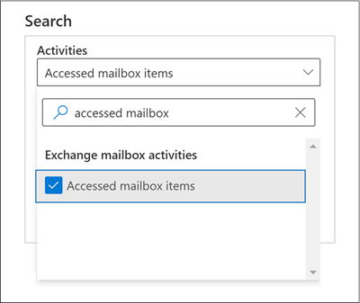
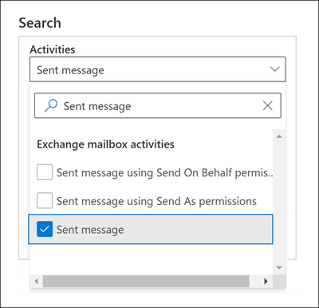
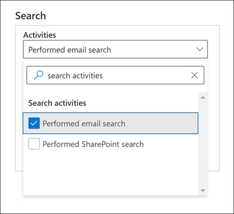
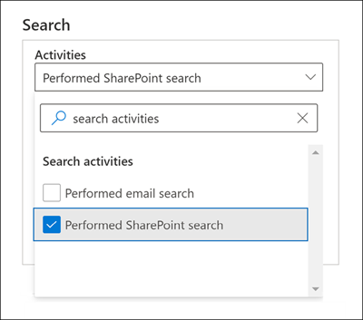

# Advanced Audit in Microsoft 365

The [unified auditing functionality](search-the-audit-log-in-security-and-compliance.md) in Microsoft 365 provides organizations with visibility into many types of audited activities across many different services in Microsoft 365. Advanced Audit helps organizations to conduct forensic and compliance investigations by increasing audit log retention required to conduct an investigation, providing access to crucial events that help determine scope of compromise, and faster access to Office 365 Management Activity API.

> [!NOTE]
> Advanced Audit is available for organizations with an Office 365 E5/G5 or Microsoft 365 Enterprise E5/G5 subscription. Additionally, a Microsoft 365 E5 Compliance or E5 eDiscovery and Audit add-on license can be assigned to users when per-user licensing is required for Advanced Audit features as is the case for long-term retention of audit logs and access to crucial events for investigations. For more information about licensing, see [Microsoft 365 licensing guidance for security & compliance](/office365/servicedescriptions/microsoft-365-service-descriptions/microsoft-365-tenantlevel-services-licensing-guidance/microsoft-365-security-compliance-licensing-guidance#advanced-audit).

This article provides an overview of Advanced Audit capabilities and shows you how to set up users for Advanced Audit.

## Long-term retention of audit logs

Advanced Audit retains all Exchange, SharePoint, and Azure Active Directory audit records for one year. This is accomplished by a default audit log retention policy that retains any audit record that contains the value of **Exchange**, **SharePoint**, or **AzureActiveDirectory** for the **Workload** property (which indicates the service in which the activity occurred) for one year. Retaining audit records for longer periods can help with on-going forensic or compliance investigations. For more information, see the "Default audit log retention policy" section in [Manage audit log retention policies](audit-log-retention-policies.md#default-audit-log-retention-policy).

We're also releasing the capability to retain audit logs for 10 years. The 10-year retention of audit logs helps support long running investigations and respond to regulatory, legal, and internal obligations.

> [!NOTE]
> Retaining audit logs for 10 years will require an additional add-on license. For more information, see the [FAQs for Advanced Audit](#faqs-for-advanced-audit) section in this article.

### Audit log retention policies

All audit records generated in other services that aren't covered by the default audit log retention policy (described in the previous section) are retained for 90 days. But you can create customized audit log retention policies to retain other audit records for longer periods of time up to 10 years. You can create a policy to retain audit records based on one or more of the following criteria:

- The Microsoft 365 service where the audited activities occur.

- Specific audited activities.

- The user who performs an audited activity.

You can also specify how long to retain audit records that match the policy and a priority level so that specific policies will take priority over other policies. Also note that any custom audit log retention policy will take precedence over the default audit retention policy in case you need retain Exchange, SharePoint, or Azure Active Directory audit records for less than a year (or for 10 years) for some or all users in your organization. For more information, see [Manage audit log retention policies](audit-log-retention-policies.md).

## Access to crucial events for investigations

Advanced Audit helps organizations to conduct forensic and compliance investigations by providing access to crucial events such as when mail items were accessed, or when mail items were replied to and forwarded, and when and what a user searched for in Exchange Online and SharePoint Online. These crucial events can help you investigate possible breaches and determine the scope of compromise.  Advanced Auditing provides the following crucial events:

- [MailItemsAccessed](#mailitemsaccessed)

- [Send](#send)

- [SearchQueryInitiatedExchange](#searchqueryinitiatedexchange)*

- [SearchQueryInitiatedSharePoint](#searchqueryinitiatedsharepoint)*

> [!NOTE]
> * At this time, this event isn't available in Office 365 and Microsoft 365 Government environments. This includes GCC, GCC High, and DoD environments.

### MailItemsAccessed

The MailItemsAccessed event is a mailbox auditing action and is triggered when mail data is accessed by mail protocols and mail clients. The MailItemsAccessed action can help investigators identify data breaches and determine the scope of messages that may have been compromised. If an attacker gained access to email messages, the MailItemsAccessed action will be triggered even if there is no explicit signal that messages were actually read (in other words, the type of access such as a bind or sync is recorded in the audit record).

The MailItemsAccessed mailbox action replaces MessageBind in mailbox auditing logging in Exchange Online and provides these improvements:

- MessageBind was only configurable for AuditAdmin user logon type; it did not apply to delegate or owner actions. MailItemsAccessed applies to all logon types.

- MessageBind only covered access by a mail client. It didn't apply to sync activities. MailItemsAccessed events are triggered by both bind and sync access types.

- MessageBind actions would trigger the creation of multiple audit records when the same email message was accessed, which resulted in auditing "noise". In contrast, MailItemsAccessed events are aggregated into fewer audit records.

For information about audit records for MailItemsAccessed activities, see [Use Advanced Audit to investigate compromised accounts](mailitemsaccessed-forensics-investigations.md).

To search for MailItemsAccessed audit records, you can search for the **Accessed mailbox items** activity in the **Exchange mailbox activities** drop-down list in the [audit log search tool](search-the-audit-log-in-security-and-compliance.md) in the Microsoft 365 compliance center.

You can also run the [Search-UnifiedAuditLog -Operations MailItemsAccessed](/powershell/module/exchange/search-unifiedauditlog) or [Search-MailboxAuditLog -Operations MailItemsAccessed](/powershell/module/exchange/search-mailboxauditlog) commands in Exchange Online PowerShell.

### Send

The Send event is also a mailbox auditing action and is triggered when a user performs one of the following actions:

- Sends an email message

- Replies to an email message

- Forwards an email message

Investigators can use the Send event to identify email sent from a compromised account. The audit record for a Send event contains information about the message, such as when the message was sent, the InternetMessage ID, the subject line, and if the message contained attachments. This auditing information can help investigators identify information about email messages sent from a compromised account or sent by an attacker. Additionally, investigators can use a Microsoft 365 eDiscovery tool to search for the message (by using the subject line or message ID) to identify the recipients the message was sent to and the actual contents of the sent message.

To search for Send audit records, you can search for the **Sent message** activity in the **Exchange mailbox activities** drop-down list in the [audit log search tool](search-the-audit-log-in-security-and-compliance.md) in the Microsoft 365 compliance center.

You can also run the [Search-UnifiedAuditLog -Operations Send](/powershell/module/exchange/search-unifiedauditlog) or [Search-MailboxAuditLog -Operations Send](/powershell/module/exchange/search-mailboxauditlog) commands in Exchange Online PowerShell.

### SearchQueryInitiatedExchange

The SearchQueryInitiatedExchange event is triggered when a person uses Outlook to search for items in a mailbox. Events are triggered when searches are performed in the following Outlook environments:

- Outlook (desktop client)

- Outlook on the web (OWA)

- Outlook for iOS

- Outlook for Android

- Mail app for Windows 10

Investigators can use the SearchQueryInitiatedExchange event to determine if an attacker who may have compromised an account looked for or tried to access sensitive information in the mailbox. The audit record for a SearchQueryInitiatedExchange event contains information such as the actual text of the search query. The audit record also indicates the Outlook environment the search was performed in. By looking at the search queries that an attacker may have performed, an investigator can better understand the intent of the email data that was searched for.

To search for SearchQueryInitiatedExchange audit records, you can search for the **Performed email search** activity in the **Search activities** drop-down list in the [audit log search tool](search-the-audit-log-in-security-and-compliance.md) in the compliance center.

You can also run the [Search-UnifiedAuditLog -Operations SearchQueryInitiatedExchange](/powershell/module/exchange/search-unifiedauditlog) in Exchange Online PowerShell.

> [!NOTE]
> You must run the following command in Exchange Online PowerShell so that SearchQueryInitiatedExchange events (performed by the specified E5 user) are included in audit log search results: `Set-Mailbox <user identity> -AuditOwner @{Add="SearchQueryInitiated"}`.   
In a multi-geo environment, you must run the **Set-Mailbox** command in the forest where the user's mailbox is located. To identify the user's mailbox location, run the following command: `Get-Mailbox <user identity> | FL MailboxLocations`.
If the `Set-Mailbox -AuditOwner @{Add="SearchQueryInitiated"}` command was previously run in the forest that's different than the one the user's mailbox is located in, then you must remove the SearchQueryInitiated value from the user's mailbox (by running `Set-Mailbox -AuditOwner @{Remove="SearchQueryInitiated"}`) and then add it to the user's mailbox in the forest where the user's mailbox is located.

### SearchQueryInitiatedSharePoint

Similar to searching for mailbox items, the SearchQueryInitiatedSharePoint event is triggered when a person searches for items in SharePoint. Events are triggered when searches are performed in the following types of SharePoint sites:

- Home sites

- Communication sites

- Hub sites

- Sites associated with Microsoft Teams

Investigators can use the SearchQueryInitiatedSharePoint event to determine if an attacker tried to find (and possibly accessed) sensitive information in SharePoint. The audit record for a SearchQueryInitiatedSharePoint event contains also contains the actual text of the search query. The audit record also indicates the type of SharePoint site that was searched. By looking at the search queries that an attacker may have performed, an investigator can better understand the intent and scope of the file data being searched for.

To search for SearchQueryInitiatedSharePoint audit records, you can search for the **Performed SharePoint search** activity in the **Search activities** drop-down list in the [audit log search tool](search-the-audit-log-in-security-and-compliance.md) in the compliance center.

You can also run the [Search-UnifiedAuditLog -Operations SearchQueryInitiatedSharePoint](/powershell/module/exchange/search-unifiedauditlog) in Exchange Online PowerShell.

> [!NOTE]
> You must run the following command in Exchange Online PowerShell so that SearchQueryInitiatedSharePoint events (performed by the specified E5 user) are included in audit log search results: `Set-Mailbox <user identity> -AuditOwner @{Add="SearchQueryInitiated"}`.   
In a multi-geo environment, you must run the **Set-Mailbox** command in the forest where the user's mailbox is located. To identify the user's mailbox location, run the following command: `Get-Mailbox <user identity> | FL MailboxLocations`.
If the `Set-Mailbox -AuditOwner @{Add="SearchQueryInitiated"}` command was previously run in the forest that's different than the one the user's mailbox is located in, then you must remove the SearchQueryInitiated value from the user's mailbox (by running `Set-Mailbox -AuditOwner @{Remove="SearchQueryInitiated"}`) and then add it to the user's mailbox in the forest where the user's mailbox is located.

## High-bandwidth access to the Office 365 Management Activity API

Organizations that access auditing logs through the Office 365 Management Activity API were restricted by throttling limits at the publisher level. This means that for a publisher pulling data on behalf of multiple customers, the limit was shared by all those customers.

With the release of Advanced Audit, we're moving from a publisher-level limit to a tenant-level limit. The result is that each organization will get their own fully allocated bandwidth quota to access their auditing data. The bandwidth is not a static, predefined limit but is modeled on a combination of factors including the number of seats in the organization and that E5 organizations will get more bandwidth than non-E5 organizations.

All organizations are initially allocated a baseline of 2,000 requests per minute. This limit will dynamically increase depending on an organization's seat count and their licensing subscription. E5 organizations will get about twice as much bandwidth as non-E5 organizations. There will also be cap on the maximum bandwidth to protect the health of the service.

For more information, see the "API throttling" section in [Office 365 Management Activity API reference](/office/office-365-management-api/office-365-management-activity-api-reference#api-throttling).

## Set up Advanced Audit for users

Advanced Audit features such as the ability to log crucial events such as MailItemsAccessed and Send require an appropriate E5 license assigned to users. Additionally, the Advanced Auditing app/service plan must be enabled for those users. To verify that the Advanced Auditing app is assigned to users, perform the following steps for each user:

1. In the [Microsoft 365 admin center](https://admin.microsoft.com/Adminportal), go to **Users** > **Active users**, and select a user.

2. On the user properties flyout page, click **Licenses and apps**.

3. In the **Licenses** section, verify that the user is assigned an E5 license.

4. Expand the **Apps** section, and verify that the **Microsoft 365 Advanced Auditing** checkbox is selected.

5. If the checkbox isn’t selected, select it, and then click **Save changes.**

   The logging of audit records for MailItemsAccessed, Send, and other crucial events for the user will begin within 24 hours.

For organizations that assign licenses to groups of users by using group-based licensing, you have to turn off the licensing assignment for Microsoft 365 Advanced Auditing for the group. After you save your changes, verify that Microsoft 365 Advanced Auditing is turned off for the group. Then turn the licensing assignment for the group back on. For instructions about group-based licensing, see [Assign licenses to users by group membership in Azure Active Directory](/azure/active-directory/users-groups-roles/licensing-groups-assign).

Also, if you have customized the mailbox actions that are logged on user mailboxes or shared mailboxes, new default mailbox actions such as MailItemsAccessed will not be automatically audited on those mailboxes. For information about changing the mailbox actions that are audited for each logon type, see the "Change or restore mailbox actions logged by default" section in [Manage mailbox auditing](enable-mailbox-auditing.md#change-or-restore-mailbox-actions-logged-by-default).

## FAQs for Advanced Audit

**Does every user need an E5 license to benefit from Advanced Audit?**

To benefit from user-level Advanced Audit capabilities, a user needs to be assigned an E5 license. There are some capabilities that will check for the appropriate license to expose the feature for the user. For example, if you're trying to retain the audit records for a user who isn't assigned an E5 license for longer than 90 days, the system will return an error message.

**My organization has an E5 subscription, do I need to do anything to get access to audit records for crucial events?**

For eligible customers and users that are assigned the appropriate license, there is no action to get access to crucial auditing events.

**What happens to my organization's audit log data if I created a 10-year audit log retention policy when the feature was released to general availability but before the required add-on license was made available?**

Any audit log data covered by a 10-year audit log retention policy that you created after the feature was released to general availability in the last quarter of 2020 will be retained for 10 years. This includes 10-yr audit log retention policies that were created before the required add-on license was released for purchase. However, since the 10-Year Audit Log Retention Add On license is now available, you'll need to purchase and assign those add-on licenses for any users whose audit data is covered by a 10-year audit retention policy.

**Are the new events in Advanced Audit available in the Office 365 Management Activity API?**

Yes. As long as audit records are generated for users with the appropriate license, you'll be able to access these records via the Office 365 Management Activity API.

**Does higher bandwidth mean better latency or higher SLA?**

At this time, high bandwidth provides a better pipeline, especially for organizations with a high volume of auditing signals and significant consumption patterns. More bandwidth can lead to better latency. But there isn't an SLA associated with high bandwidth. Standard latencies are documented, and these latencies don't change with the release of Advanced Audit.
