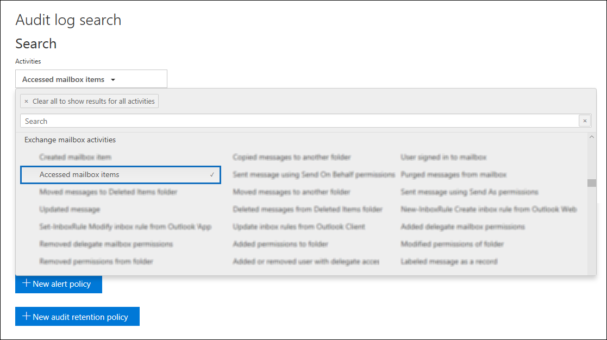

# Advanced Audit in Microsoft 365

The [unified auditing functionality](search-the-audit-log-in-security-and-compliance.md) in Microsoft 365 provides organizations with visibility into many types of audited activities across many different services in Microsoft 365. Now with the release of Advanced Audit in Microsoft 365, we're adding new auditing capabilities that can help your organization with forensic and compliance investigations.

> [!NOTE]
> Advanced Audit is available for organizations with an Office 365 or Microsoft 365 Enterprise E5 subscription. Additionally, a Microsoft 365 E5 Compliance add-on subscription can be assigned to users for when per-user licensing is required for Advanced Audit features as is the case for long-term retention of audit logs and access to crucial events for investigations.

This article provides an overview of these Advanced Audit capabilities.

## Long-term retention of audit logs

Advanced Audit retains all Exchange, SharePoint, and Azure Active Directory audit records for one year. This is accomplished by a default audit log retention policy that retains any audit record that contains the value of **Exchange**, **SharePoint**, or **AzureActiveDirectory** for the **Workload** property (which indicates the service in which the activity occurred) for one year. This can help with on-going forensic or compliance investigations. For more information, see the "Default audit log retention policy" section in [Manage audit log retention policies](audit-log-retention-policies.md#default-audit-log-retention-policy).

## Audit log retention policies

All audit records generated in other services that aren't covered by the default audit log retention policy (described in the previous section) are retained for 90 days. However, now you can create customized audit log retention policies to retain other audit records for up to one year. You can create a policy to retain audit records based on one or more of the following criteria:

- The Microsoft 365 service where the audited activities occur

- Specific audited activities

- The user who performs an audited activity

You can also specify how long to retain audit records that match the policy and a priority level so that specific policies will take priority over other policies. Also note that any custom audit log retention policy will take precedence over the default audit retention policy in case you need retain Exchange, SharePoint, or Azure Active Directory audit records for less than a year for some or all the users in your organization. For more information, see [Manage audit log retention policies](audit-log-retention-policies.md).

## Access to crucial events for investigations

Crucial security- and compliance-related audit events are ones that can help you investigate possible breaches or other forensic-related investigations. The first crucial event that we're releasing is the *MailItemsAccessed* mailbox auditing action. This action is triggered when mail data is accessed by mail protocols and mail clients. The MailItemsAccessed action can help investigators identify data breaches and determine the scope of messages that may have been compromised. If an attacker gained access to email messages, the MailItemsAccessed action will be triggered even if there is no explicit signal that messages were actually read (in other words, the type of access such as a bind or sync is recorded in the audit record).

The new MailItemsAccessed mailbox action replaces MessageBind in mailbox auditing logging in Exchange Online and provides these improvements:

- MessageBind was only configurable for AuditAdmin user logon type; it did not apply to delegate or owner actions. MailItemsAccessed applies to all logon types.

- MessageBind only covered access by a mail client. It didn't apply to sync activities. MailItemsAccessed events are triggered by both bind and sync access types.

- MessageBind actions would trigger the creation of multiple audit records when the same email message was accessed, which resulted in auditing "noise". In contrast, MailItemsAccessed events are aggregated into fewer audit records.

For more information about mailbox auditing logging, see [Manage mailbox auditing](enable-mailbox-auditing.md).

### Search for MailItemsAccessed audit records

To search for MailItemsAccessed audit records, you can search for the **Accessed mailbox items** activity in the **Exchange mailbox activities** drop-down list in the [audit log search tool](search-the-audit-log-in-security-and-compliance.md) in the Office 365 security and compliance center.

You can also run the [Search-UnifiedAuditLog -Operations MailItemsAccessed](https://docs.microsoft.com/powershell/module/exchange/policy-and-compliance-audit/search-unifiedauditlog) or [Search-MailboxAuditLog -Operations MailItemsAccessed](https://docs.microsoft.com/powershell/module/exchange/policy-and-compliance-audit/search-mailboxauditlog) commands in Exchange Online PowerShell.

<CHARU - the below is applicable for all of Advanced AUdit not just MailItemsAccessed so should be moved to a common section>
   
It is possible that Advanced audit features such as MailItemsAccessed actions aren't being logged in your organization (and not showing up in audit log search results) even with the right licenses in place. If you are observing this, this is due to Advanced Audit package rollout has not reached your organization yet. This is a temporary licensing backfill issue and will saturate in the next few days. To mitgate this issue, perform the following steps for each E5 user:

1. In the Microsoft 365 admin center, go to **Users > Active users**, and then select a user.

2. On the user properties flyout page, click **Licenses and Apps**.

3. Expand the **Apps** section, and then do one of the following things:

   a. If the **Microsoft 365 Advanced Auditing** checkbox is not selected, select it, and then click **Save changes.** Audit records for MailItemsAccessed actions should be searchable within 24 hours.

   b. If the **Microsoft 365 Advanced Auditing** checkbox is selected, clear it, and then click **Save changes.** See step 4.

4. If you cleared the checkbox in step 3, wait 60 minutes, and then repeat step 3a to enable the Microsoft 365 Advanced Auditing app.

## High-bandwidth access to the Office 365 Management Activity API

Organizations that access auditing logs through the Office 365 Management Activity API were restricted by throttling limits at the publisher level. This means that for a publisher pulling data on behalf of multiple customers, the limit was shared by all those customers.

With the release of Advanced Audit, we're moving from a publisher-level limit to a tenant-level limit. The result is that each organization will get their own fully allocated bandwidth quota to access their auditing data. The bandwidth is not a static, predefined limit but is modeled on a combination of factors including the number of seats in the organization and that E5 organizations will get more bandwidth than non-E5 organizations.

All organizations are initially allocated a baseline of 2,000 requests per minute. This limit will dynamically increase depending on an organization's seat count and their licensing subscription. E5 organizations will get approximately twice as much bandwidth as non-E5 organizations. There will also be cap on the maximum bandwidth to protect the health of the service.

For more information, see the "API throttling" section in [Office 365 Management Activity API reference](https://docs.microsoft.com/office/office-365-management-api/office-365-management-activity-api-reference#api-throttling).

## FAQs for Advanced Audit

**Where can I access Advanced Audit?**

After Advanced Audit is rolled out to your organization, you will be able to create audit log retention policies and search for MailItemsAccessed audit records using the Audit log search tool in the [Office 365 Security & Compliance Center](https://protection.office.com). We're working to roll out Advanced Audit to the [Microsoft 365 compliance center](https://compliance.microsoft.com) in the coming weeks.

**Does every user need an E5 license to benefit from Advanced Audit?**

To benefit from user-level Advanced Audit capabilities, a user needs to be assigned an E5 license. There are some capabilities that will check for the appropriate license to expose the feature for the user. For example, if you're trying to retain the audit records for a user who isn't assigned an E5 license for longer than 90 days, the system will return an error message.

**What happens if my organization was in the private preview for one-year retention of audit records?**

Your audit retention policies from the preview program will persist as long as you don't override and change them with custom audit retention policies.

**What if my organization wants to retain audit logs for longer than one year?**

We're exploring options for how and if we can provide longer retention periods for audit records. You can provide any feedback about longer retention of audit records at [Office 365 User Voice](https://office365.uservoice.com/forums/289138-office-365-security-compliance?category_id=137187).

**My organization has an E5 subscription, do I need to do anything to get access to audit records for MailItemsAccessed events?**

For eligible customers, there is no action to get access to MailItemsAccessed events. However, as previously explained in this topic, latency caused by the licensing backfill issue may prevent audit records for MailItemsAccessed event from being returned in an audit log search. If this happens, follow the instructions in the Search for MailItemsAccessed audit records section.

**Are you planning to release additional events this year?**

Yes, we plan to release new events that are crucial to investigations in the coming months. We will post information about these new events in the [Microsoft 365 Roadmap](https://www.microsoft.com/microsoft-365/roadmap) as we get closer to a release date.

**Are the new events in Advanced Audit available in the Office 365 Management Activity API?**

Yes. As long as audit records are generated for users with the appropriate license, you'll be able to access these records via the Office 365 Management Activity API.

**Does higher bandwidth mean better latency or higher SLA?**

At this time, high bandwidth provides a better pipeline, especially for organizations with a high volume of auditing signals and significant consumption patterns. This can lead to better latency. But, there isn't an SLA associated with high bandwidth. Standard latencies are documented, and these don't change with the release of Advanced Audit.
