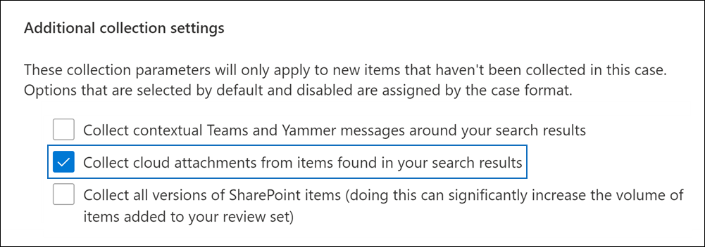
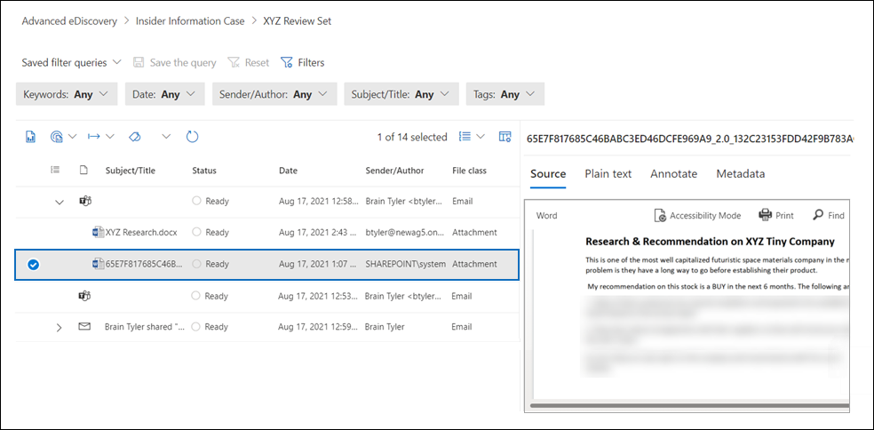

# Collect cloud attachments in Microsoft Purview eDiscovery (Premium)

Cloud attachments are links to documents that are typically stored in SharePoint site and OneDrive. So instead of attaching an actual copy of a document in an email message or a Teams chat conversation, you have the option of sharing a link to the file. Cloud attachments are an effective way to share documents and collaborate with other people in your organization. But cloud attachments present challenges during the eDiscovery workflow because only the cloud attachment link and not the actual content in the shared document are returned in an eDiscovery search. To address this challenge, eDiscovery (Premium) provides two solutions for collecting cloud attachments:  

- Collecting the live version of a document that is linked to in a cloud attachment.

- Collecting the version of the document at the time it was shared in a cloud attachment.

## Collecting cloud attachments

When you create a draft collection and the search results contain items that include cloud attachments, you have to the option of collecting the target of the cloud attachment when you commit the draft collection to a review set. When you select this option, eDiscovery (Premium) adds the documents that are linked to in the cloud attachment to the review set. This allows you to review the target documents and determine if the document is relevant to your case or investigation.

The following screenshot shows the option to include the targets of cloud attachments when you commit a collection to a review set.

> [!NOTE]
>- If you use the [new case format](advanced-ediscovery-new-case-format.md) in eDiscovery (Premium), the option to include cloud attachments in the review set is selected by default and can't be unselected. 
>- You also have the option to include all versions (in addition to the version that was shared) of cloud attachments in the review set.  
For instructions committing a collection to a review set, see [Commit a draft collection to a review set](commit-draft-collection.md).

## Collecting the version shared in a cloud attachment (preview)

The eDiscovery (Premium) workflow for collecting cloud attachments only includes adding the most current version of a cloud attachment to a review set. This means the version that's collected and added to a review set could be different than the version that was originally shared in the cloud attachment. So it's possible that content that was present in the cloud attachment at the time it was shared might have been removed and doesn't exist in the current version that's added to the review set.

Organizations now have the option to use Microsoft 365 retention labels to preserve the version of a document at the time when it was shared as a cloud attachment. To do this, your organization can create a retention label, choose the option apply the label to cloud attachments, and then automatically apply the label to documents stored in SharePoint and OneDrive. After you set up this configuration, a copy of a document is created at the time when the file is shared. Also, if the document is modified and shared again as a cloud attachment, the modified version is also preserved. If the file is modified and shared again, a new copy of the file as a new version is preserved.

Preserving the shared versions of cloud attachments can help your organization scope the preservation and collection of potentially relevant content to the specific version of the document that was shared rather than the current live version. After you implement this retention solution, both the current live version of a cloud attachment and the version that was shared in the cloud attachment are collected and added to a review set.

For instructions on setting up a retention label and automatically applying it to cloud attachments, see [Auto-apply labels to cloud attachments](apply-retention-labels-automatically.md#auto-apply-labels-to-cloud-attachments).

The following screenshot shows a cloud attachment document, named *XYZ Research.docx*, that was added to a review set. The document was shared as a cloud attachment in a Teams chat conversation. The review set also contains the version that was originally shared in the cloud attachment. Notice the name of this version of the cloud attachment is generated by the system and the author is identified as **SharePoint**.

Additionally, the current live version and the version that was shared have the same **FamilyId** property value, which is the same as the **FamilyId** for the parent object (such as an email message or a Teams chat conversation). This lets you group cloud attachments with the item in which they were shared.

After you've implemented the retention label and auto-apply the label to SharePoint documents, you still select the option to collect cloud attachments when committing a draft collection to a review set. When the cloud attachments are collected, both the current live version and the version that was originally shared are added to the review set.
