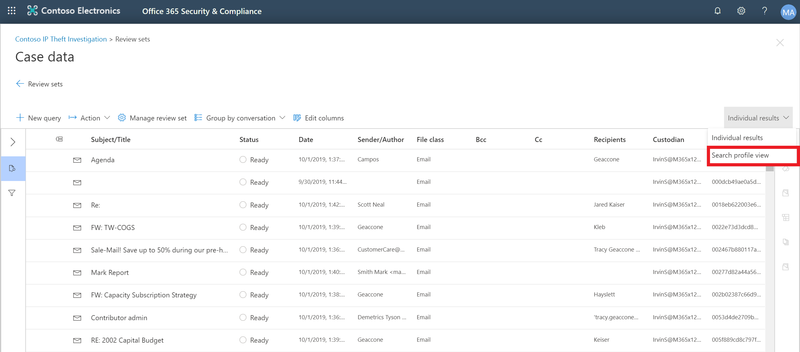

# Advanced eDiscovery dashboard (preview)

In some cases, you may have a large volume of documents and emails that need to be reviewed. Before you start your review process, you may want to quickly analyze your corpus to identify trends or key statistics that will help you develop your review strategy. To do this, you can use the Advanced eDiscovery dashboard view to quickly analyze your corpus.

The article outlines the steps to create and interact with widgets in the dashboard.

## Step 1: Create a widget

1. In the Security & Compliance Center, go to eDiscovery > Advanced eDiscovery to display the list of cases in your organization.
  
2. Select an existing case.
  
3. Click the **Review Set** tab, and then select an existing review set.
  
4. Use the toggle to switch to the search profile view. 

   
  
5. On the Search Profile Page, click Create Widget and specify the following (required) widget details.

   
     1. Title: This is the name of the widget.
     2. Chart Type: This is the type of chart that you would like to create.
     3. Pivot: The dropdown list displays the list of fields that can be used to create a widget. 
    
    >Note
    > A description for each of the pivot options can be found in the Advanced eDiscovery Export fields documentation.
  6.	Click Finish.

## Step 2: Create a search

1. For a given widget, select Apply Filter.

   

2. In the flyout, use the widget key or widget chart to visually create a filter.

   

3. You may repeat steps 1-2 using multiple widgets. 

4. Once done, you can save your conditions as a new query.

   

5. Use the toggle to navigate back to the search results grid. If you have created any visual filters, you will see the resulting query applied within your search results grid.
