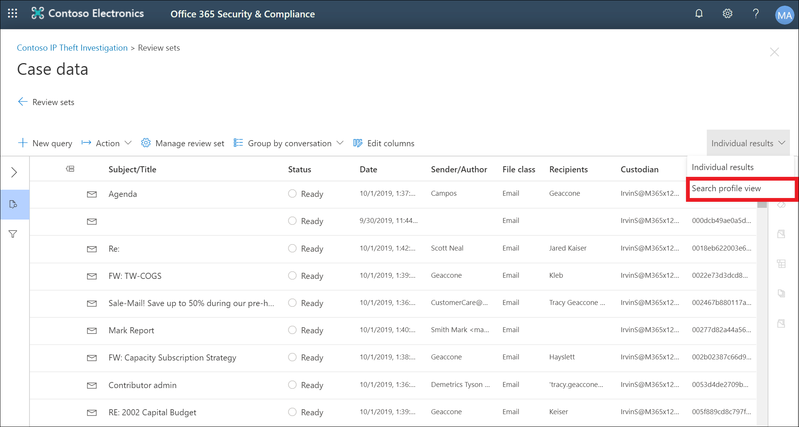
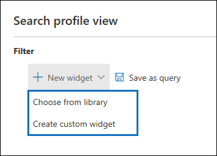

# eDiscovery (Premium) dashboard for review sets

For some cases in Microsoft Purview eDiscovery (Premium), you may have a large volume of documents and email messages that need to be reviewed. Before you start the review process, you may want to quickly analyze your corpus to identify trends or key statistics that will help you develop your review strategy. To do this, you can use the eDiscovery (Premium) dashboard for review sets to quickly analyze your corpus.

## Step 1: Create a widget on the review set dashboard

1. In the Microsoft Purview compliance portal, go to **eDiscovery > eDiscovery (Premium)** to display the list of cases in your organization.
  
2. Select an existing case.
  
3. Click the **Review Set** tab, and then select a review set.
  
4. In the **Individual results** dropdown list, click **Search profile view**. 

   

   The **Search profile view** page is displayed; the first time you display this page, three default widgets are displayed.

   
  
5. Click the **New  widget** and then select one of the following items:

   

   - **Choose from library:** Displays a default library of widgets. You click a widget and then click **Add** to add it to the widgets on the **Search profile view** page.
  
   - **Create custom widget:** Displays a flyout page that you can use to set up a custom widget. 

6. To create a custom widget, do the following on the **Add widget** flyout page:

   

    a. Type a name for the widget, which is displayed in the widget title bar. Naming a widget is required, but it's helpful to identify the widget data.

    b. Select a property in the **Choose pivot** dropdown list that will be used for the widget data. The items in this list are the searchable properties for the items in the review set. For a description of these properties, see [Document metadata fields in eDiscovery (Premium)](document-metadata-fields-in-Advanced-eDiscovery.md). The pivot options for the widget are listed in the **Searchable field name** column in this topic.

    c. Select a chart type to display the data from the selected pivot property.

  6. Click **Add** to create the custom widget and display it on the **Search profile view** page.

## Step 2: Create a review set search query

1. Click **...** in the widget title bar, and then click **Apply condition**.

   

2. On the flyout page, click an element on the widget key or widget chart to create a filter.

   

3. Repeat steps 1-2 for other widgets multiple widgets. 

4. When you're done, click **Save as query** to save your conditions as a new search query for the review set.

   

5. Close the **Search profile view** to return to the search results view.

   If you have created any visual filters, the resulting query is applied to the search results that are displayed, and the search query that you saved in step 4 is displayed under **Saved queries**. For more information about review set queries, see [Query the data in a review set](review-set-search.md).
