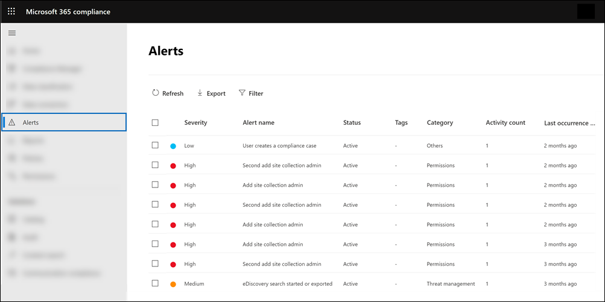

# Alert policies in Microsoft 365

You can use alert policies and the alert dashboard in the Microsoft Purview compliance portal or the Microsoft 365 Defender portal to create alert policies and then view the alerts generated when users perform activities that match the conditions of an alert policy. There are several default alert policies that help you monitor activities such as assigning admin privileges in Exchange Online, malware attacks, phishing campaigns, and unusual levels of file deletions and external sharing.

> [!TIP]
> Go to the [Default alert policies](#default-alert-policies) section in this article for a list and description of the available alert policies.

Alert policies let you categorize the alerts that are triggered by a policy, apply the policy to all users in your organization, set a threshold level for when an alert is triggered, and decide whether to receive email notifications when alerts are triggered. There's also a **Alerts** page where you can view and filter alerts, set an alert status to help you manage alerts, and then dismiss alerts after you've addressed or resolved the underlying incident.

> [!NOTE]
> Alert policies are available for organizations with a Microsoft 365 Enterprise, Office 365 Enterprise, or Office 365 US Government E1/F1/G1, E3/F3/G3, or E5/G5 subscription. Advanced functionality is only available for organizations with an E5/G5 subscription, or for organizations that have an E1/F1/G1 or E3/F3/G3 subscription and a Microsoft Defender for Office 365 P2 or a Microsoft 365 E5 Compliance or an E5 eDiscovery and Audit add-on subscription. The functionality that requires an E5/G5 or add-on subscription is highlighted in this topic. Also note that alert policies are available in Office 365 GCC, GCC High, and DoD US government environments.

[!INCLUDE [purview-preview](../includes/purview-preview.md)]

## How alert policies work

Here's a quick overview of how alert policies work and the alerts that are triggers when user or admin activity matches the conditions of an alert policy.


1. An admin in your organization creates, configures, and turns on an alert policy by using the **Alert policies** page in the compliance portal or the Microsoft 365 Defender portal. You can also create alert policies by using the [New-ProtectionAlert](/powershell/module/exchange/new-protectionalert) cmdlet in Security & Compliance PowerShell.

   To create alert policies, you have to be assigned the Manage Alerts role or the Organization Configuration role in the compliance portal or the Defender portal.

   > [!NOTE]
   > It takes up to 24 hours after creating or updating an alert policy before alerts can be triggered by the policy. This is because the policy has to be synced to the alert detection engine.

2. A user performs an activity that matches the conditions of an alert policy. In the case of malware attacks, infected email messages sent to users in your organization trigger an alert.

3. Microsoft 365 generates an alert that's displayed on the **Alerts** page in compliance portal or Defender portal. Also, if email notifications are enabled for the alert policy, Microsoft sends a notification to a list of recipients. The alerts that an admin or other users can see that on the Alerts page is determined by the roles assigned to the user. For more information, see [RBAC permissions required to view alerts](#rbac-permissions-required-to-view-alerts).

4. An admin manages alerts in the Microsoft Purview compliance portal. Managing alerts consists of assigning an alert status to help track and manage any investigation.

## Alert policy settings

An alert policy consists of a set of rules and conditions that define the user or admin activity that generates an alert, a list of users who trigger the alert if they perform the activity, and a threshold that defines how many times the activity has to occur before an alert is triggered. You also categorize the policy and assign it a severity level. These two settings help you manage alert policies (and the alerts that are triggered when the policy conditions are matched) because you can filter on these settings when managing policies and viewing alerts in the Microsoft Purview compliance portal. For example, you can view alerts that match the conditions from the same category or view alerts with the same severity level.

To view and create alert policies:

- **Microsoft Purview compliance portal**:

  Go to the <a href="https://go.microsoft.com/fwlink/p/?linkid=2077149" target="_blank">compliance portal</a>, and then select **Policies** \> **Alert** \> **Alert policies**.

  

- **Microsoft 365 Defender portal**:

  Go to the <a href="https://go.microsoft.com/fwlink/p/?linkid=2077139" target="_blank">Microsoft 365 Defender portal</a> and under **Email & collaboration** select **Policies & rules** \> **Alert policy**. Alternatively, you can go directly to <https://security.microsoft.com/alertpolicies>.

  

> [!NOTE]
> You have to be assigned the View-Only Manage Alerts role to view alert policies in the Microsoft Purview compliance portal or the Microsoft 365 Defender portal. You have to be assigned the Manage Alerts role to create and edit alert policies. For more information, see [Permissions in the Microsoft Purview compliance portal](microsoft-365-compliance-center-permissions.md).

An alert policy consists of the following settings and conditions.

- **Activity the alert is tracking**. You create a policy to track an activity or in some cases a few related activities, such a sharing a file with an external user by sharing it, assigning access permissions, or creating an anonymous link. When a user performs the activity defined by the policy, an alert is triggered based on the alert threshold settings.

    > [!NOTE]
    > The activities that you can track depend on your organization's Office 365 Enterprise or Office 365 US Government plan. In general, activities related to malware campaigns and phishing attacks require an E5/G5 subscription or an E1/F1/G1 or E3/F3/G3 subscription with an [Defender for Office 365](../security/office-365-security/defender-for-office-365.md) Plan 2 add-on subscription.

- **Activity conditions**. For most activities, you can define additional conditions that must be met to trigger an alert. Common conditions include IP addresses (so that an alert is triggered when the user performs the activity on a computer with a specific IP address or within an IP address range), whether an alert is triggered if a specific user or users perform that activity, and whether the activity is performed on a specific file name or URL. You can also configure a condition that triggers an alert when the activity is performed by any user in your organization. The available conditions are dependent on the selected activity.

You can also define user tags as a condition of an alert policy. This results in the alerts triggered by the policy to include the context of the impacted user. You can use system user tags or custom user tags. For more information, see [User tags in Microsoft Defender for Office 365](/microsoft-365/security/office-365-security/user-tags).

- **When the alert is triggered**. You can configure a setting that defines how often an activity can occur before an alert is triggered. This allows you to set up a policy to generate an alert every time an activity matches the policy conditions, when a certain threshold is exceeded, or when the occurrence of the activity the alert is tracking becomes unusual for your organization.

    

    If you select the setting based on unusual activity, Microsoft establishes a baseline value that defines the normal frequency for the selected activity. It takes up to seven days to establish this baseline, during which alerts won't be generated. After the baseline is established, an alert is triggered when the frequency of the activity tracked by the alert policy greatly exceeds the baseline value. For auditing-related activities (such as file and folder activities), you can establish a baseline based on a single user or based on all users in your organization; for malware-related activities, you can establish a baseline based on a single malware family, a single recipient, or all messages in your organization.

    > [!NOTE]
    > The ability to configure alert policies based on a threshold or based on unusual activity requires an E5/G5 subscription, or an E1/F1/G1 or E3/F3/G3 subscription with a Microsoft Defender for Office 365 P2, Microsoft 365 E5 Compliance, or Microsoft 365 eDiscovery and Audit add-on subscription. Organizations with an E1/F1/G1 and E3/F3/G3 subscription can only create alert policies where an alert is triggered every time that an activity occurs.

- **Alert category**. To help with tracking and managing the alerts generated by a policy, you can assign one of the following categories to a policy.

  - Data loss prevention
  - Information governance
  - Mail flow
  - Permissions
  - Threat management
  - Others

  When an activity occurs that matches the conditions of the alert policy, the alert that's generated is tagged with the category defined in this setting. This allows you to track and manage alerts that have the same category setting on the **Alerts** page in the Microsoft Purview portal because you can sort and filter alerts based on category.

- **Alert severity**. Similar to the alert category, you assign a severity attribute (**Low**, **Medium**, **High**, or **Informational**) to alert policies. Like the alert category, when an activity occurs that matches the conditions of the alert policy, the alert that's generated is tagged with the same severity level that's set for the alert policy. Again, this allows you to track and manage alerts that have the same severity setting on the **Alerts** page. For example, you can filter the list of alerts so that only alerts with a **High** severity are displayed.

    > [!TIP]
    > When setting up an alert policy, consider assigning a higher severity to activities that can result in severely negative consequences, such as detection of malware after delivery to users, viewing of sensitive or classified data, sharing data with external users, or other activities that can result in data loss or security threats. This can help you prioritize alerts and the actions you take to investigate and resolve the underlying causes.

- **Automated investigations**. Some alerts will trigger automated investigations to identify potential threats and risks that need remediation or mitigation. In most cases these alerts are triggered by detection of malicious emails or activities, but in some cases the alerts are triggered by administrator actions in the security portal. For more information about automated investigations, see [Automated investigation and response (AIR) in Microsoft Defender for Office 365](../security/office-365-security/office-365-air.md).

- **Email notifications**. You can set up the policy so that email notifications are sent (or not sent) to a list of users when an alert is triggered. You can also set a daily notification limit so that once the maximum number of notifications has been reached, no more notifications are sent for the alert during that day. In addition to email notifications, you or other administrators can view the alerts that are triggered by a policy on the **Alerts** page. Consider enabling email notifications for alert policies of a specific category or that have a higher severity setting.

## Default alert policies

Microsoft provides built-in alert policies that help identify Exchange admin permissions abuse, malware activity, potential external and internal threats, and information governance risks. On the **Alert policies** page, the names of these built-in policies are in bold and the policy type is defined as **System**. These policies are turned on by default. You can turn off these policies (or back on again), set up a list of recipients to send email notifications to, and set a daily notification limit. The other settings for these policies can't be edited.

The following tables list and describe the available default alert policies and the category each policy is assigned to. The category is used to determine which alerts a user can view on the Alerts page. For more information, see [RBAC permissions required to view alerts](#rbac-permissions-required-to-view-alerts).

The tables also indicate the Office 365 Enterprise and Office 365 US Government plan required for each one. Some default alert policies are available if your organization has the appropriate add-on subscription in addition to an E1/F1/G1 or E3/F3/G3 subscription.

> [!NOTE]
> The unusual activity monitored by some of the built-in policies is based on the same process as the alert threshold setting that was previously described. Microsoft establishes a baseline value that defines the normal frequency for "usual" activity. Alerts are then triggered when the frequency of activities tracked by the built-in alert policy greatly exceeds the baseline value.

### Information governance alert policies

|Name|Description|Severity|Automated investigation|Enterprise subscription|
|---|---|---|---|---|
|**Unusual external user file activity**|Generates an alert when an unusually large number of activities are performed on files in SharePoint or OneDrive by users outside of your organization. This includes activities such as accessing files, downloading files, and deleting files.|High|No|E5/G5, Microsoft Defender for Office 365 P2, or Microsoft 365 E5 add-on subscription|
|**Unusual volume of external file sharing**|Generates an alert when an unusually large number of files in SharePoint or OneDrive are shared with users outside of your organization.|Medium|No|E5/G5, Defender for Office 365 P2, or Microsoft 365 E5 add-on subscription|
|**Unusual volume of file deletion**|Generates an alert when an unusually large number of files are deleted in SharePoint or OneDrive within a short time frame.|Medium|No|E5/G5, Defender for Office 365 P2, or Microsoft 365 E5 add-on subscription|

### Mail flow alert policies

|Name|Description|Severity|Automated investigation|Enterprise subscription|
|---|---|---|---|---|
|**Messages have been delayed**|Generates an alert when Microsoft can't deliver email messages to your on-premises organization or a partner server by using a connector. When this happens, the message is queued in Office 365. This alert is triggered when there are 2,000 messages or more that have been queued for more than an hour.|High|No|E1/F1/G1, E3/F3/G3, or E5/G5|

### Permissions alert policies

|Name|Description|Severity|Automated investigation|Enterprise subscription|
|---|---|---|---|---|
|**Elevation of Exchange admin privilege**|Generates an alert when someone is assigned administrative permissions in your Exchange Online organization. For example, when a user is added to the Organization Management role group in Exchange Online.|Low|No|E1/F1/G1, E3/F3/G3, or E5/G5|

### Threat management alert policies

> [!NOTE]
> We've temporarily removed the **Phish delivered due to tenant or user override** and **User impersonation phish delivered to inbox/folder** default alert policies based on customer feedback. We're working to improve them, and we'll eventually replace them with new versions. Until then, you can create custom alert policies to replace their functionality by using the following conditions:
>
> - **Activity is**: Phishing email detected at time of delivery
> - **Mail is not ZAP'd**
> - **Mail direction is**: Inbound
> - **Mail delivery status is**: Delivered
> - **Detection technology is**:
>   - To replicate **Phish delivered due to tenant or user override**: Malicious URL retention, URL detonation, Advanced phish filter, General phish filter, Domain impersonation, User impersonation, and Brand impersonation.
>   - To replicate **User impersonation phish delivered to inbox/folder**: User impersonation
>
> For more information about anti-phishing in Office 365, see [Set up anti-phishing and anti-phishing policies](../security/office-365-security/set-up-anti-phishing-policies.md).

|Name|Description|Severity|Automated investigation|Enterprise subscription|
|---|---|---|---|---|
|**A potentially malicious URL click was detected**|Generates an alert when a user protected by [Safe Links](/microsoft-365/security/office-365-security/safe-links) in your organization clicks a malicious link. This alert is generated when a user clicks on a link and this event triggers a URL verdict change identification by Microsoft Defender for Office 365. This alert automatically triggers [automated investigation and response in Office 365](/microsoft-365/security/office-365-security/office-365-air). For more information on events that trigger this alert, see [Set up Safe Links policies](/microsoft-365/security/office-365-security/set-up-safe-links-policies).|High|Yes|E5/G5 or Defender for Office 365 P2 add-on subscription|
|**A user clicked through to a potentially malicious URL**|Generates an alert when a user protected by [Safe Links](/microsoft-365/security/office-365-security/safe-links) in your organization clicks a malicious link. This event is triggered when user clicks on a URL (which is identified as malicious or pending validation) and overrides the Safe Links warning page (based on your organization's Microsoft 365 for business Safe Links policy) to continue to the URL hosted page / content. For Defender for Office 365 P2, E5, G5 customers, this alert automatically triggers [automated investigation and response in Office 365](/microsoft-365/security/office-365-security/office-365-air). For more information on events that trigger this alert, see [Set up Safe Links policies](/microsoft-365/security/office-365-security/set-up-safe-links-policies).|High|Yes|E5/G5 or Defender for Office 365 P2 add-on subscription|
|**Admin submission result completed**|Generates an alert when an [Admin Submission](../security/office-365-security/admin-submission.md) completes the rescan of the submitted entity. An alert will be triggered every time a rescan result is rendered from an Admin Submission. <br/><br/> These alerts are meant to remind you to [review the results of previous submissions](https://compliance.microsoft.com/reportsubmission), submit user reported messages to get the latest policy check and rescan verdicts, and help you determine if the filtering policies in your organization are having the intended impact.|Informational|No|E1/F1, E3/F3, or E5|
|**Admin triggered manual investigation of email**|Generates an alert when an admin triggers the manual investigation of an email from Threat Explorer. For more information, see [Example: A security administrator triggers an investigation from Threat Explorer](../security/office-365-security/automated-investigation-response-office.md#example-a-security-administrator-triggers-an-investigation-from-threat-explorer). <br/><br/> This alert notifies your organization that the investigation was started. The alert provides information about who triggered it and includes a link to the investigation.|Informational|Yes|E5/G5 or Microsoft Defender for Office 365 P2 add-on subscription|
|**Admin triggered user compromise investigation**|Generates an alert when an admin triggers the manual user compromise investigation of either an email sender or recipient from Threat Explorer. For more information, see [Example: A security administrator triggers an investigation from Threat Explorer](../security/office-365-security/automated-investigation-response-office.md#example-a-security-administrator-triggers-an-investigation-from-threat-explorer), which shows the related manual triggering of an investigation on an email. This alert notifies your organization that the user compromise investigation was started. <br/><br/> The alert provides information about who triggered it and includes a link to the investigation.|Medium|Yes|E5/G5 or Microsoft Defender for Office 365 P2 add-on subscription|
|**Administrative action submitted by an Administrator**|Admins can take manual email actions on email entities using various surfaces. For example, Threat Explorer, advanced hunting or through custom detection. When the remediation starts, it generates an alert. This alert shows up in the alerts queue with the name **Administrative action submitted by an Administrator** to indicate that an admin took the action of remediating an entity. The alert contains details like the action type, supporting investigation link, time, etc. It's helpful to know whenever a sensitive action like remediation is performed on entities.|Informational|Yes|E5/G5 or Defender for Office 365 P2 add-on subscription|
|**Creation of forwarding/redirect rule**|Generates an alert when someone in your organization creates an inbox rule for their mailbox that forwards or redirects messages to another email account. This policy only tracks inbox rules that are created using Outlook on the web (formerly known as Outlook Web App) or Exchange Online PowerShell. For more information about using inbox rules to forward and redirect email in Outlook on the web, see [Use rules in Outlook on the web to automatically forward messages to another account](https://support.office.com/article/1433e3a0-7fb0-4999-b536-50e05cb67fed).|Informational|No|E1/F1/G1, E3/F3/G3, or E5/G5|
|**eDiscovery search started or exported**|Generates an alert when someone uses the Content search tool in the Microsoft Purview portal. An alert is triggered when the following content search activities are performed: <br><br> <li> A content search is started <li> The results of a content search are exported <li> A content search report is exported <br><br> Alerts are also triggered when the previous content search activities are performed in association with an eDiscovery case. For more information about content search activities, see [Search for eDiscovery activities in the audit log](search-for-ediscovery-activities-in-the-audit-log.md#ediscovery-activities).|Informational|No|E1/F1/G1, E3/F3/G3, or E5/G5|
|**Email messages containing malicious file removed after delivery**|Generates an alert when any messages containing a malicious file are delivered to mailboxes in your organization. If this event occurs, Microsoft removes the infected messages from Exchange Online mailboxes using [Zero-hour auto purge](../security/office-365-security/zero-hour-auto-purge.md). This policy automatically triggers [automated investigation and response in Office 365](../security/office-365-security/office-365-air.md). For more information on this new policy, see [New alert policies in Microsoft Defender for Office 365](new-defender-alert-policies.md).|Informational|Yes|E5/G5 or Microsoft Defender for Office 365 P2 add-on subscription|
|**Email messages containing malicious URL removed after delivery**|Generates an alert when any messages containing a malicious URL are delivered to mailboxes in your organization. If this event occurs, Microsoft removes the infected messages from Exchange Online mailboxes using [Zero-hour auto purge](../security/office-365-security/zero-hour-auto-purge.md). This policy automatically triggers [automated investigation and response in Office 365](../security/office-365-security/office-365-air.md). For more information on this new policy, see [New alert policies in Microsoft Defender for Office 365](new-defender-alert-policies.md).|Informational|Yes|E5/G5 or Defender for Office 365 P2 add-on subscription|
|**Email messages containing malware removed after delivery**|**Note**: This alert policy has been replaced by **Email messages containing malicious file removed after delivery**. This alert policy will eventually go away, so we recommend disabling this alert policy and using **Email messages containing malicious file removed after delivery** instead. For more information, see [New alert policies in Microsoft Defender for Office 365](new-defender-alert-policies.md).|Informational|Yes|E5/G5 or Microsoft Defender for Office 365 P2 add-on subscription|
|**Email messages containing phish URLs removed after delivery**|**Note**: This alert policy has been replaced by **Email messages containing malicious URL removed after delivery**. This alert policy will eventually go away, so we recommend disabling this alert policy and using **Email messages containing malicious URL removed after delivery** instead. For more information, see [New alert policies in Microsoft Defender for Office 365](new-defender-alert-policies.md).|Informational|Yes|E5/G5 or Defender for Office 365 P2 add-on subscription|
|**Email messages from a campaign removed after delivery**|Generates an alert when any messages associated with a [Campaign](../security/office-365-security/campaigns.md) are delivered to mailboxes in your organization. If this event occurs, Microsoft removes the infected messages from Exchange Online mailboxes using [Zero-hour auto purge](../security/office-365-security/zero-hour-auto-purge.md). This policy automatically triggers [automated investigation and response in Office 365](../security/office-365-security/office-365-air.md). For more information on this new policy, see [New alert policies in Microsoft Defender for Office 365](new-defender-alert-policies.md).|Informational|Yes|E5/G5 or Defender for Office 365 P2 add-on subscription|
|**Email messages removed after delivery**|Generates an alert when any malicious messages that do not contain a malicious entity (URL or File), or associated with a Campaign, are delivered to mailboxes in your organization. If this event occurs, Microsoft removes the infected messages from Exchange Online mailboxes using [Zero-hour auto purge](../security/office-365-security/zero-hour-auto-purge.md). This policy automatically triggers [automated investigation and response in Office 365](../security/office-365-security/office-365-air.md). For more information on this new policy, see [New alert policies in Microsoft Defender for Office 365](new-defender-alert-policies.md).|Informational|Yes|E5/G5 or Defender for Office 365 P2 add-on subscription|
|**Email reported by user as malware or phish**|Generates an alert when users in your organization report messages as phishing email using the Report Message add-in. For more information about this add-in, see [Use the Report Message add-in](https://support.office.com/article/b5caa9f1-cdf3-4443-af8c-ff724ea719d2). For Defender for Office 365 P2, E5, G5 customers, this alert automatically triggers [automated investigation and response in Office 365](../security/office-365-security/office-365-air.md).|Low|Yes|E1/F1/G1, E3/F3/G3, or E5/G5|
|**Email sending limit exceeded**|Generates an alert when someone in your organization has sent more mail than is allowed by the outbound spam policy. This is usually an indication the user is sending too much email or that the account may be compromised. If you get an alert generated by this alert policy, it's a good idea to [check whether the user account is compromised](../security/office-365-security/responding-to-a-compromised-email-account.md).|Medium|No|E1/F1/G1, E3/F3/G3, or E5/G5|
|**Form blocked due to potential phishing attempt**|Generates an alert when someone in your organization has been restricted from sharing forms and collecting responses using Microsoft Forms due to detected repeated phishing attempt behavior.|High|No|E1, E3/F3, or E5|
|**Form flagged and confirmed as phishing**|Generates an alert when a form created in Microsoft Forms from within your organization has been identified as potential phishing through Report Abuse and confirmed as phishing by Microsoft.|High|No|E1, E3/F3, or E5|
|**Malware campaign detected after delivery**|Generates an alert when an unusually large number of messages containing malware are delivered to mailboxes in your organization. If this event occurs, Microsoft removes the infected messages from Exchange Online mailboxes.|High|No|E5/G5 or Microsoft Defender for Office 365 P2 add-on subscription|
|**Malware campaign detected and blocked**|Generates an alert when someone has attempted to send an unusually large number of email messages containing a certain type of malware to users in your organization. If this event occurs, the infected messages are blocked by Microsoft and not delivered to mailboxes.|Low|No|E5/G5 or Defender for Office 365 P2 add-on subscription|
|**Malware campaign detected in SharePoint and OneDrive**|Generates an alert when an unusually high volume of malware or viruses is detected in files located in SharePoint sites or OneDrive accounts in your organization.|High|No|E5/G5 or Defender for Office 365 P2 add-on subscription|
|**Malware not zapped because ZAP is disabled**| Generates an alert when Microsoft detects delivery of a malware message to a mailbox because Zero-Hour Auto Purge for Phish messages is disabled.|Informational|No|E5/G5 or Defender for Office 365 P2 add-on subscription|
|**Messages containing malicious entity not removed after delivery**|Generates an alert when any message containing malicious content (file, URL, campaign, no entity), is delivered to mailboxes in your organization. If this event occurs, Microsoft attempted to remove the infected messages from Exchange Online mailboxes using [Zero-hour auto purge](../security/office-365-security/zero-hour-auto-purge.md), but the message was not removed due to a failure. Additional investigation is recommended. This policy automatically triggers [automated investigation and response in Office 365](../security/office-365-security/office-365-air.md).|Medium|Yes|E5/G5 or Defender for Office 365 P2 add-on subscription|
|**Phish delivered because a user's Junk Mail folder is disabled**|**Note**: This alert policy is in the process of being deprecated. Mailbox settings no longer determine whether detected messages can be moved to the Junk Email folder. For more information, see [Configure junk email settings on Exchange Online mailboxes](/microsoft-365/security/office-365-security/configure-junk-email-settings-on-exo-mailboxes).|Informational|No|E1/F1/G1, E3/F3/G3, or E5/G5|
|**Phish delivered due to an ETR override**|Generates an alert when Microsoft detects an Exchange transport rule (also known as a mail flow rule) that allowed delivery of a high confidence phishing message to a mailbox. For more information about Exchange Transport Rules (Mail flow rules), see [Mail flow rules (transport rules) in Exchange Online](/exchange/security-and-compliance/mail-flow-rules/mail-flow-rules).|Informational|No|E1/F1/G1, E3/F3/G3, or E5/G5|
|**Phish delivered due to an IP allow policy**|Generates an alert when Microsoft detects an IP allow policy that allowed delivery of a high confidence phishing message to a mailbox. For more information about the IP allow policy (connection filtering), see [Configure the default connection filter policy - Office 365](../security/office-365-security/configure-the-connection-filter-policy.md).|Informational|No|E1/F1/G1, E3/F3/G3, or E5/G5|
|**Phish not zapped because ZAP is disabled**|Generates an alert when Microsoft detects delivery of a high confidence phishing message to a mailbox because Zero-Hour Auto Purge for Phish messages is disabled.|Informational|No|E5/G5 or Defender for Office 365 P2 add-on subscription|
|**Potential nation-state activity**|Microsoft Threat Intelligence Center detected an attempt to compromise accounts from your tenant.|High|No|E5/G5 or Defender for Office 365 P2 add-on subscription|
|**Remediation action taken by admin on emails or URL or sender**|**Note**: This alert policy has been replaced by the **Administrative action submitted by an Administrator** alert policy. This alert policy will eventually go away, so we recommend disabling this alert policy and using **Administrative action submitted by an Administrator** instead. <br/><br/> This alert is triggered when an admin takes remediation action on the selected entity|Informational|Yes|E5/G5 or Defender for Office 365 P2 add-on subscription|
|**Suspicious connector activity**|Generates an alert when a suspicious activity is detected on an inbound connector in your organization. Mail is blocked from using the inbound connector. The admin will receive an email notification and an alert. This alert provides guidance on how to investigate, revert changes, and unblock a restricted connector. To learn how to respond to this alert, see [Respond to a compromised connector](/microsoft-365/security/office-365-security/respond-compromised-connector).|High|No|E1/F1/G1, E3/F3/G3, or E5/G5|
|**Suspicious email forwarding activity**|Generates an alert when someone in your organization has autoforwarded email to a suspicious external account. This is an early warning for behavior that may indicate the account is compromised, but not severe enough to restrict the user. Although it's rare, an alert generated by this policy may be an anomaly. It's a good idea to [check whether the user account is compromised](../security/office-365-security/responding-to-a-compromised-email-account.md).|High|No|E1/F1/G1, E3/F3/G3, or E5/G5|
|**Suspicious email sending patterns detected**|Generates an alert when someone in your organization has sent suspicious email and is at risk of being restricted from sending email. This is an early warning for behavior that may indicate that the account is compromised, but not severe enough to restrict the user. Although it's rare, an alert generated by this policy may be an anomaly. However, it's a good idea to [check whether the user account is compromised](../security/office-365-security/responding-to-a-compromised-email-account.md).|Medium|Yes|E1/F1/G1, E3/F3/G3, or E5/G5|
|**Tenant Allow/Block List entry is about to expire**|Generates an alert when a Tenant Allow/Block List entry is about to be removed. This event is triggered three days prior to expiration date, which is based when the entry was created or last updated. <br/><br/> For blocks, you can extend the expiration date to keep the block in place. For allows, you need to resubmit the item so that our analysts can take another look. However, if the allow has already been graded as a false positive, then the entry will only expire when the system filters have been updated to naturally allow the entry. For more information on events that trigger this alert, see [Manage the Tenant Allow/Block list](../security/office-365-security/tenant-allow-block-list.md).|Informational|No|E5/G5 or Defender for Office 365 P2 add-on subscription|
|**Tenant restricted from sending email**|Generates an alert when most of the email traffic from your organization has been detected as suspicious and Microsoft has restricted your organization from sending email. Investigate any potentially compromised user and admin accounts, new connectors, or open relays, and then contact Microsoft Support to unblock your organization. For more information about why organizations are blocked, see [Fix email delivery issues for error code 5.7.7xx in Exchange Online](/Exchange/mail-flow-best-practices/non-delivery-reports-in-exchange-online/fix-error-code-5-7-700-through-5-7-750).|High|No|E1/F1/G1, E3/F3/G3, or E5/G5|
|**Tenant restricted from sending unprovisioned email**|Generates an alert when too much email is being sent from unregistered domains (also known as _unprovisioned_ domains). Office 365 allows a reasonable amount of email from unregistered domains, but you should configure every domain that you use to send email as an accepted domain. This alert indicates that all users in the organization can no longer send email. For more information about why organizations are blocked, see [Fix email delivery issues for error code 5.7.7xx in Exchange Online](/Exchange/mail-flow-best-practices/non-delivery-reports-in-exchange-online/fix-error-code-5-7-700-through-5-7-750).|High|No|E1/F1/G1, E3/F3/G3, or E5/G5|
|**Unusual increase in email reported as phish**|Generates an alert when there's a significant increase in the number of people in your organization using the Report Message add-in in Outlook to report messages as phishing mail. For more information about this add-in, see [Use the Report Message add-in](https://support.office.com/article/b5caa9f1-cdf3-4443-af8c-ff724ea719d2).|Medium|No|E5/G5 or Defender for Office 365 P2 add-on subscription|
|**User requested to release a quarantined message**|Generates an alert when a user requests release for a quarantined message. To request the release of quarantined messages, the **Allow recipients to request a message to be released from quarantine** (_PermissionToRequestRelease_) permission is required in the quarantine policy (for example, from the **Limited access** preset permissions group). For more information, see [Allow recipients to request a message to be released from quarantine permission](../security/office-365-security/quarantine-policies.md#allow-recipients-to-request-a-message-to-be-released-from-quarantine-permission).|Informational|No|Microsoft Business Basic, Microsoft Business Standard, Microsoft Business Premium, E1/F1/G1, E3/F3/G3, or E5/G5|
|**User restricted from sending email**|Generates an alert when someone in your organization is restricted from sending outbound mail. This typically results when an account is compromised, and the user is listed on the **Restricted Users** page in the compliance portal. (To access this page, go to **Threat management \> Review \> Restricted Users**). For more information about restricted users, see [Removing a user, domain, or IP address from a block list after sending spam email](/office365/securitycompliance/removing-user-from-restricted-users-portal-after-spam).|High|Yes|Microsoft Business Basic, Microsoft Business Standard, Microsoft Business Premium, E1/F1/G1, E3/F3/G3, or E5/G5|
|**User restricted from sharing forms and collecting responses**|Generates an alert when someone in your organization has been restricted from sharing forms and collecting responses using Microsoft Forms due to detected repeated phishing attempt behavior.|High|No|E1, E3/F3, or E5|

## View alerts

When an activity performed by users in your organization matches the settings of an alert policy, an alert is generated and displayed on the **Alerts** page in the Microsoft Purview portal or the Defender portal. Depending on the settings of an alert policy, an email notification is also sent to a list of specified users when an alert is triggered. For each alert, the dashboard on the **Alerts** page displays the name of the corresponding alert policy, the severity and category for the alert (defined in the alert policy), and the number of times an activity has occurred that resulted in the alert being generated. This value is based on the threshold setting of the alert policy. The dashboard also shows the status for each alert. For more information about using the status property to manage alerts, see [Managing alerts](#manage-alerts).

To view alerts:

### Microsoft Purview compliance portal

 Go to <https://compliance.microsoft.com> and then select **Alerts**. Alternatively, you can go directly to <https://compliance.microsoft.com/compliancealerts>.



### Microsoft 365 Defender portal

Go to <a href="https://go.microsoft.com/fwlink/p/?linkid=2077139" target="_blank">Microsoft 365 Defender portal</a> and then select **Incidents & alerts** > **Alerts**. Alternatively, you can go directly to <https://security.microsoft.com/alerts>.


You can use the following filters to view a subset of all the alerts on the **Alerts** page:

- **Status**: Show alerts that are assigned a particular status. The default status is **Active**. You or other administrators can change the status value.
- **Policy**: Show alerts that match the setting of one or more alert policies. Or you can display all alerts for all alert policies.
- **Time range**: Show alerts that were generated within a specific date and time range.
- **Severity**: Show alerts that are assigned a specific severity.
- **Category**: Show alerts from one or more alert categories.
- **Tags**:Show alerts from one or more user tags. Tags are reflected based on tagged mailboxes or users that appear in the alerts. See [User tags in Defender for Office 365](../security/office-365-security/user-tags.md) to learn more.
- **Source**: Use this filter to show alerts triggered by alert policies in the Microsoft Purview portal or alerts triggered by Microsoft Defender for Cloud Apps policies, or both. For more information about Defender for Cloud Apps alerts, see the [View Defender for Cloud Apps alerts](#view-defender-for-cloud-apps-alerts) section in this article.

> [!IMPORTANT]
> Filtering and sorting by user tags is currently in Public Preview, and might be substantially modified before it's generally available. Microsoft makes no warranties, express or implied, with respect to the information provided about it.

## Alert aggregation

When multiple events that match the conditions of an alert policy occur with a short period of time, they are added to an existing alert by a process called _alert aggregation_. When an event triggers an alert, the alert is generated and displayed on the **Alerts** page and a notification is sent. If the same event occurs within the aggregation interval, then Microsoft 365 adds details about the new event to the existing alert instead of triggering a new alert. The goal of alert aggregation is to help reduce alert "fatigue" and let you focus and take action on fewer alerts for the same event.

The length of the aggregation interval depends on your Office 365 or Microsoft 365 subscription.

|Subscription|Aggregation<br>interval|
|---|:---:|
|Office 365 or Microsoft 365 E5/G5|1 minute|
|Defender for Office 365 Plan 2 |1 minute|
|E5 Compliance add-on or E5 Discovery and Audit add-on|1 minute|
|Office 365 or Microsoft 365 E1/F1/G1 or E3/F3/G3|15 minutes|
|Defender for Office 365 Plan 1 or Exchange Online Protection|15 minutes|

When events that match the same alert policy occur within the aggregation interval, details about the subsequent event are added to the original alert. For all events, information about aggregated events is displayed in the details field and the number of times an event occurred with the aggregation interval is displayed in the activity/hit count field. You can view more information about all aggregated events instances by viewing the activity list.

The following screenshot shows an alert with four aggregated events. The activity list contains information about the four email messages relevant to the alert.


Keep the following things in mind about alert aggregation:

- Alerts triggered by the **A potentially malicious URL click was detected** [default alert policy](#default-alert-policies) are not aggregated. This is because alerts triggered by this policy are unique to each user and email message.

- At this time, the **Hit count** alert property doesn't indicate the number of aggregated events for all alert policies. For alerts triggered by these alert policies, you can view the aggregated events by clicking **View message list** or **View activity** on the alert. We're working to make the number of aggregated events listed in the **Hit count** alert property available for all alert policies.

## RBAC permissions required to view alerts

The Role Based Access Control (RBAC) permissions assigned to users in your organization determine which alerts a user can see on the **Alerts** page. How is this accomplished? The management roles assigned to users (based on their membership in role groups in the compliance portal or the Microsoft 365 Defender portal) determine which alert categories a user can see on the **Alerts** page. Here are some examples:

- Members of the Records Management role group can view only the alerts that are generated by alert policies that are assigned the **Information governance** category.
- Members of the Compliance Administrator role group can't view alerts that are generated by alert policies that are assigned the **Threat management** category.
- Members of the eDiscovery Manager role group can't view any alerts because none of the assigned roles provide permission to view alerts from any alert category.

This design (based on RBAC permissions) lets you determine which alerts can be viewed (and managed) by users in specific job roles in your organization.

The following table lists the roles that are required to view alerts from the six different alert categories. A check mark indicates that a user who is assigned that role can view alerts from the corresponding alert category listed in the title row.

To see which category a default alert policy is assigned to, see the tables in [Default alert policies](#default-alert-policies).

|Role|Information<br>governance|Data loss<br>prevention|Mail<br>flow|Permissions|Threat<br>management|Others|
|---|:---:|:---:|:---:|:---:|:---:|:---:|
|Compliance Administrator|✔|✔||✔||✔|
|<!---X--->DLP Compliance Management||✔|||||
|Information Protection Admin||✔|||||
|Information Protection Analyst||✔|||||
|Information Protection Investigator||✔|||||
|Manage Alerts||||||✔|
|Organization Configuration||||||✔|
|Privacy Management|||||||
|Quarantine|||||||
|<!---X--->Record Management|✔||||||
|Retention Management|✔||||||
|Role Management||||✔|||
|Security Administrator||✔||✔|✔|✔|
|Security Reader||✔||✔|✔|✔|
|Transport Hygiene|||||||
|<!---X--->View-Only DLP Compliance Management||✔|||||
|View-Only Configuration|||||||
|View-Only Manage Alerts||||||✔|
|View-Only Recipients|||✔||||
|<!---X--->View-Only Record Management|✔||||||
|<!---X--->View-Only Retention Management|✔||||||

> [!TIP]
> To view the roles that are assigned to each of the default role groups, run the following commands in Security & Compliance PowerShell:
>
> ```powershell
> $RoleGroups = Get-RoleGroup
> $RoleGroups | foreach {Write-Output -InputObject `r`n,$_.Name,("-"*25); Get-RoleGroup $_.Identity | Select-Object -ExpandProperty Roles}
> ```
>
> You can also view the roles assigned to a role group in the compliance portal or the Microsoft 365 Defender portal. Go to the **Permissions** page, and select a role group. The assigned roles are listed on the flyout page.

## Manage alerts

After alerts have been generated and displayed on the **Alerts** page in the Microsoft Purview portal, you can triage, investigate, and resolve them. The same [RBAC permissions](#rbac-permissions-required-to-view-alerts) that give users access to alerts also give them the ability to manage alerts.

Here are some tasks you can perform to manage alerts.

- **Assign a status to alerts**: You can assign one of the following statuses to alerts: **Active** (the default value), **Investigating**, **Resolved**, or **Dismissed**. Then, you can filter on this setting to display alerts with the same status setting. This status setting can help track the process of managing alerts.

- **View alert details**: You can select an alert to display a flyout page with details about the alert. The detailed information depends on the corresponding alert policy, but it typically includes the following information:

  - The name of the actual operation that triggered the alert, such as a cmdlet or an audit log operation.
  - A description of the activity that triggered the alert.
  - The user (or list of users) who triggered the alert. This is included only for alert policies that are set up to track a single user or a single activity.
  - The number of times the activity tracked by the alert was performed. This number may not match that actual number of related alerts listed on the Alerts page because more alerts may have been triggered.
  - A link to an activity list that includes an item for each activity that was performed that triggered the alert. Each entry in this list identifies when the activity occurred, the name of the actual operation (such as "FileDeleted"), the user who performed the activity, the object (such as a file, an eDiscovery case, or a mailbox) that the activity was performed on, and the IP address of the user's computer. For malware-related alerts, this links to a message list.
  - The name (and link) of the corresponding alert policy.

- **Suppress email notifications**: You can turn off (or suppress) email notifications from the flyout page for an alert. When you suppress email notifications, Microsoft won't send notifications when activities or events that match the conditions of the alert policy occur. But alerts will be triggered when activities performed by users match the conditions of the alert policy. You can also turn off email notifications by editing the alert policy.

- **Resolve alerts**: You can mark an alert as resolved on the flyout page for an alert (which sets the status of the alert to **Resolved**). Unless you change the filter, resolved alerts aren't displayed on the **Alerts** page.

## View Defender for Cloud Apps alerts

Alerts that are triggered by Defender for Cloud Apps policies are now displayed on the **Alerts** page in the Microsoft Purview portal. This includes alerts that are triggered by activity policies and alerts that are triggered by anomaly detection policies in Defender for Cloud Apps. This means you can view all alerts in the Microsoft Purview portal. Defender for Cloud Apps is only available for organizations with an Office 365 Enterprise E5 or Office 365 US Government G5 subscription. For more information, see [Overview of Defender for Cloud Apps](/cloud-app-security/what-is-cloud-app-security).

Organizations that have Microsoft Defender for Cloud Apps as part of an Enterprise Mobility + Security E5 subscription or as a standalone service can also view Defender for Cloud Apps alerts that are related to Microsoft 365 apps and services in the compliance portal or the Microsoft 365 Defender portal.

To display only Defender for Cloud Apps alerts in the Microsoft Purview portal or the Defender portal, use the **Source** filter and select **Defender for Cloud Apps**.


Similar to an alert triggered by an alert policy in the Microsoft Purview portal, you can select a Defender for Cloud Apps alert to display a flyout page with details about the alert. The alert includes a link to view the details and manage the alert in the Defender for Cloud Apps portal and a link to the corresponding Defender for Cloud Apps policy that triggered the alert. See [Monitor alerts in Defender for Cloud Apps](/cloud-app-security/monitor-alerts).


> [!IMPORTANT]
> Changing the status of a Defender for Cloud Apps alert in the Microsoft Purview portal won't update the resolution status for the same alert in the Defender for Cloud Apps portal. For example, if you mark the status of the alert as **Resolved** in the Microsoft Purview portal, the status of the alert in the Defender for Cloud Apps portal is unchanged. To resolve or dismiss a Defender for Cloud Apps alert, manage the alert in the Defender for Cloud Apps portal.
