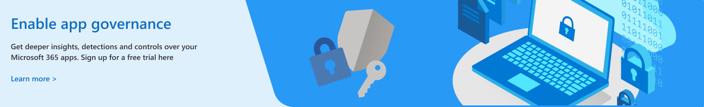

# Get started with app governance (in preview)

To begin using the app governance add-on to Microsoft Cloud App Security, you need to take three steps:

1. [Verify licensing and administrator prerequisites](#licensing-and-administrator-role-prerequisites).
1. [Sign up for the app governance trial](#sign-up-for-free-trial-of-app-governance).
1. [Add MCAS integration](#add-integration-with-mcas).

## Sign up for free trial of app governance

For existing Microsoft 365 customers:

1. Navigate to the [sign up page for the free trial](https://admin.microsoft.com/Commerce/Trial.aspx?OfferId=20be85b6-b196-402c-82b4-36b4e72862dc).
1. Complete the steps to add app governance. Sign-up is simple, as shown in the following graphic.

<!--
:::image type="content" source="../media/manage-app-protection-governance/sign-up-page.png" alt-text="Simple steps to add app governance to your account.":::
-->

If you are not already a Microsoft 365 customer, you can sign up for a free trial:

1. At the top of this page, select the **Free Account** button.
1. Under **Try Microsoft 365 for business** select **Try 1 month free**.
1. Complete the steps for the sign-up.

## Add integration with MCAS

Prerequisites:

- Office 365 is connected in Cloud App Security
- Office 365 Azure AD apps are enabled

To enable app governance sync with Cloud App Security, follow these steps:

1. Go to your Microsoft Cloud App Security portal – [https://portal.cloudappsecurity.com](https://portal.cloudappsecurity.com)
1. Select the gear icon (top right corner) and select **Settings**.
1. Under **Threat Protection**, select **App Governance**.
1. Select **Enable App Governance integration**, and then select **Save**.

To verify the integration with MCAS is active, look for the app governance policies listed below to appear in MCAS. The new policies might take few minutes to appear once integration is enabled.

- Microsoft 365 OAuth app Reputation
- Microsoft 365 OAuth Phishing Detection
- Microsoft 365 OAuth App Governance

## Licensing and administrator role prerequisites

1. Verify your account has the [appropriate level of licensing](#licensing-for-app-governance). App governance is an add-on feature for Microsoft Cloud App Security (MCAS), and thus MCAS must be present in your account as either a standalone product or as part of the various license packages.
1. You must have one of the [administrator roles](#administrator-roles) listed below to access the app governance pages in the portal.
1. Your organization's billing address must be within one of the [supported areas of North America, Europe, or Africa](app-governance-countries.md) in order to activate the free trial.

### Licensing for app governance

Before you get started with app governance, you should confirm your [Microsoft 365 admin center - subscriptions](https://admin.microsoft.com/Adminportal/Home?source=applauncher#/subscriptions) and any add-ons. To access and use app governance, your organization must have one of the following subscriptions or add-ons:

- Microsoft Cloud App Security
- Microsoft 365 E5/A5
- Microsoft 365 E5/A5 Compliance
- Microsoft 365 E5/A5 Information Protection and Governance
- Microsoft 365 E5/A5 Security
- Microsoft 365 F5 Compliance add-on
- Microsoft 365 F5 Security + Compliance add-on

### Administrator roles

> [!NOTE]
> Only Global Admin role can activate the app governance free trial.

One of the following administrator roles is required to see app governance pages or manage policies and settings:

- Application Administrator
- Cloud Application Administrator
- Company Administrator
- Compliance Administrator
- Compliance Data Administrator
- Compliance Reader (read-only)
- Global Reader
- Security Administrator
- Security Operator
- Security Reader (read-only)

Here are the capabilities for each role.

| Role | Read the dashboard | Read all apps |Read policies | Create, update, or delete policies | Read alerts | Update alerts | Read settings | Update settings | Read Remediation | Update Remediation |
|:-------|:-----|:-------|:-------|:-------|:-------|:-------|:-------|:-------|:-------|:-------|
| Application Administrator |  |  |  |  |  |  |  |  |  |  |
| Cloud Application Administrator |  | | | | | | | | | |
| Company Administrator |  |  |  |  |  |  |  |  |  |  |
| Compliance Administrator |  |  |  |  |  |  |  |  |  | |
| Compliance Data Administrator |  |  |  |  |  |  |  |  |  | |
| Compliance Reader |  |  |  |  |  |  |  |  | | |
| Global Reader  |  |  |  |  |  |  |  |  | | |
| Security Administrator |  |  |  |  |  |  |  |  |  | |
| Security Operator |  |  |  |  |  |  |  |  |  | |
| Security Reader  |  |  |  |  |  |  |  |  |  | |
|||||||||| | |

For additional information about each role, see [Administrator role permissions](/azure/active-directory/roles/permissions-reference).

## Canceling your trial

If you did not participate in private preview and would like to cancel your trial of app governance, you can communicate with your CXE contact, or use these steps:

1. In the Microsoft 365 admin center, go to **Billing** > <a href="https://go.microsoft.com/fwlink/p/?linkid=842054" target="_blank">**Your products**</a>.
1. Navigate to the app governance trial, click the three dots, and select **Cancel subscription**.
1. In the resulting fly-out pane, provide a reason for cancellation, any additional feedback, and select **Cancel subscription**.
1. Select **Cancel subscription** in the resulting pop up screen. Your trial is cancelled, you will lose access to app governance, and your app governance data will be deleted (log data that is used to create the app governance insights and detections - no emails or other files will be affected).

## Known issues for the public preview

The app governance team has identified the following known issues for the preview: 

- 2-way sync between Microsoft Defender and app governance alerts – currently alerts resolved in Defender will have to be manually resolved in app governance as well.
