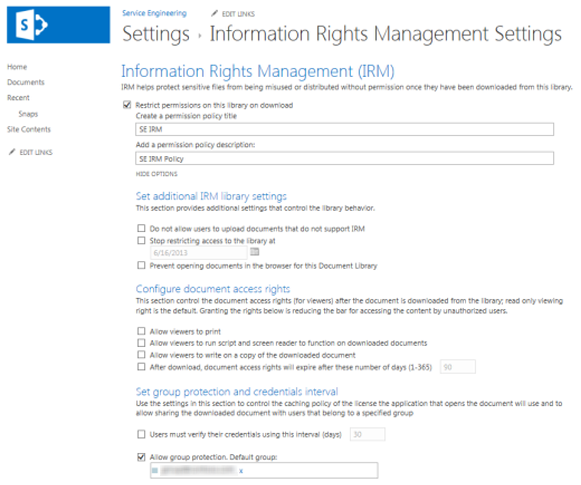
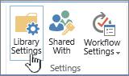

# Apply Information Rights Management (IRM) to a list or library

You can use Information Rights Management (IRM) to help control and protect files that are downloaded from lists or libraries.
  
## Administrator preparations before applying IRM

- The Azure Rights Management service (Azure RMS) from Azure Information Protection, and the on-premises equivalent, Active Directory Rights Management Services (AD RMS), support Information Rights Management for sites. No separate or additional installations are required.
    
- Before you apply IRM to a list or library, it must first be enabled by an administrator for your site.
    
- To apply IRM to a list or library, you must have administrator permissions for that list or library.
    
- If you are using SharePoint Online, your users might experience timeouts when downloading larger IRM-protected files. If this happens, then apply IRM protection by using your Office programs, and store larger files in a SharePoint library that doesn't use IRM.
    
> [!NOTE]
> If you're using SharePoint Server 2013, a server administrator must install protectors on all front-end Web servers for every file type that the people in your organization want to protect by using IRM. 
  
## Apply IRM to a list or library

  
1. Go to the list or library for which you want to configure IRM.
    
2. On the ribbon, click the **Library** tab, and then click **Library Settings**. (If you're working in a list, click the **List** tab, and then click **List Settings**).
    
    
  
3. Under **Permissions and Management**, click **Information Rights Management**. If the Information Rights Management link doesn't appear, IRM might not be enabled for your site. Contact your server administrator to see if it is possible to enable IRM for your site. The Information Rights Management link does not appear for picture libraries.
    
4. On the **Information Rights Management Settings** page, select the **Restrict permission to documents in this library on download** check box to apply restricted permission to documents that are downloaded from this list or library. 
    
5. In the **Create a permission policy title** box, type a descriptive name for the policy that you can use later to differentiate this policy from other policies. For example, you can type **Company Confidential** if you are applying restricted permission to a list or library that will contain company documents that are confidential. 
    
6. In the **Add a permission policy description** box, type a description that will appear to people who use this list or library that explains how they should handle the documents in this list or library. For example, you can type **Discuss the contents of this document only with other employees** if you want to restrict access to the information in these documents to internal employees. 
    
7. To apply additional restrictions to the documents in this list or library, click **Show Options**, and do any of the following:
    
|**To do this:**|**Do this:**|
|:-----|:-----|
|Allow people to print documents from this list or library    |Select the **Allow viewers to print** check box.    |
|Allow people with at least the View Items permission to run embedded code or macros on a document.    |Select the **Allow viewers to run script and screen reader to function on downloaded documents** check box.    If you select this option, users could run code to extract the contents of a document.           |
|Select this option if you want to restrict access to content to a specified period of time. If you select this option, people's issuance licenses to access the content will expire after the specified number of days, and people will be required to return to the server to verify their credentials and download a new copy.    |Select the **After download, document access rights will expire after these number of days (1-365)** check box, and then specify the number of days for which you want the document to be viewable.    |
| Prevent people from uploading documents that do not support IRM to this list or library.     If you select this option, people will not be able to upload any of the following file types:     File types that do not have corresponding IRM protectors installed on all of the front-end web servers.     File types that SharePoint Server 2010 cannot decrypt.     File types that are IRM protected in another program    |Select the **Do not allow users to upload documents that do not support IRM** check box.    |
|Remove restricted permissions from this list or library on a specific date.    |Select the **Stop restricting access to the library at** check box, and then select the date that you want.    |
|Control the interval that credentials are cached for the program that is licensed to open the document.    |Select the **Users must verify their credentials using this interval (days)** check box, then enter the interval for caching credentials in number of days.    |
|Allow group protection so that users can share with members of the same group.    |Select **Allow group protection**, and enter the group's name for sharing.    |
   
8. After you finish selecting the options you want, click **OK**.
  
## What is Information Rights Management?

Information Rights Management (IRM) enables you to limit the actions that users can take on files that have been downloaded from lists or libraries. IRM encrypts the downloaded files and limits the set of users and programs that are allowed to decrypt these files. IRM can also limit the rights of the users who are allowed to read files, so that they cannot take actions such as print copies of the files or copy text from them.
  
You can use IRM on lists or libraries to limit the dissemination of sensitive content. For example, if you are creating a document library to share information about upcoming products with selected marketing representatives, you can use IRM to prevent these individuals from sharing this content with other employees in the company.
  
On a site, you apply IRM to an entire list or library, rather than to individual files. This makes it easier to ensure a consistent level of protection for an entire set of documents or files. IRM can thus help your organization to enforce corporate policies that govern the use and dissemination of confidential or proprietary information.
  
> [!NOTE]
> The information on this page regarding Information Rights Management supersedes any terms that reference 'Information Rights Management' in any Microsoft SharePoint Server 2013 and SharePoint Server 2016 license term agreements. 
  
### How IRM can help protect content

IRM helps to protect restricted content in the following ways:
  
- Helps to prevent an authorized viewer from copying, modifying, printing, faxing, or copying and pasting the content for unauthorized use
    
- Helps to prevent an authorized viewer from copying the content by using the Print Screen feature in Microsoft Windows
    
- Helps to prevent an unauthorized viewer from viewing the content if it is sent in e-mail after it is downloaded from the server
    
- Restricts access to content to a specified period of time, after which users must confirm their credentials and download the content again
    
- Helps to enforce corporate policies that govern the use and dissemination of content within your organization
    
### How IRM cannot help protect content

IRM cannot protect restricted content from the following:
  
- Erasure, theft, capture, or transmission by malicious programs such as Trojan horses, keystroke loggers, and certain types of spyware
    
- Loss or corruption because of the actions of computer viruses
    
- Manual copying or retyping of content from the display on a screen
    
- Digital or film photography of content that is displayed on a screen
    
- Copying through the use of third-party screen-capture programs
    
- Copying of content metadata (column values) through the use of third-party screen-capture programs or copy-and-paste action
    
[Apply Information Rights Management to a list or library](https://support.office.com/article/6714cfe3-ef39-43b0-bb65-a887726bb63c)
  
## How IRM works for lists and libraries

IRM protection is applied to files at the list or library level. When IRM is enabled for a library, rights management applies to all of the files in that library. When IRM is enabled for a list, rights management applies only to files that are attached to list items, not the actual list items.
  
When people download files in an IRM-enabled list or library, the files are encrypted so that only authorized people can view them. Each rights-managed file also contains an issuance license that imposes restrictions on the people who view the file. Typical restrictions include making a file read-only, disabling the copying of text, preventing people from saving a local copy, and preventing people from printing the file. Client programs that can read IRM-supported file types use the issuance license within the rights-managed file to enforce these restrictions. This is how a rights-managed file retains its protection even after it is downloaded from the server.
  
The types of restrictions that are applied to a file when it is downloaded from a list or library are based on the individual user's permissions on the site that contains the file. The following table explains how the permissions on sites correspond to IRM permissions.
  
|**Permissions**|**IRM Permissions**|
|:-----|:-----|
|Manage Permissions, Manage Web Site    |**Full control** (as defined by the client program): This permission generally allows a user to read, edit, copy, save, and modify permissions of rights-managed content.    |
|Edit Items, Manage Lists, Add and Customize Pages    |**Edit**, **Copy**, and **Save**: A user can print a file only if the **Allow users to print documents** check box is selected on the Information Rights Management Settings page for the list or library.    |
|View Items    |**Read**: A user can read the document, but cannot copy or modify its content. A user can print only if the **Allow users to print documents** check box is selected on the Information Rights Management Settings page for the list or library.    |
|Other    |No other permissions correspond directly to IRM permissions.    |
   
When you enable IRM for a list or library in SharePoint Server 2013, you can only protect file types in that list or library for which a protector is installed on all front-end web servers. A protector is a program that controls the encryption and decryption of rights-managed files of a specific file format. SharePoint includes protectors for the following file types:
  
- Microsoft Office InfoPath forms
    
- The 97-2003 file formats for the following Microsoft Office programs: Word, Excel, and PowerPoint
    
- The Office Open XML Formats for the following Microsoft Office programs: Word, Excel, and PowerPoint
    
- The XML Paper Specification (XPS) format
    
If your organization plans to use IRM to protect any other file types in addition to those listed above, your server administrator must install protectors for these additional file formats.
  

