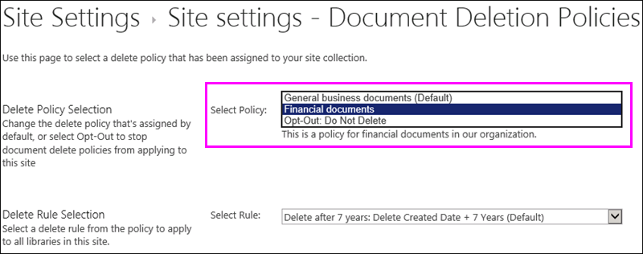

# Apply or remove a document deletion policy for a site

Organizations are often subject to compliance, legal, or other regulations that require them to retain documents for a certain period of time. However, retaining documents for longer than required can expose the organization to legal risk. For this reason, your organization may have created a document deletion policy for your site&mdash;for example, general business documents might be required to be deleted five years after they were created.
  
Depending on your organization, a document deletion policy might be:
  
- **Mandatory** A site owner can't opt out of a mandatory policy, which is automatically applied to the site. 
    
- **Default** A default policy is automatically applied to a site, but a site owner can: 
    
  - Choose another policy if available.
    
  - Opt out of the policy entirely if it isn't relevant to the content in the site.
    
- **Neither mandatory nor default** In this case, no policy is automatically applied to the site, and the site owner needs to take action to apply one. 
    
A document deletion policy may contain more than one rule&mdash;for example, one rule might say delete documents one year after they were created, but another rule might say delete documents one year after they were last modified. If a policy contains more than one rule, you can select the rule that best applies to your site. The delete rule will be applied to all libraries within the site. Only one policy and one rule can be active in a site at one time. Like a policy, a rule can be set as default, so that it's applied automatically when the policy is applied.
  
Finally, document deletion policies are inherited. When you select a policy or rule for your site, that selection is inherited by all subsites, although an owner of a subsite can break inheritance by selecting a different policy or rule. When you select a policy or rule, consider the content of any subsites below your site.
  
## View the document deletion policies available in a site collection

Your organization may assign different policies to different site collections. At the site collection level, an owner of a site collection can view all of the document deletion policies that are available to that site collection. The policies may have been made available to the site collection template (and therefore all site collections created from this template) or to this specific site collection.
  
1. In the top-level site in the site collection, in the upper-right corner, choose **Settings** [gear icon] \> **Site Settings**.
    
2. Under **Site Collection Administration** \> **Document Deletion Policies**.
    
    > [!NOTE]
    > The **Document Deletion Policies** link won't appear unless policies have been assigned to the site collection. Also, the link doesn't appear immediately after policies have been assigned to the site — it can take up to 24 hours from when the policies are assigned to when the **Document Deletion Policies** link appears. 
  
3. On this page you can view:
    
  - The currently assigned policies and the associated rules. Select a policy to view the rules in the right pane.
    
  - The default policy, if any, displays **Yes** in the **Default** column. 
    
  - A message is displayed below the list if the policy has been assigned as **Mandatory**.
    
This list is view only, for the site collection owner to see all of the available policies and rules. To apply a policy, see the next section.
  

  
## Apply or remove a document deletion policy for a site

As a site owner or site collection owner, your organization may have created policies that you can either apply to your site or opt out of entirely.
  
1. In the upper-right corner, choose **Settings** [gear icon] \> **Site Settings**.
    
2. Under **Site Administration** \> **Document Deletion Policies**.
    
    > [!NOTE]
    > The **Document Deletion Policies** link won't appear unless policies have been assigned to the site collection. Also, the link doesn't appear immediately after policies have been assigned to the site — it can take up to 24 hours from when the policies are assigned to when the **Document Deletion Policies** link appears. 
  
3. Do one of the following:
    
  - **To apply a policy** Select a policy \> select a rule in that policy \> **Save**.
    
    Only one policy and one rule can be active in a site at one time. Your organization may provide several policies and rules to choose from, or only one policy or rule.
    
    
  
  - **To opt out of a policy** Choose **Opt-Out: Do Note Delete** \> **Save**.
    
    As a site owner, you can opt out of a document deletion policy if you determine that the policy isn't applicable to the content in your site. However, you can't opt out of a policy that has been marked as **Mandatory**.
    
    
  
## Document deletion policies override other policies

A site may use other policies for retaining and deleting content:
  
- Content type policies for the site collection.
    
- Information management policies for a list or library.
    
If you apply a document deletion policy to a site that already uses content type policies or information management policies for a list or library, those policies are ignored while the document deletion policy is in effect. If other policies are ignored, you'll see the message "Content on this site uses Document Deletion Policies".
  
This means you should plan for a site to use only policies meant for structured content (information management policies and content type policies) or unstructured content (document deletion policies), not both. If you opt out of a document deletion policy, the warning won't be displayed and other types of policies will continue to work.
  
Site policies are not affected by document deletion policies.
  
### Determine if content type policies are being ignored

If your site was using content type policies and you now see this message, those policies are no longer in effect. To restore the content type policies, you can remove the document deletion policy from your site, as described earlier, if there's an opt-out option available. If there's no option to opt out, the document deletion policy is mandatory, and you need to contact the compliance officer in your organization.
  
1. In the upper-right corner, choose **Settings** [gear icon] \> **Site Settings**.
    
2. Under **Site Administration** \> **Content Type Policy Templates**.
    
    
  
### Determine if information management policies are being ignored

If your site was using information management policies and you now see this message, those policies are no longer in effect. To restore the information management policies, you can remove the document deletion policy from your site, as described earlier, if there's an opt-out option available. If there's no option to opt out, the document deletion policy is mandatory, and you need to contact the compliance officer in your organization.
  
- For a list or library, on the Ribbon \> **Library** tab \> **Library Settings** \> under **Permissions and Management** \> **Information Management Policy Settings**.
    
    
  
## See also

[Overview of document deletion policies](document-deletion-policies.md)
  
[Create a document deletion policy](create-a-document-deletion-policy.md)

