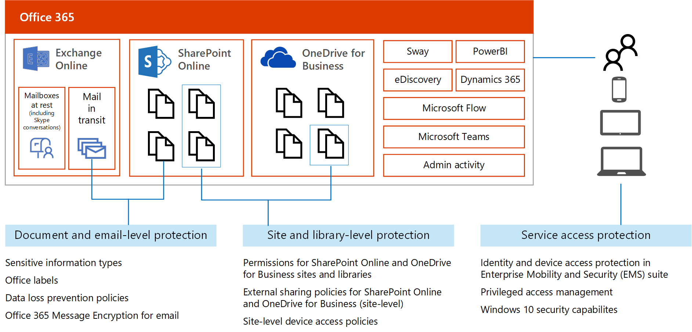
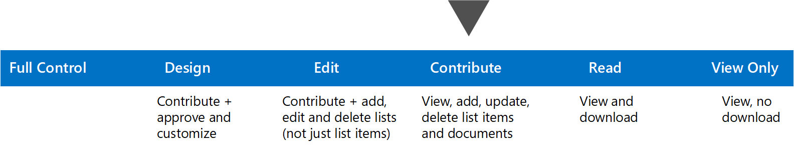

# Apply protection to personal data

Protection of personal information in Microsoft 365 includes using data loss prevention capabilities. With data loss prevention (DLP) policies in the compliance center, you can identify, monitor, and automatically protect sensitive information across Microsoft 365.

This topic describes how to use DLP to protect personal data. This topic also lists other protection capabilities that can be used to achieve GDPR compliance, including setting permissions in SharePoint libraries and using device access policies.

## Apply protection using data loss prevention in Microsoft 365

With DLP, you can:

-   Identify sensitive information across many locations.

-   Prevent accidental sharing of sensitive information.

-   Help users learn how to stay compliant without interrupting their workflow.

-   View DLP reports showing content that matches your organization's DLP policies.

For more information, see [Overview of data loss prevention policies](https://support.office.com/article/Overview-of-data-loss-prevention-policies-1966b2a7-d1e2-4d92-ab61-42efbb137f5e).

This illustration shows the options for creating a DLP policy:

-   Choose the protection to apply. Protection can include:

    -   Policy tips for users

    -   Email report for admins

    -   Prevent sharing externally, internally, or both

-   Choose the criteria for applying the protection. Apply the protection to documents with this type of content: you can configure the policy to use sensitive information types and/or labels.

### Using DLP for GDPR compliance

One of the primary uses of Microsoft 365 DLP is to identify personal data related to EU data subjects in your Microsoft 365 environment. Microsoft 365 DLP can notify your compliance teams of where personal information is stored in SharePoint Online and OneDrive for Business, or when users send email containing personal information. DLP can also provide policy tips to your employees when working with personal information related to EU residents.

Educating and raising awareness to where EU resident data is stored in your environment and how your employees are permitted to handle it represents one level of information protection using Microsoft 365 DLP. Often, employees who already have access to this type of information require this access to do their day to day work. Enforcing DLP policies to help comply with GDPR may not require restricting access.

However, complying with GDPR typically involves a risk-based assessment of the organization from both a legal and information security perspective, identification of what type and where personal information is stored, as well as if there's a legal justification to store and process that information. Based on this assessment, implementing policies to protect the organization and comply with GDPR might require removing access for employees to documents that contain personal information for EU data subjects. In cases where further protection is required, additional DLP protection can be configured.

The following table lists three configurations of increasing protection using DLP. The first configuration, awareness, can be used as a starting point and minimum level of protection for GDPR.

### Example protection levels that can be configured with DLP policies and used for GDPR compliance

<table>
<thead>
<tr class="header">
<th align="left"><strong>Protection level</strong></th>
<th align="left"><strong>DLP configuration for documents with personal information related to EU data subjects</strong></th>
<th align="left"><strong>Benefits and risks</strong></th>
</tr>
</thead>
<tbody>
<tr class="odd">
<td align="left">Awareness</td>
<td align="left">
Send email notifications to compliance teams when this data is found in documents in SharePoint Online and OneDrive for Business.

Customize and display Policy Tips to employees in SharePoint and OneDrive for Business when accessing documents containing this data.

Detect and report when this data is being shared.
</td>
<td align="left">
Raise awareness with compliance teams and employees about where this data is stored.

Educate employees on corporate policy for handling documents containing this data.

Does not prevent employees from sharing this data internally or externally.

You can review DLP reports for shared data and decide if you need to increase the protection.
</td>
</tr>
<tr class="even">
<td align="left">Prevent external sharing</td>
<td align="left">
Restrict access to documents that contain this data in SharePoint Online and OneDrive for Business when that content is shared with external users.

Prevent sending emails with documents that contain this data to external recipients.

Detect and report when this data is being shared.
</td>
<td align="left">
Prevents external sharing of this data while allowing for employees to work with this data internally.

You can review DLP reports for internally shared data and decide if you need to increase this protection.
</td>
</tr>
<tr class="odd">
<td align="left">Prevent internal and external sharing</td>
<td align="left">
Restrict access to documents that contain this data in SharePoint Online and OneDrive for Business when that content is shared internally or externally.

Prevent sending emails that contain this data to both internal and external recipients.
</td>
<td align="left">
Prevents internal and external sharing of this data.

Employees might not be able to complete tasks that require working with this data.

You can review DLP reports for internally or externally shared data and decide if end-user training is needed.
</td>
</tr>
</tbody>
</table>

Note: As the levels of protection increase, the ability of users to access information will decrease in some cases, and could potentially impact their productivity or ability to complete day to day tasks. Increasing protection levels by implementing policies that impact employees is typically accompanied by end-user training, educating users on new security policies and procedures to help them continue to be productive in a more secure environment.

### Example DLP policy for GDPR — Awareness 

Name: Awareness for personal data that is subject to GDPR.

Description: Display policy tips to employees, notify compliance teams when this data is found in documents in SharePoint Online and OneDrive for Business, detect and report when this data is being shared outside your organization.

<table>
<thead>
<tr class="header">
<th align="left"><strong>Control</strong></th>
<th align="left"><strong>Settings</strong></th>
</tr>
</thead>
<tbody>
<tr class="odd">
<td align="left">Choose information to protect</td>
<td align="left">Select a Custom policy template.</td>
</tr>
<tr class="even">
<td align="left">Locations</td>
<td align="left">All locations in Microsoft 365</td>
</tr>
<tr class="odd">
<td align="left">Find content that contains</td>
<td align="left">Click 'Edit' and add all the sensitive information types you curated for your environment.</td>
</tr>
<tr class="even">
<td align="left">Detect when this content is shared</td>
<td align="left">Check this box and select 'with people outside my organization.'</td>
</tr>
<tr class="odd">
<td align="left">Notify users when content matches the policy settings</td>
<td align="left">
Check this box ("Show policy tips to users and send them an email notification.")

Click 'Customize the tip and email' and update these for your environment. See the default notifications in this article: <a href="https://support.office.com/article/Send-email-notifications-and-show-policy-tips-for-DLP-policies-87496bc5-9601-4473-8021-cb05c71369c1?ui=en-US&amp;rs=en-US&amp;ad=US">Send email notifications and show policy tips for DLP policies</a>.
</td>
</tr>
<tr class="even">
<td align="left">Detect when a specific amount of sensitive info is being shared at one time</td>
<td align="left">
'Detect when content that's being shared contains: At least ____ instances of the same sensitive info type' — Set this to 1.

'Send incident reports in email' — check this box. Click 'Choose what to include in the report and who receives it.' Be sure to add your compliance team.

'Restrict who can access the content and override the policy' — clear this checkbox to receive notifications about sensitive information without preventing users from access that information.
</td>
</tr>
</tbody>
</table>

All locations includes:

- SharePoint Online

- OneDrive for Business accounts

- Exchange mailboxes

Because Content Search doesn't currently let you test sensitive information types with email, consider creating separate policies for Exchange with a subset of sensitive information types in each policy and monitoring the rollout of these policies.

## Additional protection you can apply to protect personal data in Microsoft 365

Sensitive information types, labels, and data loss protection policies help you identify documents containing specific data and apply protection. However, these protections depend on appropriate permissions being set for access to data, users with accounts that aren't compromised, and devices that are healthy.

The following illustration details additional protection you can apply to protect access to personal data.

For accessibility, the following table provides the same information in the illustration.

<table>
<thead>
<tr class="header">
<th align="left"><strong>Scope of protection</strong></th>
<th align="left"><strong>Capabilities</strong></th>
</tr>
</thead>
<tbody>
<tr class="odd">
<td align="left">Document and email-level protection (includes mail in transit, but not currently mailboxes at rest)</td>
<td align="left">
Sensitive information types

Office labels

Data loss prevention policies

Microsoft 365 Message Encryption for email
</td>
</tr>
<tr class="even">
<td align="left">Site and library-level protection (includes SharePoint Online and OneDrive for Business sites)</td>
<td align="left">
Permissions for SharePoint Online and OneDrive for Business sites and libraries

External sharing policies for SharePoint Online and OneDrive for Business (site-level)

Site-level device access policies
</td>
</tr>
<tr class="odd">
<td align="left">Service access protection (includes access to all services in Microsoft 365)</td>
<td align="left">
Identity and device access protection in Enterprise Mobility + Security (EMS) suite

Privileged access management

Windows 10 security capabilities
</td>
</tr>
</tbody>
</table>

The rest of this article provides more information on each of these categories of protection.

### Capabilities that are OK to use with GDPR

You can use the following capabilities in an environment configured for GDPR compliance. These capabilities are not necessary for GDPR compliance, but they can be used without adversely affecting your ability to discover, protect, monitor, and report on data related to GDPR compliance.

Customer Key — Allows customers to provide and retain control over the encryption keys that are used to encrypt data at rest within Microsoft 365. Recommended only for customers with a regulatory need to manage their own encryption keys.

Customer Lockbox — Customer lockbox allows you to control how a Microsoft support engineer accesses your data, if needed, to fix a technical issue on a case by case basis. You can control whether to give the support engineer access to your data or not. An expiration time is provided with each request.

## Site and library-level protection

### Permissions for SharePoint and OneDrive for Business libraries

Use permissions in SharePoint to provide or restrict user access to the site or its contents. Add individual users or Azure Active Directory groups to the default SharePoint groups. Or, create a custom group for finer-grain control.

The illustration plots permission levels from Full control to View Only. The following table includes the same information.

<table>
<thead>
<tr class="header">
<th align="left"><strong>Full Control</strong></th>
<th align="left"><strong>Design</strong></th>
<th align="left"><strong>Edit</strong></th>
<th align="left"><strong>Contribute</strong></th>
<th align="left"><strong>Read</strong></th>
<th align="left"><strong>View Only</strong></th>
</tr>
</thead>
<tbody>
<tr class="odd">
<td align="left"></td>
<td align="left">Contribute + approve and customize</td>
<td align="left">Contribute + add, edit, and delete lists (not just list items)</td>
<td align="left">View, add, update, delete list items and documents</td>
<td align="left">View and download</td>
<td align="left">View, no download</td>
</tr>
</tbody>
</table>

More information:

-   [Understanding permission levels in SharePoint](https://support.office.com/en-US/article/Understanding-permission-levels-in-SharePoint-87ecbb0e-6550-491a-8826-c075e4859848)

-   [Understanding SharePoint groups](https://support.office.com/en-US/article/Understanding-SharePoint-groups-94d9b261-161e-4ace-829e-eca1c8cd2eb8)

### External sharing policies for SharePoint and OneDrive for Business libraries

Many organizations allow external sharing to support collaboration. Find out how your tenant-wide settings are configured. Then review the external sharing settings for sites that contain personal data.

An external user is someone outside of your organization who is invited to access your SharePoint Online sites and documents but doesn't have a license for your SharePoint Online or Microsoft Microsoft 365 subscription.

External sharing policies apply to both SharePoint Online and OneDrive for Business.

-   You must be a SharePoint Online admin to configure sharing policies.

-   You must be a Site Owner or have full control permissions to share a site or document with external users.

The following table summarizes the controls you can configure.

<table>
<thead>
<tr class="header">
<th align="left"><strong>Control category</strong></th>
<th align="left"><strong>Options</strong></th>
</tr>
</thead>
<tbody>
<tr class="odd">
<td align="left">Type of sharing</td>
<td align="left">
Don't allow sharing outside your organization (can be set for individual site collections)

Allow sharing to authenticated external users only (allow new or limit to existing, can be set for individual site collections)*

Allow sharing to external users with an anonymous access link (can be set for individual site collections)

Limit external sharing using domains (allow and deny list)

Choose the default link type (anonymous, company shareable, or restricted)

</td>
</tr>
<tr class="even">
<td align="left">What external users can do</td>
<td align="left">
Prevent external users from sharing files, folders, sites they don't own

Require external users to accept sharing invitations with the same account the invitation was sent to
</td>
</tr>
<tr class="odd">
<td align="left">Notifications</td>
<td align="left">
Currently only available in OneDrive for Business. Notify owners when:

- 
Users invite additional external users to shared files

- 
External users accept invitations to access files

- 
An anonymous access link is created or changed
</td>
</tr>
</tbody>
</table>

More information:

-   [Manage external sharing for your SharePoint Online environment](https://support.office.com/article/Manage-external-sharing-for-your-SharePoint-Online-environment-C8A462EB-0723-4B0B-8D0A-70FEAFE4BE85?ui=en-US&rs=en-US&ad=US)

-   [Share sites or documents with people outside your organization](https://support.office.com/en-US/article/Share-sites-or-documents-with-people-outside-your-organization-80e49744-e30f-44db-8d51-16661b1d4232)

### Site-level device access policies

SharePoint Online and OneDrive for Business let you configure device access policies at the site level. This lets you configure more protection for sites with sensitive data.

If you configure site-level device access policies, be sure to coordinate these with tenant-level policies and also with access policies that are configured in Azure Active Directory, Intune, and Intune App Management.

Device access policies for SharePoint and OneDrive for Business require supporting policies in Azure Active Directory and Microsoft Intune depending on the scenario you're implementing. The following table summarizes objectives you can achieve with device access policies and indicates which products require supporting policies.

<table>
<thead>
<tr class="header">
<th align="left"></th>
<th align="left">Only allow access from specific IP address locations</th>
<th align="left">Prevent users from downloading files to non-domain joined devices</th>
<th align="left">Block access on non-domain joined devices</th>
<th align="left">Prevent users from downloading files to non-compliant devices</th>
<th align="left">Block access on non-compliant devices</th>
</tr>
</thead>
<tbody>
<tr class="odd">
<td align="left">SharePoint admin center</td>
<td align="left">Yes</td>
<td align="left">Yes</td>
<td align="left">Yes</td>
<td align="left">Yes</td>
<td align="left">Yes</td>
</tr>
<tr class="even">
<td align="left">Azure Active Directory</td>
<td align="left"></td>
<td align="left">Yes</td>
<td align="left">Yes</td>
<td align="left">Yes</td>
<td align="left">Yes</td>
</tr>
<tr class="odd">
<td align="left">Microsoft Intune</td>
<td align="left"></td>
<td align="left"></td>
<td align="left"></td>
<td align="left">Yes</td>
<td align="left">Yes</td>
</tr>
</tbody>
</table>

More information: [SharePoint Online admin center: Control access from unmanaged devices](https://support.office.com/article/Control-access-from-unmanaged-devices-5ae550c4-bd20-4257-847b-5c20fb053622?ui=en-US&rs=en-US&ad=US).

## Service access protection for identities and devices

Microsoft recommends you configure protection for identities and devices that access the service. The work you put into protecting access to Microsoft 365 services can also be used to protect access to other SaaS services, PaaS services, and even apps in other cloud providers.

Access protection for identities and devices provides a baseline of protection to ensure that identities aren't compromised, devices are safe, and organization data that is accessed on devices is isolated and protected.

For starting point recommendations and configuration guidance, see [Microsoft security guidance for political campaigns, nonprofits, and other agile organizations](https://docs.microsoft.com/microsoft-365-enterprise/microsoft-security-guidance).

For hybrid identity environments with AD FS, see [Recommended security policies and configurations](https://docs.microsoft.com/microsoft-365-enterprise/microsoft-security-guidance).

The following illustration describes how cloud services (SaaS, PaaS), account types (tenant domain accounts vs. B2B accounts), and service access capabilities relate. It's important to note which capabilities can be used with B2B accounts.

For accessibility, the rest of this section describes this illustration.

### Cloud services

Azure Active Directory provides identity access to any cloud service, including non-Microsoft providers such as Amazon Web Services. The illustration shows Microsoft 365, "Other SaaS app," and "PaaS app." Arrows point from Azure Active Directory to each of these services, showing that Azure Active Directory can be used for authentication to all of these app types.

### Types of accounts

Tenant domain accounts are account you add to your tenant and manage directly. B2B accounts are accounts for users outside your organization you invite to collaborate with. These can be other Microsoft 365 accounts, other organization accounts, or consumer accounts (such as Gmail). The illustration shows both account types within Azure Active Directory.

### Capabilities

The capabilities in the following table protect identities and devices. The table indicates which capabilities can also be used with B2B accounts, similar to the illustration.

<table>
<thead>
<tr class="header">
<th align="left"><strong>Capability</strong></th>
<th align="left"><strong>Works with tenant domain accounts</strong></th>
<th align="left"><strong>Works with Azure B2B accounts (without additional licensing)</strong></th>
</tr>
</thead>
<tbody>
<tr class="odd">
<td align="left">Multi-factor authentication and conditional access</td>
<td align="left">Yes</td>
<td align="left">Yes</td>
</tr>
<tr class="even">
<td align="left">Azure AD Identity Protection</td>
<td align="left">Yes</td>
<td align="left">Yes</td>
</tr>
<tr class="odd">
<td align="left">Azure AD Privileged Identity Management</td>
<td align="left">Yes</td>
<td align="left"></td>
</tr>
<tr class="even">
<td align="left">Mobile Application Management (MAM)</td>
<td align="left">Yes</td>
<td align="left"></td>
</tr>
<tr class="odd">
<td align="left">Device enrollment and management</td>
<td align="left">Yes</td>
<td align="left">Only one organization can manage a device</td>
</tr>
<tr class="even">
<td align="left">Windows 10 security capabilities (conditional access based on device compliance requires device management)</td>
<td align="left">Yes</td>
<td align="left">Yes</td>
</tr>
</tbody>
</table>

You can add licenses to B2B accounts to give these users additional capabilities, if needed, to protect access to personal data in your environment.
