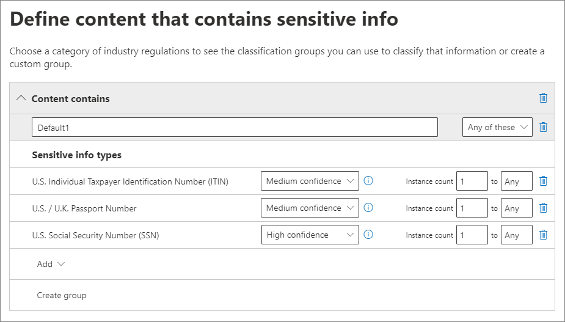
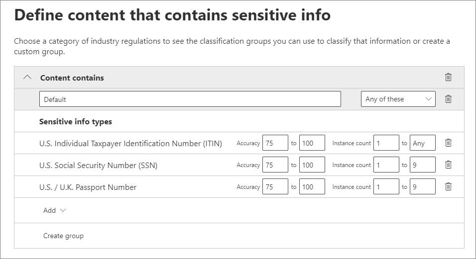
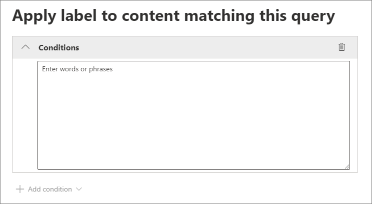
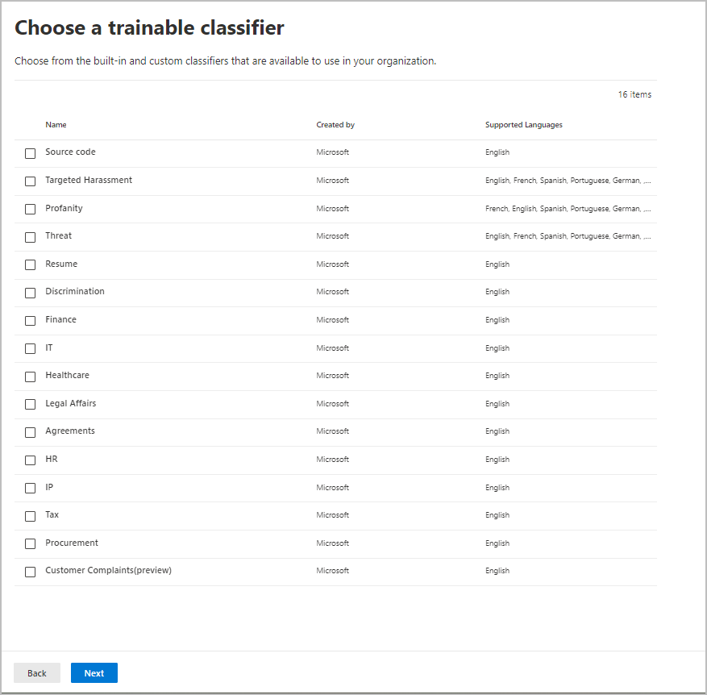
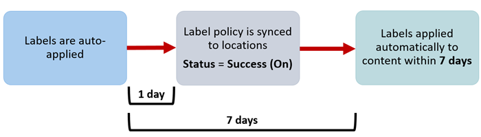

# Automatically apply a retention label to retain or delete content

>*[Microsoft 365 licensing guidance for security & compliance](/office365/servicedescriptions/microsoft-365-service-descriptions/microsoft-365-tenantlevel-services-licensing-guidance/microsoft-365-security-compliance-licensing-guidance).*

> [!NOTE]
> This scenario is not supported for [regulatory records](records-management.md#records).

One of the most powerful features of [retention labels](retention.md) is the ability to apply them automatically to content that matches specified conditions. In this case, people in your organization don't need to apply the retention labels. Microsoft 365 does the work for them.
  
Auto-applying retention labels are powerful because:
  
- You don't need to train your users on all of your classifications.
    
- You don't need to rely on users to classify all content correctly.
    
- Users no longer need to know about data governance policies - they can focus on their work.
    
You can apply retention labels to content automatically when that content contains sensitive information, keywords or searchable properties, or a match for [trainable classifiers](classifier-get-started-with.md).

> [!TIP]
> Recently released, use searchable properties to identify [Teams meeting recordings](#microsoft-teams-meeting-recordings).

The processes to automatically apply a retention label based on these conditions:


Use the following instructions for the two admin steps.

> [!NOTE]
> Auto-policies use service-side labeling with conditions to automatically apply retention labels. You can also automatically apply a retention label with a label policy when you do the following: 
>
> - Apply a retention label to a document understanding model in SharePoint Syntex
> - Apply a default retention label for SharePoint and Outlook
>- Apply a retention label to email by using Outlook rules
>
> For these scenarios, see [Create and apply retention labels in apps](create-apply-retention-labels.md).

## Before you begin

The global admin for your organization has full permissions to create and edit retention labels and their policies. If you aren't signing in as a global admin, see [Permissions required to create and manage retention policies and retention labels](get-started-with-retention.md#permissions-required-to-create-and-manage-retention-policies-and-retention-labels).

## How to auto-apply a retention label

First, create your retention label. Then create an auto-policy to apply that label. If you have already created your retention label, skip to [creating an auto-policy](#step-2-create-an-auto-apply-policy).

Navigation instructions depend on whether you're using [records management](records-management.md) or not. Instructions are provided for both scenarios.

### Step 1: Create a retention label

1. In the [Microsoft 365 compliance center](https://compliance.microsoft.com/), navigate to one of the following locations:
    
    - If you are using records management:
        - **Solutions** > **Records management** > **File plan** tab > **+ Create a label** > **Retention label**
        
    - If you are not using records management:
       - **Solutions** > **Information governance** > **Labels** tab > + **Create a label**
    
    Don't immediately see your option? First select **Show all**. 

2. Follow the prompts in the wizard. If you are using records management:
    
    - For information about the file plan descriptors, see [Use file plan to manage retention labels](file-plan-manager.md)
    
    - To use the retention label to declare records, select **Mark items as records**, or **Mark items as regulatory records**. For more information, see [Configuring retention labels to declare records](declare-records.md#configuring-retention-labels-to-declare-records).

3. After you have created the label and you see the options to publish the label, auto-apply the label, or just save the label: Select **Auto-apply this label to a specific type of content**, and then select **Done** to start the Create auto-labeling wizard that takes you directly to step 2 in the following procedure.

To edit an existing label, select it, and then select the **Edit label** option to start the Edit retention wizard that lets you change the label descriptions and any [eligible settings](#updating-retention-labels-and-their-policies) from step 2.

### Step 2: Create an auto-apply policy

When you create an auto-apply policy, you select a retention label to automatically apply to content, based on the conditions that you specify.

1. In the [Microsoft 365 compliance center](https://compliance.microsoft.com/), navigate to one of the following locations:
    
    - If you are using records management: **Information governance**:
        - **Solutions** > **Records management** > **Label policies** tab > **Auto-apply a label**
    
    - If you are not using records management:
        - **Solutions** > **Information governance** > **Label policies** tab > **Auto-apply a label**
    
    Don't immediately see your option? First select **Show all**. 

2. Follow the prompts in the Create auto-labeling wizard.
    
    For information about configuring the conditions that automatically apply the retention label, see the [Configuring conditions for auto-apply retention labels](#configuring-conditions-for-auto-apply-retention-labels) section on this page.
    
    For information about the locations supported by retention labels, see the [Retention labels and locations](retention.md#retention-label-policies-and-locations) section.

To edit an existing auto-apply policy, select it to start the Edit retention policy wizard that lets you change the selected retention label and any [eligible settings](#updating-retention-labels-and-their-policies) from step 2.

After content is labeled by using an auto-apply label policy, the applied label can't be automatically removed or changed by changing the content or the policy, or by a new auto-apply label policy. For more information, see [Only one retention label at a time](retention.md#only-one-retention-label-at-a-time).

### Configuring conditions for auto-apply retention labels

You can apply retention labels to content automatically when that content contains:

- [Specific types of sensitive information](#auto-apply-labels-to-content-with-specific-types-of-sensitive-information)

- [Specific keywords or searchable properties that match a query you create](#auto-apply-labels-to-content-with-keywords-or-searchable-properties)

- [A match for trainable classifiers](#auto-apply-labels-to-content-by-using-trainable-classifiers)

#### Auto-apply labels to content with specific types of sensitive information

> [!WARNING]
> This configuration currently has a known limitation where all unlabeled emails always have the selected retention label applied when there is a match for your chosen sensitive information types. For example, even if you scope your auto-apply policy to specific users, or select locations other than Exchange for the policy, the label is always applied to unlabeled emails when there is a match.

When you create auto-apply retention label policies for sensitive information, you see the same list of policy templates as when you create a data loss prevention (DLP) policy. Each template is preconfigured to look for specific types of sensitive information. For example, the template shown here looks for U.S. ITIN, SSN, and passport numbers from the **Privacy** category, and **U.S Personally Identifiable Information (PII) Data** template:



To learn more about the sensitivity information types, see [Sensitive information type entity definitions](sensitive-information-type-entity-definitions.md). Currently, [exact data matches](create-custom-sensitive-information-types-with-exact-data-match-based-classification.md) and [document fingerprinting](document-fingerprinting.md) are not supported for this scenario.

After you select a policy template, you can add or remove any types of sensitive information, and you can change the instance count and match accuracy. In the example screenshot shown next, a retention label will be auto-applied only when:
  
- The type of sensitive information that's detected has a match accuracy (or confidence level) of at least 75. Many sensitive information types are defined with multiple patterns, where a pattern with a higher match accuracy requires more evidence to be found (such as keywords, dates, or addresses), while a pattern with a lower match accuracy requires less evidence. The lower the **min** match accuracy, the easier it is for content to match the condition.

- The content contains between 1 and 9 instances of any of these three sensitive information types. You can delete the **to** value so that it changes to **Any**.

For more information about these options, see the following guidance from the DLP documentation [Tuning rules to make them easier or harder to match](data-loss-prevention-policies.md#tuning-rules-to-make-them-easier-or-harder-to-match).
    


To consider when using sensitive information types to auto-apply retention labels:

- New and modified items can be auto-labeled.

#### Auto-apply labels to content with keywords or searchable properties

You can auto-apply labels to content by using a query that contains specific words, phrases, or values of searchable properties. You can refine your query by using search operators such as AND, OR, and NOT.



For more information about the query syntax that uses Keyword Query Language (KQL), see [Keyword Query Language (KQL) syntax reference](/sharepoint/dev/general-development/keyword-query-language-kql-syntax-reference).

Query-based auto-apply policies use the same search index as eDiscovery content search to identify content. For more information about the searchable properties that you can use, see [Keyword queries and search conditions for Content Search](keyword-queries-and-search-conditions.md).

Some things to consider when using keywords or searchable properties to auto-apply retention labels:

- New, modified, and existing items will be auto-labeled for SharePoint, OneDrive, and Exchange.

- For SharePoint, crawled properties and custom properties aren't supported for these KQL queries and you must use only predefined managed properties. However, you can use mappings at the tenant level with the predefined managed properties that are enabled as refiners by default (RefinableDate00-19, RefinableString00-99, RefinableInt00-49, RefinableDecimals00-09, and RefinableDouble00-09). For more information, see [Overview of crawled and managed properties in SharePoint Server](/SharePoint/technical-reference/crawled-and-managed-properties-overview), and for instructions, see [Create a new managed property](/sharepoint/manage-search-schema#create-a-new-managed-property).

- If you map a custom property to one of the refiner properties, wait 24 hours before you use it in your KQL query for a retention label.

- Although SharePoint managed properties can be renamed by using aliases, don't use these for KQL queries in your labels. Always specify the actual name of the managed property, for example, "RefinableString01".

- To search for values that contain spaces or special characters, use double quotation marks (`" "`) to contain the phrase; for example, `subject:"Financial Statements"`.

- Use the *DocumentLink* property instead of *Path* to match an item based on its URL. 

- Suffix wildcard searches ( such as `*cat`) or substring wildcard searches (such as `*cat*`) aren't supported. However, prefix wildcard searches (such as `cat*`) are supported.

- Be aware that partially indexed items can be responsible for not labeling items that you're expecting, or labeling items that you're expecting to be excluded from labeling when you use the NOT operator. For more information, see [Partially indexed items in Content Search](partially-indexed-items-in-content-search.md).


Examples queries:

| Workload | Example |
|:-----|:-----|
|Exchange   | `subject:"Financial Statements"` |
|Exchange   | `recipients:garthf@contoso.com` |
|SharePoint | `contenttype:document` |
|SharePoint | `site:https://contoso.sharepoint.com/sites/teams/procurement AND contenttype:document`|
|Exchange or SharePoint | `"customer information" OR "private"`|

More complex examples:

The following query for SharePoint identifies Word documents or Excel spreadsheets when those files contain the keywords **password**, **passwords**, or **pw**:

```
(password OR passwords OR pw) AND (filetype:doc* OR filetype:xls*)
```

The following query for Exchange identifies any Word document or PDF that contains the word **nda** or the phrase **non disclosure agreement** when those documents are attached to an email:

```
(nda OR "non disclosure agreement") AND (attachmentnames:.doc* OR attachmentnames:.pdf)
```

The following query for SharePoint identifies documents that contain a credit card number: 

```
sensitivetype:"credit card number"
```

The following query contains some typical keywords to help identify documents or emails that contain legal content:

```
ACP OR (Attorney Client Privilege*) OR (AC Privilege)
```

The following query contains typical keywords to help identify documents or emails for human resources: 

```
(resume AND staff AND employee AND salary AND recruitment AND candidate)
```

Note that this final example uses the best practice of always including  operators between keywords. A space between keywords (or two property:value expressions) is the same as using AND. By always adding operators, it's easier to see that this example query will identify only content that contains all these keywords, instead of content that contains any of the keywords. If your intention is to identify content that contains any of the keywords, specify OR instead of AND. As this example shows, when you always specify the operators, it's easier to correctly interpret the query. 

##### Microsoft Teams meeting recordings

> [!NOTE]
> The ability to retain and delete Teams meeting recordings won't work before recordings are saved to OneDrive or SharePoint. For more information, see [Use OneDrive for Business and SharePoint Online or Stream for meeting recordings](/MicrosoftTeams/tmr-meeting-recording-change).

To identify Microsoft Teams meeting recordings that are stored in users' OneDrive accounts or in SharePoint, specify the following for the **Keyword query editor**:

```	
ProgID:Media AND ProgID:Meeting
```

Most of the time, meeting recordings are saved to OneDrive. But for channel meetings, they are saved in SharePoint.


#### Auto-apply labels to content by using trainable classifiers

When you choose the option for a trainable classifier, you can select one of the built-in classifiers, or a custom classifier. The built-in classifiers include **Resumes**, **SourceCode**, **Targeted Harassment**, **Profanity**, and **Threat**:



> [!CAUTION]
> We are deprecating the **Offensive Language** built-in classifier because it has been producing a high number of false positives. Don't use this built-in classifier and if you are currently using it, you should move your business processes off it. We recommend using the **Targeted Harassment**, **Profanity**, and **Threat** built-in classifiers instead.

To automatically apply a label by using this option, SharePoint sites and mailboxes must have at least 10 MB of data.

For more information about trainable classifiers, see [Learn about trainable classifiers](classifier-learn-about.md).

> [!TIP]
> If you use trainable classifiers for Exchange, see [How to retrain a classifier in content explorer](classifier-how-to-retrain-content-explorer.md).

To consider when using trainable classifiers to auto-apply retention labels:

- New and modified items can be auto-labeled, and existing items from the last six months.

## How long it takes for retention labels to take effect

When you auto-apply retention labels, it can take up to seven days for the retention labels to be applied to all existing content that matches the conditions.
  


If the expected labels don't appear after seven days, check the **Status** of the auto-apply policy by selecting it from the **Label policies** page in the compliance center. If you see the status of **Off (Error)** and in the details for the locations see a message that it's taking longer than expected to deploy the policy (for SharePoint) or to try redeploying the policy (for OneDrive), try running the [Set-RetentionCompliancePolicy](/powershell/module/exchange/set-retentioncompliancepolicy) PowerShell command to retry the policy distribution:

1. [Connect to Security & Compliance Center PowerShell](/powershell/exchange/connect-to-scc-powershell).

2. Run the following command:
    
    ``` PowerShell
    Set-RetentionCompliancePolicy -Identity <policy name> -RetryDistribution
   ```

## Updating retention labels and their policies

When you edit a retention label or auto-apply policy, and the retention label is already applied to content, your updated settings will automatically be applied to this content in addition to content that's newly identified.

Some settings can't be changed after the label or policy is created and saved, which include:
- The retention label and policy name, and the retention settings except the retention period. However, you can't change the retention period when the retention period is based on when items were labeled.
- The option to mark items as a record.

### Deleting retention labels

You can delete retention labels that aren't currently included in any retention label policies, that aren't configured for event-based retention, or mark items as regulatory records.

For retention labels that you can delete, if they have been applied to items, the deletion fails and you see a link to content explorer to identify the labeled items.

However, it can take up to two days for content explorer to show the items that are labeled. In this scenario, the retention label might be deleted without showing you the link to content explorer.

## Locking the policy to prevent changes

If you need to ensure that no one can turn off the policy, delete the policy, or make it less restrictive, see [Use Preservation Lock to restrict changes to retention policies and retention label policies](retention-preservation-lock.md).

## Next steps

See [Use retention labels to manage the lifecycle of documents stored in SharePoint](auto-apply-retention-labels-scenario.md) for an example scenario that uses an auto-apply retention label policy with managed properties in SharePoint, and event-based retention to start the retention period.