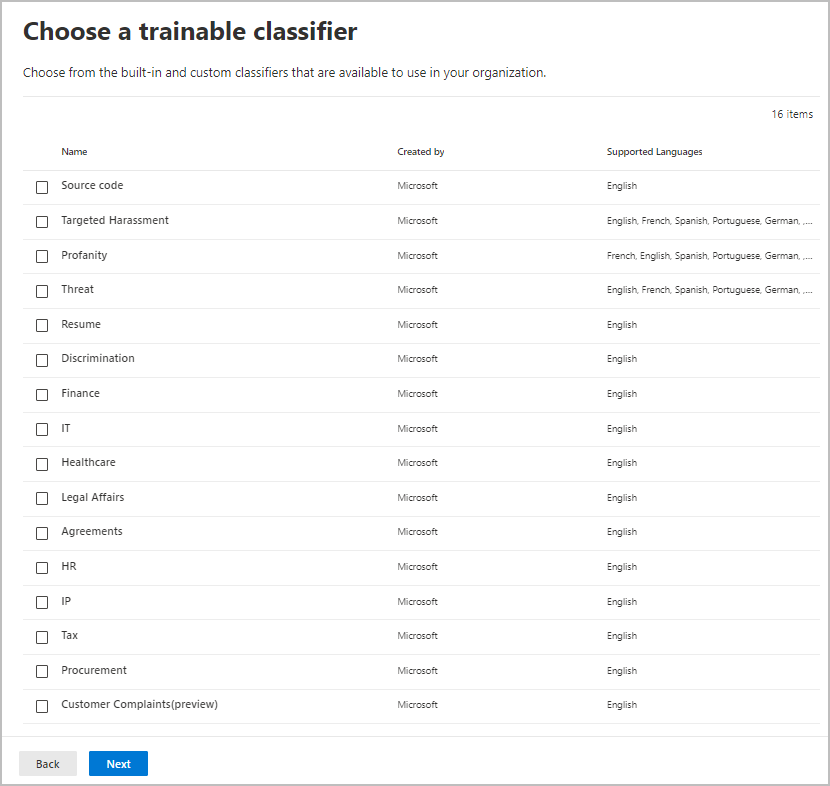
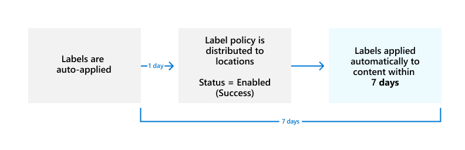

# Automatically apply a retention label to retain or delete content

>*[Microsoft 365 licensing guidance for security & compliance](/office365/servicedescriptions/microsoft-365-service-descriptions/microsoft-365-tenantlevel-services-licensing-guidance/microsoft-365-security-compliance-licensing-guidance).*

> [!NOTE]
> This scenario is not supported for [regulatory records](records-management.md#records) or default labels for an organizing structure such as a document set or library in SharePoint, or a folder in Exchange. These scenarios require a [published retention label policy](create-apply-retention-labels.md).

One of the most powerful features of [retention labels](retention.md) is the ability to apply them automatically to content that matches specified conditions. In this case, people in your organization don't need to apply the retention labels. Microsoft 365 does the work for them.

Auto-applying retention labels are powerful because:

- You don't need to train your users on all of your classifications.
- You don't need to rely on users to classify all content correctly.
- Users no longer need to know about data governance policies - they can focus on their work.

You can apply retention labels to content automatically when that content doesn't already have a retention label applied and contains sensitive information, keywords or searchable properties, or a match for [trainable classifiers](classifier-get-started-with.md). Now in preview, you can also automatically apply a retention label to cloud attachments that are stored in SharePoint or OneDrive.

> [!TIP]
> Use searchable properties to identify [Teams meeting recordings](#microsoft-teams-meeting-recordings) and [items that have a sensitivity label applied](#identify-files-and-emails-that-have-a-sensitivity-label).

The processes to automatically apply a retention label based on these conditions:


Use the following instructions for the two admin steps.

> [!NOTE]
> Auto-policies use service-side labeling with conditions to automatically apply retention labels to items. You can also automatically apply a retention label with a label policy when you do the following:
>
> - Apply a retention label to a document understanding model in SharePoint Syntex
> - Apply a default retention label for SharePoint and Outlook
> - Apply a retention label to email by using Outlook rules
>
> For these scenarios, see [Publish retention labels and apply them in apps](create-apply-retention-labels.md).

[!INCLUDE [purview-preview](../includes/purview-preview.md)]

## Before you begin

The global admin for your organization has full permissions to create and edit retention labels and their policies. If you aren't signing in as a global admin, see the permissions information for [records management](get-started-with-records-management.md#permissions) or [data lifecycle management](get-started-with-data-lifecycle-management.md#permissions-for-retention-policies-and-retention-labels), depending on the solution you're using.

Make sure you have [created the retention labels](file-plan-manager.md#create-retention-labels) you want to apply to items.

## How to create an auto-apply retention label policy

Decide before you create your retention label policy whether it will be **adaptive** or **static**. For more information, see [Adaptive or static policy scopes for retention](retention.md#adaptive-or-static-policy-scopes-for-retention). If you decide to use an adaptive policy, you must create one or more adaptive scopes before you create your retention label policy, and then select them during the create retention label policy process. For instructions, see [Configuration information for adaptive scopes](retention-settings.md#configuration-information-for-adaptive-scopes).

When you create an auto-apply policy, you select a retention label to automatically apply to content, based on the conditions that you specify.

1. In the [Microsoft Purview compliance portal](https://compliance.microsoft.com/), navigate to one of the following locations:

    - If you are using records management:
        - **Solutions** \> **Records management** \> **Label policies** tab \> **Auto-apply a label**

    - If you are using data lifecycle management:
        - **Solutions** \> **Data lifecycle management** \> **Microsoft 365** \> **Label policies** tab \> **Auto-apply a label**

    Don't immediately see your solution in the navigation pane? First select **Show all**.

2. Enter a name and description for this auto-labeling policy, and then select **Next**.

3. For **Choose the type of content you want to apply this label to**, select one of the available conditions. For more information about the choices, see the [Configuring conditions for auto-apply retention labels](#configuring-conditions-for-auto-apply-retention-labels) section on this page.

4. For the **Choose the type of retention policy to create** page, select **Adaptive** or **Static**, depending on the choice you made from the [Before you begin](#before-you-begin) instructions. If you haven't already created adaptive scopes, you can select **Adaptive** but because there won't be any adaptive scopes to select, you won't be able to finish the wizard with this option.

5. Depending on your selected scope:

    - If you chose **Adaptive**: On the **Choose adaptive policy scopes and locations** page, select **Add scopes** and select one or more adaptive scopes that have been created. Then, select one or more locations. The locations that you can select depend on the [scope types](retention-settings.md#configuration-information-for-adaptive-scopes) added. For example, if you only added a scope type of **User**, you will be able to select **Exchange email** but not **SharePoint sites**.
    
    - If you chose **Static**: On the **Choose locations** page, toggle on or off any of the locations. For each location, you can leave it at the default to [apply the policy to the entire location](retention-settings.md#a-policy-that-applies-to-entire-locations), or [specify includes and excludes](retention-settings.md#a-policy-with-specific-inclusions-or-exclusions)

    For information about the location choices, see [Locations](retention-settings.md#locations).

6. Follow the prompts in the wizard to select a retention label, and then review and submit your configuration choices.

To edit an existing retention label policy (the policy type is **Auto-apply**), select it, and then select the **Edit** option to start the **Edit retention policy** configuration.

After content is labeled by using an auto-apply label policy, the applied label can't be automatically removed or changed by changing the content or the policy, or by a new auto-apply label policy. For more information, see [Only one retention label at a time](retention.md#only-one-retention-label-at-a-time).

> [!NOTE]
> An auto-apply retention label policy will never replace an existing retention label that's applied to content. If you want to relabel content by using the conditions you configure, you'll need to manually remove the current retention label from existing content.

### Configuring conditions for auto-apply retention labels

You can apply retention labels to content automatically when that content contains:

- [Specific types of sensitive information](#auto-apply-labels-to-content-with-specific-types-of-sensitive-information)

- [Specific keywords or searchable properties that match a query you create](#auto-apply-labels-to-content-with-keywords-or-searchable-properties)

- [A match for trainable classifiers](#auto-apply-labels-to-content-by-using-trainable-classifiers)

Or, you can automatically apply retention labels to newly shared [cloud attachments](#auto-apply-labels-to-cloud-attachments).

When you configure retention labels to auto-apply based on sensitive information, keywords or searchable properties, or trainable classifiers, use the following table to identify when retention labels can be automatically applied.

Exchange:

|Condition|Items in transit (sent or received) |Existing items (data at rest)|
|:-----|:-----|:-----|
|Sensitive info types - built-in| Yes | No |
|Sensitive info types - custom| Yes | No |
|Specific keywords or searchable properties| Yes |Yes |
|Trainable classifiers| Yes | Yes (last six months only) |

SharePoint and OneDrive:

|Condition|New or modified items |Existing items |
|:-----|:-----|:-----|
|Sensitive info types - built-in| Yes | Yes |
|Sensitive info types - custom| Yes | No |
|Specific keywords or searchable properties| Yes |Yes |
|Trainable classifiers| Yes | Yes (last six months only) |

Additionally, SharePoint items that are in draft or that have never been published aren't supported for this scenario.

#### Auto-apply labels to content with specific types of sensitive information

> [!IMPORTANT]
> For emails that you auto-apply by identifying sensitive information, all mailboxes are automatically included, which includes mailboxes from Microsoft 365 groups. By default, the **Exchange email** location isn't selected for adaptive scopes when you have this configuration. Even if you can select the location, retention labels won't apply to the Exchange items.
>
> Although group mailboxes would usually be included by selecting the **Microsoft 365 Groups** location, for this specific policy configuration, the groups location includes only SharePoint sites connected to a Microsoft 365 group.

When you create auto-apply retention label policies for sensitive information, you see the same list of policy templates as when you create a Microsoft Purview Data Loss Prevention (DLP) policy. Each template is preconfigured to look for specific types of sensitive information. In the following example, the sensitive info types are from the **Privacy** category, and **U.S Personally Identifiable Information (PII) Data** template:


To learn more about the sensitivity information types, see [Learn about sensitive information types](sensitive-information-type-learn-about.md#learn-about-sensitive-information-types). Currently, [exact data match based sensitive information types](sit-learn-about-exact-data-match-based-sits.md#learn-about-exact-data-match-based-sensitive-information-types) and [document fingerprinting](document-fingerprinting.md) are not supported for this scenario.

After you select a policy template, you can add or remove any types of sensitive information, and you can change the confidence level and instance count. In the previous example screenshot, these options have been changed so that a retention label will be auto-applied only when:

- The type of sensitive information that's detected has a match accuracy (or [confidence level](sensitive-information-type-learn-about.md#more-on-confidence-levels)) of at least **Medium confidence** for two of the sensitive info types, and **High confidence** for one. Many sensitive information types are defined with multiple patterns, where a pattern with a higher match accuracy requires more evidence to be found (such as keywords, dates, or addresses), while a pattern with a lower match accuracy requires less evidence. The lower the confidence level, the easier it is for content to match the condition but with the potential for more false positives.

- The content contains between 1 and 9 instances of any of these three sensitive info types. The default for the **to** value is **Any**.

For more information about these options, see the following guidance from the DLP documentation [Tuning rules to make them easier or harder to match](data-loss-prevention-policies.md#tuning-rules-to-make-them-easier-or-harder-to-match).

> [!IMPORTANT]
> Sensitive information types have two different ways of defining the max unique instance count parameters. To learn more, see [Instance count supported values for SIT](sit-limits.md#instance-count-supported-values-for-sit).

To consider when using sensitive information types to auto-apply retention labels:

- If you use custom sensitive information types, these can't auto-label existing items in SharePoint and OneDrive.

- For emails, you can't select specific recipients to include or exclude; only the **All recipients** setting is supported and for this configuration only, it includes mailboxes from Microsoft 365 groups.

#### Auto-apply labels to content with keywords or searchable properties

You can auto-apply labels to content by using a query that contains specific words, phrases, or values of searchable properties. You can refine your query by using search operators such as AND, OR, and NOT.


For more information about the query syntax that uses Keyword Query Language (KQL), see [Keyword Query Language (KQL) syntax reference](/sharepoint/dev/general-development/keyword-query-language-kql-syntax-reference).

Query-based auto-apply policies use the same search index as eDiscovery content search to identify content. For more information about the searchable properties that you can use, see [Keyword queries and search conditions for Content Search](keyword-queries-and-search-conditions.md).

Some things to consider when using keywords or searchable properties to auto-apply retention labels:

- For SharePoint, crawled properties and custom properties aren't supported for these KQL queries and you must use only predefined managed properties for documents. However, you can use mappings at the tenant level with the predefined managed properties that are enabled as refiners by default (RefinableDate00-19, RefinableString00-99, RefinableInt00-49, RefinableDecimals00-09, and RefinableDouble00-09). For more information, see [Overview of crawled and managed properties in SharePoint Server](/SharePoint/technical-reference/crawled-and-managed-properties-overview), and for instructions, see [Create a new managed property](/sharepoint/manage-search-schema#create-a-new-managed-property).

- If you map a custom property to one of the refiner properties, wait 24 hours before you use it in your KQL query for a retention label.

- Although SharePoint managed properties can be renamed by using aliases, don't use these for KQL queries in your labels. Always specify the actual name of the managed property, for example, "RefinableString01".

- To search for values that contain spaces or special characters, use double quotation marks (`" "`) to contain the phrase; for example, `subject:"Financial Statements"`.

- Use the *DocumentLink* property instead of *Path* to match an item based on its URL.

- Suffix wildcard searches (such as `*cat`) or substring wildcard searches (such as `*cat*`) aren't supported. However, prefix wildcard searches (such as `cat*`) are supported.

- Be aware that partially indexed items can be responsible for not labeling items that you're expecting, or labeling items that you're expecting to be excluded from labeling when you use the NOT operator. For more information, see [Partially indexed items in Content Search](partially-indexed-items-in-content-search.md).

- We recommend that you don't use spaces between words in RefinableStrings values on documents. RefinableString is not a word-break property.

Examples queries:

| Workload | Example |
|:-----|:-----|
|Exchange   | `subject:"Financial Statements"` |
|Exchange   | `recipients:garthf@contoso.com` |
|SharePoint | `contenttype:document` |
|SharePoint | `site:https://contoso.sharepoint.com/sites/teams/procurement AND contenttype:document`|
|Exchange or SharePoint | `"customer information" OR "private"`|

More complex examples:

The following query for SharePoint identifies Word documents or Excel spreadsheets when those files contain the keywords **password**, **passwords**, or **pw**:

```KQL
(password OR passwords OR pw) AND (filetype:doc* OR filetype:xls*)
```

The following query for Exchange identifies any Word document or PDF that contains the word **nda** or the phrase **non disclosure agreement** when those documents are attached to an email:

```KQL
(nda OR "non disclosure agreement") AND (attachmentnames:.doc* OR attachmentnames:.pdf)
```

The following query for SharePoint identifies documents that contain a credit card number:

```KQL
sensitivetype:"credit card number"
```

The following query contains some typical keywords to help identify documents or emails that contain legal content:

```KQL
ACP OR (Attorney Client Privilege*) OR (AC Privilege)
```

The following query contains typical keywords to help identify documents or emails for human resources:

```KQL
(resume AND staff AND employee AND salary AND recruitment AND candidate)
```

Note that this final example uses the best practice of always including operators between keywords. A space between keywords (or two property:value expressions) is the same as using AND. By always adding operators, it's easier to see that this example query will identify only content that contains all these keywords, instead of content that contains any of the keywords. If your intention is to identify content that contains any of the keywords, specify OR instead of AND. As this example shows, when you always specify the operators, it's easier to correctly interpret the query.

##### Microsoft Teams meeting recordings

> [!NOTE]
> The ability to retain and delete Teams meeting recordings won't work before recordings are saved to OneDrive or SharePoint. For more information, see [Use OneDrive for Business and SharePoint Online or Stream for meeting recordings](/MicrosoftTeams/tmr-meeting-recording-change).

To identify Microsoft Teams meeting recordings that are stored in users' OneDrive accounts or in SharePoint, specify the following for the **Keyword query editor**:

```KQL
ProgID:Media AND ProgID:Meeting
```

Most of the time, meeting recordings are saved to OneDrive. But for channel meetings, they are saved in SharePoint.

##### Identify files and emails that have a sensitivity label

To identify files in SharePoint or OneDrive and Exchange emails that have a specific [sensitivity label](sensitivity-labels.md) applied, specify the following for the **Keyword query editor**:

```KQL
InformationProtectionLabelId:<GUID>
```

To find the GUID, use the [Get-Label](/powershell/module/exchange/get-label) cmdlet from [Security & Compliance PowerShell](/powershell/exchange/scc-powershell):

```powershell
Get-Label | Format-Table -Property DisplayName, Name, Guid
```

#### Auto-apply labels to content by using trainable classifiers

> [!IMPORTANT]
> Currently, trainable classifiers for auto-labeling can't be used with [adaptive scopes](retention.md#adaptive-or-static-policy-scopes-for-retention). Use a static scope instead.

When you choose the option for a trainable classifier, you can select one or more of the pre-trained or custom trainable classifiers:



The available pre-trained classifiers are often updated, so there might be more entries to select than the ones displayed in this screenshot.

For more information about trainable classifiers, see [Learn about trainable classifiers](classifier-learn-about.md).

To automatically apply a label by using this option, SharePoint sites, as well as mailboxes, must have at least 10 MB of data.

> [!TIP]
> If you use trainable classifiers for Exchange, see [How to retrain a classifier in content explorer](classifier-how-to-retrain-content-explorer.md).

To consider when using trainable classifiers to auto-apply retention labels:

- You can't auto-label SharePoint and OneDrive items that are older than six months.

#### Auto-apply labels to cloud attachments

> [!NOTE]
> This option is in preview and subject to change.

You might need to use this option if you're required to capture and retain all copies of files in your tenant that are sent over communications by users. You use this option in conjunction with retention policies for the communication services themselves, Exchange and Teams.

> [!IMPORTANT]
> When you select a label to use for auto-applying retention labels for cloud attachments, ensure that the label retention setting **Start the retention period based on** is **When items were labeled**.

Cloud attachments, sometimes also known as modern attachments, are a sharing mechanism that uses embedded links to files that are stored in the cloud. They support centralized storage for shared content with collaborative benefits, such as version control. Cloud attachments are not attached copies of a file or a URL text link to a file. You might find it helpful to refer to the visual checklists for supported cloud attachments in [Outlook](/office365/troubleshoot/retention/cannot-retain-cloud-attachments#cloud-attachments-in-outlook) and [Teams](/office365/troubleshoot/retention/cannot-retain-cloud-attachments#cloud-attachments-in-teams).

When you choose the option to apply a retention label to cloud attachments, for compliance purposes, a copy of that file is created at the time of sharing. Your selected retention label is then applied to the copy that can then be [identified using eDiscovery](advanced-ediscovery-cloud-attachments.md). Users are not aware of the copy that is stored in the Preservation Hold library. The retention label is not applied to the message itself, or to the original file.

If the file is modified and shared again, a new copy of the file as a new version is saved in the Preservation Hold library. For more information, including why you should use the **When items were labeled** label setting, see [How retention works with cloud attachments](retention-policies-sharepoint.md#how-retention-works-with-cloud-attachments).

The cloud attachments supported for this option are files such as documents, videos, and images that are stored in SharePoint and OneDrive. For Teams, cloud attachments shared in chat messages, and standard and private channels are supported. Cloud attachments shared over meeting invites and apps other than Teams or Outlook aren't supported. The cloud attachments must be shared by users; cloud attachments sent via bots aren't supported.

Although not required for this option, we recommend that you ensure versioning is enabled for your SharePoint sites and OneDrive accounts so that the version shared can be accurately captured. If versioning isn't enabled, the last available version will be retained. Documents in draft or that have never been published aren't supported.

When you select a label to use for auto-applying retention labels for cloud attachments, make sure the label retention setting **Start the retention period based on** is **When items were labeled**.

When you configure the locations for this option, you can select:

- **SharePoint sites** for shared files stored in SharePoint communication sites, team sites that aren't connected by Microsoft 365 groups, and classic sites.
- **Microsoft 365 Groups** for shared files that are stored in team sites connected by Microsoft 365 groups.
- **OneDrive accounts** for shared files stored in users' OneDrive.

You will need to create separate retention policies if you want to retain or delete the original files, email messages, or Teams messages.

> [!NOTE]
> If you want retained cloud attachments to expire at the same time as the messages that contained them, configure the retention label to have the same retain and then delete actions and timings as your retention policies for Exchange and Teams.

To consider when auto-applying retention labels to cloud attachments:

- Only newly shared cloud attachments will be auto-labeled for retention.

- When a user is added to a Teams conversation and given access to the full history of the conversation, that history can include cloud attachments. If they were shared within 48 hours of the user added to the conversation, current copies of the cloud attachments are auto-labeled for retention. Cloud attachments shared before this time period aren't supported for newly added users.

- Cloud attachments shared outside Teams and Outlook aren't supported.

- The following items aren't supported as cloud attachments that can be retained:
  - SharePoint sites, pages, lists, forms, folders, document sets, and OneNote pages.
  - Files shared by users who don't have access to those files at the time of sharing.
  - Files that are deleted or moved before the cloud attachment is sent. For example, a user copies and pastes a previously shared attachment from another message, without first confirming that the file is still available. Or, somebody forwards an old message when the file is now deleted.
  - Files that are shared by guests or users outside your organization.
  - Files in draft emails and messages that aren't sent.
  - Empty files.

## How long it takes for retention labels to take effect

When you auto-apply retention labels based on sensitive information, keywords or searchable properties, or trainable classifiers, it can take up to seven days for the retention labels to be applied:



If the expected labels don't appear after seven days, check the **Status** of the auto-apply policy by selecting it from the **Label policies** page in the Microsoft Purview compliance portal. If you see the status of **Off (Error)** and in the details for the locations see a message that it's taking longer than expected to deploy the policy (for SharePoint) or to try redeploying the policy (for OneDrive), try running the [Set-RetentionCompliancePolicy](/powershell/module/exchange/set-retentioncompliancepolicy) PowerShell command to retry the policy distribution:

1. [Connect to Security & Compliance PowerShell](/powershell/exchange/connect-to-scc-powershell).

2. Run the following command:

    ```PowerShell
    Set-RetentionCompliancePolicy -Identity <policy name> -RetryDistribution
    ```

## Updating retention labels and their policies

For auto-apply retention label policies that are configured for sensitive information, keywords or searchable properties, or a match for trainable classifiers: When a retention label from the policy is already applied to content, a change in configuration to the selected label and policy will be automatically applied to this content in addition to content that's newly identified.

For auto-apply retention label policies that are configured for cloud attachments: Because this policy applies to newly shared files rather than existing files, a change in configuration to the selected label and policy will be automatically applied to newly shared content only.

Some settings can't be changed after the label or policy is created and saved, which include:

- Names for retention labels and their policies, the scope type (adaptive or static), and the retention settings except the retention period. However, you can't change the retention period when the retention period is based on when items were labeled.
- The option to mark items as a record.

### Deleting retention labels

You can delete retention labels that aren't currently included in any retention label policies, that aren't configured for event-based retention, or mark items as regulatory records.

For retention labels that you can delete, if they have been applied to items, the deletion fails and you see a link to content explorer to identify the labeled items.

However, it can take up to two days for content explorer to show the items that are labeled. In this scenario, the retention label might be deleted without showing you the link to content explorer.

## Locking the policy to prevent changes

If you need to ensure that no one can turn off the policy, delete the policy, or make it less restrictive, see [Use Preservation Lock to restrict changes to retention policies and retention label policies](retention-preservation-lock.md).

## Next steps

To help you track the labels applied from your auto-labeling policies:

- [Monitoring retention labels](retention.md#monitoring-retention-labels)
- [Using Content Search to find all content with a specific retention label](retention.md#using-content-search-to-find-all-content-with-a-specific-retention-label)
- [Auditing retention actions](retention.md#auditing-retention-actions)

See [Use retention labels to manage the lifecycle of documents stored in SharePoint](auto-apply-retention-labels-scenario.md) for an example scenario that uses an auto-apply retention label policy with managed properties in SharePoint, and event-based retention to start the retention period.
