# Apply a sensitivity label to content automatically

>*[Microsoft 365 licensing guidance for security & compliance](/office365/servicedescriptions/microsoft-365-service-descriptions/microsoft-365-tenantlevel-services-licensing-guidance/microsoft-365-security-compliance-licensing-guidance).*

> [!NOTE]
> For information about automatically applying a sensitivity label in Azure Purview (preview), see [Automatically label your content in Azure Purview](/azure/purview/create-sensitivity-label).

When you create a sensitivity label, you can automatically assign that label to files and emails when it matches conditions that you specify.

This ability to apply sensitivity labels to content automatically is important because:

- You don't need to train your users when to use each of your classifications.

- You don't need to rely on users to classify all content correctly.

- Users no longer need to know about your policies—they can instead focus on their work.

When content has been manually labeled, that label will never be replaced by automatic labeling. However, automatic labeling can replace a [lower priority label](sensitivity-labels.md#label-priority-order-matters) that was automatically applied.

There are two different methods for automatically applying a sensitivity label to content in Microsoft 365:

- **Client-side labeling when users edit documents or compose (also reply or forward) emails**: Use a label that's configured for auto-labeling for files and emails (includes Word, Excel, PowerPoint, and Outlook). 
    
    This method supports recommending a label to users, as well as automatically applying a label. But in both cases, the user decides whether to accept or reject the label, to help ensure the correct labeling of content. This client-side labeling has minimal delay for documents because the label can be applied even before the document is saved. However, not all client apps support auto-labeling. This capability is supported by the Azure Information Protection unified labeling client, and [some versions of Office](sensitivity-labels-office-apps.md#support-for-sensitivity-label-capabilities-in-apps). 
    
    For configuration instructions, see [How to configure auto-labeling for Office apps](#how-to-configure-auto-labeling-for-office-apps) on this page.

- **Service-side labeling when content is already saved (in SharePoint or OneDrive) or emailed (processed by Exchange Online)**: Use an auto-labeling policy. 
    
    You might also hear this method referred to as auto-labeling for data at rest (documents in SharePoint and OneDrive) and data in transit (email that is sent or received by Exchange). For Exchange, it doesn't include emails at rest (mailboxes).
    
    Because this labeling is applied by services rather than by applications, you don't need to worry about what apps users have and what version. As a result, this capability is immediately available throughout your organization and suitable for labeling at scale. Auto-labeling policies don't support recommended labeling because the user doesn't interact with the labeling process. Instead, the administrator runs the policies in simulation mode to help ensure the correct labeling of content before actually applying the label.
    
    For configuration instructions, see [How to configure auto-labeling policies for SharePoint, OneDrive, and Exchange](#how-to-configure-auto-labeling-policies-for-sharepoint-onedrive-and-exchange) on this page.
    
    Specific to auto-labeling for SharePoint and OneDrive:
    - Office files for Word, PowerPoint, and Excel are supported. Open XML format is supported (such as .docx and .xlsx) but not Microsoft Office 97-2003 format (such as .doc and .xls).
        - These files can be auto-labeled at rest before or after the auto-labeling policies are created. Note that files cannot be auto-labeled if they are part of an open session (the file is open).
    - Maximum of 25,000 automatically labeled files in your tenant per day.
    - Maximum of 10 auto-labeling policies per tenant, each targeting up to 10 sites (SharePoint or OneDrive). Preview improvements: With the new [preview](#opt-in-to-the-new-preview-for-auto-labeling-policies), these numbers increase to 100 policies and 100 sites when they are specified individually. You can also specify all sites that are exempt from the 100 sites maximum. 
    - Existing values for modified, modified by, and the date are not changed as a result of auto-labeling policies—for both simulation mode and when labels are applied.
    - When the label applies encryption, the [Rights Management issuer and Rights Management owner](/azure/information-protection/configure-usage-rights#rights-management-issuer-and-rights-management-owner) is the account that last modified the file.

    Specific to auto-labeling for Exchange:
    - Unlike manual labeling or auto-labeling with Office apps, PDF attachments as well as Office attachments (Word, Excel, and PowerPoint files) are also scanned for the conditions you specify in your auto-labeling policy. When there is a match, the email is labeled but not the attachment.
        - For PDF files, if the label applies encryption, these files are encrypted when your tenant is [enabled for PDF attachments](ome-faq.yml#are-pdf-file-attachments-supported-).
        - For these Office files, Open XML format is supported (such as .docx and .xlsx) but not Microsoft Office 97-2003 format (such as .doc and .xls). If the label applies encryption, these files are encrypted.
    - If you have Exchange mail flow rules or data loss prevention (DLP) policies that apply IRM encryption: When content is identified by these rules or policies and an auto-labeling policy, the label is applied. If that label applies encryption, the IRM settings from the Exchange mail flow rules or DLP policies are ignored. However, if that label doesn't apply encryption, the IRM settings from the mail flow rules or DLP policies are applied in addition to the label.
    - Email that has IRM encryption with no label will be replaced by a label with any encryption settings when there is a match by using auto-labeling.
    - Incoming email is labeled when there is a match with your auto-labeling conditions:
        - If the label is configured for [encryption](encryption-sensitivity-labels.md), that encryption is applied. However, this configuration isn't currently supported.
        - If the label is configured to apply [dynamic markings](sensitivity-labels-office-apps.md#dynamic-markings-with-variables), be aware that this can result in the names of people outside your organization.
    - When the label applies encryption, the [Rights Management issuer and Rights Management owner](/azure/information-protection/configure-usage-rights#rights-management-issuer-and-rights-management-owner) is the person who sends the email. There currently isn't a way to set a Rights Manager owner for all incoming email messages that are automatically encrypted.
    

## Compare auto-labeling for Office apps with auto-labeling policies

Use the following table to help you identify the differences in behavior for the two complementary automatic labeling methods:

|Feature or behavior|Label setting: Auto-labeling for files and emails  |Policy: Auto-labeling|
|:-----|:-----|:-----|
|App dependency|[Yes](sensitivity-labels-office-apps.md#support-for-sensitivity-label-capabilities-in-apps) |No \* |
|Restrict by location|No |Yes |
|Conditions: Trainable classifiers|Yes |No |
|Conditions: Sharing options and additional options for email|No |Yes |
|Recommendations, policy tooltip, and user overrides|Yes |No |
|Simulation mode|No |Yes |
|Exchange attachments checked for conditions|No | Yes|
|Apply visual markings |Yes |Yes (email only) |
|Override IRM encryption applied without a label|Yes if the user has the minimum usage right of Export |Yes (email only) |
|Label incoming email|No |Yes|

\* Auto-labeling isn't currently available in all regions. If your tenant can't support this functionality, the Auto-labeling tab isn't visible in the admin labeling center.

## How multiple conditions are evaluated when they apply to more than one label

The labels are ordered for evaluation according to their position that you specify in the policy: The label positioned first has the lowest position (least sensitive) and the label positioned last has the highest position (most sensitive). For more information on priority, see [Label priority (order matters)](sensitivity-labels.md#label-priority-order-matters).

## Don't configure a parent label to be applied automatically or recommended

Remember, you can't apply a parent label (a label with sublabels) to content. Make sure that you don't configure a parent label to be auto-applied or recommended in Office apps, and don't select a parent label for an auto-labeling policy. If you do, the parent label won't be applied to content.

To use automatic labeling with sublabels, make sure you publish both the parent label and the sublabel.

For more information on parent labels and sublabels, see [Sublabels (grouping labels)](sensitivity-labels.md#sublabels-grouping-labels).

## How to configure auto-labeling for Office apps

Automatic labeling in Office apps for Windows is supported by the Azure Information Protection unified labeling client. For built-in labeling in Office apps, this capability is in [different stages of availability for different apps](sensitivity-labels-office-apps.md#support-for-sensitivity-label-capabilities-in-apps).

The auto-labeling settings for Office apps are available when you [create or edit a sensitivity label](create-sensitivity-labels.md). Make sure **Files & emails** is selected for the label's scope: 

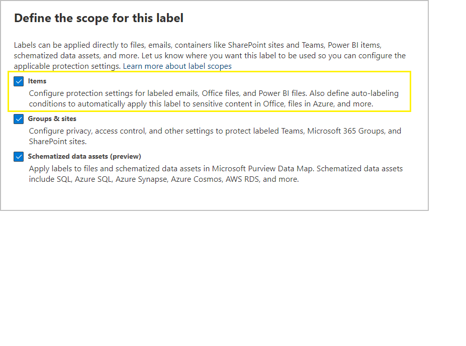

As you move through the wizard, you see the **Auto-labeling for files and emails** page where you can choose from a list of sensitive info types or trainable classifiers:

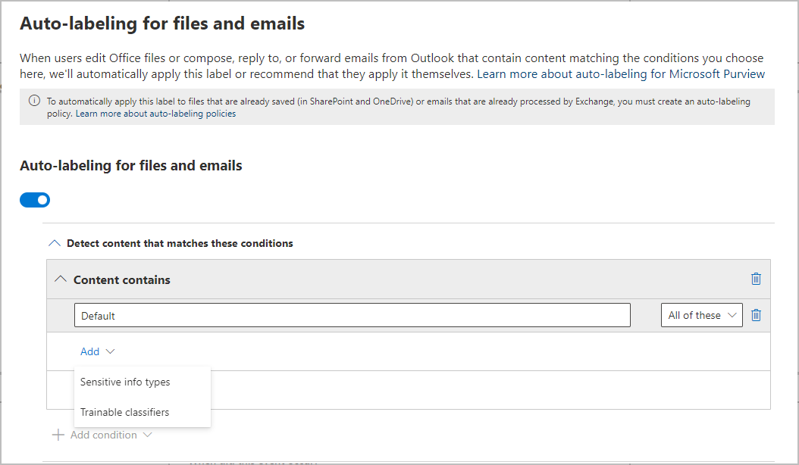

When this sensitivity label is automatically applied, the user sees a notification in their Office app. For example:


### Configuring sensitive info types for a label

When you select the **Sensitive info types** option, you see the same list of sensitive information types as when you create a data loss prevention (DLP) policy. So you can, for example, automatically apply a Highly Confidential label to any content that contains customers' personal information, such as credit card numbers, social security numbers, or passport numbers:

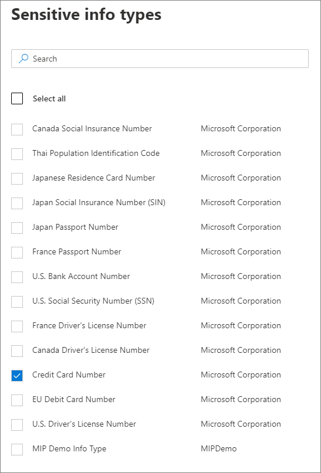

Similarly to when you configure DLP policies, you can then refine your condition by changing the instance count and match accuracy. For example:

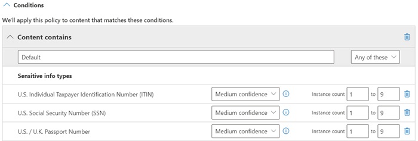

You can learn more about these configuration options from the DLP documentation: [Tuning rules to make them easier or harder to match](data-loss-prevention-policies.md#tuning-rules-to-make-them-easier-or-harder-to-match).

Also similarly to DLP policy configuration, you can choose whether a condition must detect all sensitive information types, or just one of them. And to make your conditions more flexible or complex, you can add [groups and use logical operators between the groups](data-loss-prevention-policies.md#grouping-and-logical-operators).

### Configuring trainable classifiers for a label

This option is currently in preview. If you use this option, make sure you have published in your tenant at least one other sensitivity label that's configured for auto-labeling and the [sensitive info types option](#configuring-sensitive-info-types-for-a-label).

When you select the **Trainable classifiers** option, select one or more of the built-in trainable classifiers from Microsoft. If you've created your own custom trainable classifiers, these are also available to select:

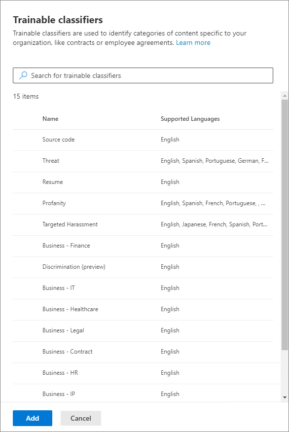

> [!CAUTION]
> We are deprecating the **Offensive Language** built-in classifier because it has been producing a high number of false positives. Don't use this built-in classifier and if you are currently using it, you should move your business processes off it. We recommend using the **Targeted Harassment**, **Profanity**, and **Threat** built-in classifiers instead.

For more information about these classifiers, see [Learn about trainable classifiers](classifier-learn-about.md).

During the preview period for this option, the following apps support trainable classifiers for sensitivity labels:

- Microsoft 365 Apps for enterprise ([formerly Office 365 ProPlus](/deployoffice/name-change)) for Windows, now rolling out to the [Current Channel](/deployoffice/overview-update-channels#current-channel-overview) in version 2006 and later:
    - Word
    - Excel
    - PowerPoint

- Office for the web apps, when you have [enabled sensitivity labels for Office files in SharePoint and OneDrive](sensitivity-labels-sharepoint-onedrive-files.md):
    - Word
    - Excel
    - PowerPoint
    - Outlook

### Recommend that the user applies a sensitivity label

If you prefer, you can recommend to your users that they apply the label. With this option, your users can accept the classification and any associated protection, or dismiss the recommendation if the label isn't suitable for their content.

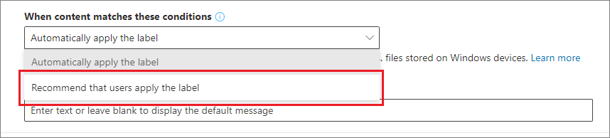

Here's an example of a prompt from the Azure Information Protection unified labeling client when you configure a condition to apply a label as a recommended action, with a custom policy tip. You can choose what text is displayed in the policy tip.


### When automatic or recommended labels are applied

The implementation of automatic and recommended labeling in Office apps depend on whether you're using labeling that's built into Office, or the Azure Information Protection unified labeling client. In both cases, however:

- You can't use automatic labeling for documents and emails that were previously manually labeled, or previously automatically labeled with a higher sensitivity. Remember, you can only apply a single sensitivity label to a document or email (in addition to a single retention label).

- You can't use recommended labeling for documents or emails that were previously labeled with a higher sensitivity. When the content's already labeled with a higher sensitivity, the user won't see the prompt with the recommendation and policy tip.

Specific to built-in labeling:

- Not all Office apps support automatic (and recommended) labeling. For more information, see [Support for sensitivity label capabilities in apps](sensitivity-labels-office-apps.md#support-for-sensitivity-label-capabilities-in-apps).

- For recommended labels in the desktop versions of Word, the sensitive content that triggered the recommendation is flagged so that users can review and remove the sensitive content instead of applying the recommended sensitivity label.

- For details about how these labels are applied in Office apps, example screenshots, and how sensitive information is detected, see [Automatically apply or recommend sensitivity labels to your files and emails in Office](https://support.office.com/en-us/article/automatically-apply-or-recommend-sensitivity-labels-to-your-files-and-emails-in-office-622e0d9c-f38c-470a-bcdb-9e90b24d71a1).

Specific to the Azure Information Protection unified labeling client:

-  Automatic and recommended labeling applies to Word, Excel, and PowerPoint when you save a document, and to Outlook when you send an email.

- For Outlook to support recommended labeling, you must first configure an [advanced policy setting](/azure/information-protection/rms-client/clientv2-admin-guide-customizations#enable-recommended-classification-in-outlook).

- Sensitive information can be detected in the body text in documents and emails, and to headers and footers—but not in the subject line or attachments of email.

## How to configure auto-labeling policies for SharePoint, OneDrive, and Exchange

> [!NOTE]
> Consider opting in to the current preview that contains many improvements from the general availability version for auto-labeling policies. For more information, see [Opt in to the new preview for auto-labeling policies](#opt-in-to-the-new-preview-for-auto-labeling-policies).

Make sure you're aware of the prerequisites before you configure auto-labeling policies. 

### Prerequisites for auto-labeling policies

- Simulation mode:
    - Auditing for Microsoft 365 must be turned on. If you need to turn on auditing or you're not sure whether auditing is already on, see [Turn audit log search on or off](turn-audit-log-search-on-or-off.md).
    - To view file or email contents in the source view, you must have the **Content Explorer Content Viewer** role. Global admins don't have this role by default. If you don't have this permission, you don't see the preview pane when you select an item from the **Matched Items** tab.

- To auto-label files in SharePoint and OneDrive:
    - You have [enabled sensitivity labels for Office files in SharePoint and OneDrive](sensitivity-labels-sharepoint-onedrive-files.md).
    - At the time the auto-labeling policy runs, the file mustn't be open by another process or user. A file that's checked out for editing falls into this category.

- If you plan to use [custom sensitive information types](sensitive-information-type-learn-about.md) rather than the built-in sensitivity types: 
    - Custom sensitivity information types are evaluated for content that is added to SharePoint or OneDrive after the custom sensitivity information types are saved. 
    - To test new custom sensitive information types, create them before you create your auto-labeling policy, and then create new documents with sample data for testing.

- One or more sensitivity labels [created and published](create-sensitivity-labels.md) (to at least one user) that you can select for your auto-labeling policies. For these labels:
    - It doesn't matter if the auto-labeling in Office apps label setting is turned on or off, because that label setting supplements auto-labeling policies, as explained in the introduction.
    - If the labels you want to use for auto-labeling are configured to use visual markings (headers, footers, watermarks), note that these are not applied to documents.
    - If the labels apply [encryption](encryption-sensitivity-labels.md):
        - When the auto-labeling policy includes locations for SharePoint or OneDrive, the label must be configured for the **Assign permissions now** setting.
        - When the auto-labeling policy is just for Exchange, the label can be configured for either **Assign permissions now** or **Let users assign permissions** (for the Do Not Forward or Encrypt-Only options).

### Learn about simulation mode

Simulation mode is unique to auto-labeling policies and woven into the workflow. You can't automatically label documents and emails until your policy has run at least one simulation.

Workflow for an auto-labeling policy:

1. Create and configure an auto-labeling policy.

2. Run the policy in simulation mode, which can take 48 hours to complete.
    
    Preview improvements: With the new [preview](#opt-in-to-the-new-preview-for-auto-labeling-policies), this time is reduced to 12 hours and the completed simultation triggers an email notification.

3. Review the results, and if necessary, refine your policy. Rerun simulation mode and wait for it to complete again.

4. Repeat step 3 as needed.

5. Deploy in production.

The simulated deployment runs like the WhatIf parameter for PowerShell. You see results reported as if the auto-labeling policy had applied your selected label, using the rules that you defined. You can then refine your rules for accuracy if needed, and rerun the simulation. However, because auto-labeling for Exchange applies to emails that are sent and received, rather than emails stored in mailboxes, don't expect results for email in a simulation to be consistent unless you're able to send and receive the exact same email messages.

Simulation mode also lets you gradually increase the scope of your auto-labeling policy before deployment. For example, you might start with a single location, such as a SharePoint site, with a single document library. Then, with iterative changes, increase the scope to multiple sites, and then to another location, such as OneDrive.

Finally, you can use simulation mode to provide an approximation of the time needed to run your auto-labeling policy, to help you plan and schedule when to run it without simulation mode.

### Creating an auto-labeling policy

1. In the [Microsoft 365 compliance center](https://compliance.microsoft.com/), navigate to sensitivity labels:
    
    - **Solutions** > **Information protection**
    
    If you don't immediately see this option, first select **Show all**.

2. Select the **Auto-labeling** tab:
    
    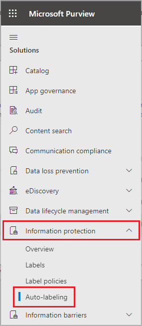
    
    > [!NOTE]
    > If you don't see the **Auto-labeling** tab, this functionality isn't currently available in your region.

3. Select **+ Create auto-labeling policy**. This starts the New policy wizard:
    
    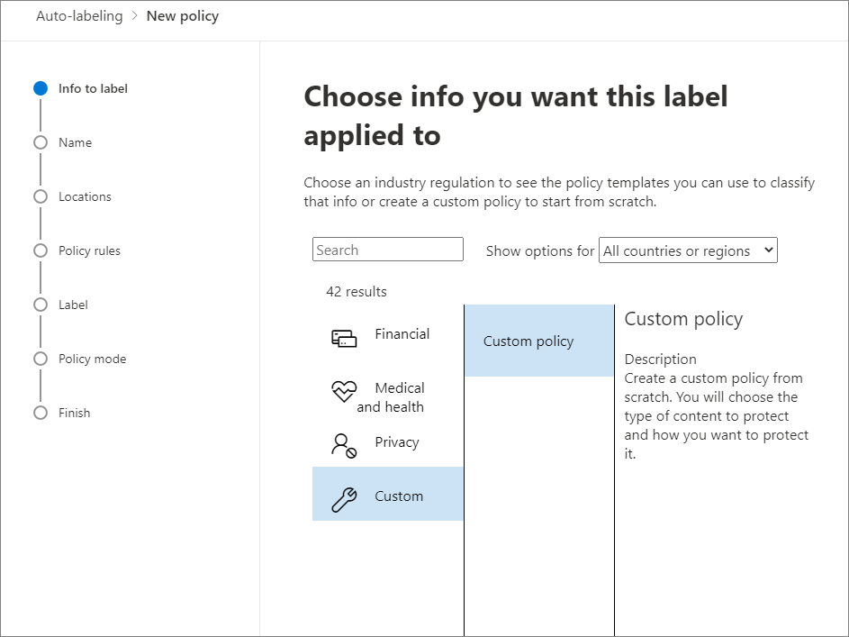

4. For the page **Choose info you want this label applied to**: Select one of the templates, such as **Financial** or **Privacy**. You can refine your search by using the **Show options for** dropdown. Or, select **Custom policy** if the templates don't meet your requirements. Select **Next**.

5. For the page **Name your auto-labeling policy**: Provide a unique name, and optionally a description to help identify the automatically applied label, locations, and conditions that identify the content to label.

6. For the page **Choose locations where you want to apply the label**: Select and specify locations for Exchange, SharePoint sites, and OneDrive. Then select **Next**.
    
    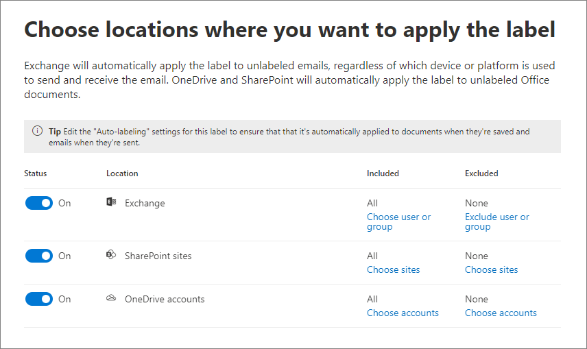
    
    You must specify individual SharePoint sites and OneDrive accounts. For OneDrive, the URL for a user's OneDrive account is in the following format: `https://<tenant name>-my.sharepoint.com/personal/<user_name>_<tenant name>_com`
    
    For example, for a user in the contoso tenant that has a user name of "rsimone": `https://contoso-my.sharepoint.com/personal/rsimone_contoso_onmicrosoft_com`
    
    To verify the syntax for your tenant and identify URLs for users, see [Get a list of all user OneDrive URLs in your organization](/onedrive/list-onedrive-urls).
    
    Preview improvements: If you opt in to the new [preview](#opt-in-to-the-new-preview-for-auto-labeling-policies), you can specify **All sites**.


7. For the **Set up common or advanced rules** page: Keep the default of **Common rules** to define rules that identify content to label across all your selected locations. If you need different rules per location, select **Advanced rules**. Then select **Next**.
    
    The rules use conditions that include sensitive information types and sharing options:
    - For sensitive information types, you can select both built-in and custom sensitive information types.
    - For the shared options, you can choose **only with people inside my organization** or **with people outside my organization**.
    
    If your only location is **Exchange**, or if you select **Advanced rules**, there are additional conditions that you can select:
    - Sender IP address is
    - Recipient domain is
    - Recipient is
    - Attachment's file extension is
    - Attachment is password protected
    - Any email attachment's content could not be scanned
    - Any email attachment's content didn't complete scanning

8. Depending on your previous choices, you'll now have an opportunity to create new rules by using conditions and exceptions.
    
    The configuration options for sensitive information types are the same as those you select for auto-labeling for Office apps. If you need more information, see [Configuring sensitive info types for a label](#configuring-sensitive-info-types-for-a-label).
    
    When you have defined all the rules you need, and confirmed their status is on, select **Next** to move on to choosing a label to auto-apply.

11. For the **Choose a label to auto-apply** page: Select **+ Choose a label**, select a label from the **Choose a sensitivity label** pane, and then select **Next**.

12. For the **Decide if you want to test out the policy now or later** page: Select **Run policy in simulation mode** if you're ready to run the auto-labeling policy now, in simulation mode. Otherwise, select **Leave policy turned off**. Select **Next**: 
    
    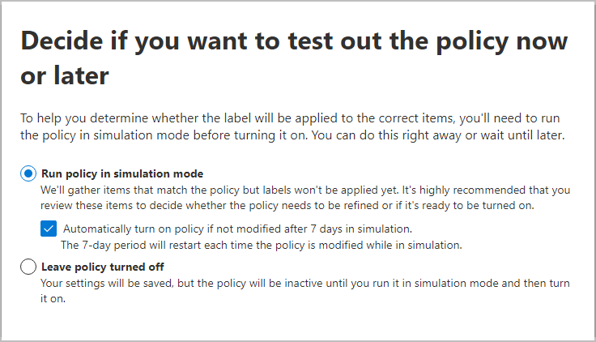

13. For the **Summary** page: Review the configuration of your auto-labeling policy and make any changes that needed, and complete the wizard.

Now on the **Information protection** > **Auto-labeling** page, you see your auto-labeling policy in the **Simulation** or **Off** section, depending on whether you chose to run it in simulation mode or not. Select your policy to see the details of the configuration and status (for example, **Policy simulation is still running**). For policies in simulation mode, select the **Matched items** tab to see which emails or documents matched the rules that you specified.

You can modify your policy directly from this interface:

- For a policy in the **Off** section, select the **Edit policy** button.

- For policy in the **Simulation** section, select the **Edit policy** option at the top of the page, from either tab:
    
    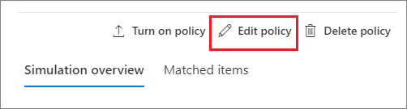
    
    When you're ready to run the policy without simulation, select the **Turn on policy** option.

Your auto-policies run continuously until they are deleted. For example, new and modified documents will be included with the current policy settings.

You can also see the results of your auto-labeling policy by using [content explorer](data-classification-content-explorer.md) when you have the appropriate [permissions](data-classification-content-explorer.md#permissions):
- **Content Explorer List Viewer** lets you see a file's label but not the file's contents.
- **Content Explorer Content Viewer** lets you see the file's contents.

> [!TIP]
> You can also use content explorer to identify locations that have documents with sensitive information, but are unlabeled. Using this information, consider adding these locations to your auto-labeling policy, and include the identified sensitive information types as rules.

### Use PowerShell for auto-labeling policies

You can use [Security & Compliance Center PowerShell](/powershell/exchange/scc-powershell) to create and configure auto-labeling policies. This means you can fully script the creation and maintenance of your auto-labeling policies, which also provides a more efficient method of specifying multiple URLs for OneDrive and SharePoint locations.

Before you run the commands in PowerShell, you must first [connect to Security & Compliance Center PowerShell](/powershell/exchange/connect-to-scc-powershell).

To create a new auto-labeling policy: 

```powershell
New-AutoSensitivityLabelPolicy -Name <AutoLabelingPolicyName> -SharePointLocation "<SharePointSiteLocation>" -ApplySensitivityLabel <Label> -Mode TestWithoutNotifications
```
This command creates an auto-labeling policy for a SharePoint site that you specify. For a OneDrive location, use the *OneDriveLocation* parameter, instead. 

To add additional sites to an existing auto-labeling policy:

```powershell
$spoLocations = @("<SharePointSiteLocation1>","<SharePointSiteLocation2>")
Set-AutoSensitivityLabelPolicy -Identity <AutoLabelingPolicyName> -AddSharePointLocation $spoLocations -ApplySensitivityLabel <Label> -Mode TestWithoutNotifications
```

This command specifies the additional SharePoint URLs in a variable that is then added to an existing auto-labeling policy. To add OneDrive locations instead, use the *AddOneDriveLocation* parameter with a different variable, such as *$OneDriveLocations*.

To create a new auto-labeling policy rule:

```powershell
New-AutoSensitivityLabelRule -Policy <AutoLabelingPolicyName> -Name <AutoLabelingRuleName> -ContentContainsSensitiveInformation @{"name"= "a44669fe-0d48-453d-a9b1-2cc83f2cba77"; "mincount" = "2"} -Workload SharePoint
```

For an existing auto-labeling policy, this command creates a new policy rule to detect the sensitive information type of **U.S. social security number (SSN)**, which has an entity ID of a44669fe-0d48-453d-a9b1-2cc83f2cba77. To find the entity IDs for other sensitive information types, refer to [Sensitive information type entity definitions](sensitive-information-type-entity-definitions.md).

For more information about the PowerShell cmdlets that support auto-labeling policies, their available parameters and some examples, see the following cmdlet help:

- [Get-AutoSensitivityLabelPolicy](/powershell/module/exchange/get-autosensitivitylabelpolicy)
- [New-AutoSensitivityLabelPolicy](/powershell/module/exchange/new-autosensitivitylabelpolicy)
- [New-AutoSensitivityLabelRule](/powershell/module/exchange/new-autosensitivitylabelrule)
- [Remove-AutoSensitivityLabelPolicy](/powershell/module/exchange/remove-autosensitivitylabelpolicy)
- [Remove-AutoSensitivityLabelRule](/powershell/module/exchange/remove-autosensitivitylabelrule)
- [Set-AutoSensitivityLabelPolicy](/powershell/module/exchange/set-autosensitivitylabelpolicy)
- [Set-AutoSensitivityLabelRule](/powershell/module/exchange/set-autosensitivitylabelrule)

## Opt in to the new preview for auto-labeling policies

The new preview version of auto-labeling policies for OneDrive and SharePoint has the following improvements from the general availability version:

- Maximum of 100 auto-labeling policies per tenant instead of 10.

- Support for all OneDrive and SharePoint sites by specifying **All sites** instead of having to enter each site by URL. As a result, all existing sites and any newly created sites are automatically selected, although you can still manually enter sites by their URL if needed.

- For the sites that you manually enter, up to 100 sites are now supported instead of 10 sites.

- Maximum of 1,000,000 matched files per auto-labeling policy, although the total of 25,000 automatically labeled files in your tenant per day remains the same.

- Simulation improvements:
    - Running the auto-labeling policy in simulation mode takes up to 12 hours to complete for the initial run, instead of up to 48 hours. Rerunning the policy takes less than 3 hours to complete.
    - Better performance by providing up to 100 randomly sampled matched files for review for each site (OneDrive or SharePoint) instead of every matched item for review.
    - When simulation is complete, an email notification is sent to the user configured to receive [activity alerts](alert-policies.md).

- Improvements to help you review matched items:
    - Additional metadata information for the sampled matched items.
    - Ability to export information about the matched items, such as the SharePoint site name and file owner. You can use this information to pivot and analyze the matched files, and delegate to file owners for review if needed.

### How to opt in to the new preview

To opt in to this preview, use the request form for [Auto-labelling V2 Preview for OneDrive and SharePoint online files](https://aka.ms/AutoLabelV2-Preview]). Wait a few days and confirm your tenant has been enabled for the preview when you see **(Preview)** added to the **Auto-labeling** tab in the Microsoft 365 compliance center.

Before you submit the form, be aware of the following conditions:

- After your tenant is running the preview, you cannot opt out and return to the general availability version. The tenant will continue to run the preview until this version becomes general available.

- If had any auto-labeling policies that are still in simulation mode when your preview request was accepted, you must re-run the simulation. If this scenario applies to you, you'll be prompted to select **Restart Simulation**. If you don't, the simulation won't complete and the preview won't be enabled.