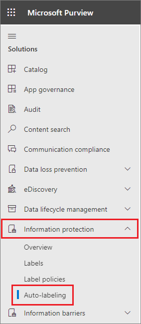
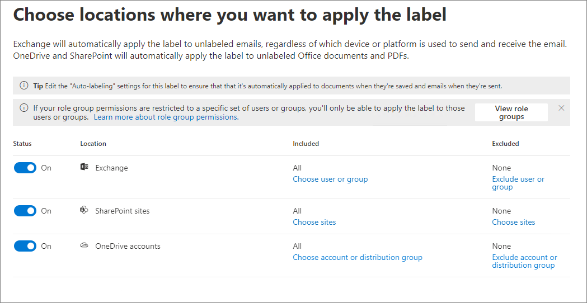
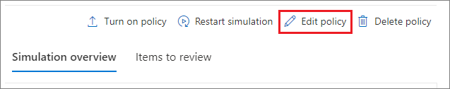

# Apply a sensitivity label to content automatically

>*[Microsoft 365 licensing guidance for security & compliance](/office365/servicedescriptions/microsoft-365-service-descriptions/microsoft-365-tenantlevel-services-licensing-guidance/microsoft-365-security-compliance-licensing-guidance).*

> [!NOTE]
> For information about automatically applying a sensitivity label in the data map, see [Labeling in Microsoft Purview Data Map](/azure/purview/create-sensitivity-label).

When you create a sensitivity label, you can automatically assign that label to files and emails when it matches conditions that you specify.

This ability to apply sensitivity labels to content automatically is important because:

- You don't need to train your users when to use each of your classifications.

- You don't need to rely on users to classify all content correctly.

- Users no longer need to know about your policies—they can instead focus on their work.

There are two different methods for automatically applying a sensitivity label to content in Microsoft 365:

- **Client-side labeling when users edit documents or compose (also reply or forward) emails**: Use a label that's configured for auto-labeling for files and emails (includes Word, Excel, PowerPoint, and Outlook).

    This method supports recommending a label to users, as well as automatically applying a label. But in both cases, the user decides whether to accept or reject the label, to help ensure the correct labeling of content. This client-side labeling has minimal delay for documents because the label can be applied even before the document is saved. However, not all client apps support auto-labeling. This capability is supported by built-in labeling with [some versions of Office](sensitivity-labels-office-apps.md#support-for-sensitivity-label-capabilities-in-apps), and also the Azure Information Protection unified labeling client.

    For configuration instructions, see [How to configure auto-labeling for Office apps](#how-to-configure-auto-labeling-for-office-apps) on this page.

- **Service-side labeling when content is already saved (in SharePoint or OneDrive) or emailed (processed by Exchange Online)**: Use an auto-labeling policy.
    
    You might also hear this method referred to as auto-labeling for data at rest (documents in SharePoint and OneDrive) and data in transit (email that is sent or received by Exchange). For Exchange, it doesn't include emails at rest (mailboxes).
    
    Because this labeling is applied by services rather than by applications, you don't need to worry about what apps users have and what version. As a result, this capability is immediately available throughout your organization and suitable for labeling at scale. Auto-labeling policies don't support recommended labeling because the user doesn't interact with the labeling process. Instead, the administrator runs the policies in simulation to help ensure the correct labeling of content before actually applying the label.

    For configuration instructions, see [How to configure auto-labeling policies for SharePoint, OneDrive, and Exchange](#how-to-configure-auto-labeling-policies-for-sharepoint-onedrive-and-exchange) on this page.
    
    Specific to auto-labeling for SharePoint and OneDrive:
    
    - Office files for Word (.docx), PowerPoint (.pptx), and Excel (.xlsx) are supported.
        - These files can be auto-labeled at rest before or after the auto-labeling policies are created. Files can't be auto-labeled if they're part of an open session (the file is open).
        - Currently, attachments to list items aren't supported and won't be auto-labeled.
    - Maximum of 25,000 automatically labeled files in your tenant per day.
    - Maximum of 100 auto-labeling policies per tenant, each targeting up to 100 sites (SharePoint or OneDrive) when they're specified individually. You can also specify all sites, and this configuration is exempt from the 100 sites maximum.
    - Existing values for modified, modified by, and the date aren't changed as a result of auto-labeling policies—for both simulation mode and when labels are applied.
    - When the label applies encryption, the [Rights Management issuer and Rights Management owner](/azure/information-protection/configure-usage-rights#rights-management-issuer-and-rights-management-owner) is the account that last modified the file.

    Specific to auto-labeling for Exchange:
    
    - Unlike manual labeling or auto-labeling with Office apps, PDF attachments as well as Office attachments are also scanned for the conditions you specify in your auto-labeling policy. When there's a match, the email is labeled but not the attachment.
        - For PDF files, if the label applies encryption, these files, if unencrypted, are now encrypted by using [Message encryption](ome.md) when your tenant is [enabled for PDF attachments](ome-faq.yml#are-pdf-file-attachments-supported-). The encryption settings applied are inherited from the email.
        - For these Office files, Word, PowerPoint, and Excel are supported. If the label applies encryption and these files are unencrypted, they're now encrypted by using [Message encryption](ome.md). The encryption settings are inherited from the email.
    - If you have Exchange mail flow rules or Microsoft Purview Data Loss Prevention (DLP) policies that apply IRM encryption: When content is identified by these rules or policies and an auto-labeling policy, the label is applied. If that label applies encryption, the IRM settings from the Exchange mail flow rules or DLP policies are ignored. However, if that label doesn't apply encryption, the IRM settings from the mail flow rules or DLP policies are applied in addition to the label.
    - Email that has IRM encryption with no label will be replaced by a label with any encryption settings when there's a match by using auto-labeling.
    - Incoming email is labeled when there is a match with your auto-labeling conditions. If this label is configured for [encryption](encryption-sensitivity-labels.md), that encryption is always applied when the sender is from your organization. By default, that encryption isn't applied when the sender is outside your organization but can be applied by configuring **Additional settings for email** and specifying a Rights Management owner.
    - When the label applies encryption, the [Rights Management issuer and Rights Management owner](/azure/information-protection/configure-usage-rights#rights-management-issuer-and-rights-management-owner) is the person who sends the email when the sender is from your own organization. When the sender is outside your organization, you can specify a Rights Management owner for incoming email that's labeled and encrypted by your policy.
    - If the label is configured to apply [dynamic markings](sensitivity-labels-office-apps.md#dynamic-markings-with-variables), be aware that for incoming email, this configuration can result in displaying the names of people outside your organization.

> [!NOTE]
> For some new customers, we're offering the automatic configuration of default auto-labeling settings for both client-side labeling and service-side labeling. Even if you're not eligible for this automatic configuration, you might find it useful to reference their configuration. For example, you can manually configure existing labels and create your own auto-labeling policies with the same settings to help accelerate your labeling deployment.
> 
> For more information, see [Default labels and policies for Microsoft Purview Information Protection](mip-easy-trials.md).


[!INCLUDE [purview-preview](../includes/purview-preview.md)]

## Compare auto-labeling for Office apps with auto-labeling policies

Use the following table to help you identify the differences in behavior for the two complementary automatic labeling methods:

|Feature or behavior|Label setting: Auto-labeling for files and emails  |Policy: Auto-labeling|
|:-----|:-----|:-----|
|App dependency|Yes ([minimum versions](sensitivity-labels-office-apps.md#support-for-sensitivity-label-capabilities-in-apps)) |No \* |
|Restrict by location|No |Yes |
|Conditions: Trainable classifiers|Yes |In preview |
|Conditions: Sharing options and additional options for email|No |Yes |
|Conditions: Exceptions|No |Yes (email only) |
|Recommendations, policy tooltip, and user overrides|Yes |No |
|Simulation mode|No |Yes |
|Exchange attachments checked for conditions|No | Yes|
|Apply visual markings |Yes |Yes (email only) |
|Override IRM encryption applied without a label|Yes if the user has the minimum usage right of Export |Yes (email only) |
|Label incoming email|No |Yes|
|Assign a Rights Management owner for emails sent from another organization |No |Yes|
|For emails, replace existing label that has same or lower priority |No |Yes (configurable)|

\* Auto-labeling isn't currently available in all regions because of a backend Azure dependency. If your tenant can't support this functionality, the **Auto-labeling** tab isn't visible in the Microsoft Purview compliance portal. For more information, see [Azure dependency availability by country](/troubleshoot/azure/general/dependency-availability-by-country).

## How multiple conditions are evaluated when they apply to more than one label

The labels are ordered for evaluation according to their position that you specify in the compliance portal: The label positioned first has the lowest position (least sensitive, so lowest priority) and the label positioned last has the highest position (most sensitive, so highest priority). The label with the highest order number is selected.

This behavior is also true for service-side auto-labeling (auto-labeling policies) when sublabels share the same parent label: If, after evaluation and ordering, more than one sublabel from the same parent label meets the auto-labeling conditions, the sublabel with the highest order number is selected and applied.

However, the behavior is a little different for client-side auto-labeling (auto-labeling settings in the label). If multiple sublabels from the same parent label match the conditions:

- If a file is not already labeled, the highest order sublabel that's configured for automatic labeling is always selected, rather than the highest order sublabel that's configured for recommended labeling. If none of these sublabels are configured for automatic labeling but only recommended labeling, the highest order sublabel is selected and recommended.

- If a file is already labeled with a sublabel from the same parent, no action is taken and the existing sublabel remains. This behavior applies even if the existing sublabel was a default label or automatically applied.

For more information about label priority, see [Label priority (order matters)](sensitivity-labels.md#label-priority-order-matters).

## Don't configure a parent label to be applied automatically or recommended

Remember, you can't apply a parent label (a label with sublabels) to content. Make sure that you don't configure a parent label to be auto-applied or recommended in Office apps, and don't select a parent label for an auto-labeling policy. If you do, the parent label won't be applied to content.

To use automatic labeling with sublabels, make sure you publish both the parent label and the sublabel.

For more information on parent labels and sublabels, see [Sublabels (grouping labels)](sensitivity-labels.md#sublabels-grouping-labels).

## Will an existing label be overridden?

> [!NOTE]
> A recently added setting for email auto-labeling polices let you specify that a matching sensitivity label will always override an existing label.

Default behavior whether automatic labeling will override an existing label:

- When content has been manually labeled, that label won't be replaced by automatic labeling.

- Automatic labeling will replace a [lower priority sensitivity label](sensitivity-labels.md#label-priority-order-matters) that was automatically applied, but not a higher priority label.
    
    > [!TIP]
    > For example, the sensitivity label at the top of the list in the Microsoft Purview compliance portal is named **Public** with an order number (priority) of 0, and the sensitivity label at the bottom of the list is named **Highly Confidential** with an order number (priority of 4). The **Highly Confidential** label can override the **Public** label but not the other way around.

For email auto-labeling policies only, you can select a setting to always override an existing sensitivity label, regardless of how it was applied.

|Existing label |Override with label setting: Auto-labeling for files and emails  |Override with policy: Auto-labeling|
|:-----|:-----|:-----|
|Manually applied, any priority|Word, Excel, PowerPoint: No <br /><br> Outlook: No  |SharePoint and OneDrive: No <br /><br> Exchange: No by default, but configurable |
|Automatically applied or default label from policy, lower priority |Word, Excel, PowerPoint: Yes \* <br /><br> Outlook: Yes \* | SharePoint and OneDrive: Yes <br /><br> Exchange: Yes |
|Automatically applied or default label from policy, higher priority |Word, Excel, PowerPoint: No <br /><br> Outlook: No |SharePoint and OneDrive: No <br /><br> Exchange: No by default, but configurable |

\* There's an [exception for sublabels that share the same parent label](#how-multiple-conditions-are-evaluated-when-they-apply-to-more-than-one-label)

The configurable setting for email auto-labeling policies is on the **Additional settings for email** page. This page displays after you've selected a sensitivity label for an auto-labeling policy that includes the Exchange location.

## How to configure auto-labeling for Office apps

For built-in labeling in Office apps, check the [minimum versions required](sensitivity-labels-office-apps.md#support-for-sensitivity-label-capabilities-in-apps) for automatic labeling in Office apps.

The Azure Information Protection unified labeling client supports automatic labeling only for built-in and custom sensitive info types, and doesn't support trainable classifiers or sensitive info types that use Exact Data Match (EDM) or named entities.

The auto-labeling settings for Office apps are available when you [create or edit a sensitivity label](create-sensitivity-labels.md). Make sure **Items** is selected for the label's scope:


As you move through the configuration, you see the **Auto-labeling for files and emails** page where you can choose from a list of sensitive info types or trainable classifiers:


When this sensitivity label is automatically applied, the user sees a notification in their Office app. For example:


### Configuring sensitive info types for a label

When you select the **Sensitive info types** option, you see the same list of [sensitive information types](sensitive-information-type-learn-about.md) as when you create a data loss prevention (DLP) policy. So you can, for example, automatically apply a Highly Confidential label to any content that contains customers' personal information, such as credit card numbers, social security numbers, or passport numbers:


Similarly to when you configure DLP policies, you can then refine your condition by changing the instance count and match accuracy. For example:


You can learn more about these configuration options from the DLP documentation: [Tuning rules to make them easier or harder to match](data-loss-prevention-policies.md#tuning-rules-to-make-them-easier-or-harder-to-match).

> [!IMPORTANT]
> Sensitive information types have two different ways of defining the max unique instance count parameters. To learn more, see [Instance count supported values for SIT](sit-limits.md#instance-count-supported-values-for-sit).

Also similarly to DLP policy configuration, you can choose whether a condition must detect all sensitive information types, or just one of them. And to make your conditions more flexible or complex, you can add [groups and use logical operators between the groups](data-loss-prevention-policies.md).

> [!NOTE]
> Auto-labeling based on custom sensitive information types applies only to newly created or modified content in OneDrive and SharePoint; not to existing content. This limitation also applies to auto-labeling polices.

#### Custom sensitive information types with Exact Data Match

You can configure a sensitivity label to use [exact data match based sensitive information types](sit-learn-about-exact-data-match-based-sits.md#learn-about-exact-data-match-based-sensitive-information-types) for custom sensitive information types. However, currently, you must also specify at least one sensitive information type that doesn't use EDM. For example, one of the built-in sensitive information types, such as **Credit card number**.

If you configure a sensitivity label with only EDM for your sensitive information type conditions, the auto-labeling setting is automatically turned off for the label.

### Configuring trainable classifiers for a label

If you use this option with Microsoft 365 Apps for Windows version 2106 or lower, or Microsoft 365 Apps for Mac version 16.50 or lower, make sure you've published in your tenant at least one other sensitivity label that's configured for auto-labeling and the [sensitive info types option](#configuring-sensitive-info-types-for-a-label). This requirement isn't necessary when you use later versions on these platforms.

When you select the **Trainable classifiers** option, select one or more of the pre-trained or custom trainable classifiers:


The available pre-trained classifiers are often updated, so there might be more entries to select than the ones displayed in this screenshot.

For more information about these classifiers, see [Learn about trainable classifiers](classifier-learn-about.md).

### Recommend that the user applies a sensitivity label

If you prefer, you can recommend to your users that they apply the label. With this option, your users can accept the classification and any associated protection, or dismiss the recommendation if the label isn't suitable for their content.


Here's an example of a prompt from the Azure Information Protection unified labeling client when you configure a condition to apply a label as a recommended action, with a custom policy tip. You can choose what text is displayed in the policy tip.


### When automatic or recommended labels are applied

The implementation of automatic and recommended labeling in Office apps depend on whether you're using labeling that's built into Office, or the Azure Information Protection unified labeling client. In both cases, however:

- You can't use automatic labeling for documents and emails that were previously manually labeled, or previously automatically labeled with a higher sensitivity. Remember, you can only apply a single sensitivity label to a document or email (in addition to a single retention label).

- You can't use recommended labeling for documents or emails that were previously labeled with a higher sensitivity. When the content's already labeled with a higher sensitivity, the user won't see the prompt with the recommendation and policy tip.

Specific to built-in labeling:

- Not all Office apps support automatic (and recommended) labeling. For more information, see [Support for sensitivity label capabilities in apps](sensitivity-labels-office-apps.md#support-for-sensitivity-label-capabilities-in-apps).

- For recommended labels in the desktop versions of Word, the sensitive content that triggered the recommendation is flagged so that users can review and remove the sensitive content instead of applying the recommended sensitivity label.

- For details about how these labels are applied in Office apps, example screenshots, and how sensitive information is detected, see [Automatically apply or recommend sensitivity labels to your files and emails in Office](https://support.microsoft.com/office/automatically-apply-or-recommend-sensitivity-labels-to-your-files-and-emails-in-office-622e0d9c-f38c-470a-bcdb-9e90b24d71a1).

Specific to the Azure Information Protection unified labeling client:

- Automatic and recommended labeling applies to Word, Excel, and PowerPoint when you save a document, and to Outlook when you send an email.

- For Outlook to support recommended labeling, you must first configure an [advanced policy setting](/azure/information-protection/rms-client/clientv2-admin-guide-customizations#enable-recommended-classification-in-outlook).

- Sensitive information can be detected in the body text in documents and emails, and to headers and footers—but not in the subject line or attachments of email.

### Convert your label settings into an auto-labeling policy

> [!NOTE]
> This option is gradually rolling out.

If the label includes sensitive info types for the configured conditions, you'll see an option at the end of the label creation or editing process to automatically create an auto-labeling policy that's based on the same auto-labeling settings.

Because auto-labeling policies don't support trainable classifiers:

- If the label conditions contain just trainable classifiers, you won't see the option to automatically create an auto-labeling policy.

- If the label conditions contain trainable classifiers and sensitivity info types, an auto-labeling policy will be created for just the sensitive info types. 

Although an auto-labeling policy is automatically created for you by auto-populating the values that you would have to select manually if you created the policy from scratch, you can still view and edit the values before they are saved.

By default, all locations for SharePoint, OneDrive, and Exchange are included in the auto-label policy, and when the policy is saved, it runs in [simulation mode](#learn-about-simulation-mode). There's no check that you've [enabled sensitivity labels for Office files in SharePoint and OneDrive](sensitivity-labels-sharepoint-onedrive-files.md), which is one of the prerequisites for auto-labeling to apply to content in SharePoint and OneDrive.

## How to configure auto-labeling policies for SharePoint, OneDrive, and Exchange

Make sure you're aware of the prerequisites before you configure auto-labeling policies.

### Prerequisites for auto-labeling policies

- Simulation mode:
  - Auditing for Microsoft 365 must be turned on. If you need to turn on auditing or you're not sure whether auditing is already on, see [Turn audit log search on or off](turn-audit-log-search-on-or-off.md).
  - To view file or email contents in the source view, you must have the **Data Classification Content Viewer** role, which is included in the **Content Explorer Content Viewer** role group, or **Information Protection** and **Information Protection Investigators** role groups (currently in preview). Without the required role, you don't see the preview pane when you select an item from the **Matched Items** tab. Global admins don't have this role by default.

- To auto-label files in SharePoint and OneDrive:
  - You have [enabled sensitivity labels for Office files in SharePoint and OneDrive](sensitivity-labels-sharepoint-onedrive-files.md).
  - At the time the auto-labeling policy runs, the file mustn't be open by another process or user. A file that's checked out for editing falls into this category.

- If you plan to use [custom sensitive information types](sensitive-information-type-learn-about.md) rather than the built-in sensitivity types:
  - Custom sensitivity information types apply only to content that is added or modified in SharePoint or OneDrive after the custom sensitivity information types are created.
  - To test new custom sensitive information types, create them before you create your auto-labeling policy, and then create new documents with sample data for testing.

- One or more sensitivity labels [created and published](create-sensitivity-labels.md) (to at least one user) that you can select for your auto-labeling policies. For these labels:
  - It doesn't matter if the auto-labeling in Office apps label setting is turned on or off, because that label setting supplements auto-labeling policies, as explained in the introduction.
  - If the labels you want to use for auto-labeling are configured to use visual markings (headers, footers, watermarks), note that these aren't applied to documents.
  - If the labels apply [encryption](encryption-sensitivity-labels.md):
    - When the auto-labeling policy includes locations for SharePoint or OneDrive, the label must be configured for the **Assign permissions now** setting, and **User access to content expires** must be set to **Never**.
    - When the auto-labeling policy is just for Exchange, the label can be configured for either **Assign permissions now** or **Let users assign permissions** (for the Do Not Forward or Encrypt-Only options). You can't auto-apply a label that's [configured to apply S/MIME protection](sensitivity-labels-office-apps.md#configure-a-label-to-apply-smime-protection-in-outlook).

### Learn about simulation mode

Simulation mode is unique to auto-labeling policies and woven into the workflow. You can't automatically label documents and emails until your policy has run at least one simulation.

Simulation mode supports up to 1,000,000 matched files. If more than this number of files are matched from an auto-labeling policy, you can't turn on the policy to apply the labels. In this case, you must reconfigure the auto-labeling policy so that fewer files are matched, and rerun simulation. This maximum of 1,000,000 matched files applies to simulation mode only and not to an auto-labeling policy that's already turned on to apply sensitivity labels.

Workflow for an auto-labeling policy:

1. Create and configure an auto-labeling policy.

2. Run the policy in simulation mode, which can take 12 hours to complete. The completed simulation triggers an email notification that's sent to the user configured to receive [activity alerts](alert-policies.md).

3. Review the results, and if necessary, refine your policy. For example, you might need to edit the policy rules to reduce false positives, or remove some sites so that the number of matched files doesn't exceed 1,000,000. Rerun simulation mode and wait for it to complete again.

4. Repeat step 3 as needed.

5. Deploy in production.

The simulated deployment runs like the WhatIf parameter for PowerShell. You see results reported as if the auto-labeling policy had applied your selected label, using the rules that you defined. You can then refine your rules for accuracy if needed, and rerun the simulation. However, because auto-labeling for Exchange applies to emails that are sent and received, rather than emails stored in mailboxes, don't expect results for email in a simulation to be consistent unless you can send and receive the exact same email messages.

Simulation mode also lets you gradually increase the scope of your auto-labeling policy before deployment. For example, you might start with a single location, such as a SharePoint site, with a single document library. Then, with iterative changes, increase the scope to multiple sites, and then to another location, such as OneDrive.

Finally, you can use simulation mode to provide an approximation of the time needed to run your auto-labeling policy, to help you plan and schedule when to run it without simulation mode.

### Creating an auto-labeling policy

1. In the <a href="https://go.microsoft.com/fwlink/p/?linkid=2077149" target="_blank">Microsoft Purview compliance portal</a>, navigate to sensitivity labels:

    - **Solutions** > **Information protection**

    If you don't immediately see this option, first select **Show all**.

2. Select the **Auto-labeling** tab:

    

    > [!NOTE]
    > If you don't see the **Auto-labeling** tab, this functionality isn't currently available in your region because of a backend Azure dependency. For more information, see [Azure dependency availability by country](/troubleshoot/azure/general/dependency-availability-by-country).

3. Select **+ Create auto-labeling policy**. This starts the New policy configuration:

    

4. For the page **Choose info you want this label applied to**: Select one of the templates, such as **Financial** or **Privacy**. You can refine your search by using the **Show options for** dropdown. Or, select **Custom policy** if the templates don't meet your requirements. Select **Next**.

5. For the page **Name your auto-labeling policy**: Provide a unique name, and optionally a description to help identify the automatically applied label, locations, and conditions that identify the content to label.

6. For the page **Choose locations where you want to apply the label**: Select and specify locations for Exchange, SharePoint, and OneDrive. If you don't want to keep the default of **All** included for your chosen locations, select the link to choose specific instances to include, or select the link to choose specific instances to exclude. Then select **Next**.

    
    
    If you change the default settings by using **Included** or **Excluded**:
    
    - For the **Exchange** location, the policy is applied according to the sender address of the recipients specified. Most of the time, you'll want to keep the default of **All** included with **None** excluded. This configuration is suitable even if you're testing for a subset of users. Instead of specifying your subset of users here, use the advanced rules in the next step to configure conditions to include or exclude recipients in your organization. Otherwise, when you change the default settings here:
        -  If you change the default of **All** included and instead, choose specific users or groups, email sent from outside your organization will be exempt from the policy. 
        -  If you keep the default of **All** included but specify users or groups to exclude, email that these excluded users send will be exempt from the policy, but not email that they receive.
    
    - For OneDrive accounts, see [Get a list of all user OneDrive URLs in your organization](/onedrive/list-onedrive-urls) to help you specify individual OneDrive accounts to include or exclude.

7. For the **Set up common or advanced rules** page: Keep the default of **Common rules** to define rules that identify content to label across all your selected locations. If you need different rules per location, including more options for Exchange, select **Advanced rules**. Then select **Next**.

    The rules use conditions that include [sensitive information types](sensitive-information-type-learn-about.md), [trainable classifiers](classifier-learn-about.md), and sharing options:
    - To select a sensitive information type or trainable classifier as a condition, under **Content contains**, select **Add**, and then choose **Sensitive info types** or **Trainable classifiers**.
    - To select sharing options as a condition, under **Content is shared**, choose either **only with people inside my organization** or **with people outside my organization**.

    If your location is **Exchange** and you selected **Advanced rules**, there are other conditions that you can select:
    - Sender IP address is
    - Recipient domain is
    - Recipient is
    - Attachment's file extension is
    - Attachment is password protected
    - Any email attachment's content could not be scanned
    - Any email attachment's content didn't complete scanning
    - Header matches patterns
    - Subject matches patterns
    - Recipient address contains words
    - Recipient address matches patterns
    - Sender address matches patterns
    - Sender domain is
    - Recipient is a member of
    - Sender is

    For each of these conditions, you can then specify exceptions.

8. Depending on your previous choices, you'll now have an opportunity to create new rules by using conditions and exceptions.

    The configuration options for sensitive information types are the same as those you select for auto-labeling for Office apps. If you need more information, see [Configuring sensitive info types for a label](#configuring-sensitive-info-types-for-a-label).

    When you've defined all the rules you need, and confirmed their status is on, select **Next** to move on to choosing a label to auto-apply.

9. For the **Choose a label to auto-apply** page: Select **+ Choose a label**, select a label from the **Choose a sensitivity label** pane, and then select **Next**.

10. If your policy includes the Exchange location: Specify optional configurations on the **Additional settings for email** page:
    
    - **Automatically replace existing labels that have the same or lower priority**: Applicable for both incoming and outgoing emails, when you select this setting, it ensures a matching sensitivity label will always be applied. If you don't select this setting, a matching sensitivity label won't be applied to emails that have an existing sensitivity label with a [higher priority](sensitivity-labels.md#label-priority-order-matters) or that were manually labeled.
    
    - **Apply encryption to email received from outside your organization**: When you select this option, you must assign a [Rights Management owner](/azure/information-protection/configure-usage-rights#rights-management-issuer-and-rights-management-owner) to ensure that an authorized person in your organization has Full Control [usage rights](/azure/information-protection/configure-usage-rights#usage-rights-and-descriptions) for emails sent from your outside your organization and your policy labels with encryption. This role might be needed to later remove the encryption, or assign different usage rights for users in your organization.
        
        For **Assign a Rights Management owner**, specify a single user by an email address that's owned by your organization. Don't specify a mail contact, a shared mailbox, or any group type, because these aren't supported for this role.

10. For the **Decide if you want to test out the policy now or later** page: Select **Run policy in simulation mode** if you're ready to run the auto-labeling policy now, in simulation mode. Then decide whether to automatically turn on the policy if it's not edited for 7 days:
    
    
    
    If you're not ready to run simulation, select **Leave policy turned off**. 

11. For the **Summary** page: Review the configuration of your auto-labeling policy and make any changes that needed, and complete the configuration.

Now on the **Information protection** > **Auto-labeling** page, you see your auto-labeling policy in the **Simulation** or **Off** section, depending on whether you chose to run it in simulation mode or not. Select your policy to see the details of the configuration and status (for example, **Policy simulation is still running**). For policies in simulation mode, select the **Matched items** tab to see which emails or documents matched the rules that you specified.

You can modify your policy directly from this interface:

- For a policy in the **Off** section, select the **Edit policy** button.

- For policy in the **Simulation** section, select the **Edit policy** option at the top of the page, from either tab:

    

    When you're ready to run the policy without simulation, select the **Turn on policy** option.

Auto-labeling policies run continuously until they're deleted. For example, new and modified files will be included with the current policy settings.

### Monitoring your auto-labeling policy

After your auto-labeling policy is turned on, you can view the labeling progress for files in your chosen SharePoint and OneDrive locations. Emails aren't included in the labeling progress because they're automatically labeled as they're sent.

The labeling progress includes the files to be labeled by the policy, the files labeled in the last seven days, and the total files labeled. Because of the maximum of labeling 25,000 files a day, this information provides you with visibility into the current labeling progress for your policy and how many files are still to be labeled.

When you first turn on your policy, you initially see a value of 0 for files to be labeled until the latest data is retrieved. This progress information updates every 48 hours, so you can expect to see the most current data about every other day. When you select an auto-labeling policy, you can see more details about the policy in a flyout pane, which includes the labeling progress by the top 10 sites. The information on this flyout pane might be more current than the aggregated policy information displayed on the **Auto-labeling** main page.

You can also see the results of your auto-labeling policy by using [content explorer](data-classification-content-explorer.md) when you have the appropriate [permissions](data-classification-content-explorer.md#permissions):

- **Content Explorer List Viewer** role group lets you see a file's label but not the file's contents.
- **Content Explorer Content Viewer** role group, and **Information Protection** and **Information Protection Investigators** role groups (currently in preview) let you see the file's contents.

> [!TIP]
> You can also use content explorer to identify locations that have documents with sensitive information, but are unlabeled. Using this information, consider adding these locations to your auto-labeling policy, and include the identified sensitive information types as rules.

### Use PowerShell for auto-labeling policies

You can use [Security & Compliance PowerShell](/powershell/exchange/scc-powershell) to create and configure auto-labeling policies. This means you can fully script the creation and maintenance of your auto-labeling policies, which also provides a more efficient method of specifying multiple URLs for OneDrive and SharePoint locations.

Before you run the commands in PowerShell, you must first [connect to Security & Compliance PowerShell](/powershell/exchange/connect-to-scc-powershell).

To create a new auto-labeling policy:

```powershell
New-AutoSensitivityLabelPolicy -Name <AutoLabelingPolicyName> -SharePointLocation "<SharePointSiteLocation>" -ApplySensitivityLabel <Label> -Mode TestWithoutNotifications
```

This command creates an auto-labeling policy for a SharePoint site that you specify. For a OneDrive location, use the *OneDriveLocation* parameter, instead.

To add more sites to an existing auto-labeling policy:

```powershell
$spoLocations = @("<SharePointSiteLocation1>","<SharePointSiteLocation2>")
Set-AutoSensitivityLabelPolicy -Identity <AutoLabelingPolicyName> -AddSharePointLocation $spoLocations -ApplySensitivityLabel <Label> -Mode TestWithoutNotifications
```

This command specifies the new SharePoint URLs in a variable that is then added to an existing auto-labeling policy. To add OneDrive locations instead, use the *AddOneDriveLocation* parameter with a different variable, such as *$OneDriveLocations*.

To create a new auto-labeling policy rule:

```powershell
New-AutoSensitivityLabelRule -Policy <AutoLabelingPolicyName> -Name <AutoLabelingRuleName> -ContentContainsSensitiveInformation @{"name"= "a44669fe-0d48-453d-a9b1-2cc83f2cba77"; "mincount" = "2"} -Workload SharePoint
```

For an existing auto-labeling policy, this command creates a new policy rule to detect the sensitive information type of **U.S. social security number (SSN)**, which has an entity ID of a44669fe-0d48-453d-a9b1-2cc83f2cba77. To find the entity IDs for other sensitive information types, refer to [Sensitive information type entity definitions](sensitive-information-type-entity-definitions.md).

For more information about the PowerShell cmdlets that support auto-labeling policies, their available parameters and some examples, see the following cmdlet help:

- [Get-AutoSensitivityLabelPolicy](/powershell/module/exchange/get-autosensitivitylabelpolicy)
- [New-AutoSensitivityLabelPolicy](/powershell/module/exchange/new-autosensitivitylabelpolicy)
- [New-AutoSensitivityLabelRule](/powershell/module/exchange/new-autosensitivitylabelrule)
- [Remove-AutoSensitivityLabelPolicy](/powershell/module/exchange/remove-autosensitivitylabelpolicy)
- [Remove-AutoSensitivityLabelRule](/powershell/module/exchange/remove-autosensitivitylabelrule)
- [Set-AutoSensitivityLabelPolicy](/powershell/module/exchange/set-autosensitivitylabelpolicy)
- [Set-AutoSensitivityLabelRule](/powershell/module/exchange/set-autosensitivitylabelrule)

## Tips to increase labeling reach

Although auto-labeling is one of the most efficient ways to classify, label, and protect Office files that your organization owns, check whether you can supplement it with any of the following methods to increase your labeling reach:

- For SharePoint document libraries, you can apply a default sensitivity label for new and edited files. For more information, see [Configure a default sensitivity label for a SharePoint document library](sensitivity-labels-sharepoint-default-label.md).

- With SharePoint Syntex, you can [apply a sensitivity label to a document understanding model](/microsoft-365/contentunderstanding/apply-a-sensitivity-label-to-a-model), so that identified documents in a SharePoint document library are automatically labeled.

- When you use the [Azure Information Protection unified labeling client](/azure/information-protection/rms-client/aip-clientv2):

  - For files in on-premises data stores, such as network shares and SharePoint Server libraries: Use the [scanner](deploy-scanner.md) to discover sensitive information in these files and label them appropriately. If you're planning to migrate or upload these files to SharePoint in Microsoft 365, use the scanner to label the files before you move them to the cloud.

  - If you've used another labeling solution before using sensitivity labels: Use PowerShell and [an advanced setting to reuse labels](/azure/information-protection/rms-client/clientv2-admin-guide-customizations#migrate-labels-from-secure-islands-and-other-labeling-solutions) from these solutions.

- Encourage [manual labeling](https://support.microsoft.com/office/apply-sensitivity-labels-to-your-files-and-email-in-office-2f96e7cd-d5a4-403b-8bd7-4cc636bae0f9) after providing users with training which sensitivity labels to apply. When you're confident that users understand which label to apply, consider configuring a default label and mandatory labeling as [policy settings](sensitivity-labels.md#what-label-policies-can-do).

Additionally, consider [marking new files as sensitive by default](/sharepoint/sensitive-by-default) in SharePoint to prevent guests from accessing newly added files until at least one DLP policy scans the content of the file.
