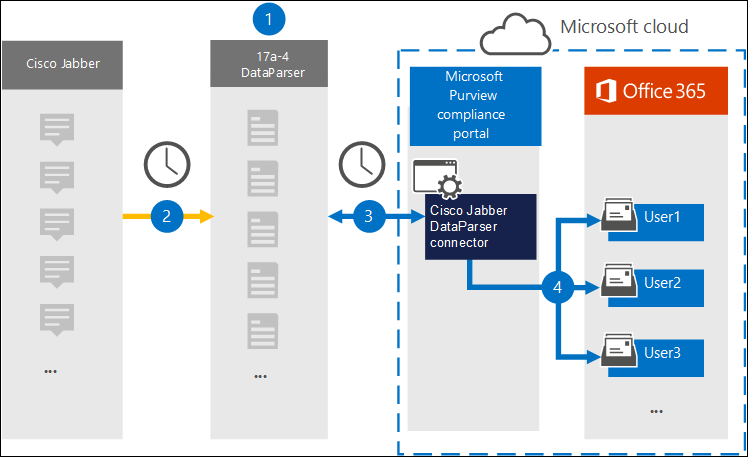

# Set up a connector to archive Cisco Jabber data (preview)

Use the [Cisco Jabber DataParser](https://www.17a-4.com/jabber-dataparser/) from 17a-4 LLC to import and archive data from Cisco Jabber to user mailboxes in your Microsoft 365 organization. The DataParser includes a Cisco Jabber connector that's configured to capture items from a third-party data source and import those items to Microsoft 365. The Cisco Jabber DataParser connector converts Cisco Jabber data to an email message format and then imports those items to user mailboxes in Microsoft 365.

After Cisco Jabber data is stored in user mailboxes, you can apply Microsoft 365 compliance features such as Litigation Hold, eDiscovery, retention policies and retention labels, and communication compliance. Using a Cisco Jabber connector to import and archive data in Microsoft 365 can help your organization stay compliant with government and regulatory policies.

## Overview of archiving Cisco Jabber data

The following overview explains the process of using a data connector to archive Cisco Jabber data in Microsoft 365.

1. Your organization works with 17a-4 to set up and configure the Cisco Jabber DataParser.

2. On a regular basis, Cisco Jabber items are collected by the DataParser. The DataParser also converts the content of a message to an email message format.

3. The Cisco Jabber DataParser connector that you create in the Microsoft 365 compliance center connects to DataParser and transfers the messages to a secure Azure Storage location in the Microsoft cloud.

4. A subfolder in the Inbox folder named **Cisco Jabber DataParser** is created in the user mailboxes, and the Cisco Jabber items are imported to that folder. The connector determines which mailbox to import items to by using the value of the *Email* property. Every Cisco Jabber item contains this property, which is populated with the email address of every participant.

## Before you set up a connector

- Create a DataParser account for Microsoft connectors. To do this, contact [17a-4 LLC](https://www.17a-4.com/contact/). You need to sign into this account when you create the connector in Step 1.

- The user who creates the Cisco Jabber DataParser connector in Step 1 (and completes it in Step 3) must be assigned to the Mailbox Import Export role in Exchange Online. This role is required to add connectors on the **Data connectors** page in the Microsoft 365 compliance center. By default, this role is not assigned to a role group in Exchange Online. You can add the Mailbox Import Export role to the Organization Management role group in Exchange Online. Or you can create a role group, assign the Mailbox Import Export role, and then add the appropriate users as members. For more information, see the [Create role groups](/Exchange/permissions-exo/role-groups#create-role-groups) or [Modify role groups](/Exchange/permissions-exo/role-groups#modify-role-groups) sections in the article "Manage role groups in Exchange Online".

## Step 1: Set up a Cisco Jabber DataParser connector

The first step is to access to the Data connectors page in the Microsoft 365 compliance center and create a 17a-4 connector for Cisco Jabber data.

1. Go to <https://compliance.microsoft.com> and then click **Data connectors** > **Cisco Jabber DataParser**.

2. On the **Cisco Jabber DataParser** product description page, click **Add connector**.

3. On the **Terms of service** page, click **Accept**.

4. Enter a unique name that identifies the connector and then click **Next**.

5. Sign in to your 17a-4 account and complete the steps in the Cisco Jabber DataParser connection wizard.

## Step 2: Configure the Cisco Jabber DataParser connector

Work with 17a-4 Support to configure the Cisco Jabber DataParser connector.

## Step 3: Map users

The Cisco Jabber DataParser connector will automatically map users to their Microsoft 365 email addresses before importing data to Microsoft 365.

## Step 4: Monitor the Cisco Jabber DataParser connector

After you create a Cisco Jabber DataParser connector, you can view the connector status in the Microsoft 365 compliance center.

1. Go to <https://compliance.microsoft.com> and click **Data connectors** in the left nav.

2. Click the **Connectors** tab and then select the Cisco Jabber DataParser connector that you created to display the flyout page, which contains the properties and information about the connector.

3. Under **Connector status with source**, click the **Download log** link to open (or save) the status log for the connector. This log contains data that has been imported to the Microsoft cloud.

## Known issues

At this time, we don't support importing attachments or items that are larger than 10 MB. Support for larger items will be available at a later date.
