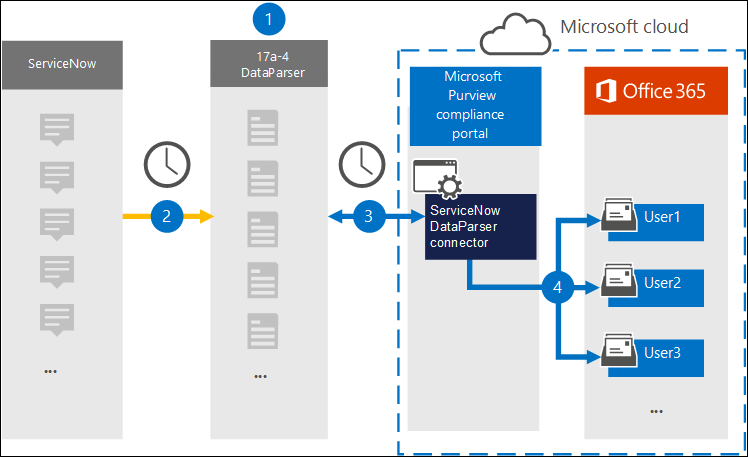

# Set up a connector to archive data from ServiceNow

Use the [ServiceNow DataParser](https://www.17a-4.com/dataparser/) from 17a-4 LLC to import and archive data from ServiceNow to user mailboxes in your Microsoft 365 organization. The DataParser includes a ServiceNow connector that's configured to capture items from a third-party data source and import those items to Microsoft 365. The ServiceNow DataParser connector converts ServiceNow data to an email message format and then imports those items to user mailboxes in Microsoft 365.

After ServiceNow data is stored in user mailboxes, you can apply Microsoft Purview features such as Litigation Hold, eDiscovery, retention policies and retention labels, and communication compliance. Using a ServiceNow connector to import and archive data in Microsoft 365 can help your organization stay compliant with government and regulatory policies.

## Overview of archiving ServiceNow data

The following overview explains the process of using a data connector to archive ServiceNow data in Microsoft 365.

1. Your organization works with 17a-4 to set up and configure the ServiceNow DataParser.

2. On a regular basis, ServiceNow items are collected by the DataParser. The DataParser also converts the content of a message to an email message format.

3. The ServiceNow DataParser connector that you create in the Microsoft Purview compliance portal connects to DataParser and transfers the messages to a secure Azure Storage location in the Microsoft cloud.

4. A subfolder in the Inbox folder named **ServiceNow DataParser** is created in the user mailboxes, and the ServiceNow items are imported to that folder. The connector determines which mailbox to import items to by using the value of the *Email* property. Every ServiceNow item contains this property, which is populated with the email address of every participant.

## Before you set up a connector

- Create a DataParser account for Microsoft connectors. To do this, contact [17a-4 LLC](https://www.17a-4.com/contact/). You need to sign into this account when you create the connector in Step 1.

- The user who creates the ServiceNow DataParser connector in Step 1 (and completes it in Step 3) must be assigned the Data Connector Admin role. This role is required to add connectors on the **Data connectors** page in the compliance portal. This role is added by default to multiple role groups. For a list of these role groups, see the "Roles in the security and compliance centers" section in [Permissions in the Security & Compliance Center](../security/office-365-security/permissions-in-the-security-and-compliance-center.md#roles-in-the-security--compliance-center). Alternatively, an admin in your organization can create a custom role group, assign the Data Connector Admin role, and then add the appropriate users as members. For instructions, see the "Create a custom role group" section in [Permissions in the Microsoft Purview compliance portal](microsoft-365-compliance-center-permissions.md#create-a-custom-role-group).

- This 17a-4 data connector is available in GCC environments in the Microsoft 365 US Government cloud. Third-party applications and services might involve storing, transmitting, and processing your organization's customer data on third-party systems that are outside of the Microsoft 365 infrastructure and therefore are not covered by the Microsoft Purview and data protection commitments. Microsoft makes no representation that use of this product to connect to third-party applications implies that those third-party applications are FEDRAMP compliant.

## Step 1: Set up a ServiceNow DataParser connector

The first step is to access to the Data connectors page in the compliance portal and create a 17a-4 connector for ServiceNow data.

1. Go to <https://compliance.microsoft.com> and then click **Data connectors** > **ServiceNow DataParser**.

2. On the **ServiceNow DataParser** product description page, click **Add connector**.

3. On the **Terms of service** page, click **Accept**.

4. Enter a unique name that identifies the connector and then click **Next**.

5. Sign in to your 17a-4 account and complete the steps in the ServiceNow DataParser connection wizard.

## Step 2: Configure the ServiceNow DataParser connector

Work with 17a-4 Support to configure the ServiceNow DataParser connector.

## Step 3: Map users

The ServiceNow DataParser connector will automatically map users to their Microsoft 365 email addresses before importing data to Microsoft 365.

## Step 4: Monitor the ServiceNow DataParser connector

After you create a ServiceNow DataParser connector, you can view the connector status in the compliance portal.

1. Go to <https://compliance.microsoft.com> and click **Data connectors** in the left nav.

2. Click the **Connectors** tab and then select the ServiceNow DataParser connector that you created to display the flyout page, which contains the properties and information about the connector.

3. Under **Connector status with source**, click the **Download log** link to open (or save) the status log for the connector. This log contains information about the data that's been imported to the Microsoft cloud. For more information, see [View admin logs for data connectors](data-connector-admin-logs.md).

## Known issues

At this time, we don't support importing attachments or items that are larger than 10 MB. Support for larger items will be available at a later date.
