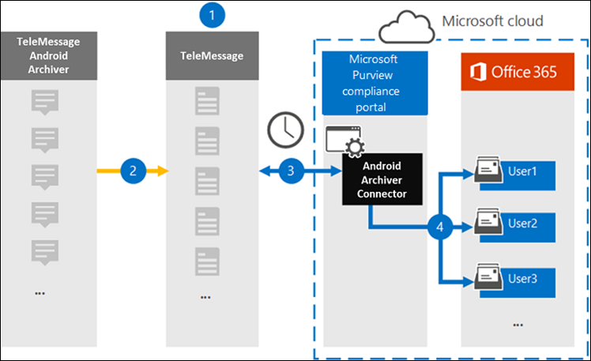

# Set up a connector to archive Android mobile data

Use a TeleMessage connector in the Microsoft 365 compliance center to import and archive SMS, MMS, voice calls, and call logs from Android mobile phones. After you set up and configure a connector, it connects to your organization's TeleMessage account once every day, and imports the mobile communication of employees using the TeleMessage Android Archiver to mailboxes in Microsoft 365.

After data from Android mobile phones is stored in user mailboxes, you can apply Microsoft 365 compliance features such as Litigation Hold, Content Search, and Microsoft 365 retention policies to Android Archiver data. For example, you can search Android Archiver mobile communication using Content Search or associate the mailbox that contains the Android Archiver connector data with a custodian in an Advanced eDiscovery case. Using an Android Archiver connector to import and archive data in Microsoft 365 can help your organization stay compliant with government and regulatory policies.

## Overview of archiving Android mobile data

The following overview explains the process of using a connector to archive Android mobile data in Microsoft 365.

1. Your organization works with TeleMessage to set up an Android Archiver connector. For more information, see [Android Archiver](https://www.telemessage.com/office365-activation-for-android-archiver/).

2. In real time, SMS, MMS, voice calls, and call logs from your organization's Android mobile phones are copied to the TeleMessage site.

3. The Android Archiver connector that you create in the Microsoft 365 compliance center connects to the TeleMessage site every day and transfers the Android data from the previous 24 hours to a secure Azure Storage location in the Microsoft cloud. The connector also converts the Android data to an email message format.

4. The connector imports the mobile communication items to the mailbox of a specific user. A new folder named Android Archiver is created in the specific user's mailbox and the items are imported to it. The connector does mapping by using the value of the *User's Email address* property. Every email message contains this property, which is populated with the email address of every participant of the email message. In addition to automatic user mapping using the value of the *User's Email address* property, you can also define a custom mapping by uploading a CSV mapping file. This mapping file should contain the mobile number and corresponding Microsoft 365 mailbox address for each user. If you enable automatic user mapping and provide a custom mapping, for every email item the connector will first look at custom mapping file. If it doesn't find a valid Microsoft 365 user that corresponds to a user's mobile number, the connector will use the user's email address property of the email item. If the connector doesn't find a valid Microsoft 365 user in either the custom mapping file or the *User's email address* property of the email item, the item won't be imported.

## Before you begin

Some of the implementation steps required to archive Android communication data are external to Microsoft 365 and must be completed before you can create the connector in the compliance center.

- Order the [Android Archiver service from TeleMessage](https://www.telemessage.com/mobile-archiver/order-mobile-archiver-for-o365) and get a valid administration account for your organization. You'll need to sign into this account when you create the connector.

- Register all users that require the Android Archiver service in the TeleMessage account. When registering users, be sure to use the same email address that's used for their Microsoft 365 account.

- Install and activate the TeleMessage Android Archiver app on the mobile phones of your employees.

- The user who creates a Android Archiver connector must be assigned the Mailbox Import Export role in Exchange Online. This is required to add connectors in the **Data connectors** page in the Microsoft 365 compliance center. By default, this role isn't assigned to any role group in Exchange Online. You can add the Mailbox Import Export role to the Organization Management role group in Exchange Online. Or you can create a role group, assign the Mailbox Import Export role, and then add the appropriate users as members. For more information, see the [Create role groups](/Exchange/permissions-exo/role-groups#create-role-groups) or [Modify role groups](/Exchange/permissions-exo/role-groups#modify-role-groups) sections in the article "Manage role groups in Exchange Online".

## Create an Android Archiver connector

The last step is to create an Android Archiver connector in the Microsoft 365 compliance center. The connector uses the information you provide to connect to the TeleMessage site and transfer Android communication to the corresponding user mailbox boxes in Microsoft 365.

1. Go to [https://compliance.microsoft.com](https://compliance.microsoft.com) and click **Data connectors** > **Android Archiver**.

2. On the **Android Archiver** product description page, click **Add connector**.

3. On the **Terms of service** page, click **Accept**.

4. On the **Login to TeleMessage** page, under Step 3, enter the required information in the following boxes and then click **Next**.

   - **Username:** Your TeleMessage username.

   - **Password:** Your TeleMessage password.

5. After the connector is created, close the pop-up window and click **Next**.

6. On the **User mapping** page, enable automatic user mapping and click **Next**. In case you need custom mapping upload a CSV file, and click **Next**.

7. Review your settings, and then click **Finish** to create the connector.

8. Go to the Connectors tab in **Data connectors** page to see the progress of the import process for the new connector.

## Known issues

- At this time, we don't support importing attachments or items that are larger than 10 MB. Support for larger items will be available at a later date.
