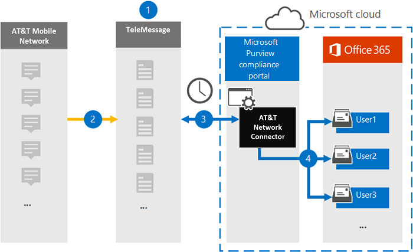

# Set up a connector to archive AT&T SMS/MMS data

Use a TeleMessage connector in the Microsoft 365 compliance center to import and archive SMS and MMS data from AT&T Mobile Network. After you set up and configure a connector, it connects to your organization's AT&T Network once every day, and imports SMS and MMS data to mailboxes in Microsoft 365.

After SMS and MMS messages are stored in user mailboxes, you can apply Microsoft 365 compliance features such as Litigation Hold, Content Search, and Microsoft 365 retention policies to AT&T Network data. For example, you can search AT&T Network data using Content Search or associate the mailbox that contains the AT&T Network connector data with a custodian in an Advanced eDiscovery case. Using a AT&T Network connector to import and archive data in Microsoft 365 can help your organization stay compliant with government and regulatory policies.

## Overview of archiving AT&T Network data

The following overview explains the process of using a connector to archive AT&T Network data in Microsoft 365.

1. Your organization works with TeleMessage to set up an AT&T Network connector. For information, see [AT&T Network Archiver](https://www.telemessage.com/office365-activation-for-atnt-network-archiver/).

2. Once every 24 hours, SMS and MMS messages from your organization’s AT&T Network are copied to the TeleMessage site.

3. The AT&T Network connector that you create in the Microsoft 365 compliance center connects to the TeleMessage site every day and transfers the SMS and MMS messages from the previous 24 hours to a secure Azure Storage location in the Microsoft Cloud. The connector also converts the content of SMS and MMS messages to an email message format.

4. The connector imports the mobile communication items to the mailbox of specific users. A new folder named **AT&T SMS/MMS Network Archiver** is created in the user's mailbox and the items are imported to it. The connector does this mapping by using the value of the *User’s Email address* property. Every SMS and MMS message contains this property, which is populated with the email address of every participant of the message.
 
   In addition to automatic user mapping using the value of the *User’s Email address* property, you can also define a custom mapping by uploading a CSV mapping file. This mapping file contains the mobile phone number and corresponding Microsoft 365 email address for users in your organization. If you enable both automatic user mapping and custom mapping, for every email item the connector first looks at the custom mapping file. If it doesn't find a valid Microsoft 365 user that corresponds to a mobile phone number, the connector uses the values in the email address property of the item it's trying to import. If the connector doesn't find a valid Microsoft 365 user in either the custom mapping file or in the email address property of the email item, the item won't be imported.

## Before you begin

Some of the implementation steps required to archive AT&T Network data are external to Microsoft 365 and must be completed before you can create the connector in the compliance center.

- Order the [mobile archiver service from TeleMessage](https://www.telemessage.com/mobile-archiver/order-mobile-archiver-for-o365/) and get a valid administration account for your organization. You'll need to sign into this account when you create the connector in the compliance center.

- Obtain your AT&T account and billing contact details so you can fill-out the TeleMessage onboarding forms and order the message archiving service from AT&T.

- Register all users that require AT&T SMS/MMS Network archiving in the TeleMessage account. When registering users, be sure to use the same email address that's used for their Microsoft 365 account.

- Your employees must have corporate-owned and corporate-liable mobile phones on the AT&T mobile network. Archiving messages in Microsoft 365 isn't available for employee-owned or "Bring Your Own Devices (BYOD) devices.

- Your organization must consent to allow the Office 365 Import service to access mailbox data in your organization. You will need to provide this consent when you create the connector. To consent to this request, go to [this page](https://login.microsoftonline.com/common/oauth2/authorize?client_id=570d0bec-d001-4c4e-985e-3ab17fdc3073&response_type=code&redirect_uri=https://portal.azure.com/&nonce=1234&prompt=admin_consent), sign in with the credentials of Microsoft 365 global admin, and then accept the request. You have to complete this step before you can successfully create an AT&T Network connector.

- The user who creates a AT&T Network connector must be assigned the Mailbox Import Export role in Exchange Online. This is required to add connectors in the **Data connectors** page in the Microsoft 365 compliance center. By default, this role isn't assigned to any role group in Exchange Online. You can add the Mailbox Import Export role to the Organization Management role group in Exchange Online. Or you can create a role group, assign the Mailbox Import Export role, and then add the appropriate users as members. For more information, see the [Create role groups](https://docs.microsoft.com/Exchange/permissions-exo/role-groups#create-role-groups) or [Modify role groups](https://docs.microsoft.com/Exchange/permissions-exo/role-groups#modify-role-groups) sections in the article "Manage role groups in Exchange Online".

## Create a AT&T Network connector

After you've completed the prerequisites described in the previous section, you can create an AT&T Network connector in the Microsoft 365 compliance center. The connector uses the information you provide to connect to the TeleMessage site and transfer SMS and MMS messages to the corresponding user mailbox boxes in Microsoft 365.

1. Go to [https://compliance.microsoft.com](https://compliance.microsoft.com/) and then click **Data connectors** \ **AT&T Network**.

2. On the **AT&T Network product** description page, click **Add connector**

3. On the **Terms of service** page, click **Accept**.

4. On the **Login to TeleMessage** page, under Step 3, enter the required information in the following boxes and then click **Next**.

   - **Username:** Your TeleMessage username.

   - **Password:** Your TeleMessage password.

5. After the connector is created, you can close the pop-up window and go to the next page.

6. On the **User mapping** page, enable automatic user mapping. To enable custom mapping, upload a CSV file that contains the user mapping information, and then click **Next**.

7. Provide admin consent and then click **Next**.

   To provide admin consent, you must be signed in with the credentials of an Office 365 global admin, and then accept the consent request. If you aren't signed in as a global admin, you can go to [this page](https://login.microsoftonline.com/common/oauth2/authorize?client_id=570d0bec-d001-4c4e-985e-3ab17fdc3073&response_type=code&redirect_uri=https://portal.azure.com/&nonce=1234&prompt=admin_consent) and sign in using global admin credentials to accept the request. 

8. Review your settings, and then click **Finish** to create the connector.

9. Go to the **Connectors** tab on the **Data connectors** page in the compliance center to see the progress of the import process for the new connector.

## Known issues

- At this time, we don't support importing attachments or items that are larger than 10 MB. Support for larger items will be available at a later date.
