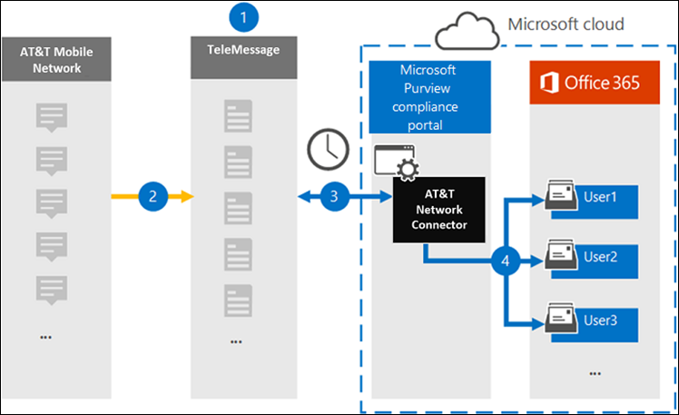

# Set up a connector to archive AT&T SMS/MMS data

Use the TeleMessage connector in the Microsoft 365 compliance center to import and archive SMS and MMS data from AT&T Mobile Network. After you set up and configure a connector, it connects to your organization's AT&T Network once every day, and imports SMS and MMS data to mailboxes in Microsoft 365.

After the SMS and MMS data is stored in user mailboxes, you can apply Microsoft 365 compliance features such as Litigation Hold, Content Search, and Microsoft 365 retention policies to AT&T Network data. For example, you can search AT&T Network data using Content Search or associate the mailbox that contains the AT&T Network connector data with a custodian in an Advanced eDiscovery case. Using a AT&T Network connector to import and archive data in Microsoft 365 can help your organization stay compliant with government and regulatory policies.

## Overview of archiving AT&T Network data

The following overview explains the process of using a connector to archive AT&T Network data in Microsoft 365.

1. Your organization works with TeleMessage to set up a AT&T Network connector. For more details refer to [here](https://www.telemessage.com/office365-activation-for-atnt-network-archiver/).

2.

3. The AT&T Network connector that you create in the Microsoft 365 compliance center connects to the TeleMessage site once every day and transfers the email messages from the previous 24 hours to a secure Azure Storage area in the Microsoft Cloud.

4. The connector imports the mobile communication items to the mailbox of a specific user. A new folder named **AT&T SMS/MMS Network Archiver** is created in the user's mailbox and the items will be imported to it. The connector does mapping by using the value of the *User’s Email address* property. Every email message contains this property, which is populated with the email address of every participant of the email message. In addition to automatic user mapping using the value of the *User’s Email address* property, you can also define a custom mapping by uploading a CSV mapping file. This mapping file should contain User’s mobile Number and the corresponding Microsoft 365 email address for each user. If you enable automatic user mapping and provide a custom mapping, for every email item the connector will first look at custom mapping file. If it doesn't find a valid Microsoft 365 user that corresponds to a user's mobile number, the connector will use user's email address property of the email item. If the connector doesn't find a valid Microsoft 365 user in either the custom mapping file or the *user’s email address* property of the email item, the item won't be imported.

## Before you begin

Many of the implementation steps required to archive AT&T Network data are external to Microsoft 365 and must be completed before you can create the connector in the compliance center.

- Your organization must consent to allow the Office 365 Import service to access mailbox data in your organization. To consent to this request, go to [this page](https://login.microsoftonline.com/common/oauth2/authorize?client_id=570d0bec-d001-4c4e-985e-3ab17fdc3073&response_type=code&redirect_uri=https://portal.azure.com/&nonce=1234&prompt=admin_consent), sign in with the credentials of an Office 365 global admin, and then accept the request. You have to complete this step before you can successfully create the AT&T Network connector in Step 3.

- The user who creates a AT&T Network connector in Step 3 must be assigned the Mailbox Import Export role in Exchange Online. This is required to add connectors in the **Data connectors** page in the Microsoft 365 compliance center. By default, this role isn't assigned to any role group in Exchange Online. You can add the Mailbox Import Export role to the Organization Management role group in Exchange Online. Or you can create a role group, assign the Mailbox Import Export role, and then add the appropriate users as members. For more information, see the [Create role groups](https://docs.microsoft.com/Exchange/permissions-exo/role-groups#create-role-groups) or [Modify role groups](https://docs.microsoft.com/Exchange/permissions-exo/role-groups#modify-role-groups) sections in the article "Manage role groups in Exchange Online".

- You will also need to [order the service from TeleMessage](https://www.telemessage.com/mobile-archiver/order-mobile-archiver-for-o365/) and get a valid company administration account.

- Register all users that require AT&T SMS/MMS Network archiving in the TeleMessage account with the same email as configured in the Microsoft 365 account.

- Your employees must have corporate owned and corporate liable mobile phones on the AT&T mobile network. This product is not available for employee owned BYOD devices (but can be combined with other products for capturing mobile communication from BYOD devices).

- You should know your AT&T account and billing contact details to fill the onboarding forms and order the message archiving service from AT&T.

## Create a AT&T Network connector

After you've completed the prerequisites described in the previous section, you can create an AT&T Network connector in the Microsoft 365 compliance center. The connector uses the information you provide to connect to the TeleMessage site and transfer SMS and MMS messages to the corresponding user mailbox boxes in Microsoft 365.

1. Go to [https://compliance.microsoft.com](https://compliance.microsoft.com/) and then click **Data connectors** \ **AT&T Network**.

2. On the **AT&T Network product** description page, click **Add connector**

3. On the **Terms of service** page, click **Accept**.

4. On the **Login to TeleMessage** page, under Step 3, enter the required information in the following boxes and then click **Next**.

   - **Username :** Your TeleMessage Username

   - **Password:** Your TeleMessage password

5. Once the connector is created, you can close the pop up window and move forward.

6. On the **User mapping** page, enable automatic user mapping and click **Next**. In case you need custom mapping upload a CSV file, and click **Next**.

7. Provide admin consent, by clicking **Next**. Review your settings, and then click **Finish** to create the connector.

8. Go to the Connectors tab in **Data connectors** page to see the progress of the import process for the new connector.

## Known issues

- The connector doesn’t import any attachment larger than 10 MB.
