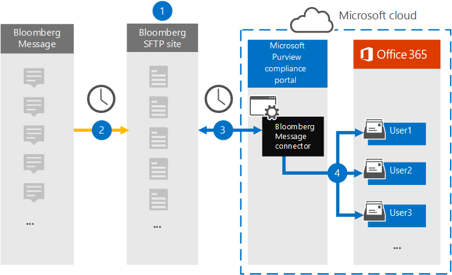

# Set up a connector to archive Bloomberg Message data

Use a data connector in the Microsoft 365 compliance center to import and archive financial services email data from the [Bloomberg Message](https://www.bloomberg.com/professional/product/collaboration/) collaboration tool. After you set up and configure a connector, it connects to your organization's Bloomberg secure FTP (SFTP) site once every day, and imports email items to mailboxes in Microsoft 365.

After Bloomberg Message data is stored in user mailboxes, you can apply Microsoft 365 compliance features such as Litigation hold, content search, In-place archiving, auditing, Communication compliance, and Microsoft 365 retention policies to Bloomberg Message data. For example, you can search Bloomberg Message emails using the content search tool or associate the mailbox that contains the Bloomberg Message data with a custodian in an Advanced eDiscovery case. Using a Bloomberg Message connector to import and archive data in Microsoft 365 can help your organization stay compliant with government and regulatory policies.

## Overview of archiving Bloomberg Message data

The following overview explains the process of using a connector to archive Bloomberg Message data in Microsoft 365.

1. Your organization works with Bloomberg to set up a Bloomberg SFTP site. You'll also work with Bloomberg to configure Bloomberg Message to copy email messages to the Bloomberg SFTP site.

2. Once every 24 hours, email messages from Bloomberg Message are copied to the Bloomberg SFTP site.

3. The Bloomberg Message connector that you create in the Microsoft 365 compliance center connects to the Bloomberg SFTP site every day and transfers the email messages from the previous 24 hours to a secure Azure Storage area in the Microsoft Cloud.

4. The connector imports the email message items to the mailbox of a specific user. A new folder named BloombergMessage is created in the specific user's mailbox and the items will be imported to it. 

   The connector does this by using the value of the CorporateEmailAddress property. Every email message contains this property, which is populated with the email address of every participant of the email message. In addition to automatic user mapping using the value of the *CorporateEmailAddress* property, you can also define a custom mapping by uploading a CSV mapping file. This mapping file contains a Bloomberg UUID and the corresponding Microsoft 365 mailbox address for each user in your organization. If you enable automatic user mapping and provide a custom mapping, for every email item the connector will first look at the custom-mapping file. If it doesn't find a valid Microsoft 365 user that corresponds to a user's Bloomberg UUID, the connector uses the *CorporateEmailAddress* property of the email item. If the connector doesn't find a valid Microsoft 365 user in either the custom-mapping file or the *CorporateEmailAddress* property of the email item, the item won't be imported.

## Before you begin

Some of the implementation steps required to archive Bloomberg Message data are external to Microsoft 365 and must be completed before you can create the connector in the compliance center.

- Your organization must consent to allow the Office 365 Import service to access mailbox data in your organization. To consent to this request, go to [this page](https://login.microsoftonline.com/common/oauth2/authorize?client_id=570d0bec-d001-4c4e-985e-3ab17fdc3073&response_type=code&redirect_uri=https://portal.azure.com/&nonce=1234&prompt=admin_consent), sign in with the credentials of an Office 365 global admin, and then accept the request. You have to complete this step before you can successfully create the Bloomberg Message connector in Step 3.

- Subscribe to [Bloomberg Anywhere](https://www.bloomberg.com/professional/product/remote-access/?bbgsum-page=DG-WS-PROF-PROD-BBA). This is required so that you can log in to Bloomberg Anywhere to access the Bloomberg SFTP site that you have to set up and configure.

- Set up a Bloomberg SFTP (Secure file transfer protocol) site. After working with Bloomberg to set up the SFTP site, data from Bloomberg Message is uploaded to the SFTP site every day. The connector you create in Step 2 connects to this SFTP site and transfers the email data to Microsoft 365 mailboxes. SFTP also encrypts the Bloomberg Message data that is sent to mailboxes during the transfer process.

  For information about Bloomberg SFTP (also called *BB-SFTP*):

  - See the "SFTP Connectivity Standards" document at [Bloomberg Support](https://www.bloomberg.com/professional/support/documentation/).

  - Contact [Bloomberg customer support](https://service.bloomberg.com/portal/sessions/new?utm_source=bloomberg-menu&utm_medium=csc).

   > [!NOTE]
   > If your organization already deployed a connector to archive Instant Bloomberg data, you don't need to set up another SFTP site. You can use the same SFTP site for the Bloomberg Message connector.

- After you work with Bloomberg to set up an SFTP site, Bloomberg will provide some information to you after you respond to the Bloomberg implementation email message. Save a copy of the following information. You use it to set up a connector in Step 3.

  - Firm code, which is an ID for your organization and is used to log in to the Bloomberg SFTP site.

  - Password for your Bloomberg SFTP site

  - URL for Bloomberg SFTP site (for example, sftp.bloomberg.com). In addition, Bloomberg may also provide a corresponding IP address for the Bloomberg SFTP site, which also can be used to set up the connector.

  - Port number for Bloomberg SFTP site

- The user who creates a Bloomberg Message connector in Step 3 (and who downloads the public keys and IP address in Step 1) must be assigned the Mailbox Import Export role in Exchange Online. This is required to add connectors in the **Data connectors** page in the Microsoft 365 compliance center. By default, this role isn't assigned to any role group in Exchange Online. You can add the Mailbox Import Export role to the Organization Management role group in Exchange Online. Or you can create a role group, assign the Mailbox Import Export role, and then add the appropriate users as members. For more information, see the [Create role groups](https://docs.microsoft.com/Exchange/permissions-exo/role-groups#create-role-groups) or [Modify role groups](https://docs.microsoft.com/Exchange/permissions-exo/role-groups#modify-role-groups) sections in the article "Manage role groups in Exchange Online".

## Step 1: Obtain SSH and PGP public keys

The first step is to obtain a copy of the public keys for Secure Shell (SSH) and Pretty Good Privacy (PGP). You use these keys in Step 2 to configure the Bloomberg SFTP site to allow the connector (that you create in Step 3) to connect to the SFTP site and transfer the Bloomberg Message email data to Microsoft 365 mailboxes. You also obtain an IP address in this step, which you use when configuring the Bloomberg SFTP site.

1. Go to [https://compliance.microsoft.com\](https://compliance.microsoft.com) and click **Data connectors** in the left nav.

2. On the **Data connectors** page under **Bloomberg Message**, click **View**.

3. On the **Bloomberg Message** product description page, click **Add connector**

4. On the **Terms of service** page, click **Accept**.

5. On the **Add credentials for Bloomberg SFTP site** under step 1, click the **Download SSH key**, **Download PGP key**, and **Download IP address** links to save a copy of each file to your local computer. These files contain the following items that are used to configure the Bloomberg SFTP site in Step 2:

   - SSH public key: This key is used to configure Secure Shell (SSH) to enable a secure remote login when the connector connects to the Bloomberg SFTP site.

   - PGP public key: This key is used to configure the encryption of data that's transferred from the Bloomberg SFTP site to Microsoft 365.

   - IP address: The Bloomberg SFTP site is configured to accept a connection request only from this IP address, which is used by the Bloomberg Message connector that you create in Step 3.

6. Click **Cancel** to close the wizard. You come back to this wizard in Step 3 to create the connector.

## Step 2: Configure the Bloomberg SFTP site

> [!NOTE]
> As previously stated, if you're organization has previously set up a Bloomberg SFTP site to archive Instant Bloomberg data, you don't have to set up another one. You can specify the same SFTP site when you create the connector in Step 3.

The next step is to use the SSH and PGP public keys and the IP address that you obtained in Step 1 to configure SSH authentication and PGP encryption for the Bloomberg SFTP site. This lets the Bloomberg Message connector that you create in Step 3 connect to the Bloomberg SFTP site and transfer Bloomberg Message data to Microsoft 365. You need to work with Bloomberg customer support to set up your Bloomberg SFTP site. Contact [Bloomberg customer support](https://service.bloomberg.com/portal/sessions/new?utm_source=bloomberg-menu&utm_medium=csc) for assistance.

> [!IMPORTANT]
> Bloomberg recommends that you attach the three files that you downloaded in Step 1 to an email message and send it to their customer support team when working with them to set up your Bloomberg SFTP site.

## Step 3: Create a Bloomberg Message connector

The last step is to create a Bloomberg Message connector in the Microsoft 365 compliance center. The connector uses the information you provide to connect to the Bloomberg SFTP site and transfer email messages to the corresponding user mailbox boxes in Microsoft 365.

1. Go to [https://compliance.microsoft.com](https://compliance.microsoft.com) and click **Data connectors** in the left nav.

2. On the **Data connectors** page under **Bloomberg Message**, click **View**.

3. On the **Bloomberg Message** product description page, click **Add connector**

4. On the **Terms of service** page, click **Accept**.

5. On the **Add credentials for Bloomberg SFTP site** page, under Step 3, enter the required information in the following boxes and then click **Next**.

      - **Firm code:** The ID for your organization that is used as the username for the Bloomberg SFTP site.

      - **Password:** The password for your organization's Bloomberg SFTP site.

      - **SFTP URL:** The URL for the Bloomberg SFTP site (for example, sftp.bloomberg.com).

      - **SFTP port:** The port number for the Bloomberg SFTP site. The connector uses this port to connect to the SFTP site.

6. On the **User-mapping** page, enable automatic user mapping and provide custom user mapping as required

7. Click **Next**, review your settings, and then click prepare to create the connector.

8. Go to the **Data connectors** page to see the progress of the import process for the new connector.

## Known issues

- Threading of Bloomberg Message email imported to Microsoft 365 isn't supported. Individual messages sent to a person are imported, but they aren't presented in a threaded conversation. Microsoft is working to support threading in later versions of the Bloomberg Message data connector.
