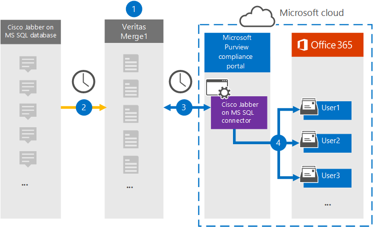

# Set up a connector to archive Cisco Jabber on MS SQL data

Use a Veritas connector in the Microsoft 365 compliance center to import and archive data from the Cisco Jabber platform to user mailboxes in your Microsoft 365 organization. Veritas provides you with a [Cisco Jabber](https://globanet.com/jabber/) connector that is configured to capture items from the Jabber's MS SQL Database, such as 1:1 chat messages and group chats and then import those items to Microsoft 365. The connector retrieves data from the Cisco Jabber's MS SQL Database, processes it, and the converts the content from a user's Cisco Jabber account to an email message format and then imports those items to the user's mailbox in Microsoft 365.

After Cisco Jabber data is stored in user mailboxes, you can apply Microsoft 365 compliance features such as Litigation Hold, eDiscovery, retention policies and retention labels, and communication compliance. Using a Cisco Jabber connector to import and archive data in Microsoft 365 can help your organization stay compliant with government and regulatory policies.

## Overview of archiving Cisco Jabber data

The following overview explains the process of using a connector to archive Cisco Jabber on MS SQL data in Microsoft 365.

1. Your organization works with Cisco to set up and configure a Cisco Jabber on MS SQL Database.

2. Once every 24 hours, Cisco Jabber items are copied from the MS SQL Database to the Veritas Merge1 site. The connector also converts the content of chat messages to an email message format.

3. The Cisco Jabber connector that you create in the Microsoft 365 compliance center connects to the Veritas Merge1 site every day and transfers the items to a secure Azure Storage location in the Microsoft cloud.

4. The automatic user mapping as connector imports items to the mailboxes of specific users by using the value of the *Email* property of the described in [Step 3](#step-3-map-users-and-complete-the-connector-setup). A subfolder in the Inbox folder named **Cisco Jabber on MS SQL** is created in the user mailboxes, and the message items are imported to that folder. The connector determines which mailbox to import items to by using the value of the *Email* property. Every Cisco Jabber item contains this property, which is populated with the email address of every participant.

## Before you begin

- Create a Veritas Merge1 account for Microsoft connectors. To create this account, contact [Veritas Customer Support](https://www.veritas.com/content/support/). You will sign into this account when you create the connector in Step 1.

- Set up an MS SQL Database to retrieve Jabber items from before creating the connector in Step 1. You will specify the connection settings for the MS SQL Database when configuring the Cisco Jabber connector in Step 2. For more information, see the [Merge1 Third-Party Connectors User Guide](https://docs.ms.merge1.globanetportal.com/Merge1%20Third-Party%20Connectors%20Cisco%20Jabber%20on%20MS%20SQL%20User%20Guide%20.pdf).

- The user who creates the Cisco Jabber connector in Step 1 (and completes it in Step 3) must be assigned to the Mailbox Import Export role in Exchange Online. This role is required to add connectors on the **Data connectors** page in the Microsoft 365 compliance center. By default, this role is not assigned to a role group in Exchange Online. You can add the Mailbox Import Export role to the Organization Management role group in Exchange Online. Or you can create a role group, assign the Mailbox Import Export role, and then add the appropriate users as members. For more information, see the [Create role groups](/Exchange/permissions-exo/role-groups#create-role-groups) or [Modify role groups](/Exchange/permissions-exo/role-groups#modify-role-groups) sections in the article "Manage role groups in Exchange Online".

## Step 1: Set up the Cisco Jabber on MS SQL connector

The first step is to access to the **Data Connectors** in the Microsoft 365 compliance center and create a connector for Cisco Jabber on MS SQL data.

1. Go to [https://compliance.microsoft.com](https://compliance.microsoft.com/)and then click **Data connectors** > **Cisco Jabber on MS SQL**.

2. On the **Cisco Jabber on MS SQL** product description page, click **Add connector**.

3. On the **Terms of service** page, click **Accept**.

4. Enter a unique name that identifies the connector and then click **Next**.

5. Sign in to your Merge1 account to configure the connector.

## Step 2: Configure the Cisco Jabber on MS SQL connector on the Veritas Merge1 site

The second step is to configure the Cisco Jabber on MS SQL connector on the Veritas Merge1 site. For information about how to configure the Cisco Jabber on MS SQL connector, see [Merge1 Third-Party Connectors User Guide](https://docs.ms.merge1.globanetportal.com/Merge1%20Third-Party%20Connectors%20Cisco%20Jabber%20on%20MS%20SQL%20User%20Guide%20.pdf).

After you click **Save & Finish**, the **User mapping** page in the connector wizard in the Microsoft 365 compliance center is displayed.

## Step 3: Map users and complete the connector setup

To map users and complete the connector set up in the Microsoft 365 compliance center, follow these steps:

1. On the **Map Cisco Jabber on MS SQL users to Microsoft 365 users** page, enable automatic user mapping. The Cisco Jabber on MS SQL items include a property called *Email*, which contains email addresses for users in your organization. If the connector can associate this address with a Microsoft 365 user, the items are imported to that user’s mailbox.

2. Click **Next**, review your settings, and go to the **Data connectors** page to see the progress of the import process for the new connector.

## Step 4: Monitor the Cisco Jabber connector

After you create the Cisco Jabber on MS SQL connector, you can view the connector status in the Microsoft 365 compliance center.

1. Go to [https://compliance.microsoft.com](https://compliance.microsoft.com) and click **Data connectors** in the left nav.

2. Click the **Connectors** tab and then select the **Cisco Jabber on MS SQL** connector to display the flyout page. This page contains the properties and information about the connector.

3. Under **Connector status with source**, click the **Download log** link to open (or save) the status log for the connector. This log contains data that has been imported to the Microsoft cloud.

## Known issues

- At this time, we don't support importing attachments or items that are larger than 10 MB. Support for larger items will be available at a later date.
