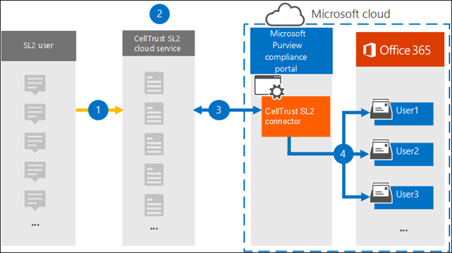

# Archive data from CellTrust SL2 to Microsoft 365

CellTrust SL2 captures mobile communications data and integrates with the leading archiving technologies to meet the electronic discovery requirements for regulations such as FINRA, HIPAA, FOIA, and TCPA. The SL2 Data Connector imports mobile communication items to Microsoft 365. This article describes the process for integrating SL2 with Microsoft 365 by using the CellTrust SL2 Data Connector for archiving. Completing this process assumes that you have subscribed to CellTrust SL2 service and are familiar with the SL2 architecture. For information about CellTrust SL2, see <https://www.celltrust.com>.

After data is imported to user mailboxes in Microsoft 365, you can apply Microsoft Purview features such as Litigation Hold, eDiscovery, Microsoft 365 retention policies, and communication compliance. Using the CellTrust SL2 Data Connector to import and archive data in Microsoft 365 can help your organization stay compliant with government and regulatory policies.

[!INCLUDE [purview-preview](../includes/purview-preview.md)]

## Overview of archiving with the CellTrust SL2 Data Connector

CellTrust's SL2 platform captures communication data from multiple sources. SL2 data sources are either Person-to-Person (P2P) or Application-to-Person (A2P). The process described in this article pertains only to P2P data sources. For all P2P data sources, at least one party in the collaboration is an SL2 user who is subscribed to the SL2 service. The following overview explains the process of using the CellTrust SL2 Data Connector in Microsoft 365.

1. SL2 users send and receive data to and from SL2 services in Microsoft Azure.

2. Your organization has an SL2 domain in CellTrust's SL2 Cloud Service environment. Your domain may have one or more organizational units (OUs). The SL2 Cloud Service transfers your data to a highly secure area in the Microsoft Azure platform, so that your data never leaves the Microsoft Azure environment. Depending on your SL2 plan (Enterprise, SMB, or Government), your domain is either hosted on Microsoft Azure Global or Microsoft Azure Government.

3. After you create the CellTrust SL2 Data Connector, your domain and OUs (regardless of your SL2 plan), begin sending data to Microsoft 365. The data feed is structured to support reporting based on data sources, OUs, or the domain by itself. As a result, your organization needs only one connector to feed all your data sources to Microsoft 365.

4. The connector creates a folder under each mapped user with an appropriate Office 365 license titled **CellTrust SL2**. This mapping connects a CellTrust SL2 user to an Office 365 mailbox by using an email address. If a user ID in CellTrust SL2 has no match in Office 365, the user's data will not be archived.

## Before you set up a connector

- Verify that you have a domain in the CellTrust SL2 cloud service environment. For additional information on obtaining a production or trial SL2 domain, [Contact CellTrust](https://www.celltrust.com/contact-us/#form).

- Obtain the credentials to access the administrator account for your SL2 domain.

- The user who creates the CellTrust SL2 data connector in Step 1 (and completes it in Step 3) must be assigned the Data Connector Admin role. This role is required to add connectors on the **Data connectors** page in the Microsoft Purview compliance portal. This role is added by default to multiple role groups. For a list of these role groups, see the "Roles in the Defender and compliance portals" section in [Roles and role groups in the Microsoft 365 Defender and Microsoft Purview compliance portals](../security/office-365-security/permissions-in-the-security-and-compliance-center.md#roles-in-the-defender-and-compliance-portals). Alternatively, an admin in your organization can create a custom role group, assign the Data Connector Admin role, and then add the appropriate users as members. For instructions, see the "Create a custom role group" section in [Permissions in the Microsoft Purview compliance portal](microsoft-365-compliance-center-permissions.md#create-a-custom-role-group).

- This CellTrust data connector is available in GCC environments in the Microsoft 365 US Government cloud. Third-party applications and services might involve storing, transmitting, and processing your organization's customer data on third-party systems that are outside of the Microsoft 365 infrastructure and therefore aren't covered by the Microsoft Purview and data protection commitments. Microsoft makes no representation that use of this product to connect to third-party applications implies that those third-party applications are FEDRAMP compliant.

## Step 1: Create a CellTrust SL2 connector

The first step is to create a data connector in the compliance portal.

1. Go to <https://compliance.microsoft.com> and select **Data connectors** on the left navigation pane.

2. On the **Overview** tab, select **Filter** and select **By CellTrust**, and then apply the filter.

   

3. Select **CellTrust SL2 (preview)**.

4. On the **CellTrust SL2 (preview)** product description page, select **Add connector**.

5. On the **Terms of service** page, select **Accept**.

6. Enter a unique name that identifies the connector and then select **Next**. The name you enter will identify the connector on the **Data connectors** page after you create it.

7. On the **Sign in to your CellTrust account** page, select **Sign into CellTrust**. You'll be redirected to the **CellTrust Portal for Microsoft 365** in a new browser window.

## Step 2: Select the domains or OUs to archive

The next step is to sign into an administrator account for your CellTrust SL2 domain and select the domains and OUs to archive in Microsoft 365.

1. On the CellTrust **Microsoft 365 Connector** page, select your environment in the SL2 cloud service to display a sign-in page.

   Typically, you should see one option representing your environment. However, if you have domains in more than one environment, you will see options for each environment. After you make a selection, you'll be redirected to the SL2 login page.

2. Sign in with your Domain or OU Administrator account credentials.

   If you sign in as an SL2 domain administrator, you will see the name of your domain and the OUs in that domain. If you do not have OUs, you only see the name of your domain. If you log in as OU Administrator, you only see the name of your OU.

3. Enable the business units you wish to archive. Selecting the domain will not automatically select the OUs. You must enable each OU separately to archive it.

   

4. When you're finished with your selections, close the browser window and return to the wizard page in compliance portal. After a few seconds, the wizard automatically advances to the next step of mapping users.

## Step 3: Map users and complete the connector setup

The last step is to map users and complete the connector setup in the compliance portal.

1. On the **User mapping** page, select **Enable automatic user mapping** if the email address for users is the same in both SL2 and  Microsoft 365. Otherwise, you should manually user email addresses by uploading a CSV file that maps users' SL2 address to their Microsoft 365 address.

2. Select **Next**, review your settings, and then select **Finish** to create the connector.

   The new connector is added to the list on the **Data connectors** page.

## Get help from CellTrust

See the [CellTrust Customer Support page](https://www.celltrust.com/contact-us/#support) for details about contacting CellTrust for help with setting up a CellTrust SL2 data connector.

## More information

- A domain administrator can set up a connector for the domain or any OUs in that domain. If you use the OU Administrator account, you can only set up a connector for that specific OU.

- To successfully complete the steps above, you must be assigned a Microsoft 365 E5 license and have the proper Microsoft Office admin rights.

- To test the new connector, send a text message using your SL2 mobile app or from your SL2 portal. Go to your Microsoft 365 mailbox and open the **CellTrust SL2** folder in your Inbox. It may take a few minutes for the text messages to show up in your mailbox.

- Many laws and regulations require electronic communication to be preserved in such a way that, when requested, it can be produced as evidence. Electronic Discovery (eDiscovery) is used to comply with the production of electronic communication. Enterprise Information Archiving (EIA) solutions are designed to perform eDiscovery, and provide features such as retention policy management, data classification, and content supervision. Microsoft 365 offers a long-term retention solution for compliance with the regulations and standards that affect your organization.

- The term *archiving* as used in this document refers to archiving in the context of use within an Enterprise Information Archiving (EIA) solution. EIA solutions have eDiscovery features that produce documents for legal proceedings, litigation, audits, and investigations. Archiving in the context of backup and restore used for disaster recovery and business continuity isn't the intended use of the term within this document.
