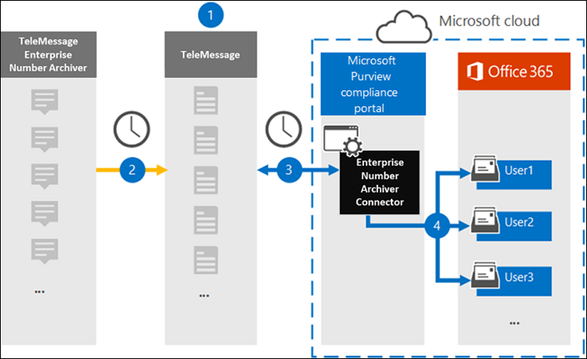

# Set up a connector to archive Enterprise Number data

Use a TeleMessage connector in the Microsoft 365 compliance center to import and archive Short Messaging Service (SMS) and Multimedia Messaging Service (MMS) messages, chat messages, voice call recordings, and voice call logs from the Enterprise Number Archiver. After you set up and configure a connector, it connects to your organization's TeleMessage account once every day and imports the mobile communication data of employees using the TeleMessage Enterprise Number Archiver to mailboxes in Microsoft 365.

After the TeleMessage Enterprise Number Archiver connector data is stored in user mailboxes, you can apply Microsoft 365 compliance features such as Litigation Hold, Content Search, In-Place Archiving, Auditing, Communication compliance, and Microsoft 365 retention policies to Enterprise Number Archiver data. For example, you can search the TeleMessage Enterprise Number Archiver SMS, MMS, and Voice Call using Content Search or associate the mailbox that contains the Enterprise Number Archiver connector data with a custodian in an Advanced eDiscovery case. Using an Enterprise Number Archiver connector to import and archive data in Microsoft 365 can help your organization stay compliant with government and regulatory policies.

## Overview of archiving Enterprise Number data

The following overview explains the process of using a connector to archive Enterprise Network data in Microsoft 365.

1. Your organization works with TeleMessage to set up an Enterprise Number Archiver connector. For more details refer to [here](https://www.telemessage.com/office365-activation-for-enterprise-number-archiver/).

2. The Enterprise Number Archiver connector that you create in the Microsoft 365 compliance center connects to the TeleMessage site every day and transfers the email messages from the previous 24 hours to a secure Azure Storage area in the Microsoft Cloud.

3. The connector imports the mobile communication items to the mailbox of a specific user. A new folder named Enterprise Number Archiver is created in the specific user's mailbox and the items are imported to it. The connector does mapping by using the value of the *User’s Email address* property. Every email message contains this property, which is populated with the email address of every participant of the email message. In addition to automatic user mapping using the value of the *User’s Email address* property, you can also define a custom mapping by uploading a CSV mapping file. This mapping file should contain User’s mobile Number and the corresponding Microsoft 365 mailbox address for each user. If you enable automatic user mapping and provide a custom mapping, for every email item the connector will first look at custom mapping file. If it doesn't find a valid Microsoft 365 user that corresponds to a user's mobile number, the connector will use the User ‘s email address property of the email item. If the connector doesn't find a valid Microsoft 365 user in either the custom mapping file or the *user’s email address* property of the email item, the item won't be imported.

## Before you set up a connector

Some of the implementation steps required to archive Enterprise Number Archiver data are external to Microsoft 365 and must be completed before you can create the connector in the compliance center.

- Order the [Enterprise Number Archiver service from TeleMessage](https://www.telemessage.com/mobile-archiver/order-mobile-archiver-for-o365) and get a valid administration account for your organization. You'll need to sign into this account when you create the connector in the compliance center.

- Register all users that require Enterprise Number SMS/MMS Network archiving in the TeleMessage account. When registering users, be sure to use the same email address that's used for their Microsoft 365 account.

- Install and activate the TeleMessage Enterprise Number Archiver app on the mobile phones of your employees.

- The user who creates a Enterprise Number Archiver connector must be assigned the Mailbox Import Export role in Exchange Online. This is required to add connectors in the **Data connectors** page in the Microsoft 365 compliance center. By default, this role isn't assigned to any role group in Exchange Online. You can add the Mailbox Import Export role to the Organization Management role group in Exchange Online. Or you can create a role group, assign the Mailbox Import Export role, and then add the appropriate users as members. For more information, see the [Create role groups](/Exchange/permissions-exo/role-groups#create-role-groups) or [Modify role groups](/Exchange/permissions-exo/role-groups#modify-role-groups) sections in the article "Manage role groups in Exchange Online".

- This data connector is available in GCC environments in the Microsoft 365 US Government cloud. Third-party applications and services might involve storing, transmitting, and processing your organization's customer data on third-party systems that are outside of the Microsoft 365 infrastructure and therefore are not covered by the Microsoft 365 compliance and data protection commitments. Microsoft makes no representation that use of this product to connect to third-party applications implies that those third-party applications are FEDRAMP compliant.

## Create an Enterprise Number Archiver connector

After you've completed the prerequisites described in the previous section, you can create an Enterprise Number Archiver connector in the Microsoft 365 compliance center. The connector uses the information you provide to connect to the TeleMessage site and transfer SMS, MMS, and voice call messages to the corresponding user mailbox boxes in Microsoft 365.

1. Go to [https://compliance.microsoft.com](https://compliance.microsoft.com/) and then click **Data connectors** \> **Enterprise Number Archiver**.

2. On the **Enterprise Number Archiver** product description page, click **Add connector**

3. On the **Terms of service** page, click **Accept**.

4. On the **Login to TeleMessage** page, under Step 3, enter the required information in the following boxes and then click **Next**.

   - **Username:** Your TeleMessage username.

   - **Password:** Your TeleMessage password.

5. After the connector is created, you can close the pop-up window and go to the next page.

6. On the **User mapping** page, enable automatic user mapping. To enable custom mapping, upload a CSV file that contains the user mapping information, and then click **Next**.

7. Review your settings, and then click **Finish** to create the connector.

8. Go to the Connectors tab in **Data connectors** page to see the progress of the import process for the new connector.

## Known issues

- At this time, we don't support importing attachments or items that are larger than 10 MB. Support for larger items will be available at a later date.