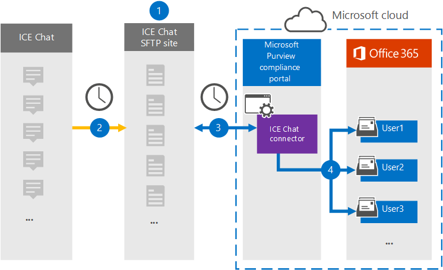
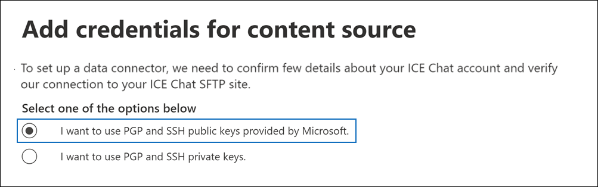
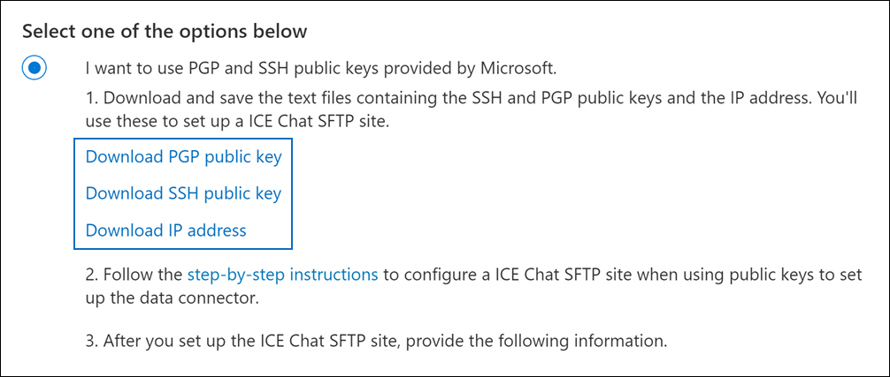
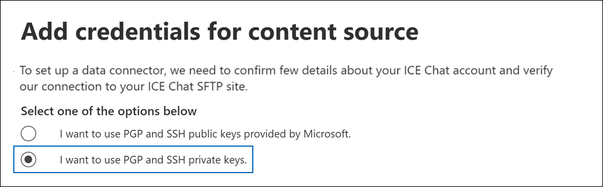
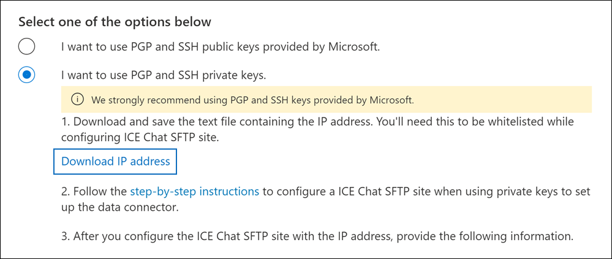

# Set up a connector to archive ICE Chat data

Use a native connector in the Microsoft Purview compliance portal to import and archive financial services chat data from the ICE Chat collaboration tool. After you set up and configure a connector, it connects to your organization's ICE Chat secure FTP (SFTP) site once every day, converts the content of chat messages to an email message format, and then import those items to mailboxes in Microsoft 365.

After ICE chat data is stored in user mailboxes, you can apply Microsoft Purview features such as litigation hold, eDiscovery, archiving, auditing, communication compliance, and Microsoft 365 retention policies to ICE Chat data. For example, you can search ICE Chat messages using content search or associate the mailbox that contains the ICE Chat data with a custodian in an eDiscovery (Premium) case. Using an ICE Chat connector to import and archive data in Microsoft 365 can help your organization stay compliant with government and regulatory policies.

[!INCLUDE [purview-preview](../includes/purview-preview.md)]

## Overview of archiving ICE Chat data

The following overview explains the process of using a connector to archive ICE chat data in Microsoft 365.

1. Your organization works with ICE Chat to set up an ICE Chat SFTP site. You'll also work with ICE Chat to configure ICE Chat to copy chat messages to your ICE Chat SFTP site.

2. Once every 24 hours, chat messages from ICE Chat are copied to your ICE Chat SFTP site.

3. The ICE Chat connector that you create in the compliance portal connects to the ICE Chat SFTP site every day and transfers the chat messages from the previous 24 hours to a secure Azure Storage location in the Microsoft cloud. The connector also converts the content of a chat massage to an email message format.

4. The connector imports chat message items to the mailboxes of specific users. A new folder named **ICE Chat** is created in the user mailboxes and the chat message items are imported to that folder. The connector does by using the value of the *SenderEmail* and *RecipientEmail* properties. Every chat message contains these properties, which are populated with email address of the sender and every recipient/participant of the chat message.

   In addition to automatic user mapping that uses the values of the *SenderEmail* and *RecipientEmail* property (which means that the connector imports a chat message to the sender's mailbox and the mailboxes of every recipient), you can also define custom user mapping by uploading a CSV mapping file. This mapping file contains the ICE Chat *ImId* and the corresponding Microsoft 365 mailbox address for every user in your organization. If you enable automatic user mapping and provide a custom-mapping file, for every chat item the connector will first look at the custom-mapping file. If it doesn't find a valid Microsoft 365 user account that corresponds to a user's ICE Chat ImId, the connector will use the *SenderEmail* and *RecipientEmail* properties of the chat item to import the item to the mailboxes of the chat participants. If the connector doesn't find a valid Microsoft 365 user in either the custom-mapping file or the *SenderEmail* and *RecipientEmail* properties, the item won't be imported.

## Before you set up a connector

Some of the implementation steps required to archive ICE Chat data are external to Microsoft 365 and must be completed before you can create the connector in the compliance center.

- ICE Chat charges their customers a fee for external compliance. Your organization should contact the ICE Chat sales group to discuss, and to sign the ICE Chat data services agreement, which you can obtain at [https://www.theice.com/publicdocs/agreements/ICE\_Data\_Services\_Agreement.pdf](https://www.theice.com/publicdocs/agreements/ICE\_Data\_Services\_Agreement.pdf). This agreement is between ICE Chat and your organization and does not involve Microsoft. After you set up an ICE Chat SFTP site in Step 2, ICE Chat provides the FTP credentials directly to your organization. Then you who would provide those credentials to Microsoft when setting up the connector in Step 3.

- You must set up an ICE Chat SFTP site before creating the connector in Step 3. After working with ICE Chat to set up the SFTP site, data from ICE Chat is uploaded to the SFTP site every day. The connector you create in Step 3 connects to this SFTP site and transfers the chat data to Microsoft 365 mailboxes. SFTP also encrypts the ICE Chat data that's sent to mailboxes during the transfer process.

- To set up an ICE Chat connector, you have to use keys and key passphrases for Pretty Good Privacy (PGP) and Secure Shell (SSH). These keys are used to configure the ICE Chat SFTP site and used by the connector to connect to the ICE Chat SFTP site to import data to Microsoft 365. The PGP key is used to configure the encryption of data that's transferred from the ICE Chat SFTP site to Microsoft 365. The SSH key is used to configure secure shell to enable a secure remote login when the connector connects to the ICE Chat SFTP site.

  When setting up a connector, you have the option to use public keys and key passphrases provided by Microsoft or you can use your own private keys and passphrases. We recommend that you use the public keys provided by Microsoft. However, if your organization has already configured an ICE Chat SFTP site using private keys, then you can create a connector using these same private keys.

- The ICE Chat connector can import a total of 200,000 items in a single day. If there are more than 200,000 items on the SFTP site, none of those items will be imported to Microsoft 365.

- The admin who creates the ICE Chat connector in Step 3 (and who downloads the public keys and IP address in Step 1) must be assigned the Data Connector Admin role. This role is required to add connectors on the **Data connectors** page in the compliance portal. This role is added by default to multiple role groups. For a list of these role groups, see the "Roles in the security and compliance centers" section in [Permissions in the Security & Compliance Center](../security/office-365-security/permissions-in-the-security-and-compliance-center.md#roles-in-the-defender-and-compliance-portals). Alternatively, an admin in your organization can create a custom role group, assign the Data Connector Admin role, and then add the appropriate users as members. For instructions, see the "Create a custom role group" section in [Permissions in the Microsoft Purview compliance portal](microsoft-365-compliance-center-permissions.md#create-a-custom-role-group).

## Set up a connector using public keys

The steps in this section show you how to set up an ICE Chat connector using the public keys for Pretty Good Privacy (PGP) and Secure Shell (SSH).

### Step 1: Obtain PGP and SSH public keys

The first step is to obtain a copy of the public keys for Pretty Good Privacy (PGP) and Secure Shell (SSH). You use these keys in Step 2 to configure the ICE Chat SFTP site to allow the connector (that you create in Step 3) to connect to the SFTP site and transfer the ICE Chat data to Microsoft 365 mailboxes. You will also obtain an IP address in this step, which you use when configuring the ICE Chat SFTP site.

1. Go to [https://compliance.microsoft.com](https://compliance.microsoft.com) and select **Data connectors** in the left nav.

2. On the **Data connectors** page under **ICE Chat**, select **View**.

3. On the **ICE Chat** page, select **Add connector**.

4. On the **Terms of service** page, select **Accept**.

5. On the **Add credentials for content source** page, select **I want to use PGP and SSH public keys provided by Microsoft**.

   

6. Under step 1, select the **Download SSH key**, **Download PGP key**, and **Download IP address** links to save a copy of each file to your local computer.

   

   These files contain the following items that are used to configure the ICE Chat SFTP site in Step 2:

   - PGP public key: This key is used to configure the encryption of data that's transferred from the ICE Chat SFTP site to Microsoft 365.

   - SSH public key: This key is used to configure Secure SSH to enable a secure remote login when the connector connects to the ICE Chat SFTP site.

   - IP address: The ICE Chat SFTP site is configured to accept a connection request only from this IP address, which is used by the ICE Chat connector that you create in Step 3.

7. Select **Cancel** to close the wizard. You come back to this wizard in Step 3 to create the connector.

### Step 2: Configure the ICE Chat SFTP site

The next step is to use the PGP and SSH public keys and the IP address that you obtained in Step 1 to configure PGP encryption and SSH authentication for the ICE Chat SFTP site. This lets the ICE Chat connector that you create in Step 3 connect to the ICE Chat SFTP site and transfer ICE Chat data to Microsoft 365. You need to work with ICE Chat customer support to set up your ICE Chat SFTP site.

### Step 3: Create an ICE Chat connector

The last step is to create an ICE Chat connector in the compliance portal. The connector uses the information you provide to connect to the ICE Chat SFTP site and transfer chat messages to the corresponding user mailbox boxes in Microsoft 365.

1. Go to [https://compliance.microsoft.com](https://compliance.microsoft.com) and select **Data connectors** in the left nav.

2. On the **Data connectors** page under **ICE Chat**, select **View**.

3. On the **ICE Chat** page, select **Add connector**.

4. On the **Terms of service** page, select **Accept**.

5. On the **Add credentials for content source** page, select **I want to use PGP and SSH public keys**.

6. Under Step 3, enter the required information in the following boxes and then select **Validate connection**.

   - **Firm code:** The ID for your organization, which is used as the username for the ICE Chat SFTP site.

   - **Password:** The password for your ICE Chat SFTP site.

   - **SFTP URL:** The URL for the ICE Chat SFTP site (for example, `sftp.theice.com`). You can also use an IP address for this value.

   - **SFTP port:** The port number for the ICE Chat SFTP site. The connector uses this port to connect to the SFTP site.

7. After the connection is successfully validated, select **Next**.

8. On the **Define user** page, specify the users to import data for.

     - **All users in your organization**. Select this option to import data for all users.

     - **Only users on Litigation hold**. Select this option to import data only for users whose mailboxes are placed on Litigation hold. This option imports data to user mailboxes that have the LitigationHoldEnabled property set to True. For more information, see [Create a Litigation hold](create-a-litigation-hold.md).

9. On the **Map external users to Microsoft 365 users** page, enable automatic user mapping and provide custom user mapping as required. You can download a copy of the user-mapping CSV file on this page. You can add the user mappings to the file and then upload it.

   > [!NOTE]
   > As previously explained, custom mapping file CSV file contains the ICE Chat imid and corresponding Microsoft 365 mailbox address for each user. If you enable automatic user mapping and provide a custom mapping, for every chat item, the connector will first look at custom mapping file. If it doesn't find a valid Microsoft 365 user that corresponds to a user's ICE Chat imid, the connector will import the item to the mailboxes for the users specified in the *SenderEmail* and *RecipientEmail* properties of the chat item. If the connector doesn't find a valid Microsoft 365 user by either automatic or custom user mapping, the item won't be imported.

10. Select **Next**, review your settings, and then select **Finish** to create the connector.

11. Go to the **Data connectors** page to see the progress of the import process for the new connector.

## Set up a connector using private keys

The steps in this section show you how to set up an ICE Chat connector using PGP and SSH private keys. This connector setup option is intended for organizations that have already configured an ICE Chat SFTP site using private keys.

### Step 1: Obtain an IP address to configure the ICE Chat SFTP site

If your organization has used PGP and SSH private keys to set up an ICE Chat SFTP site, then you have to obtain an IP address and provide it to ICE Chat customer support. The ICE Chat SFTP site must be configured to accept  connection requests from this IP address. The same IP address is used by the ICE Chat connector to connect to the SFTP site and transfer ICE Chat data to Microsoft 365.

To obtain the IP address:

1. Go to <https://compliance.microsoft.com> and select **Data connectors** in the left nav.

2. On the **Data connectors** page under **ICE Chat**, select **View**.

3. On the **ICE Chat** product description page, select **Add connector**

4. On the **Terms of service** page, select **Accept**.

5. On the **Add credentials for content source** page, select **I want to use PGP and SSH private keys**.

   

6. Under step 1, select **Download IP address** to save a copy of the IP address file to your local computer.

   

7. Select **Cancel** to close the wizard. You come back to this wizard in Step 2 to create the connector.

You need to work with ICE Chat customer support to configure your ICE Chat SFTP site to accept connection requests from this IP address.

### Step 2: Create an ICE Chat connector

After your ICE Chat SFTP site is configured, the next step is to create an ICE Chat connector in the compliance portal. The connector uses the information you provide to connect to the ICE Chat SFTP site and transfer email messages to the corresponding user mailbox boxes in Microsoft 365. To complete this step, be sure to have copies of the same private keys and key passphrases that you used to set up your ICE Chat SFTP site.

1. Go to <https://compliance.microsoft.com> and select **Data connectors** in the left nav.

2. On the **Data connectors** page under **ICE Chat**, select **View**.

3. On the **ICE Chat** product description page, select **Add connector**

4. On the **Terms of service** page, select **Accept**.

5. On the **Add credentials for content source** page, select **I want to use PGP and SSH private keys**.

6. Under Step 3, enter the required information in the following boxes and then select **Validate connection**.

      - **Name:** The name for the connector. It must be unique in your organization.

      - **Firm code:** The ID for your organization that is used as the username for the ICE Chat SFTP site.

      - **Password:** The password for your organization's ICE Chat SFTP site.

      - **SFTP URL:** The URL for the ICE Chat SFTP site (for example, `sftp.theice.com`). You can also use an IP address for this value.

      - **SFTP port:** The port number for the ICE Chat SFTP site. The connector uses this port to connect to the SFTP site.

      - **PGP private key:** The PGP private key for the ICE Chat SFTP site. Be sure to include the entire private key value, including the beginning and ending lines of the key block.

      - **PGP key passphrase:** The passphrase for the PGP private key.

      - **SSH private key:** The SSH private key for the ICE Chat SFTP site. Be sure to include the entire private key value, including the beginning and ending lines of the key block.

      - **SSH key passphrase:** The passphrase for the SSH private key.

7. After the connection is successfully validated, select **Next**.

8. On the **Define user** page, specify the users to import data for.

     - **All users in your organization**. Select this option to import data for all users.

     - **Only users on Litigation hold**. Select this option to import data only for users whose mailboxes are placed on Litigation hold. This option imports data to user mailboxes that have the LitigationHoldEnabled property set to True. For more information, see [Create a Litigation hold](create-a-litigation-hold.md).

9. On the **Map ICE Chat users to Microsoft 365 users** page, enable automatic user mapping and provide custom user mapping as required.

   > [!NOTE]
   > As previously explained, custom mapping file CSV file contains the ICE Chat imid and corresponding Microsoft 365 mailbox address for each user. If you enable automatic user mapping and provide a custom mapping, for every chat item, the connector will first look at custom mapping file. If it doesn't find a valid Microsoft 365 user that corresponds to a user's ICE Chat imid, the connector will import the item to the mailboxes for the users specified in the *SenderEmail* and *RecipientEmail* properties of the chat item. If the connector doesn't find a valid Microsoft 365 user by either automatic or custom user mapping, the item won't be imported.

10. Select **Next**, review your settings, and then select **Finish** to create the connector.

11. Go to the **Data connectors** page to see the progress of the import process for the new connector. Select the connector to display the flyout page, which contains information about the connector.
