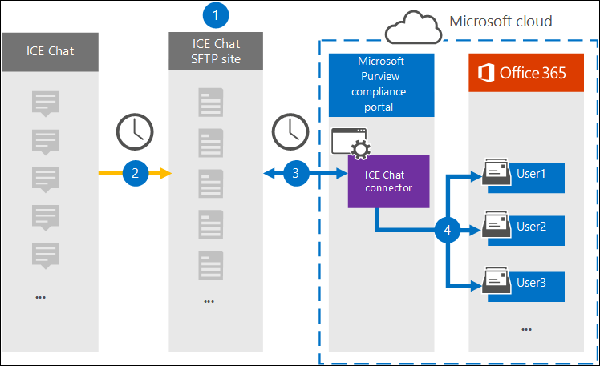

# Set up a connector to archive ICE Chat data

Use a native connector in the Microsoft 365 compliance center to import and archive financial services chat data from the ICE Chat collaboration tool. After you set up and configure a connector, it connects to your organization's ICE Chat secure FTP (SFTP) site once every day, converts the content of chat messages to an email message format, and then import those items to mailboxes in Microsoft 365.

After ICE chat data is stored in user mailboxes, you can apply Microsoft 365 compliance features such as litigation hold, eDiscovery, archiving, auditing, communication compliance, and Microsoft 365 retention policies to ICE Chat data. For example, you can search ICE Chat messages using content search or associate the mailbox that contains the ICE Chat data with a custodian in an Advanced eDiscovery case. Using an ICE Chat connector to import and archive data in Microsoft 365 can help your organization stay compliant with government and regulatory policies.

## Overview of archiving ICE Chat data

The following overview explains the process of using a connector to archive ICE chat data in Microsoft 365.

1. Your organization works with ICE Chat to set up an ICE Chat SFTP site. You'll also work with ICE Chat to configure ICE Chat to copy chat messages to your ICE Chat SFTP site.

2. Once every 24 hours, chat messages from ICE Chat are copied to your ICE Chat SFTP site.

3. The ICE Chat connector that you create in the Microsoft 365 compliance center connects to the ICE Chat SFTP site every day and transfers the chat messages from the previous 24 hours to a secure Azure Storage location in the Microsoft Cloud. The connector also converts the content of a chat massage to an email message format.

4. The connector imports chat message items to the mailboxes of specific users. A new folder named **ICE Chat** is created in the user mailboxes and the chat message items are imported to that folder. The connector does by using the value of the *SenderEmail* and *RecipientEmail* properties. Every chat message contains these properties, which are populated with email address of the sender and every recipient/participant of the chat message.

   In addition to automatic user mapping that uses the values of the *SenderEmail* and *RecipientEmail* property (which means that the connector imports a chat message to the sender's mailbox and the mailboxes of every recipient), you can also define custom user mapping by uploading a CSV mapping file. This mapping file contains the ICE Chat *ImId* and the corresponding Microsoft 365 mailbox address for every user in your organization. If you enable automatic user mapping and provide a custom-mapping file, for every chat item the connector will first look at the custom-mapping file. If it doesn't find a valid Microsoft 365 user account that corresponds to a user's ICE Chat ImId, the connector will use the *SenderEmail* and *RecipientEmail* properties of the chat item to import the item to the mailboxes of the chat participants. If the connector doesn't find a valid Microsoft 365 user in either the custom-mapping file or the *SenderEmail* and *RecipientEmail* properties, the item won't be imported.

## Before you begin

Some of the implementation steps required to archive ICE Chat data are external to Microsoft 365 and must be completed before you can create the connector in the compliance center.

- ICE Chat charges their customers a fee for external compliance. Your organization should contact the ICE Chat sales group to discuss, and to sign the ICE Chat data services agreement, which you can obtain at [https://www.theice.com/publicdocs/agreements/ICE\_Data\_Services\_Agreement.pdf](https://www.theice.com/publicdocs/agreements/ICE\_Data\_Services\_Agreement.pdf). This agreement is between ICE Chat and your organization and does not involve Microsoft. After you set up an ICE Chat SFTP site in Step 2, ICE Chat provides the FTP credentials directly to your organization. Then you who would provide those credentials to Microsoft when setting up the connector in Step 3.

- You must set up an ICE Chat SFTP site before creating the connector in Step 3. After working with ICE Chat to set up the SFTP site, data from ICE Chat is uploaded to the SFTP site every day. The connector you create in Step 3 connects to this SFTP site and transfers the chat data to Microsoft 365 mailboxes. SFTP also encrypts the ICE Chat data that's sent to mailboxes during the transfer process.

- The admin who creates the ICE Chat connector in Step 3 (and who downloads the public keys and IP address in Step 1) must be assigned the Mailbox Import Export role in Exchange Online. This role is required to add connectors on the **Data connectors** page in the Microsoft 365 compliance center. By default, this role isn't assigned to any role group in Exchange Online. You can add the Mailbox Import Export role to the Organization Management role group in Exchange Online. Or you can create a role group, assign the Mailbox Import Export role, and then add the appropriate users as members. For more information, see the [Create role groups](https://docs.microsoft.com/Exchange/permissions-exo/role-groups#create-role-groups) or [Modify role groups](https://docs.microsoft.com/Exchange/permissions-exo/role-groups#modify-role-groups) sections in the article "Manage role groups in Exchange Online".

## Step 1: Obtain SSH and PGP public keys

The first step is to obtain a copy of the public keys for Secure Shell (SSH) and Pretty Good Privacy (PGP). You use these keys in Step 2 to configure the ICE Chat SFTP site to allow the connector (that you create in Step 3) to connect to the SFTP site and transfer the ICE Chat data to Microsoft 365 mailboxes. You will also obtain an IP address in this step, which you use when configuring the ICE Chat SFTP site.

1. Go to [https://compliance.microsoft.com](https://compliance.microsoft.com) and click **Data connectors** in the left nav.

2. On the **Data connectors** page under **ICE Chat**, click **View**.

3. On the **ICE Chat** page, click **Add connector**.

4. On the **Terms of service** page, click **Accept**.

5. On the **Add credentials for ICE Chat SFTP site** page under step 1, click the **Download SSH key**, **Download PGP key**, and **Download IP address** links to save a copy of each file to your local computer. These files contain the following items that are used to configure the ICE Chat SFTP site in Step 2:

   - SSH public key: This key is used to configure Secure SSH to enable a secure remote login when the connector connects to the ICE Chat SFTP site.

   - PGP public key: This key is used to configure the encryption of data that's transferred from the ICE Chat SFTP site to Microsoft 365.

   - IP address: The ICE Chat SFTP site is configured to accept a connection request only from this IP address, which is used by the ICE Chat connector that you create in Step 3.

6. Click **Cancel** to close the wizard. You come back to this wizard in Step 3 to create the connector.

## Step 2: Configure the ICE Chat SFTP site

The next step is to use the SSH and PGP public keys and the IP address that you obtained in Step 1 to configure SSH authentication and PGP encryption for the ICE Chat SFTP site. This lets the ICE Chat connector that you create in Step 3 connect to the ICE Chat SFTP site and transfer ICE Chat data to Microsoft 365. You need to work with ICE Chat customer support to set up your ICE Chat SFTP site.

## Step 3: Create an ICE Chat connector

The last step is to create an ICE Chat connector in the Microsoft 365 compliance center. The connector uses the information you provide to connect to the ICE Chat SFTP site and transfer chat messages to the corresponding user mailbox boxes in Microsoft 365.

1. Go to [https://compliance.microsoft.com](https://compliance.microsoft.com) and click **Data connectors** in the left nav.

2. On the **Data connectors** page under **ICE Chat**, click **View**.

3. On the **ICE Chat** page, click **Add connector**.

4. On the **Terms of service** page, click **Accept**.

5. On the **Add credentials for ICE Chat SFTP site** page, under Step 3, enter the required information in the following boxes and then click **Validate connection**.

   - **Firm code:** The ID for your organization, which is used as the username for the ICE Chat SFTP site.

   - **Password:** The password for your ICE Chat SFTP site.

   - **SFTP URL:** The URL for the ICE Chat SFTP site (for example, sftp.theice.com).

   - **SFTP port:** The port number for the ICE Chat SFTP site. The connector uses this port to connect to the SFTP site.

6. After the connection is validated, click **Next**.

7. On the **Map external users to Microsoft 365 users** page, enable automatic user mapping and provide custom user mapping as required. You can download a copy of the user-mapping CSV file on this page. You can add the user mappings to the file and then upload it.

   > [!NOTE]
   > As previously explained, custom mapping file CSV file contains the ICE Chat imid and corresponding Microsoft 365 mailbox address for each user. If you enable automatic user mapping and provide a custom mapping, for every chat item, the connector will first look at custom mapping file. If it doesn't find a valid Microsoft 365 user that corresponds to a user's ICE Chat imid, the connector will import the item to the mailboxes for the users specified in the *SenderEmail* and *RecipientEmail* properties of the chat item. If the connector doesn't find a valid Microsoft 365 user by either automatic or custom user mapping, the item won't be imported.

8. Click **Next**, review your settings, and then click **Finish** to create the connector.

9. Go to the **Data connectors** page to see the progress of the import process for the new connector.
