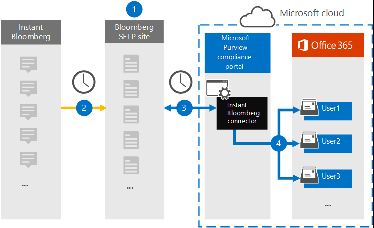

# Set up a connector to archive Instant Bloomberg data

Use a native connector in the Microsoft 365 compliance center to import and archive financial services chat data from the [Instant Bloomberg](https://www.bloomberg.com/professional/product/collaboration/) collaboration tool. After you set up and configure a connector, it connects to your organization's Bloomberg secure FTP site (SFTP) once every day, converts the content of chat messages to an email message format, and then imports those items to mailboxes in Microsoft 365.

After Instant Bloomberg data is stored in user mailboxes, you can apply Microsoft 365 compliance features such as Litigation Hold, Content Search, In-Place Archiving, Auditing, Communication compliance, and Microsoft 365 retention policies to Instant Bloomberg data. For example, you can search Instant Bloomberg chat messages using Content Search or associate the mailbox that contains the Instant Bloomberg data with a custodian in an Advanced eDiscovery case. Using an Instant Bloomberg connector to import and archive data in Microsoft 365 can help your organization stay compliant with government and regulatory policies.

## Overview of archiving Instant Bloomberg data

The following overview explains the process of using a connector to archive Instant Bloomberg chat data in Microsoft 365. 

1. Your organization works with Bloomberg to set up a Bloomberg SFTP site. You'll also work with Bloomberg to configure Instant Bloomberg to copy chat messages to your Bloomberg SFTP site.

2. Once every 24 hours, chat messages from Instant Bloomberg are copied to the Bloomberg SFTP site.

3. The Instant Bloomberg connector that you create in the Microsoft 365 compliance center connects to the Bloomberg SFTP site every day and transfers the chat messages from the previous 24 hours to a secure Azure Storage area in the Microsoft Cloud. The connector also converts the content of a chat massage to an email message format.

4. The connector imports the chat message items to the mailbox of a specific user. A new folder named InstantBloomberg is created in the specific user's mailbox and the items will be imported to it. The connector does this by using the value of the *CorporateEmailAddress* property. Every chat message contains this property, which is populated with the email address of every participant of the chat message. In addition to automatic user mapping using the value of the *CorporateEmailAddress* property, you can also define a custom mapping by uploading a CSV mapping file. This mapping file should contain a Bloomberg UUID and the corresponding Microsoft 365 mailbox address for each user. If you enable automatic user mapping and provide a custom mapping, for every chat item the connector will first look at custom-mapping file. If it doesn't find a valid Microsoft 365 user that corresponds to a user's Bloomberg UUID, the connector will use the *CorporateEmailAddress* property of the chat item. If the connector doesn't find a valid Microsoft 365 user in either the custom-mapping file or the *CorporateEmailAddress* property of the chat item, the item won't be imported.

## Before you set up a connector

Some of the implementation steps required to archive Instant Bloomberg data are external to Microsoft 365 and must be completed before you can create the connector in the compliance center.

- To set up an Instant Bloomberg connector, you have to use keys and key passphrases for Pretty Good Privacy (PGP) and Secure Shell (SSH). These keys are used to configure the Bloomberg SFTP site and used by the connector to connect to the Bloomberg SFTP site to import data to Microsoft 365. The PGP key is used to configure the encryption of data that's transferred from the Bloomberg SFTP site to Microsoft 365. The SSH key is used to configure secure shell to enable a secure remote login when the connector connects to the Bloomberg SFTP site.

  When setting up a connector, you have the option to use public keys and key passphrases provided by Microsoft or you can use your own private keys and passphrases. We recommend that you use the public keys provided by Microsoft. However, if your organization has already configured a Bloomberg SFTP site using private keys, then you can create a connector using these same private keys.

- Subscribe to [Bloomberg Anywhere](https://www.bloomberg.com/professional/product/remote-access/?bbgsum-page=DG-WS-PROF-PROD-BBA). This is required so that you can log in to Bloomberg Anywhere to access the Bloomberg SFTP site that you have to set up and configure.

- Set up a Bloomberg SFTP (Secure file transfer protocol) site. After working with Bloomberg to set up the SFTP site, data from Instant Bloomberg is uploaded to the SFTP site every day. The connector you create in Step 2 connects to this SFTP site and transfers the chat data to Microsoft 365 mailboxes. SFTP also encrypts the Instant Bloomberg chat data that is sent to mailboxes during the transfer process.

  For information about Bloomberg SFTP (also called *BB-SFTP*):

  - See the "SFTP Connectivity Standards" document at [Bloomberg Support](https://www.bloomberg.com/professional/support/documentation/).

  - Contact [Bloomberg customer support](https://service.bloomberg.com/portal/sessions/new?utm_source=bloomberg-menu&utm_medium=csc).

  After you work with Bloomberg to set up an SFTP site, Bloomberg will provide some information to you after you respond to the Bloomberg implementation email message. Save a copy of the following information. You use it to set up a connector in Step 3.

  - Firm code, which is an ID for your organization and is used to log in to the Bloomberg SFTP site.

  - Password for your Bloomberg SFTP site

  - URL for Bloomberg SFTP site (for example, sftp.bloomberg.com)

  - Port number for Bloomberg SFTP site

- The Instant Bloomberg connector can import a total of 200,000 items in a single day. If there are more than 200,000 items on the SFTP site, none of those items will be imported to Microsoft 365.

- The user who creates an Instant Bloomberg connector in Step 3 (and who downloads the public keys and IP address in Step 1) must be assigned the Mailbox Import Export role in Exchange Online. This is required to add connectors in the **Data connectors** page in the Microsoft 365 compliance center. By default, this role isn't assigned to any role group in Exchange Online. You can add the Mailbox Import Export role to the Organization Management role group in Exchange Online. Or you can create a role group, assign the Mailbox Import Export role, and then add the appropriate users as members. For more information, see the [Create role groups](/Exchange/permissions-exo/role-groups#create-role-groups) or [Modify role groups](/Exchange/permissions-exo/role-groups#modify-role-groups) sections in the article "Manage role groups in Exchange Online".

## Set up a connector using public keys

The steps in this section show you how to set up an Instant Bloomberg connector using the public keys for Pretty Good Privacy (PGP) and Secure Shell (SSH).

### Step 1: Obtain PGP and SSH and public keys

The first step is to obtain a copy of the public keys for Pretty Good Privacy (PGP) and Secure Shell (SSH). You use these keys in Step 2 to configure the Bloomberg SFTP site to allow the connector (that you create in Step 3) to connect to the SFTP site and transfer the Instant Bloomberg chat data to Microsoft 365 mailboxes. You also obtain an IP address in this step, which you use when configuring the Bloomberg SFTP site.

1. Go to <https://compliance.microsoft.com> and click **Data connectors** in the left nav.

2. On the **Data connectors** page under **Instant Bloomberg**, click **View**.

3. On the **Instant Bloomberg** product description page, click **Add connector**

4. On the **Terms of service** page, click **Accept**.

5. On the **Add credentials for content source** page, click **I want to use PGP and SSH public keys provided by Microsoft**.

   

6. Under step 1, click the **Download SSH key**, **Download PGP key**, and **Download IP address** links to save a copy of each file to your local computer.

   

   These files contain the following items that are used to configure the Bloomberg SFTP site in Step 2:

   - PGP public key: This key is used to configure the encryption of data that's transferred from the Bloomberg SFTP site to Microsoft 365.

   - SSH public key: This key is used to configure secure shell to enable a secure remote login when the connector connects to the Bloomberg SFTP site.

   - IP address: The Bloomberg SFTP site is configured to accept connection requests from this IP address. The same IP address is used by the Instant Bloomberg connector to connect to the SFTP site and transfer Instant Bloomberg data to Microsoft 365.

7. Click **Cancel** to close the wizard. You come back to this wizard in Step 3 to create the connector.

### Step 2: Configure the Bloomberg SFTP site

The next step is to use the PGP and SSH public keys and the IP address that you obtained in Step 1 to configure PGP encryption and SSH authentication for the Bloomberg SFTP site. This lets the Instant Bloomberg connector that you create in Step 3 connect to the Bloomberg SFTP site and transfer Instant Bloomberg data to Microsoft 365. You need to work with Bloomberg customer support to set up your Bloomberg SFTP site. Contact [Bloomberg customer support](https://service.bloomberg.com/portal/sessions/new?utm_source=bloomberg-menu&utm_medium=csc) for assistance. 

> [!IMPORTANT]
> Bloomberg recommends that you attach the three files that you downloaded in Step 1 to an email message and send it to their customer support team when working with them to set up your Bloomberg SFTP site.

### Step 3: Create an Instant Bloomberg connector

The last step is to create an Instant Bloomberg connector in the Microsoft 365 compliance center. The connector uses the information you provide to connect to the Bloomberg SFTP site and transfer chat messages to the corresponding user mailbox boxes in Microsoft 365.

1. Go to <https://compliance.microsoft.com> and then click **Data connectors** > **Instant Bloomberg**.

2. On the **Instant Bloomberg** product description page, click **Add connector**

3. On the **Terms of service** page, click **Accept**.

4. On the **Add credentials for Bloomberg SFTP site** page, under Step 3, enter the required information in the following boxes and then click **Next**.

    - **Firm code:** The ID for your organization that is used as the username for the Bloomberg SFTP site.

    - **Password:** Password for Bloomberg SFTP site.

    - **SFTP URL:** The URL for Bloomberg SFTP site (for example, `sftp.bloomberg.com`). You can also use an IP address for this value.

    - **SFTP port:** The port number for Bloomberg SFTP site. The connector uses this port to connect to the SFTP site.

5. On the **Select data types to import** page, select the required data types to be imported apart from **Messages**

6. On the **Map Instant Bloomberg users to Microsoft 365 users** page, enable automatic user mapping and provide custom user mapping as required

   > [!NOTE]
   > The connector imports the chat message items to the mailbox of a specific user. A new folder named **InstantBloomberg** is created in the specific user's mailbox and the items will be imported to it. The connector does by using the value of the *CorporateEmailAddress* property. Every chat message contains this property, and the property is populated with the email address of every participant of the chat message. In addition to automatic user mapping using the value of the *CorporateEmailAddress* property, you can also define custom mapping by uploading a CSV mapping file. The mapping file should contain the Bloomberg UUID and corresponding Microsoft 365 mailbox address for each user. If you enable automatic user mapping and provide a custom mapping, for every chat item the connector will first look at custom mapping file. If it doesn't find a valid Microsoft 365 user that corresponds to a user's Bloomberg UUID, the connector will use the *CorporateEmailAddress* property of the chat item. If the connector doesn't find a valid Microsoft 365 user in either the custom mapping file or the *CorporateEmailAddress* property of the chat item, the item won't be imported.

7. Click **Next**, review your settings, and then click **Finish** to create the connector.

8. Go to the **Data connectors** page to see the progress of the import process for the new connector. Click the connector to display the flyout page, which contains information about the connector.

## Set up a connector using private keys

The steps in this section show you how to set up an Instant Bloomberg connector using PGP and SSH private keys. This connector setup option is intended for organizations that have already configured a Bloomberg SFTP site using private keys.

### Step 1: Obtain an IP address to configure the Bloomberg SFTP site

> [!NOTE]
> If your organization has previously configured a Bloomberg SFTP site to archive Bloomberg Message data using PGP and SSH private keys, you don't have to configure another one. You can specify the same SFTP site when you create the connector in Step 2.

If your organization has used PGP and SSH private keys to set up a Bloomberg SFTP site, then you have to obtain an IP address and provide it to Bloomberg customer support. The Bloomberg SFTP site must be configured to accept  connection requests from this IP address. The same IP address is used by the Instant Bloomberg connector to connect to the SFTP site and transfer Instant Bloomberg data to Microsoft 365.

To obtain the IP address:

1. Go to <https://compliance.microsoft.com> and click **Data connectors** in the left nav.

2. On the **Data connectors** page under **Instant Bloomberg**, click **View**.

3. On the **Instant Bloomberg** product description page, click **Add connector**

4. On the **Terms of service** page, click **Accept**.

5. On the **Add credentials for content source** page, click **I want to use PGP and SSH private keys**.

6. Under step 1, click **Download IP address** to save a copy of the IP address file to your local computer.

   

7. Click **Cancel** to close the wizard. You come back to this wizard in Step 2 to create the connector.

You need to work with Bloomberg customer support to configure your Bloomberg SFTP site to accept connection requests from this IP address. Contact [Bloomberg customer support](https://service.bloomberg.com/portal/sessions/new?utm_source=bloomberg-menu&utm_medium=csc) for assistance.

### Step 2: Create an Instant Bloomberg connector

After your Bloomberg SFTP site is configured, the next step is to create an Instant Bloomberg connector in the Microsoft 365 compliance center. The connector uses the information you provide to connect to the Bloomberg SFTP site and transfer email messages to the corresponding user mailbox boxes in Microsoft 365. To complete this step, be sure to have copies of the same private keys and key passphrases that you used to set up your Bloomberg SFTP site.

1. Go to <https://compliance.microsoft.com> and click **Data connectors** in the left nav.

2. On the **Data connectors** page under **Instant Bloomberg**, click **View**.

3. On the **Instant Bloomberg** product description page, click **Add connector**

4. On the **Terms of service** page, click **Accept**.

5. On the **Add credentials for content source** page, click **I want to use PGP and SSH private keys**.

   

6. Under Step 3, enter the required information in the following boxes and then click **Validate connection**.

      - **Name:** The name for the connector. It must be unique in your organization.

      - **Firm code:** The ID for your organization that is used as the username for the Bloomberg SFTP site.

      - **Password:** The password for your organization's Bloomberg SFTP site.

      - **SFTP URL:** The URL for the Bloomberg SFTP site (for example, `sftp.bloomberg.com`). You can also use an IP address for this value.

      - **SFTP port:** The port number for the Bloomberg SFTP site. The connector uses this port to connect to the SFTP site.

      - **PGP private key:** The PGP private key for the Bloomberg SFTP site. Be sure to include the entire private key value, including the beginning and ending lines of the key block.

      - **PGP key passphrase:** The passphrase for the PGP private key.

      - **SSH private key:** The SSH private key for the Bloomberg SFTP site. Be sure to include the entire private key value, including the beginning and ending lines of the key block.

      - **SSH key passphrase:** The passphrase for the SSH private key.

7. After the connection is successfully validated, click **Next**.

8. On the **Map Instant Bloomberg users to Microsoft 365 users** page, enable automatic user mapping and provide custom user mapping as required.

   > [!NOTE]
   > The connector imports the chat message items to the mailbox of a specific user. A new folder named **InstantBloomberg** is created in the specific user's mailbox and the items will be imported to it. The connector does by using the value of the *CorporateEmailAddress* property. Every chat message contains this property, and the property is populated with the email address of every participant of the chat message. In addition to automatic user mapping using the value of the *CorporateEmailAddress* property, you can also define custom mapping by uploading a CSV mapping file. The mapping file should contain the Bloomberg UUID and corresponding Microsoft 365 mailbox address for each user. If you enable automatic user mapping and provide a custom mapping, for every chat item the connector will first look at custom mapping file. If it doesn't find a valid Microsoft 365 user that corresponds to a user's Bloomberg UUID, the connector will use the *CorporateEmailAddress* property of the chat item. If the connector doesn't find a valid Microsoft 365 user in either the custom mapping file or the *CorporateEmailAddress* property of the chat item, the item won't be imported.

9. Click **Next**, review your settings, and then click **Finish** to create the connector.

10. Go to the **Data connectors** page to see the progress of the import process for the new connector. Click the connector to display the flyout page, which contains information about the connector.
