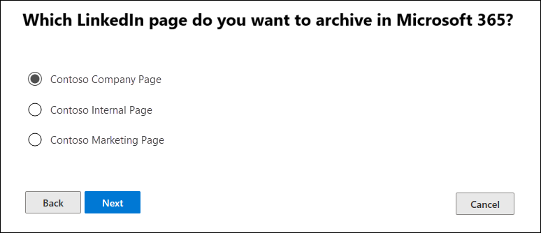

# Set up a connector to archive LinkedIn data

Use a connector in the Microsoft 365 compliance center to import and archive data from LinkedIn Company pages. After you set up and configure a connector, it connects to the account for the specific LinkedIn Company page once every 24 hours. The connector converts the messages posted to the Company page to an email message, and then imports those items to a mailbox in Microsoft 365.

After the LinkedIn Company page data is stored in a mailbox, you can apply Microsoft 365 compliance features such as Litigation Hold, Content Search, In-Place Archiving, Auditing, and Microsoft 365 retention policies to LinkedIn data. For example, you can search for these items using Content Search or associate the storage mailbox with a custodian in an Advanced eDiscovery case. Creating a connector to import and archive LinkedIn data in Microsoft 365 can help your organization stay compliant with government and regulatory policies.

## Before you set up a connector

- The user who creates a LinkedIn Company Page connector must be assigned the Mailbox Import Export role in Exchange Online. This is required to add connectors in the **Data connectors** page in the Microsoft 365 compliance center. By default, this role isn't assigned to any role group in Exchange Online. You can add the Mailbox Import Export role to the Organization Management role group in Exchange Online. Or you can create a role group, assign the Mailbox Import Export role, and then add the appropriate users as members. For more information, see the [Create role groups](/Exchange/permissions-exo/role-groups#create-role-groups) or [Modify role groups](/Exchange/permissions-exo/role-groups#modify-role-groups) sections in the article "Manage role groups in Exchange Online".

- You must have the sign-in credentials (email address or phone number and password) of a LinkedIn user account that is an admin for the LinkedIn Company Page that you want to archive. You use these credentials to sign into LinkedIn when setting up the connector.

- The LinkedIn connector can import a total of 200,000 items in a single day. If there are more than 200,000 LinkedIn items in a day, none of those items will be imported to Microsoft 365.

## Create a LinkedIn connector

1. Go to <https://compliance.microsoft.com> and then click **Data connectors** > **LinkedIn Company pages**.

2. On the **LinkedIn company pages** product page, click **Add connector**.

3. On the **Terms of service** page, select **Accept**.

4. On the **Sign in with LinkedIn** page, click **Sign in with LinkedIn**.

   The LinkedIn sign-in page is displayed.

   

5. On the LinkedIn sign in page, enter the email address (or phone number) and password for the LinkedIn account associated with the company page that you want to archive, and then click **Sign in**.

   A wizard page is displayed with a list of all LinkedIn Company Pages associated with the account that you signed in to. A connector can only be configured for one company page. If your organization has multiple LinkedIn Company Pages, you have to create a connector for each one.

   

6. Select the company page that you want to archive items from, and then click **Next**.

7. On the **Choose storage location** page, click in the box, select the email address of a Microsoft 365 mailbox that the LinkedIn items will be imported to, and then click **Next**. Items are imported to the inbox folder in this mailbox.

8. Click **Next** to review the connector settings and then click **Finish** to complete the connector setup.

After you create the connector, you can go back to the **Data connectors** page to see the progress of the import process for the new connector (select **Refresh** if necessary to update the list of connectors). The value in the **Status** column is **Waiting to start**. It takes up to 24 hours for the initial import process to be started. After the first time the connector runs and imports the LinkedIn items, the connector will run once every 24 hours and import any new items that are created on the LinkedIn Company Page in the previous 24 hours.

To view more details, select the connector in the list on the **Data connectors** page to display the flyout page. Under **Status**, the date range that's displayed indicates the age filter that was selected when the connector was created.

## More information

LinkedIn items are imported to the LinkedIn subfolder in the inbox of the storage mailbox in Microsoft 365. They appear as email messages.