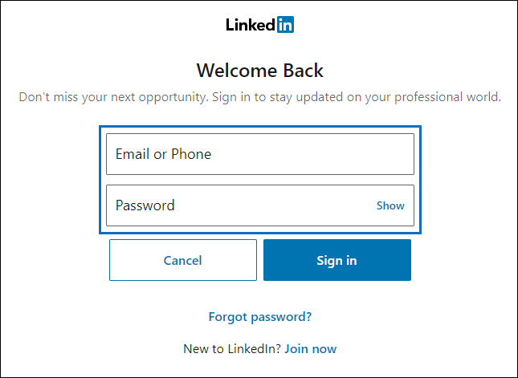
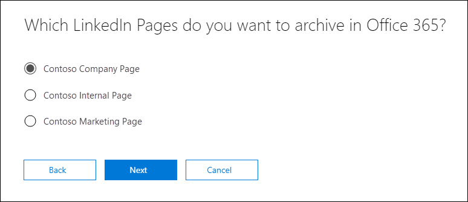

# Set up a connector to archive LinkedIn data (Preview)

The connector feature to archive data from LinkedIn Company pages in Office 365 is in Preview.

Use a native connector in the Security & Compliance Center in Office 365 to import and archive data from LinkedIn Company pages. After you set up and configure a connector, it connects to the account for the specific LinkedIn Company page once every 24 hours. The connector converts the messages posted to the Company page to an email message, and then imports those items to a mailbox in Office 365.

After the LinkedIn Company page data is stored in a mailbox, you can apply Office 365 compliance features such as Litigation Hold, Content Search, In-Place Archiving, Auditing, and Office 365 retention policies to LinkedIn data. For example, you can search for these items using Content Search or associate the storage mailbox with a custodian in an Advanced eDiscovery case. Creating a connector to import and archive LinkedIn data in Office 365 can help your organization stay compliant with government and regulatory policies.

## Before you  begin

- Your organization must consent to allow the Office 365 Import service to access mailbox data in your organization. To consent to this request, go to [this page](https://login.microsoftonline.com/common/oauth2/authorize?client_id=570d0bec-d001-4c4e-985e-3ab17fdc3073&response_type=code&redirect_uri=https://portal.azure.com/&nonce=1234&prompt=admin_consent), sign in with the credentials of an Office 365 global admin, and then accept the request.

- The user who creates a LinkedIn Company Page connector must be assigned the Mailbox Import Export role in Exchange Online. This role is required to access the **Archive third-party data** page in the Security & Compliance Center. By default, this role isn't assigned to any role group in Exchange Online. You can add the Mailbox Import Export role to the Organization Management role group in Exchange Online. Or you can create a role group, assign the Mailbox Import Export role, and then add the appropriate users as members. For more information, see the [Create role groups](https://docs.microsoft.com/Exchange/permissions-exo/role-groups#create-role-groups) or [Modify role groups](https://docs.microsoft.com/Exchange/permissions-exo/role-groups#modify-role-groups) sections in the article "Manage role groups in Exchange Online".

- You must have the sign-in credentials (email address or phone number and password) of a LinkedIn user account that is an admin for the LinkedIn Company Page that you want to archive. You use these credentials to sign in to LinkedIn when setting up the connector.

## Create a LinkedIn connector

1. Go to <https://protection.office.com> and then click **Information governance \> Import > Archive third-party data**.

2. On the **Archive third-party data** page, select **Add a connector**, and then select **LinkedIn**.

3. On the **Terms of service** page, select **Accept**.

4. On the **Sign in with LinkedIn** page, select **Sign in with LinkedIn**.

   The LinkedIn sign in page is displayed.

   

5. On the LinkedIn sign in page, enter the email address (or phone number) and password for the LinkedIn account associated with the company page that you want to archive, and then select **Sign in**.

   A wizard page is displayed with a list of all LinkedIn Company Pages associated with the account that you signed in to. A connector can only be configured for one company page. If your organization has multiple LinkedIn Company Pages, you have to create a connector for each one.

   

6. Select the company page that you want to archive items from, and then select **Next**.

7. On the **Set filters** page, you can apply a filter to initially import items that are a certain age. Select an age, and then select **Next**.

8. On the **Set storage account** page, type the email address of an Office 365 mailbox that the LinkedIn items will be imported to, and then select **Next**. Items are imported to the Inbox folder in this mailbox.

9. Review the connector settings and then select **Save** to complete the connector setup.

After you create the connector, you can go back to the **Archive third-party data** page (select **Refresh** if necessary to update the list of connectors) a view the new connector. The value in the **Status** column is **Waiting to start**. It takes up to 24 hours for the initial import process to be started. After the first time the connector runs and imports the LinkedIn items, the connector will run once every 24 hours and import any new items that are created on the LinkedIn Company Page in the previous 24 hours.

To view more details, select the connector in the list on the **Archive third-party data** page to display the flyout page. Under **Status**, the date range that's displayed indicates the age filter that was selected when the connector was created. 

## More information

- LinkedIn items are imported to the Inbox folder in the storage mailbox in Office 365. They appear as email messages. The display name of the sender of the message is the name of the LinkedIn Company Page. The actual email address of the sender is the email address of the storage mailbox. The name of the company page is also pre-appended to the subject line. 

- Because of the previous behavior, you can search the `from` or `subject` email properties when using a Microsoft eDiscovery tool to search LinkedIn items that are archived in Office 365. For example if the name of the company page is "Contoso Company Page", then you can use one of the following *property:value* pairs in the keyword search query:
   
   > from:"Contoso Company Page"

    Or

   > subject:"Contoso Company Page"

- To make it easier to locate or manage LinkedIn items imported to Office 365, the owner of the storage mailbox (or anyone assigned the FullAccess permission) can set up an inbox rule to move the items from a LinkedIn Company Page to a specific folder. This is helpful if the storage mailbox is used to archive items imported from different third-party data sources. For example, you can create an inbox rule that moves all items that contain the name of a specific LinkedIn Company Page in the subject field to a specific folder.