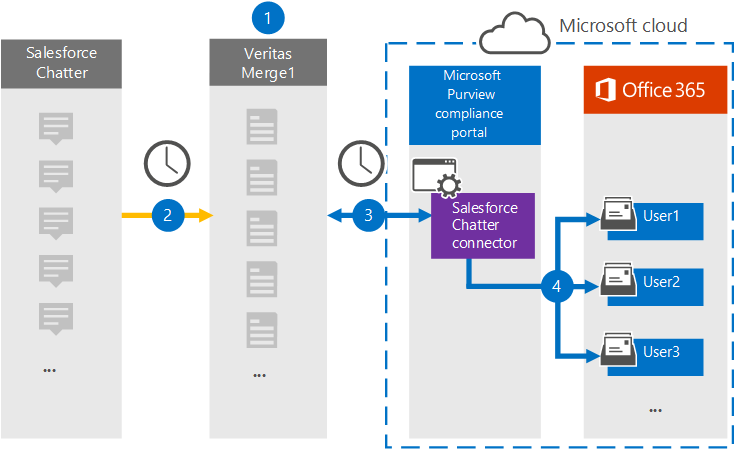

# Set up a connector to archive Salesforce Chatter data

Use a Veritas connector in the Microsoft Purview compliance portal to import and archive data from the Salesforce Chatter platform to user mailboxes in your Microsoft 365 organization. Veritas provides a [Salesforce Chatter](http://globanet.com/chatter/) connector that captures items from the third-party data source and imports those items to Microsoft 365. The connector converts the content such as chats, attachments, and posts from Salesforce Chatter to an email message format and then imports those items to the user's mailbox in Microsoft 365.

After Salesforce Chatter data is stored in user mailboxes, you can apply Microsoft Purview features such as Litigation Hold, eDiscovery, retention policies and retention labels. Using a Salesforce Chatter connector to import and archive data in Microsoft 365 can help your organization stay compliant with government and regulatory policies.

[!INCLUDE [purview-preview](../includes/purview-preview.md)]

## Overview of archiving Salesforce Chatter data

The following overview explains the process of using a connector to archive the Salesforce Chatter data in Microsoft 365.

1. Your organization works with Salesforce Chatter to set up and configure a Salesforce Chatter site.

2. Once every 24 hours, Salesforce Chatter items are copied to the Veritas Merge1 site. The connector also Salesforce Chatter items to an email message format.

3. The Salesforce Chatter connector that you create in the compliance portal, connects to the Veritas Merge1 site every day and transfers the Chatter content to a secure Azure Storage location in the Microsoft cloud.

4. The connector imports the converted items to the mailboxes of specific users using the value of the *Email* property of the automatic user mapping as described in [Step 3](#step-3-map-users-and-complete-the-connector-setup). A subfolder in the Inbox folder named **Salesforce Chatter** is created in the user mailboxes, and items are imported to that folder. The connector determines which mailbox to import items to by using the value of the *Email* property. Every Chatter item contains this property, which is populated with the email address of every participant of the item.

## Before you begin

- Create a Merge1 account for Microsoft connectors. To create an account, contact [Veritas Customer Support](https://www.veritas.com/content/support/). You need to sign into this account when you create the connector in Step 1.

- Create a Salesforce application and acquire a token at [https://salesforce.com](https://salesforce.com). You'll need to log into the Salesforce account as an admin and get a user personal token to import data. Also, triggers need to be published on the Chatter site to capture updates, deletes, and edits. These triggers will create a post on a channel, and Merge1 will capture the information from the channel. For step-by-step instructions about how to create the application and acquire the token, see [Merge1 Third-Party Connectors User Guide](https://docs.ms.merge1.globanetportal.com/Merge1%20Third-Party%20Connectors%20SalesForce%20Chatter%20User%20Guide%20.pdf).

- The user who creates the Salesforce Chatter connector in Step 1 (and completes it in Step 3) must be assigned the Data Connector Admin role. This role is required to add connectors on the **Data connectors** page in the compliance portal. This role is added by default to multiple role groups. For a list of these role groups, see the "Roles in the Defender and compliance portals" section in [Roles and role groups in the Microsoft 365 Defender and Microsoft Purview compliance portals](../security/office-365-security/permissions-in-the-security-and-compliance-center.md#roles-in-the-defender-and-compliance-portals). Alternatively, an admin in your organization can create a custom role group, assign the Data Connector Admin role, and then add the appropriate users as members. For instructions, see the "Create a custom role group" section in [Permissions in the Microsoft Purview compliance portal](microsoft-365-compliance-center-permissions.md#create-a-custom-role-group).

- This Veritas data connector is in public preview in GCC environments in the Microsoft 365 US Government cloud. Third-party applications and services might involve storing, transmitting, and processing your organization's customer data on third-party systems that are outside of the Microsoft 365 infrastructure and therefore aren't covered by the Microsoft Purview and data protection commitments. Microsoft makes no representation that use of this product to connect to third-party applications implies that those third-party applications are FEDRAMP compliant.

## Step 1: Set up the Salesforce Chatter connector

The first step is to access to the **Data Connectors** page in the compliance portal and create a connector for Chatter data.

1. Go to [https://compliance.microsoft.com](https://compliance.microsoft.com/) and then select **Data connectors** > **Salesforce Chatter**.

2. On the **Salesforce Chatter** product description page, select **Add connector**.

3. On the **Terms of service** page, select **Accept**.

4. Enter a unique name that identifies the connector, and then select **Next**.

5. Sign in to your Merge1 account to configure the connector.

## Step 2: Configure the Salesforce Chatter on the Veritas Merge1 site

The second step is to configure the Salesforce Chatter connector on the Veritas Merge1 site. For information about how to configure the Salesforce Chatter connector, see [Merge1 Third-Party Connectors User Guide](https://docs.ms.merge1.globanetportal.com/Merge1%20Third-Party%20Connectors%20SalesForce%20Chatter%20User%20Guide%20.pdf).

After you select **Save & Finish,** the **User mapping** page in the connector wizard in the compliance portal is displayed.

## Step 3: Map users and complete the connector setup

To map users and complete the connector setup in the compliance portal, follow these steps:

1. On the **Map Salesforce Chatter users to Microsoft 365 users** page, enable automatic user mapping. The Salesforce Chatter items include a property called *Email*, which contains email addresses for users in your organization. If the connector can associate this address with a Microsoft 365 user, the items are imported to that user's mailbox.

2. select **Next**, review your settings, and then go to the **Data connectors** page to see the progress of the import process for the new connector.

## Step 4: Monitor the Salesforce Chatter connector

After you create the Salesforce Chatter connector, you can view the connector status in the compliance portal.

1. Go to [https://compliance.microsoft.com](https://compliance.microsoft.com/) and select **Data connectors** in the left nav.

2. select the **Connectors** tab and then select the **Salesforce Chatter** connector to display the flyout page, which contains the properties and information about the connector.

3. Under **Connector status with source**, select the **Download log** link to open (or save) the status log for the connector. This log contains data that's been imported to the Microsoft cloud.

## Known issues

- At this time, we don't support importing attachments or items that are larger than 10 MB. Support for larger items will be available at a later date.
