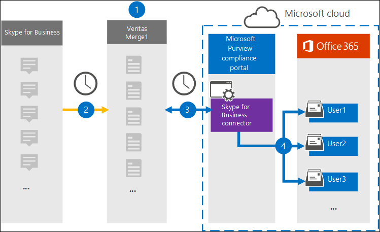

# Set up a connector to archive Skype for Business data (preview)

Use a Veritas connector in the Microsoft 365 compliance center to import and archive data from the Skype for Business platform to user mailboxes in your Microsoft 365 organization. Veritas provides a [Skype for Business](https://www.veritas.com/en/au/insights/merge1/skype-for-business) connector that is configured to capture items from the third-party data source (on a regular basis) and import those items to Microsoft 365. The connector converts the content such as messages between users, persistent chats, and conference messages from Skype for Business to an email message format and then imports those items to the user’s mailbox in Microsoft 365.

After Skype for Business data is stored in user mailboxes, you can apply Microsoft 365 compliance features such as Litigation Hold, eDiscovery, retention policies and retention labels. Using a Skype for Business connector to import and archive data in Microsoft 365 can help your organization stay compliant with government and regulatory policies.

## Overview of archiving Skype for Business data

The following overview explains the process of using a connector to archive the Skype for Business data in Microsoft 365.

1. Your organization works with Skype for Business to set up and configure a Skype for Business site.

2. Once every 24 hours, Skype for Business items are copied to the Veritas Merge1 site. The connector also converts Skype for Business items to an email message format.

3. The Skype for Business connector that you create in the Microsoft 365 compliance center, connects to the Veritas Merge1 site every day, and transfers the Skype for Business content to a secure Azure Storage location in the Microsoft cloud.

4. The connector imports the converted items to the mailboxes of specific users using the value of the *Email* property of the automatic user mapping as described in [Step 3](#step-3-map-users-and-complete-the-connector-setup). A subfolder in the Inbox folder named **Skype for Business** is created in the user mailboxes, and items are imported to that folder. The connector does this by using the value of the *Email* property. Every Skype for Business item contains this property, which is populated with the email address of every participant of the item.

## Before you set up a connector

- Create a Merge1 account for Microsoft connectors. To do this, contact [Veritas Customer Support](https://www.veritas.com/form/requestacall/ms-connectors-contact.html). You need to sign into this account when you create the connector in Step 1.

- The user who creates the Skype for Business connector in Step 1 (and completes it in Step 3) must be assigned to the Mailbox Import Export role in Exchange Online. This role is required to add connectors on the **Data connectors** page in the Microsoft 365 compliance center. By default, this role is not assigned to any role group in Exchange Online. You can add the Mailbox Import Export role to the Organization Management role group in Exchange Online. Or you can create a role group, assign the Mailbox Import Export role, and then add the appropriate users as members. For more information, see the [Create role groups](https://docs.microsoft.com/Exchange/permissions-exo/role-groups#create-role-groups) or [Modify role groups](https://docs.microsoft.com/Exchange/permissions-exo/role-groups#modify-role-groups) sections in the article “Manage role groups in Exchange Online”.

## Step 1: Set up the Skype for Business connector

The first step is to access to the **Data Connectors** page in the Microsoft 365 compliance center and create a connector for Skype for Business data.

1. Go to <https://compliance.microsoft.com> and click **Data connectors** > **Skype for Business**.

2. On the **Skype for Business** product description page, click **Add connector**.

3. On the **Terms of service** page, click **Accept**.

4. Enter a unique name that identifies the connector, and then click **Next**.

5. Sign in to your Merge1 account to configure the connector.

## Step 2: Configure the Skype for Business on the Veritas Merge1 site

The second step is to configure the Skype for Business connector on the Veritas Merge1 site. For information about how to configure the Skype for Business connector, see [Merge1 Third-Party Connectors User Guide](https://docs.ms.merge1.globanetportal.com/Merge1%20Third-Party%20Connectors%20Skype%20for%20Business%20%20User%20Guide.pdf).

After you click **Save & Finish**, the **User mapping** page in the connector wizard in the Microsoft 365 compliance center is displayed.

## Step 3: Map users and complete the connector setup

To map users and complete the connector setup in the Microsoft 365 compliance center, follow these steps:

1. On the **Map Skype for Business users to Microsoft 365 users** page, enable automatic user mapping. The Skype for Business items include a property called *Email*, which contains email addresses for users in your organization. If the connector can associate this address with a Microsoft 365 user, the items are imported to that user’s mailbox.

2. Click **Next**, review your settings, and then go to the **Data connectors** page to see the progress of the import process for the new connector.

## Step 4: Monitor the Skype for Business connector

After you create the Skype for Business connector, you can view the connector status in the Microsoft 365 compliance center.

1. Go to <https://compliance.microsoft.com/> and click **Data connectors** in the left nav.

2. Click the **Connectors** tab and then select the **Skype for Business** connector to display the flyout page, which contains the properties and information about the connector.

3. Under **Connector status with source**, click the **Download log** link to open (or save) the status log for the connector. This log contains data that has been imported to the Microsoft cloud.

## Known issues

- At this time, we don't support importing attachments or items that are larger than 10 MB. Support for larger items will be available at a later date.

