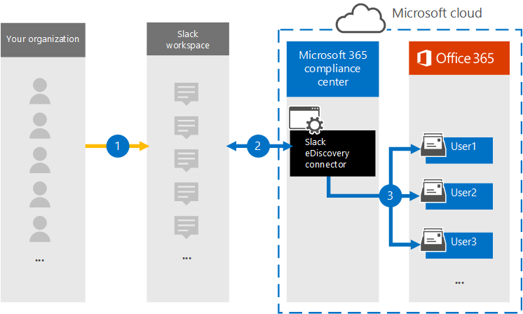

# Set up a connector to archive Slack eDiscovery data (preview)

The Slack eDiscovery data connector provided by Microsoft helps you to import and archive instant messaging data (such as messages, attachments, links, and revisions) from your organization's Slack workspaces to Microsoft 365. The data connector pulls data from the Slack API, converts it to an email message format, and then imports those items to user mailboxes in Microsoft 365. After the Slack data is imported, you can apply compliance solutions, such as Litigation hold, Microsoft Purview eDiscovery (Premium), Communication compliance, and retention settings to the Slack content. Using a Slack eDiscovery data connector to import and archive data in Microsoft 365 can help your organization stay compliant with government and regulatory policies.

If you’d like to participate in the preview, please reach out to the team at dcfeedback@microsoft.com.

## Overview of archiving Slack eDiscovery data

The following overview explains the process of using a Microsoft data connector to archive the Slack data in Microsoft 365.

1. Your organization works with Slack to set up and configure a Slack workspace.

2. After the data connector is set up, messages from your organization's Slack workspaces are copied to user mailboxes in Microsoft 365. The data connector also converts the contents of a chat message to an email message format.

3. The connector imports the converted chat messages to the mailboxes of specific users. A subfolder in the Inbox folder named **Slack eDiscovery** is created in the user mailboxes and the chat message items are imported to that folder.

## Before you set up a connector

- Your organization needs the Enterprise Grid subscription for Slack. For more information, see [Slack subscriptions and features](https://slack.com/intl/en-gb/help/articles/115003205446-Slack-subscriptions-and-features-).

- The user who creates the data connector must be assigned the **Org owners** application role in their Slack organization. For more information, see [Types of roles in Slack](https://slack.com/intl/en-gb/help/articles/360018112273-Types-of-roles-in-Slack).

- Obtain the username and password for your organization's Slack enterprise account. You use these credentials to sign into this account when you create the data connector. It's also recommended that you have automated user provisioning in your Slack organization configured to use single sign-on (SSO). [Roles in the Security & Compliance Center](../security/office-365-security/permissions-in-the-security-and-compliance-center.md#roles-in-the-security--compliance-center)

- The user who creates the Slack eDiscovery connector must be assigned the Data Connector Admin role. This role is required to add connectors on the **Data connectors** page in the Microsoft Purview compliance portal. This role is added by default to multiple role groups. For a list of these role groups, see the "Roles in the security and compliance centers" section in [Permissions in the Security & Compliance Center](../security/office-365-security/permissions-in-the-security-and-compliance-center.md#roles-in-the-security--compliance-center). Alternatively, an admin in your organization can create a custom role group, assign the Data Connector Admin role, and then add the appropriate users as members. For instructions, see the "Create a custom role group" section in [Permissions in the Microsoft Purview compliance portal](microsoft-365-compliance-center-permissions.md#create-a-custom-role-group).

## Step 1: Create a Slack eDiscovery connector

1. Go to <https://compliance.microsoft.com> and click **Data connectors** on the left navigation pane.

2. On the **Overview** tab, click **Filter** and select **By Microsoft**, and then apply the filter.

3. Click **Slack eDiscovery (preview)**.

4. On the **Slack eDiscovery (preview)** product description page, click **Add connector**.

5. On the **Terms of service** wizard page, click **Accept**.

6. Enter a unique name that identifies the connector and then click **Next**. The name you enter will identify the connector on the **Data connectors** page after you create it.

## Step 2: Sign into your Slack organization

1. On the **Sign into Slack** wizard page, click **Sign into Slack** to sign into your organization's Slack workspace.

2. On the Slack **Sign into your workspace** page, type the name of the workspace that you want to archive data from, and then click **Continue**.

   A page is displayed with the name of your Slack workspace and a prompt to sign in.

3. Click the link in the string **Org Owners can also sign in here**.

4. On the workspace sign-in page, enter the email address and password for your organization's Slack enterprise account, and then click **Sign in**.

   After you successfully sign in, a page is displayed that requests permission to access your Slack organization by the connector app.

5. Click **Allow** to allow the app to administer your organization.

   After you click **Allow**, the Slack page closes and the **Map Slack eDiscovery users to Microsoft 365 users** page in the connector wizard is displayed.

## Step 3: Specify the users to import data for

Select one of the following options to specify which users whose Slack eDiscovery data you want to import.

- **All users in your organization**. Select this option to import data for all users.

- **Only users on Litigation hold**. Select this option to import data only for users whose mailboxes are placed on Litigation hold. This option imports data to user mailboxes that have the LitigationHoldEnabled property set to True. For more information, see [Create a Litigation hold](create-a-litigation-hold.md).

## Step 4: Map users and select data types to import

1. Configure one or both of the following options to map Slack users to their Microsoft 365 mailboxes.

   - **Automatic user mapping**. Select this option to automatically map Slack user names to Microsoft 365 mailboxes. The connector does by using the value of the *Email* property, which every Slack message or item contains. This property is populated with an email address of every participant of the message. If the connector can associate the email addresses with corresponding Microsoft 365 users, the item is imported to the Microsoft 365 mailbox of those users. To use this option, you must have SSO configured for your Slack organization.

   - **Custom user mapping**. You also have the option to use custom user mapping instead of (or in addition to) automatic user mapping. With this option, you have to create and then upload a CSV file that maps users' Slack member ID to their Microsoft 365 email address. To do this, click **Download CSV mapping template**, populate the CSV file with the Slack member ID and Microsoft 365 email address for all users in your organization, then select and upload the CSV file to the wizard. Be sure not to change the column headings in the CSV file. Here's an example of the CSV mapping file:

     |**ExternalUserId**  | **O365UserMailbox**   |
     |:-------------------|:-----------------------|
     | U01MDTF0QV6        | alexjones@contoso.onmicrosoft.com |
     | U02MDTF1RW7| pilarp@contoso.onmicrosoft.com|
     | U03MDTF2SX8 | sarad@contoso.onmicrosoft.com|
     |||

   > [!TIP]
   > Member IDs for users can be obtained by clicking the ... More button in a user's profile and then selecting **Copy member ID**. Alternatively, you can use the Slack [users.list API method](https://api.slack.com/methods/users.list) to obtain the IDs for all members of a Slack team.

   If you enable automatic user mapping and provide a custom mapping file, the connector will first look at the custom mapping file to map the Slack user to a Microsoft 365 mailbox. If the connector doesn't find a valid Microsoft 365 user that corresponds to the Slack user, the connector will use the *Email* property of the Slack item. If the connector doesn't find a valid Microsoft 365 user in either the custom mapping file or the *Email* property of the message item, the item won't be imported.

2. On the **Select data types to import** wizard page, select the Slack data types you want to import. If you want to import messages from all channels, then select all options. Otherwise, select only the data types that you want to import.

     In addition to Slack messages, you can also specify other types of Slack content to import to Microsoft 365. 

3. After you configure the data types to import, click **Next**, review the connector settings, and then click **Finish** to create the connector.

## Step 5: Monitor the Slack eDiscovery connector

After you create the Slack eDiscovery connector, you can view the connector status in the compliance portal.

1. Go to [https://compliance.microsoft.com](https://compliance.microsoft.com/) and click **Data connectors** in the left nav.

2. Click the **Connectors** tab and then select the **Slack eDiscovery** connector to display the flyout page, which contains the properties and information about the connector.

3. Under **Connector status with source**, click the **Download log** link to open (or save) the status log for the connector. This log contains information about the data that's been imported to the Microsoft cloud. For more information, see [View admin logs for data connectors](data-connector-admin-logs.md).

## Known issues

- At this time, we don't support importing attachments or items that are larger than 10 MB. Support for larger items will be available at a later date.
