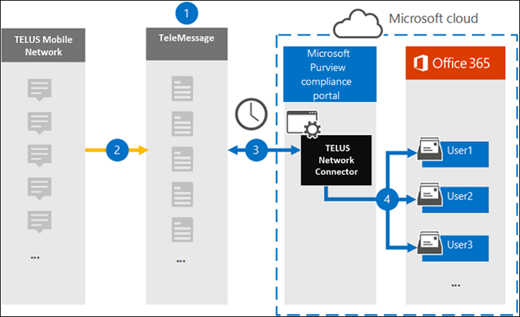

# Set up a connector to archive TELUS Network data

Use the TeleMessage connector in the Microsoft 365 compliance center to import and archive Short Messaging Service (SMS) data from your organization's TELUS Network. After you set up and configure a connector, it connects to your organization's TELUS Network once every day, and imports SMS data to mailboxes in Microsoft 365.

After SMS messages are stored in user mailboxes, you can apply Microsoft 365 compliance features such as Litigation Hold, Content Search, and Microsoft 365 retention policies to TELUS data. For example, you can search TELUS SMS messages using Content Search or associate the mailbox that contains the TELUS data with a custodian in an Advanced eDiscovery case. Using a TELUS Network connector to import and archive data in Microsoft 365 can help your organization stay compliant with government and regulatory policies.

## Overview of archiving TELUS Network data

The following overview explains the process of using a connector to archive TELUS Network data in Microsoft 365.

1. Your organization works with TeleMessage and TELUS to set up a TELUS Network connector. For more information, see [TELUS Network Archiver](https://www.telemessage.com/office365-activation-for-telus-network-archiver/).

2. In real time, SMS messages from your organization's TELUS Network are copied to the TeleMessage site.

3. The TELUS Network connector that you create in the Microsoft 365 compliance center connects to the TeleMessage site every day and transfers the SMS messages from the previous 24 hours to a secure Azure Storage location in the Microsoft cloud. The connector also converts the content of SMS messages to an email message format.

4. The connector imports the mobile communication items to the mailbox of a specific user. A new folder named **TELUS SMS Network Archiver** is created in the specific user's mailbox and the items are imported to it. The connector does mapping by using the value of the *User's Email address* property. Every SMS message contains this property, which is populated with the email address of every participant of the SMS message.

   In addition to automatic user mapping using the value of the *User’s Email address* property, you can also implement custom mapping by uploading a CSV mapping file. This mapping file contains the mobile phone number and corresponding Microsoft 365 email address for users in your organization. If you enable both automatic user mapping and custom mapping, for every TELUS item the connector first looks at custom mapping file. If it doesn't find a valid Microsoft 365 user that corresponds to a user's mobile phone number, the connector will use the values in the email address property of the item it's trying to import. If the connector doesn't find a valid Microsoft 365 user in either the custom mapping file or in the email address property of the TELUS item, the item won't be imported.

## Before you begin

Some of the implementation steps required to archive TELUS Network data are external to Microsoft 365 and must be completed before you can create a connector in the compliance center.

- Order the [TELUS Network Archiver service from TeleMessage](https://www.telemessage.com/mobile-archiver/order-mobile-archiver-for-o365) and get a valid administration account for your organization. You'll need to sign into this account when you create the connector in the compliance center.

- Obtain your TELUS Network account and billing contact details so you can fill-out the TeleMessage onboarding forms and order the message archiving service from TELUS.

- Register all users that require TELUS SMS Network archiving in the TeleMessage account. When registering users, be sure to use the same email address that's used for their Microsoft 365 account.

- Your employees must have corporate-owned and corporate-liable mobile phones on theTELUS mobile network. Archiving messages in Microsoft 365 isn't available for employee-owned or Bring Your Own Devices (BYOD) devices.

- The user who creates a TELUS Network connector must be assigned the Mailbox Import Export role in Exchange Online. This is required to add connectors in the **Data connectors** page in the Microsoft 365 compliance center. By default, this role isn't assigned to any role group in Exchange Online. You can add the Mailbox Import Export role to the Organization Management role group in Exchange Online. Or you can create a role group, assign the Mailbox Import Export role, and then add the appropriate users as members. For more information, see the [Create role groups](/Exchange/permissions-exo/role-groups#create-role-groups) or [Modify role groups](/Exchange/permissions-exo/role-groups#modify-role-groups) sections in the article "Manage role groups in Exchange Online".

## Create a TELUS Network connector

After you've completed the prerequisites described in the previous section, you can create TELUS Network connector in the Microsoft 365 compliance center. The connector uses the information you provide to connect to the TeleMessage site and transfer SMS messages to the corresponding user mailbox boxes in Microsoft 365.

1. Go to [https://compliance.microsoft.com](https://compliance.microsoft.com/) and then click **Data connectors** > **TELUS Network**.

2. On the **TELUS Network** product description page, click **Add connector**

3. On the **Terms of service** page, click **Accept**.

4. On the **Login to TeleMessage** page, under Step 3, enter the required information in the following boxes and then click **Next**.

   - **Username:** Your TeleMessage username.

   - **Password:** Your TeleMessage password.

5. After the connector is created, you can close the pop-up window and go to the next page.

6. On the **User mapping** page, enable automatic user mapping and click **Next**. In case you need custom mapping upload a CSV file, and click **Next**.

7. Review your settings, and then click **Finish** to create the connector.

8. Go to the Connectors tab in **Data connectors** page to see the progress of the import process for the new connector.

## Known issues

- At this time, we don't support importing attachments or items that are larger than 10 MB. Support for larger items will be available at a later date.
