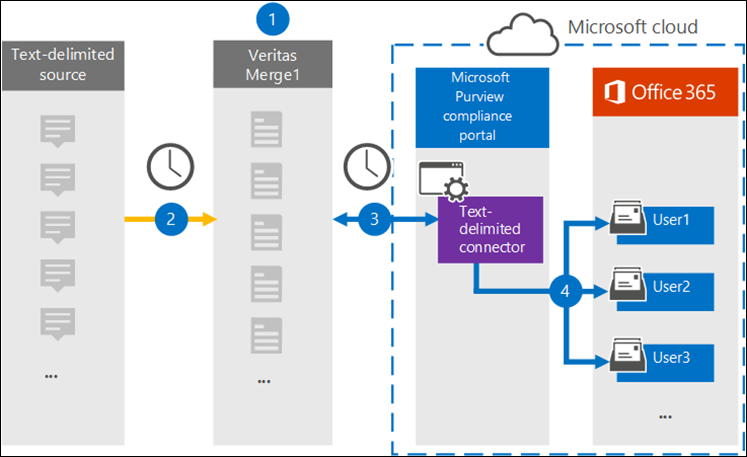

# Set up a connector to archive text-delimited data

Microsoft 365 allows the administrators to import and archive third-party data from social media, instant messaging, and document collaboration platforms to mailboxes in your Microsoft 365 organization. [Globanet](https://globanet.com/) provides you with a Text-Delimited connector that allows rapidly developing text- delimited file processing and then importing those items. The connector converts the content of an item from the Text-Delimited source to an email message format and then submits the item to your mailboxes.

Once archived, the Text-Delimited source communications can be retained, supervised for compliance, and retrieved for eDiscovery and internal Information Governance.

## Overview of archiving the Text-Delimited source

The following overview explains the process of using a connector to archive the Text-Delimited source information in Microsoft 365.

1. Your organization works with the Text-Delimited source to set up and configure a Text-Delimited site.

2. Once every 24 hours, chat messages from the Text-Delimited source are copied to the Globanet Merge1 site. The connector also converts the content to an email message format.

3. The Text-Delimited connector that you create in the Microsoft 365 compliance center, connects to the Globanet Merge1 site every day and transfers the messages to a secure Azure Storage location in the Microsoft cloud.

4. The connector imports the converted message items to the mailboxes of specific users using the value of the *Email* property of the automatic user mapping as described in Step 3. A new subfolder in the Inbox folder named **Text- Delimited** will be created in the user mailboxes, and the message items will be imported to that folder. The connector does this by using the value of the *Email* property. Every message contains this property, which is populated with the email address of every participant of the message.

## Before you begin

An implementation step required to archive Text-Delimited data is external to Microsoft 365 and must be completed before you can create the connector in the compliance center.

1. Create a Merge1 account by accepting their terms and conditions for the Text-Delimited connector. Here you will need to contact Globanet Customer Support at <https://globanet.com/contact-us/>.

## Step 1: Set up the Text- Delimited connector

The first step is to gain access to the **Data Connectors** and set up the [Text-Delimited](https://globanet.com/merge1/) connector.

1. Go to <https://compliance.microsoft.com> and click **Data connectors** in the left nav.

2. Go to the **Connectors** tab.

3. Click the **Add new connector** button.

4. Select the **Text-Delimited** option from the list.

5. On the **Terms of service** page, click **Accept**.

6. Define a unique name that can represent or identify the connector and click **Next**.

7. Login to your Merge1 account to configure the connector.

## Step 2: Configure text-delimited connector

The second step is to configure the Text-Delimited connector in the Merge1 site. For more details on how to configure the Text-Delimited connector in the Globanet Merge1 site, see [Merge1 Third-Party Connectors User Guide](https://docs.ms.merge1.globanetportal.com/Merge1%20Third-Party%20Connectors%20Text-Delimited%20User%20Guide%20.pdf).

Once you click **Save& Finish,** you will be navigated to the Microsoft 365 compliance center, to the **User mapping** section.

## Step 3: Map users and complete the connector set up

To map users and complete the connector set up, follow the steps below:

1. On the **Map external users to Microsoft 365 users** page, enable automatic user mapping. The Text- Delimited source items include a property called *Email*, which contains email addresses for users in your organization. If the connector can associate this address with a Microsoft 365 user, the items are imported to that user’s mailbox.

2. On the **Admin Consent** page, click the **Provide Consent** button. You will be redirected to the Microsoft site. Click **Accept** to provide the consent.

   Your organization must consent to allow the Office 365 Import service to access mailbox data in your organization. To consent to this request, go to [this](https://login.microsoftonline.com/common/oauth2/authorize?client_id=570d0bec-d001-4c4e-985e-3ab17fdc3073&response_type=code&redirect_uri=https://portal.azure.com/&nonce=1234&prompt=admin_consent) page, sign in with the credentials of a global admin, and then accept the request. You have to complete this step before you can successfully add the Text- Delimited connector.

   The admin who creates the Text-Delimited connector in Step 2 must be assigned to the Mailbox Import Export role in Exchange Online. This role is required to add connectors on the **Data connectors** page in the Microsoft 365 compliance center. By default, this role is not assigned to any role group in Exchange Online. You can add the Mailbox Import Export role to the Organization Management role group in Exchange Online. Or you can create a role group, assign the Mailbox Import Export role, and then add the appropriate users as members. For more information, see the [Create role groups](https://docs.microsoft.com/Exchange/permissions-exo/role-groups#create-role-groups) or [Modify role groups](https://docs.microsoft.com/Exchange/permissions-exo/role-groups#modify-role-groups) sections in the article “Manage role groups in Exchange Online”.

3. Click **Next**, review your settings and go to the **Data connectors** page to see the progress of the import process for the new connector.

## Step 4: Monitor the text-delimited connector

After you create the Text- Delimited connector, you can view the connector status in the Microsoft 365 compliance center.

1. Go to <https://compliance.microsoft.com/> and click **Data connectors** in the left nav.

2. Click the **Connectors** tab and then select the **Text- Delimited** connector to display the flyout page, which contains the properties and information about the connector.

3. Under **Connector status with source**, click the **Download log** link to open (or save) the status log for the connector. This log contains data that has been imported to the Microsoft cloud.
