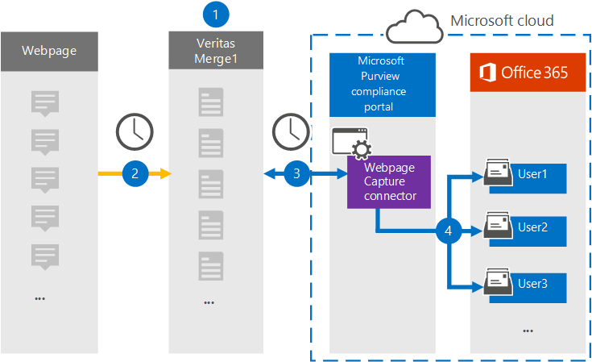

# Set up a connector to archive webpage data

Use a Veritas connector in the Microsoft 365 compliance center to import and archive data from webpages to user mailboxes in your Microsoft 365 organization. Veritas provides a [Webpage Capture](https://globanet.com/webpage-capture) connector that captures specific webpages (and any links on those pages) in a specific website or an entire domain. The connector converts the webpage content to a PDF, PNG, or custom file format and then attaches the converted files to an email message and then imports those email items to user mailboxes in Microsoft 365.

After webpage content is stored in user mailboxes, you can apply Microsoft 365 compliance features such as Litigation Hold, eDiscovery, and retention policies and retention labels. Using a Webpage Capture connector to import and archive data in Microsoft 365 can help your organization stay compliant with government and regulatory policies.

## Overview of archiving webpage data

The following overview explains the process of using a connector to archive webpage content in Microsoft 365.

1. Your organization works with the webpage source to set up and configure a Webpage Capture site.

2. Once every 24 hours, the webpage sources items are copied to the Veritas Merge1 site. The connector also converts and attaches the content of a webpage to an email message.

3. The Webpage Capture connector that you create in the Microsoft 365 compliance center, connects to the Veritas Merge1 site every day and transfers the webpage items to a secure Azure Storage location in the Microsoft cloud.

4. The connector imports the converted webpage items to the mailboxes of specific users by using the value of the *Email* property of the automatic user mapping as described in [Step 3](#step-3-map-users-and-complete-the-connector-setup). A subfolder in the Inbox folder named **Webpage Capture** is created in the user mailboxes, and the webpage items are imported to that folder. The connector does this by using the value of the *Email* property. Every webpage item contains this property, which is populated with the email addresses provided when you configure the Webpage Capture connector in [Step 2](#step-2-configure-the-webpage-capture-connector-on-the-veritas-merge1-site).

## Before you begin

- Create a Veritas Merge1 account for Microsoft connectors. To create this account, contact [Veritas Customer Support](https://www.veritas.com/content/support/). You will sign into this account when you create the connector in Step 1.

- You need to work with Veritas support to set up a custom file format to convert the webpage items to. For more information, see the [Merge1 Third-Party Connectors User Guide](https://docs.ms.merge1.globanetportal.com/Merge1%20Third-Party%20Connectors%20Web%20Page%20Capture%20User%20Guide%20.pdf).

- The user who creates the Webpage Capture connector in Step 1 (and completes it in Step 3) must be assigned to the Mailbox Import Export role in Exchange Online. This role is required to add connectors on the **Data connectors** page in the Microsoft 365 compliance center. By default, this role is not assigned to a role group in Exchange Online. You can add the Mailbox Import Export role to the Organization Management role group in Exchange Online. Or you can create a role group, assign the Mailbox Import Export role, and then add the appropriate users as members. For more information, see the [Create role groups](/Exchange/permissions-exo/role-groups#create-role-groups) or [Modify role groups](/Exchange/permissions-exo/role-groups#modify-role-groups) sections in the article "Manage role groups in Exchange Online".

## Step 1: Set up the Webpage Capture connector

The first step is to access to the **Data Connectors** and create a connector for Web Page source data.

1. Go to [https://compliance.microsoft.com](https://compliance.microsoft.com/) and then click **Data connectors** > **Webpage Capture**.

2. On the **Webpage Capture** product description page, click **Add connector**.

3. On the **Terms of service** page, click **Accept**.

4. Enter a unique name that identifies the connector, and then click **Next**.

5. Sign in to your Merge1 account to configure the connector.

## Step 2: Configure the Webpage Capture connector on the Veritas Merge1 site

The second step is to configure the Webpage Capture connector on the Veritas Merge1 site. For information about how to configure the Webpage Capture connector, see [Merge1 Third-Party Connectors User Guide](https://docs.ms.merge1.globanetportal.com/Merge1%20Third-Party%20Connectors%20Web%20Page%20Capture%20User%20Guide%20.pdf).

After you click **Save & Finish**, the **User mapping** page in the connector wizard in the Microsoft 365 compliance center is displayed.

## Step 3: Map users and complete the connector setup

To map users and complete the connector setup in the Microsoft 365 compliance center, follow the steps below:

1. On the **Map Webpage Capture users to Microsoft 365 users** page, enable automatic user mapping. The Webpage Capture items include a property called *Email*, which contains email addresses for users in your organization. If the connector can associate this address with a Microsoft 365 user, the items are imported to that user's mailbox.

2. Click **Next**, review your settings, and go to the **Data connectors** page to see the progress of the import process for the new connector.

## Step 4: Monitor the Webpage Capture connector

After you create the Webpage Capture connector, you can view the connector status in the Microsoft 365 compliance center.

1. Go to [https://compliance.microsoft.com](https://compliance.microsoft.com) and click **Data connectors** in the left nav.

2. Click the **Connectors** tab and then select the **Webpage Capture** connector to display the flyout page. This page contains the properties and information about the connector.

3. Under **Connector status with source**, click the **Download log** link to open (or save) the status log for the connector. This log contains data that has been imported to the Microsoft cloud.

## Known issues

- At this time, we don't support importing attachments or items that are larger than 10 MB. Support for larger items will be available at a later date.