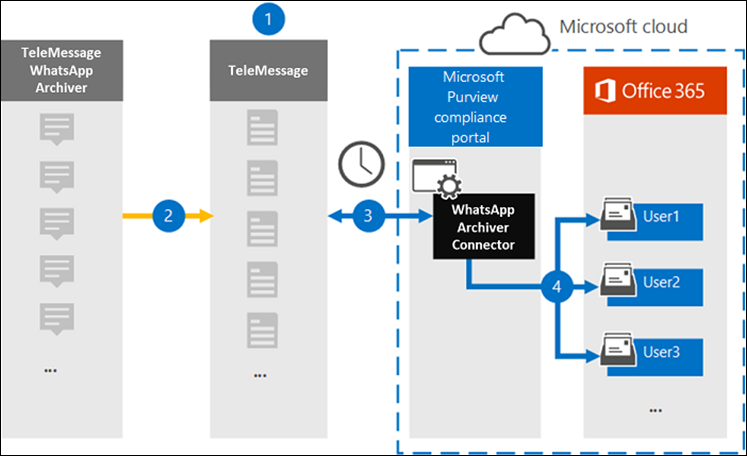

# Set up a connector to archive WhatsApp data

Use the TeleMessage connector in the Microsoft 365 compliance center to import and archive WhatsApp calls, chats, attachments, files, and deleted messages. After you set up and configure a connector, it connects to your organization's TeleMessage account once every day, and imports the mobile communication of employees using the TeleMessage WhatsApp Phone Archiver or TeleMessage WhatsApp Cloud Archiver to mailboxes in Microsoft 365.

After WhatsApp data is stored in user mailboxes, you can apply Microsoft 365 compliance features such as Litigation Hold, Content Search, and Microsoft 365 retention policies to WhatsApp data. For example, you can search WhatsApp messages using Content Search or associate the mailbox that contains WhatsApp messages with a custodian in an Advanced eDiscovery case. Using a WhatsApp connector to import and archive data in Microsoft 365 can help your organization stay compliant with government and regulatory policies.

## Overview of archiving WhatsApp data

The following overview explains the process of using a connector to archive WhatsApp data in Microsoft 365.

1. Your organization works with TeleMessage to set up a WhatsApp Archiver connector. For more information, see [WhatsApp Archiver](https://www.telemessage.com/office365-activation-for-whatsapp-archiver).

2. In real time, your organization's WhatsApp data is copied to the TeleMessage site.

3. The WhatsApp connector that you create in the Microsoft 365 compliance center connects to the TeleMessage site every day and transfers WhatsApp data from the previous 24 hours to a secure Azure Storage location in the Microsoft cloud. The connector also converts the content WhatsApp data to an email message format.

4. The connector imports WhatsApp data to the mailbox of a specific user. A new folder named **WhatsApp Archiver** is created in the specific user's mailbox and the items are imported to it. The connector does this mapping by using the value of the *User’s Email address* property. Every WhatsApp message contains this property, which is populated with the email address of every participant of the message.

   In addition to automatic user mapping using the value of the *User’s Email address* property, you can also implement custom mapping by uploading a CSV mapping file. This mapping file contains the mobile phone number and corresponding Microsoft 365 email address for users in your organization. If you enable both automatic user mapping and custom mapping, for every WhatsApp item the connector first looks at custom mapping file. If it doesn't find a valid Microsoft 365 user that corresponds to a user's mobile phone number, the connector will use the values in the email address property of the item it's trying to import. If the connector doesn't find a valid Microsoft 365 user in either the custom mapping file or in the email address property of the WhatsApp item, the item won't be imported.

## Before you set up a connector

Some of the implementation steps required to archive WhatsApp communication data are external to Microsoft 365 and must be completed before you can create the connector in the compliance center.

- Order the [WhatsApp Archiver service from TeleMessage](https://www.telemessage.com/mobile-archiver/order-mobile-archiver-for-o365) and get a valid administration account for your organization. You'll need to sign into this account when you create the connector in the compliance center.

- Register all users that require WhatsApp archiving in the TeleMessage account. When registering users, be sure to use the same email address that's used for their Microsoft 365 account.

- Install the TeleMessage [WhatsApp Phone Archiver app](https://www.telemessage.com/mobile-archiver/whatsapp-phone-archiver-2/) on the mobile phones of your employees and activate it. Alternatively, you can install the regular WhatsApp or WhatsApp Business apps on the mobile phones of your employees and activate the WhatsApp Cloud Archiver service by scanning a QR code on the TeleMessage website. For more information, see [WhatsApp Cloud Archiver](https://www.telemessage.com/mobile-archiver/whatsapp-archiver/whatsapp-cloud-archiver/).

- The user who creates a Verizon Network connector must be assigned the Mailbox Import Export role in Exchange Online. This is required to add connectors in the **Data connectors** page in the Microsoft 365 compliance center. By default, this role isn't assigned to any role group in Exchange Online. You can add the Mailbox Import Export role to the Organization Management role group in Exchange Online. Or you can create a role group, assign the Mailbox Import Export role, and then add the appropriate users as members. For more information, see the [Create role groups](/Exchange/permissions-exo/role-groups#create-role-groups) or [Modify role groups](/Exchange/permissions-exo/role-groups#modify-role-groups) sections in the article "Manage role groups in Exchange Online".

- This data connector is available in GCC environments in the Microsoft 365 US Government cloud. Third-party applications and services might involve storing, transmitting, and processing your organization's customer data on third-party systems that are outside of the Microsoft 365 infrastructure and therefore are not covered by the Microsoft 365 compliance and data protection commitments. Microsoft makes no representation that use of this product to connect to third-party applications implies that those third-party applications are FEDRAMP compliant.

## Create a WhatsApp Archiver connector

After you've completed the prerequisites described in the previous section, you can create the WhatsApp connector in the Microsoft 365 compliance center. The connector uses the information you provide to connect to the TeleMessage site and transfer the WhatsApp data to the corresponding user mailbox boxes in Microsoft 365.

1. Go to [https://compliance.microsoft.com](https://compliance.microsoft.com/) and then click **Data connectors** > **WhatsApp Archiver**.

2. On the **WhatsApp Archiver** product description page, click **Add connector**

3. On the **Terms of service** page, click **Accept**.

4. On the **Login to TeleMessage** page, under Step 3, enter the required information in the following boxes and then click **Next**.

   - **Username:** Your TeleMessage username.

   - **Password:** Your TeleMessage password.

5. After the connector is created, you can close the pop-up window and go to the next page.

6. On the **User mapping** page, enable automatic user mapping and click **Next**. In case you need custom mapping upload a CSV file, and click **Next**.

7. Review your settings, and then click **Finish** to create the connector.

8. Go to the Connectors tab in **Data connectors** page to see the progress of the import process for the new connector.

## Known issues

- At this time, we don't support importing attachments or items that are larger than 10 MB. Support for larger items will be available at a later date.
