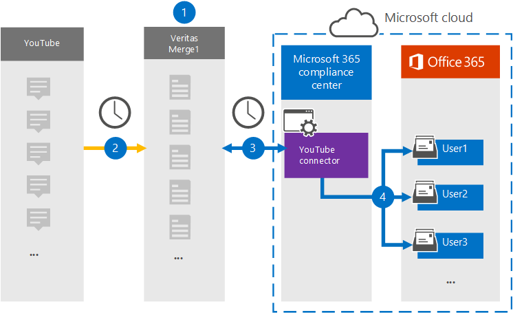

# Set up a connector to archive YouTube data

Use a Veritas connector in the Microsoft Purview compliance portal to import and archive data from YouTube to user mailboxes in your Microsoft 365 organization. Veritas provides a connector that is configured to capture items from a third-party data source and import those items to Microsoft 365. The connector converts content such as chats, attachments, tasks, notes, and posts from YouTube to an email message format and then imports those items to the user mailboxes in Microsoft 365.

After YouTube data is stored in user mailboxes, you can apply Microsoft Purview features such as Litigation Hold, eDiscovery, retention policies and retention labels. Using a YouTube connector to import and archive data in Microsoft 365 can help your organization stay compliant with government and regulatory policies.

[!INCLUDE [purview-preview](../includes/purview-preview.md)]

## Overview of archiving YouTube data

The following overview explains the process of using a connector to archive the YouTube data in Microsoft 365.

1. Your organization works with YouTube to set up and configure a YouTube site.

2. Once every 24 hours, YouTube items are copied to the Veritas Merge1 site. The connector also converts YouTube items to an email message format.

3. The YouTube connector that you create in the compliance portal connects to the Veritas Merge1 site every day, and transfers the YouTube content to a secure Azure Storage location in the Microsoft cloud.

4. The connector imports the converted items to the mailboxes of specific users using the value of the *Email* property of the automatic user mapping as described in [Step 3](#step-3-map-users-and-complete-the-connector-setup). A subfolder in the Inbox folder named **YouTube** is created in the user mailboxes, and items are imported to that folder. The connector determines which mailbox to import items to by using the value of the *Email* property. Every YouTube item contains this property, which is populated with the email address of every participant of the item.

## Before you set up a connector

- Create a Merge1 account for Microsoft connectors. To create this account, contact [Veritas Customer Support](https://www.veritas.com/form/requestacall/ms-connectors-contact). You need to sign into this account when you create the connector in Step 1.

- Create a YouTube application to fetch data from your YouTube account. For step-by step instructions about creating the application, see [Merge1 Third-Party Connectors User Guide](https://docs.ms.merge1.globanetportal.com/Merge1%20Third-Party%20Connectors%20YouTube%20User%20Guide.pdf).

- The user who creates the YouTube connector in Step 1 (and completes it in Step 3) must be assigned the Data Connector Admin role. This role is required to add connectors on the **Data connectors** page in the compliance portal. This role is added by default to multiple role groups. For a list of these role groups, see the "Roles in the Defender and compliance portals" section in [Roles and role groups in the Microsoft 365 Defender and Microsoft Purview compliance portals](../security/office-365-security/permissions-in-the-security-and-compliance-center.md#roles-in-the-defender-and-compliance-portals). Alternatively, an admin in your organization can create a custom role group, assign the Data Connector Admin role, and then add the appropriate users as members. For instructions, see the "Create a custom role group" section in [Permissions in the Microsoft Purview compliance portal](microsoft-365-compliance-center-permissions.md#create-a-custom-role-group).

## Step 1: Set up the YouTube connector

The first step is to access to the **Data Connectors** page in the compliance portal and create a connector for YouTube data.

1. Go to <https://compliance.microsoft.com> and then select **Data connectors** > **YouTube**.

2. On the **YouTube** product description page, select **Add connector**.

3. On the **Terms of service** page, select **Accept**.

4. Enter a unique name that identifies the connector, and then select **Next**.

5. Sign in to your Merge1 account to configure the connector.

## Step 2: Configure the YouTube on the Veritas Merge1 site

The second step is to configure the YouTube connector on the Veritas Merge1 site. For information about how to configure the YouTube connector, see [Merge1 Third-Party Connectors User Guide](https://docs.ms.merge1.globanetportal.com/Merge1%20Third-Party%20Connectors%20YouTube%20User%20Guide.pdf).

After you select **Save & Finish,** the **User mapping** page in the connector wizard in the compliance portal is displayed.

## Step 3: Map users and complete the connector setup

To map users and complete the connector setup in the compliance portal, follow these steps:

1. On the **Map YouTube users to Microsoft 365 users** page, enable automatic user mapping. The YouTube items include a property called *Email*, which contains email addresses for users in your organization. If the connector can associate this address with a Microsoft 365 user, the items are imported to that user's mailbox.

2. Select **Next**, review your settings, and then go to the **Data connectors** page to see the progress of the import process for the new connector.

## Step 4: Monitor the YouTube connector

After you create the YouTube connector, you can view the connector status in the compliance portal.

1. Go to <https://compliance.microsoft.com/> and select **Data connectors** in the left nav.

2. Select the **Connectors** tab and then select the **YouTube** connector to display the flyout page, which contains the properties and information about the connector.

3. Under **Connector status with source**, select the **Download log** link to open (or save) the status log for the connector. This log contains information about the data that's been imported to the Microsoft cloud. For more information, see [View admin logs for data connectors](data-connector-admin-logs.md).

## Known issues

- At this time, we don't support importing attachments or items that are larger than 10 MB. Support for larger items will be available at a later date.
