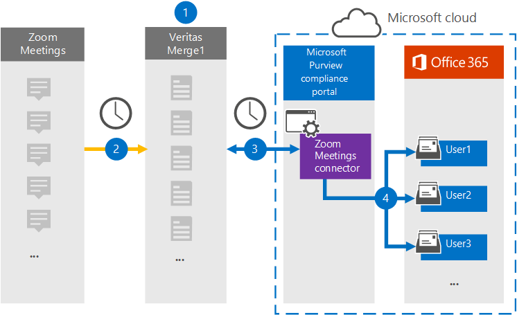

# Set up a connector to archive Zoom Meetings data

Use a Veritas connector in the Microsoft 365 compliance center to import and archive data from Zoom Meetings to user mailboxes in your Microsoft 365 organization. Veritas provides a [Zoom Meetings](https://globanet.com/zoom/) connector that is configured to capture items from the third-party data source (on a regular basis) and import those items to Microsoft 365. The connector converts the content of the meetings (including chats, recorded files, and metadata) from the Zoom Meetings account to an email message format and then imports those items to user mailboxes in Microsoft 365.

After Zoom Meetings data is stored in user mailboxes, you can apply Microsoft 365 compliance features such as Litigation Hold, eDiscovery, retention policies and retention labels, and communication compliance. Using a Zoom Meetings connector to import and archive data in Microsoft 365 can help your organization stay compliant with government and regulatory policies.

## Overview of archiving Zoom Meetings data

The following overview explains the process of using a connector to archive Zoom Meetings data in Microsoft 365.

1. Your organization works with Zoom Meetings to set up and configure a Zoom Meetings site.

2. Once every 24 hours, meeting items from Zoom Meetings are copied to the Veritas Merge1 site. The connector also converts the content of the meetings to an email message format.

3. The Zoom Meetings connector that you create in the Microsoft 365 compliance center, connects to the Veritas Merge1 every day, and transfers the meeting messages to a secure Azure Storage location in the Microsoft cloud.

4. The connector imports the converted meeting items to the mailboxes of specific users using the value of the *Email* property and automatic user mapping, as described in Step 3. A new subfolder in the Inbox folder named **Zoom Meetings** is created in user mailboxes, and the meeting items are imported to that folder. The connector does this by using the value of the *Email* property. Every meeting item contains this property, which is populated with the email address of every participant of the meeting.

## Before you begin

- Create a Veritas Merge1 account for Microsoft connectors. To create this account, contact [Veritas Customer Support](https://globanet.com/ms-connectors-contact). You will sign into this account when you create the connector in Step 1.

- Obtain the username and password for your organization's Zoom Business or Zoom Enterprise account. You'll need to sign into this account in Step 2 when you configure the Zoom Meetings connector.

- Create the following applications in the [Zoom Marketplace](https://marketplace.zoom.us):

  - OAuth application

  - JWT application

  After you create these applications, the Zoom platform generates a set of unique credentials used to generate the tokens. These tokens are used to authenticate the connector when it connects to your Zoom account and copies items to the Merge1 site. You will use these tokens when you configure the Zoom connector in Step 2.

  For step-by step instructions on how to create the OAuth and JWT applications, see [Merge1 Third-Party Connectors User Guide](https://docs.ms.merge1.globanetportal.com/Merge1%20Third-Party%20Connectors%20Zoom%20Meetings%20User%20Guide%20.pdf).

- The user who creates the Zoom Meetings connector in Step 1 (and completes it in Step 3) must be assigned to the Mailbox Import Export role in Exchange Online. This role is required to add connectors on the **Data connectors** page in the Microsoft 365 compliance center. By default, this role is not assigned to a role group in Exchange Online. You can add the Mailbox Import Export role to the Organization Management role group in Exchange Online. Or you can create a role group, assign the Mailbox Import Export role, and then add the appropriate users as members. For more information, see the [Create role groups](/Exchange/permissions-exo/role-groups#create-role-groups) or [Modify role groups](/Exchange/permissions-exo/role-groups#modify-role-groups) sections in the article "Manage role groups in Exchange Online".

## Step 1: Set up the Zoom Meetings connector

The first step is to access the **Data Connectors** in the Microsoft 365 compliance center and create a Zoom Meetings connector.

1. Go to [https://compliance.microsoft.com](https://compliance.microsoft.com/) and then click **Data connectors** > **Zoom Meetings**.

2. On the **Zoom Meetings** product description page, click **Add connector**.

3. On the **Terms of service** page, click **Accept**.

4. Enter a unique name that identifies the connector, and then click **Next**.

5. Sign in to your Merge1 account to configure the connector.

## Step 2: Configure the Zoom Meetings connector

The second step is to configure the Zoom Meetings connector on the Merge1 site. For more information about how to configure the Zoom Meetings connector on the Veritas Merge1 site, see [Merge1 Third-Party Connectors User Guide](https://docs.ms.merge1.globanetportal.com/Merge1%20Third-Party%20Connectors%20Zoom%20Meetings%20User%20Guide%20.pdf).

After you click **Save & Finish**, the **User mapping** page in the connector wizard in the Microsoft 365 compliance center is displayed.

## Step 3: Map users and complete the connector setup

1. On the **Map external users to Microsoft 365 users** page, enable automatic user mapping.

   Zoom Meetings items include a property called *Email* that contains email addresses for users in your organization. If the connector can associate this address with a Microsoft 365 user, the items are imported to that user's mailbox

2. Click **Next**, review your settings, and go to the **Data connectors** page to see the progress of the import process for the new connector.

## Step 4: Monitor the Zoom Meetings connector

After you create the Zoom Meetings connector, you can view the connector status in the Microsoft 365 compliance center.

1. Go to [https://compliance.microsoft.com](https://compliance.microsoft.com) and click **Data connectors** in the left nav.

2. Click the **Connectors** tab and then select the **Zoom Meetings** connector to display the flyout page. This page contains the properties and information about the connector.

3. Under **Connector status with source**, click the **Download log** link to open (or save) the status log for the connector. This log contains information about the data that has been imported to the Microsoft cloud.

## Known issues

- At this time, we don't support importing attachments or items that are larger than 10 MB. Support for larger items will be available at a later date.

- For the Zoom Meetings connector to work, you must enable recordings when setting up Zoom Meetings.