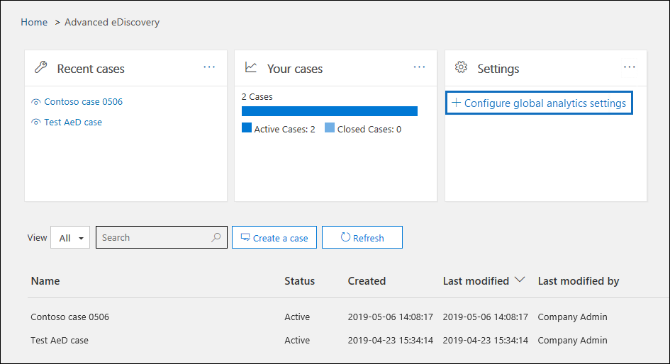
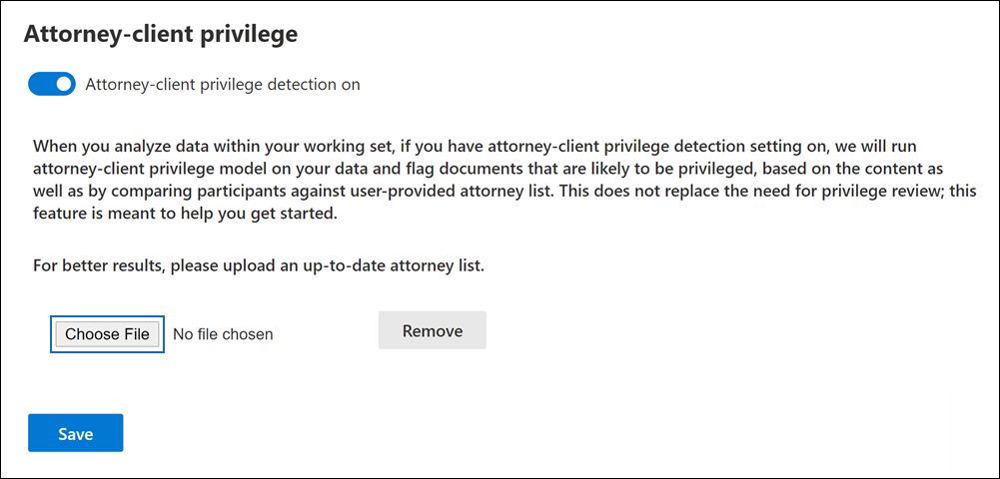
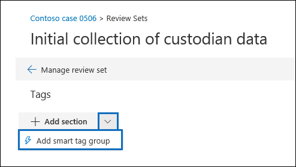

# Set up attorney-client privilege detection in Advanced eDiscovery

A major and costly aspect of the review phase of any eDiscovery process is reviewing documents for privileged content. Advanced eDiscovery provides machine learning-based detection of privileged content to make this process more efficient. This feature is called *attorney-client privilege detection*.

## How does it work?

When attorney-client privilege detection is enabled, all documents in a review set will be processed by the attorney-client privilege detection model when you [analyze the data](analyzing-data-in-review-set.md) in the review set. The model looks for two things:

- Privileged content – The model uses machine learning to determine the likelihood that the document contains content that is legal in nature.

- Participants – As part of setting up attorney-client privilege detection, you have to submit a list of attorneys for your organization. The model then compares the participants of the document with the attorney list to determine if a document has at least one attorney participant.

The model produces the following three properties for every document:

- **AttorneyClientPrivilegeScore:** The likelihood the document is legal in nature; the values for the score are between **0** and **1**.

- **HasAttorney:** This property is set to **true** if one of the document participants is listed in the attorney list; otherwise the value is **false**. The value is also set to **false** if your organization didn't upload an attorney list.

- **IsPrivilege:** This property is set to **true** if the value for **AttorneyClientPrivilegeScore** is above the threshold *or* if the document has an attorney participant; otherwise the value is set to **false**.

These properties (and their corresponding values) are added to the file metadata of the documents in a review set, as shown in the following screenshot:

These three properties are also searchable within a review set. For more information, see [Query the data in a review set](review-set-search.md).

## Set up the attorney-client privilege detection model

To enable the attorney-client privilege detection model, your organization has to turn it on and then upload an attorney list.

### Step 1: Turn on attorney-client privilege detection

A person who is an eDiscovery Administrator in your organization (a member of the eDiscovery Administrator subgroup in the eDiscovery Manager role group) must make the model available in your Advanced eDiscovery cases.

1. In the Security & Compliance Center, go to **eDiscovery > Advanced eDiscovery**.

2. On the **Advanced eDiscovery** home page, in the **Settings** tile, click **Configure global analytics settings**.

   

3. On the **Analytics settings** tab, select **Manage attorney-client privilege setting**.

4. On the **Attorney-client privilege** flyout page, use the toggle to turn on the feature and then select **Save**.

### Step 2: Upload a list of attorneys (optional)

To take full advantage of the attorney-client privilege detection model and use the results of the **Has Attorney** or **Potentially Privileged** detection that was previously described, we recommend that you upload a list of email addresses for the lawyers and legal personnel who work for your organization. 

To upload an attorney list for use by the attorney-client privilege detection model:

1. Create a .csv file (without a header row) and add the email address for each appropriate person on a separate line. Save this file to your local computer.

2. On the **Advanced eDiscovery** home page, in the **Settings** tile, select **Configure experimental features**, and then select **Manage attorney-client privilege setting**.

   The **Attorney-client privilege** page is displayed, and the **Attorney-client privilege detection** toggle is turned on.

   

3. Select **Browse** and then find and select the .csv file that you created in step 1.

4. Select **Save** to upload the attorney list.

## Use the attorney-client privilege detection model

Follow the steps in this section to use attorney-client privilege detection for documents in a review set.

### Step 1: Create a smart tag group with attorney-client privilege detection model

One of the primary ways to see the results of attorney-client privilege detection in your review process is by using a smart tag group. A smart tag group indicates the results of the attorney-client privilege detection and shows the results in-line next to the tags in a smart tag group. This lets you quickly identify potentially privileged documents during document review. Additionally, you can also use the tags in the smart tag group to tag documents as privileged or non-privileged. For more information about smart tags, see [Set up smart tags in Advanced eDiscovery](smart-tags.md).

1. In the review set that contains the documents that you analyzed in Step 1, select **Manage review set** and then select **Manage tags**.
 
2. Under **Tags**, select the pull-down next to **Add group** and then select **Add smart tag group**.

   

3. On the **Choose a model for your smart tag** page, choose **Select** next to **Attorney-client privilege**.

   A tag group named **Attorney-client privilege** is displayed. It contains two child tags named **Positive** and **Negative**, which correspond to the possible results produced by the model.

   

3. Rename the tag group and tags as appropriate for your review. For example, you can rename **Positive** to **Privileged** and **Negative** to **Not privileged**.

### Step 2: Analyze a review set

When you analyze the documents in a review set, the attorney-client privilege detection model will also run and the corresponding properties (described in [How does it work?](#how-does-it-work) will be added to every document in the review set. For more information about analyzing data in review set, see [Analyze data in a review set in Advanced eDiscovery](analyzing-data-in-review-set.md).

### Step 3: Use the smart tag group for review of privileged content

After analyzing the review set and setting up smart tags, the next step is to review the documents. If the model has determined the document is potentially privileged, the corresponding smart tag in the **Tagging panel** will indicate the following results produced by the attorney-client privilege detection:

- If the document has content that may be legal in nature, the label **Legal content** is displayed next to the corresponding smart tag (which in this case is the default **Positive** tag).

- If the document has a participant who is found in your organization's attorney list, the label **Attorney** is displayed next to the corresponding smart tag (which in this case is also the default **Positive** tag).

- If the document has content that may be legal in nature *and* has a participant found in the attorney list, both the **Legal content**  and **Attorney** labels are displayed. 

If the model determines that a document doesn't contain content that is legal in nature or doesn't contain a participant from the attorney list, then neither label is displayed in the tagging panel.

For example, the following screenshots show two documents. The first one contains content that is legal in nature and has a participant found in the list of attorneys. The second contains neither and therefore doesn't display any labels.

After you review a document to see if it contains privileged content, you can tag the document with the appropriate tag.
