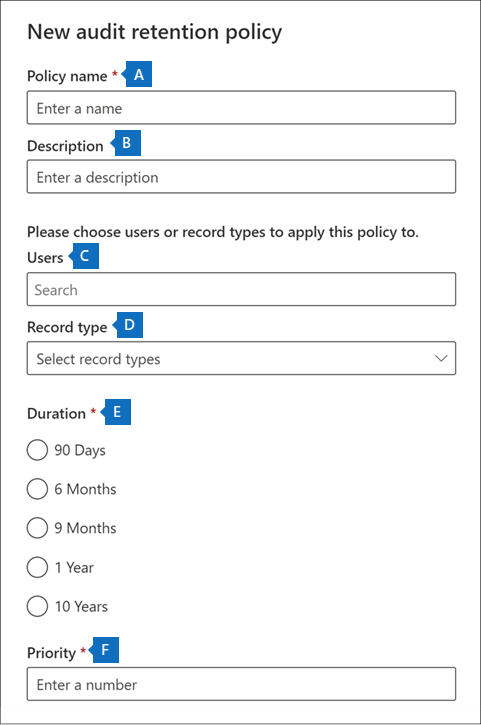
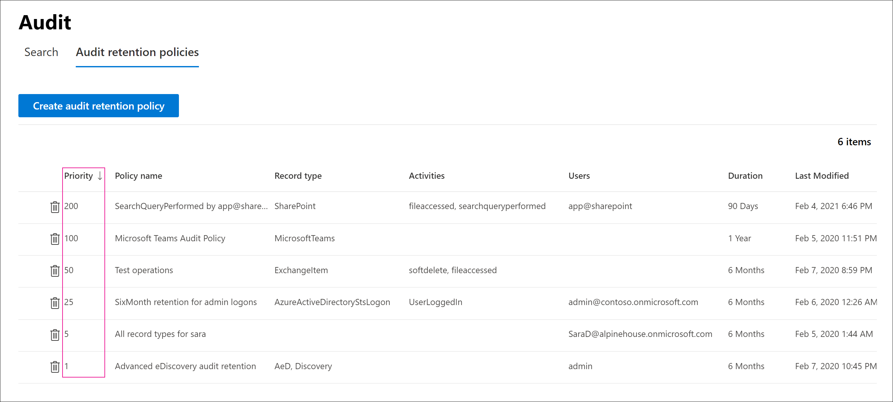

# Manage audit log retention policies

You can create and manage audit log retention policies in the Security & Compliance Center. Audit log retention policies are part of the new Advanced Audit capabilities in Microsoft 365. An audit log retention policy lets you specify how long to retain audit logs in your organization. You can retain audit logs for up to 10 years. You can create policies based on the following criteria:

- All activities in one or more Microsoft 365 services
- Specific activities (in a Microsoft 365 service) performed by all users or by specific users
- A priority level that specifies which policy takes precedence in you have multiple policies in your organization

## Default audit log retention policy

Advanced Audit in Microsoft 365 provides a default audit log retention policy for all organizations. This policy retains all Exchange Online, SharePoint Online, OneDrive for Business, and Azure Active Directory audit records for one year. This default policy retains audit records that contain the value of **Exchange**, **SharePoint**, **OneDrive**, **AzureActiveDirectory** for the **Workload** property (which is the service in which the activity occurred). The default policy can't be modified. See the [More information](#more-information) section in this article for a list of record types for each workload that are included in the default policy.

> [!NOTE]
> The default audit log retention policy only applies to audit records for activity performed by users who are assigned an Office 365 or Microsoft 365 E5 license or have a Microsoft 365 E5 Compliance or E5 eDiscovery and Audit add-on license. If you have non-E5 users or guest users in your organization, their corresponding audit records are retained for 90 days.

## Before you create an audit log retention policy

- You have to be assigned the Organization Configuration role in the Security & Compliance Center to create or modify an audit retention policy.

- You can have a maximum of 50 audit log retention policies in your organization.

- To retain an audit log for longer than 90 days (and up to 1 year), the user who generates the audit log (by performing an audited activity) must be assigned an Office 365 E5 or Microsoft 365 E5 license or have a Microsoft 365 E5 Compliance or E5 eDiscovery and Audit add-on license. To retain audit logs for 10 years, the user who generates the audit log must also be assigned a 10-year audit log retention add-on license in addition to an E5 license.

- All custom audit log retention policies (created by your organization) take priority over the default retention policy. For example, if you create an audit log retention policy for Exchange mailbox activity that has a retention period that's shorter than one year, audit records for Exchange mailbox activities will be retained for the shorter duration specified by the custom policy.

## Create an audit log retention policy

1. Go to <https://compliance.microsoft.com> and sign in with a user account that's assigned the Organization Configuration role on the Permissions page in the Security & Compliance Center.

2. In the left pane of the Microsoft 365 compliance center, click **Show all**, and then click **Audit**.

3. Click the **Audit retention policies** tab.

4. Click **Create audit retention policy**, and then complete the following fields on the flyout page:

   

   1. **Policy name:** The name of the audit log retention policy. This name must be unique in your organization, and it can't be change after the policy is created.

   2. **Description:** Optional, but helpful to provide information about the policy, such as the record type or workload, users specified in the policy, and the duration.

   3. **Users:** Select one or more users to apply the policy to. If you leave this box blank, then the policy will apply to all users. If you leave the **Record type** blank, then you must select a user.

   4. **Record type:** The audit record type the policy applies to. If you leave this property blank, you must select a user in the **Users** box. You can select a single record type or multiple record types:
      - If you select a single record type, the **Activities** field is dynamically displayed. You can use the drop-down list to select activities from the selected record type to apply the policy to. If you don't choose specific activities, the policy will apply to all activities of the selected record type.
      - If you select multiple record types, you don't have the ability to select activities. The policy will apply to all activities of the selected record types.

   5. **Duration:** The amount of time to retain the audit logs that meet the criteria of the policy.

   6. **Priority:** This value determines the order in which audit log retention policies in your organization are processed. A lower value indicates a higher priority. Valid priorities are numerical values between **1** and **10000**. A value of **1** is the highest priority, and a value of **10000** is the lowest priority. For example, a policy with a value of **5** takes priority over a policy with a value of **10**. As previously explained, any custom audit log retention policy takes priority over the default policy for your organization.

5. Click **Save** to create the new audit log retention policy.

The new policy is displayed in the list on the **Audit retention policies** tab.

## Manage audit log retention policies in the Microsoft 365 compliance center

Audit log retention policies are listed on the **Audit retention policies** tab (also called the *dashboard*). You can use the dashboard to view, edit, and delete audit retention policies.

### View policies in the dashboard

Audit log retention policies are listed in the dashboard. One advantage of viewing policies in the dashboard is that you can click the **Priority** column to list the policies in the priority in which they are applied. As previously explained, a higher value indicates a higher priority.



You can also select a policy to display its settings on the flyout page.

> [!NOTE]
> The default audit log retention policy for your organization isn't displayed in the dashboard.

### Edit policies in the dashboard

To edit a policy, select it to display the flyout page. You can modify one or more setting and then save your changes.

> [!IMPORTANT]
>
> If you use the **New-UnifiedAuditLogRetentionPolicy** cmdlet, it's possible to create an audit log retention policy for record types or activities that aren't available in the **Create audit retention policy** tool in the dashboard. In this case, you won't be able to edit the policy (for example, change the retention duration or add and remove activities) from the **Audit retention policies** dashboard. You'll only be able to view and delete the policy in the compliance center. To edit the policy, you'll have to use the [Set-UnifiedAuditLogRetentionPolicy](/powershell/module/exchange/set-unifiedauditlogretentionpolicy) cmdlet in Security & Compliance Center PowerShell.>
>
> **Tip:** A message is displayed at the top of the flyout page for policies that have to be edited using PowerShell.

### Delete policies in the dashboard

To delete a policy, click the **Delete**  icon and then confirm that you want to delete the policy. The policy is removed from the dashboard, but it might take up to 30 minutes for the policy to be removed from your organization.

## Create and manage audit log retention policies in PowerShell

You can also use Security & Compliance Center PowerShell to create and manage audit log retention policies. One reason to use PowerShell is to create a policy for a record type or activity that isn't available in the UI.

### Create an audit log retention policy in PowerShell

Follow these steps to create an audit log retention policy in PowerShell:

1. [Connect to Security & Compliance Center PowerShell](/powershell/exchange/connect-to-scc-powershell).

2. Run the following command to create an audit log retention policy:

   ```powershell
   New-UnifiedAuditLogRetentionPolicy -Name "Microsoft Teams Audit Policy" -Description "One year retention policy for all Microsoft Teams activities" -RecordTypes MicrosoftTeams -RetentionDuration TenYears -Priority 100
   ```

   This example creates an audit log retention policy named "Microsoft Teams Audit Policy" with these settings:

   - A description of the policy.
   - Retains all Microsoft Teams activities (as defined by the *RecordType* parameter).
   - Retains Microsoft Teams audit logs for 10 years.
   - A priority of 100.

Here's another example of creating an audit log retention policy. This policy retains audit logs for the "User logged in" activity for six months for the user admin@contoso.onmicrosoft.com.

```powershell
New-UnifiedAuditLogRetentionPolicy -Name "SixMonth retention for admin logons" -RecordTypes AzureActiveDirectoryStsLogon -Operations UserLoggedIn -UserIds admin@contoso.onmicrosoft.com -RetentionDuration SixMonths -Priority 25
```

For more information, see [New-UnifiedAuditLogRetentionPolicy](/powershell/module/exchange/new-unifiedauditlogretentionpolicy).

### View policies in PowerShell

Use the [Get-UnifiedAuditLogRetentionPolicy](/powershell/module/exchange/get-unifiedauditlogretentionpolicy) cmdlet in Security & Compliance Center PowerShell to view audit log retention policies.

Here's a sample command to display the settings for all audit log retention policies in your organization. This command sorts the policies from the highest to lowest priority.

```powershell
Get-UnifiedAuditLogRetentionPolicy | Sort-Object -Property Priority -Descending | FL Priority,Name,Description,RecordTypes,Operations,UserIds,RetentionDuration
```

> [!NOTE]
> The **Get-UnifiedAuditLogRetentionPolicy** cmdlet doesn't return the default audit log retention policy for your organization.

### Edit policies in PowerShell

Use the [Set-UnifiedAuditLogRetentionPolicy](/powershell/module/exchange/set-unifiedauditlogretentionpolicy) cmdlet in Security & Compliance Center PowerShell to edit an existing audit log retention policy.

### Delete policies in PowerShell

Use the [Remove-UnifiedAuditLogRetentionPolicy](/powershell/module/exchange/remove-unifiedauditlogretentionpolicy) cmdlet in Security & Compliance Center PowerShell to delete an audit log retention policy. It might take up to 30 minutes for the policy to be removed from your organization.

## More information

As previously stated, audit records for operations in Azure Active Directory, Exchange Online, SharePoint Online, and OneDrive for Business, are retained for one year by default. The following table lists all the record types (for each of these services) included in the default audit log retention policy. This means that audit logs for any operation with this record type are retained for one year unless a custom audit log retention policy takes precedence for a specific record type, operation, or user. The Enum value (which is displayed as the value for the RecordType property in an audit record) for each record type is shown in parentheses.

<br>

****

|AzureActiveDirectory|Exchange |SharePoint or OneDrive|
|---|---|---|
|AzureActiveDirectory (8)|ExchangeAdmin (1)|ComplianceDLPSharePoint (11)|
|AzureActiveDirectoryAccountLogon (9)|ExchangeItem (2)|ComplianceDLPSharePointClassification (33)|
|AzureActiveDirectoryStsLogon (15)|Campaign (62)|Project (35)|
||ComplianceDLPExchange (13)|SharePoint (4)|
||ComplianceSupervisionExchange (68)|SharePointCommentOperation (37)|
||CustomerKeyServiceEncryption (69)|SharePointContentTypeOperation (55)|
||ExchangeAggregatedOperation (19)|SharePointFieldOperation (56)|
||ExchangeItemAggregated (50)|SharePointFileOperation (6)|
||ExchangeItemGroup (3)|SharePointListOperation (36)|
||InformationBarrierPolicyApplication (53)|SharePointSharingOperation (14)|
||||
