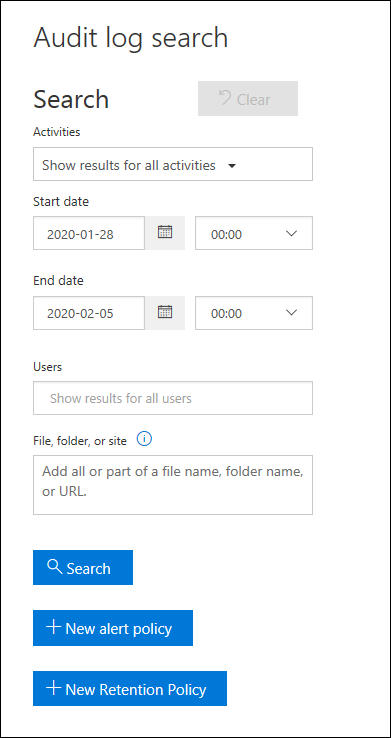

# Manage audit log retention policies

You can create and manage audit log retention policies in the Security & Compliance Center. Audit log retention policies are part of the new Advanced Audit capabilities in Microsoft 365. An audit log retention policy lets you specify how long to retain audit logs in your organization. You can retain audit logs for up to one year. You can create policies based on the following criteria:

- All activities in one or more Microsoft services

- Specific activities (in a specific service) performed by all users or by specific users

- A priority level that specifies which policy takes precedence in you have multiple policies in your organization

## Default audit log retention policy

Advanced Audit in Microsoft 365 provides a default audit log retention policy for all organizations. This policy retains all Exchange, SharePoint, and Azure Active Directory audit records for one year. This default policy retains any audit records that contain the value of **Exchange**,**SharePoint**, or **AzureActiveDirectory** as the value of the **Workload** property (which is the service in which the activity occurred) in the audit record. See the [More information](#more-information) section for a list of record types that are included in this default retention policy.

## Before you begin

- You have to be assigned the Organization Configuration role in the Security & Compliance Center to create or modify an audit retention policy.

- You can have a maximum of 50 audit log retention policies in your organization.

- All custom audit log retention policies (created by your organization) take priority of the default retention policy. For example, if you create a audit log retention policy for Exchange mailbox activity that has a shorter retention period that one year, audit records for Exchange mailbox activities will be retained for the shorter duration specified by the custom retention policy.

## Create an audit log retention policy in the Security & Compliance Center

1. Go to [https://protection.office.com](https://protection.office.com) and sign in with user account that's assigned the Organization Configuration role in the Security & Compliance Center. 

2. In the left pane of the Security & Compliance Center, click **Search** > **Audit log search**.

    The **Audit log search** page is displayed.

    

3. Click **New retention policy**, and then complete the following fields on the flyout page:

    

   a. **Name:** The name of the audit log retention policy. This name must be unique in your organization.
   
   b. **Description:** Optional, but helpful to provide information about the policy, such as the record type or workload, users specified in the policy, and the duration.

   c. **Record types:** The audit record type the policy applies to. If you select more than one record type, you can't select activities in the next dropdown box because the policy will apply to all activities in the selected record types. Also, you can leave this property blank but you must select a user in the **Users** box.

   d. **Activities:** Use this box to choose activities from the record type that you selected. You can choose specific activities to apply the policy to. If you don't choose specific activities, then the policy will apply to all activities of the selected record type.

   e. **Users:** Select one or more use to apply the policy to. If you leave this box blank, then the policy will apply to all users. If you leave the **Record types** blank, then you must select a user.

   f. **Duration:** The amount of time to retain the audit logs that meet the criteria of the policy.

   g. **Priority:** This value determines the order in which audit log retention policies in your organization are processed. A higher value indicates a higher priority. For example, a policy with a priority value of **5** would take priority over a policy with a priority value of **0**. As previously explained, any custom audit log retention policy takes priority over the default policy for your organization.

6. Click **Save** to create the new audit log retention policy. At this time, there's no indication that the retention policy was successfully created. See the next section on viewing the properties of the audit log retention policies.

## View audit log retention policies

At this time, the only way to view custom audit log retention policies is to use the **Get-UnifiedAuditRetentionPolicy** cmdlet in Office 365 Security & Compliance Center PowerShell. 

## Create an audit log retention policy in PowerShell

1. 

## More information 