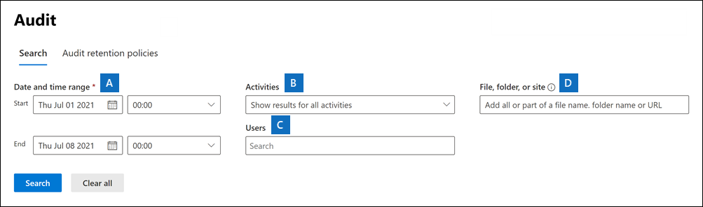

# Search the audit log in the Microsoft Purview compliance portal

Need to find if a user viewed a specific document or purged an item from their mailbox? If so, you can use the audit log search tool in Microsoft Purview compliance portal to search the unified audit log to view user and administrator activity in your organization. Thousands of user and admin operations performed in dozens of Microsoft 365 services and solutions are captured, recorded, and retained in your organization's unified audit log. Users in your organization can use the audit log search tool to search for, view, and export (to a CSV file) the audit records for these operations.

[!INCLUDE [purview-preview](../includes/purview-preview.md)]

## Microsoft 365 services that support auditing

Why a unified audit log? Because you can search the audit log for activities performed in different Microsoft 365 services. The following table lists the Microsoft 365 services, apps, and features that are supported by the unified audit log.

|Microsoft 365 service or feature|Record types|
|:-------------------------------|:-----------|
|Azure Active Directory|AzureActiveDirectory, AzureActiveDirectoryAccountLogon, AzureActiveDirectoryStsLogon|
|Azure Information Protection|AipDiscover, AipSensitivityLabelAction, AipProtectionAction, AipFileDeleted, AipHeartBeat|
|Communication compliance|ComplianceSupervisionExchange|
|Content explorer|LabelContentExplorer|
|Data connectors|ComplianceConnector|
|Data loss prevention (DLP)|ComplianceDLPSharePoint, ComplianceDLPExchange, DLPEndpoint|
|Dynamics 365|CRM|
|eDiscovery (Standard + Premium)|Discovery, AeD|
|Encrypted message portal|OMEPortal|
|Exact Data Match|MipExactDataMatch|
|Exchange Online|ExchangeAdmin, ExchangeItem, ExchangeItemAggregated|
|Forms|MicrosoftForms|
|Information barriers|InformationBarrierPolicyApplication|
|Microsoft 365 Defender|AirInvestigation, AirManualInvestigation, AirAdminActionInvestigation, MS365DCustomDetection|
|Microsoft Defender Experts|DefenderExpertsforXDRAdmin|
|Microsoft Defender for Identity (MDI)|MicrosoftDefenderForIdentityAudit|
|Microsoft Planner|PlannerCopyPlan, PlannerPlan, PlannerPlanList, PlannerRoster, PlannerRosterSensitivityLabel, PlannerTask, PlannerTaskList, PlannerTenantSettings |
|Microsoft Project for the web|ProjectAccessed, ProjectCreated, ProjectDeleted, ProjectTenantSettingsUpdated, ProjectUpdated, RoadmapAccessed,RoadmapCreated, RoadmapDeleted, RoadmapItemAccessed,RoadmapItemCreated,RoadmapItemDeleted, RoadmapItemUpdated, RoadmapTenantSettingsUpdated, RoadmapUpdated, TaskAccessed, TaskCreated,TaskDeleted, TaskUpdated|
|Microsoft Purview Information Protection (MIP) labels|MIPLabel, MipAutoLabelExchangeItem, MipAutoLabelSharePointItem, MipAutoLabelSharePointPolicyLocation|
|Microsoft Teams|MicrosoftTeams|
|Microsoft To Do|MicrosoftToDo, MicrosoftToDoAudit|
|MyAnalytics|MyAnalyticsSettings|
|OneDrive for Business|OneDrive|
|Power Apps|PowerAppsApp, PowerAppsPlan|
|Power Automate|MicrosoftFlow|
|Power BI|PowerBIAudit|
|Quarantine|Quarantine|
|Sensitive information types|DlpSensitiveInformationType|
|Sensitivity labels|MIPLabel, SensitivityLabelAction, SensitivityLabeledFileAction, SensitivityLabelPolicyMatch|
|SharePoint Online|SharePoint, SharePointFileOperation,SharePointSharingOperation, SharePointListOperation, SharePointCommentOperation|
|Stream|MicrosoftStream|
|SystemSync|DataShareCreated, DataShareDeleted, GenerateCopyOfLakeData, DownloadCopyOfLakeData|
|Threat Intelligence|ThreatIntelligence, ThreatIntelligenceUrl, ThreatFinder, ThreatIntelligenceAtpContent|
|Viva Goals|VivaGoals|
|Viva Insights|VivaInsights|
|Yammer|Yammer|

For more information about the operations that are audited in each of the services listed in the previous table, see the [Audit log activities](audit-log-activities.md) article.

The previous table also identifies the record type value to use to search the audit log for activities in the corresponding service using the **Search-UnifiedAuditLog** cmdlet in Exchange Online PowerShell or by using a PowerShell script. Some services have multiple record types for different types of activities within the same service. For a more complete list of auditing record types, see [Office 365 Management Activity API schema](/office/office-365-management-api/office-365-management-activity-api-schema#auditlogrecordtype).

 For more information about using PowerShell to search the audit log, see:

- [Search-UnifiedAuditLog](/powershell/module/exchange/search-unifiedauditlog)
- [Use a PowerShell script to search the audit log](audit-log-search-script.md)

## Before you search the audit log

Be sure to review the following items before you start searching the audit log.

- Audit log search is turned on by default for Microsoft 365 and Office 365 enterprise organizations. To verify that audit log search is turned on, you can run the following command in **Exchange Online PowerShell**:

  ```powershell
  Get-AdminAuditLogConfig | Format-List UnifiedAuditLogIngestionEnabled
  ```

  The value of `True` for the *UnifiedAuditLogIngestionEnabled* property indicates that audit log search is turned on. For more information, see [Turn audit log search on or off](audit-log-enable-disable.md).

  > [!IMPORTANT]
  > Be sure to run the previous command in Exchange Online PowerShell. Although the **Get-AdminAuditLogConfig** cmdlet is also available in Security & Compliance PowerShell, the *UnifiedAuditLogIngestionEnabled* property is always `False`, even when audit log search is turned on.

- You have to be assigned the *View-Only Audit Logs* or *Audit Logs* role in Exchange Online to search the audit log. By default, these roles are assigned to the *Compliance Management* and *Organization Management* role groups on the **Permissions** page in the Exchange admin center. Global administrators in Office 365 and Microsoft 365 are automatically added as members of the *Organization Management* role group in Exchange Online. To give a user the ability to search the audit log with the minimum level of privileges, you can create a custom role group in Exchange Online, add the *View-Only Audit Logs* or *Audit Logs* role, and then add the user as a member of the new role group. For more information, see [Manage role groups in Exchange Online](/Exchange/permissions-exo/role-groups).

  > If you assign a user the View-Only Audit Logs or Audit Logs role on the **Permissions** page in the compliance portal, they won't be able to search the audit log. You have to assign the permissions in Exchange Online. This is because the underlying cmdlet used to search the audit log is an Exchange Online cmdlet.

- When an audited activity is performed by a user or admin, an audit record is generated and stored in the audit log for your organization. The length of time that an audit record is retained (and searchable in the audit log) depends on your Office 365 or Microsoft 365 Enterprise subscription, and specifically the type of the license that is assigned to specific users.

  - For users assigned an Office 365 E5 or Microsoft 365 E5 license (or users with a Microsoft 365 E5 Compliance or Microsoft 365 E5 eDiscovery and Audit add-on license), audit records for Azure Active Directory, Exchange, and SharePoint activity are retained for one year by default. Organizations can also create audit log retention policies to retain audit records for activities in other services for up to one year. For more information, see [Manage audit log retention policies](audit-log-retention-policies.md).

    > [!NOTE]
    > If your organization participated in the private preview program for the one-year retention of audit records, the retention duration for audit records that were generated before the general availability rollout date will not be reset.

  - For users assigned any other (non-E5) Office 365 or Microsoft 365 license, audit records are retained for 90 days. For a list of Office 365 and Microsoft 365 subscriptions that support unified audit logging, see the [security and compliance portal service description](/office365/servicedescriptions/office-365-platform-service-description/office-365-securitycompliance-center).

    > [!NOTE]
    > Even when mailbox auditing on by default is turned on, you might notice that mailbox audit events for some users aren't found in audit log searches in the compliance portal or via the Office 365 Management Activity API. For more information, see [More information about mailbox audit logging](audit-mailboxes.md#more-information).

- If you want to turn off audit log search for your organization, you can run the following command in Exchange Online PowerShell:

  ```powershell
  Set-AdminAuditLogConfig -UnifiedAuditLogIngestionEnabled $false
  ```

    To turn on audit search again, you can run the following command in Exchange Online PowerShell:

  ```powershell
  Set-AdminAuditLogConfig -UnifiedAuditLogIngestionEnabled $true
  ```

  For more information, see [Turn off audit log search](audit-log-enable-disable.md).

- The underlying cmdlet used to search the audit log is an Exchange Online cmdlet, which is **Search-UnifiedAuditLog**. That means you can use this cmdlet to search the audit log instead of using the search tool on the **Audit** page in the compliance portal. You have to run this cmdlet in Exchange Online PowerShell. For more information, see [Search-UnifiedAuditLog](/powershell/module/exchange/search-unifiedauditlog).

  For information about exporting the search results returned by the **Search-UnifiedAuditLog** cmdlet to a CSV file, see the "Tips for exporting and viewing the audit log" section in [Export, configure, and view audit log records](audit-log-export-records.md#tips-for-exporting-and-viewing-the-audit-log).

- If you want to programmatically download data from the audit log, we recommend that you use the Office 365 Management Activity API instead of using a PowerShell script. The Office 365 Management Activity API is a REST web service that you can use to develop operations, security, and compliance monitoring solutions for your organization. For more information, see [Office 365 Management Activity API reference](/office/office-365-management-api/office-365-management-activity-api-reference).

- Azure Active Directory (Azure AD) is the directory service for Microsoft 365. The unified audit log contains user, group, application, domain, and directory activities performed in the <a href="https://go.microsoft.com/fwlink/p/?linkid=2024339" target="_blank">Microsoft 365 admin center</a> or in the Azure management portal. For a complete list of Azure AD events, see [Azure Active Directory Audit Report Events](/azure/active-directory/reports-monitoring/concept-audit-logs).

- Microsoft doesn't guarantee a specific time after an event occurs for the corresponding audit record to be returned in the results of an audit log search. For core services (such as Exchange, SharePoint, OneDrive, and Teams), audit record availability is typically 60 to 90 minutes after an event occurs. For other services, audit record availability may be longer. However, some issues that are unavoidable (such as a server outage) may occur outside of the audit service that delays the availability of audit records. For this reason, Microsoft doesn't commit to a specific time.

- To search for Power BI activities in the audit log, you have to enable auditing in the Power BI admin portal. For instructions, see the "Audit logs" section in [Power BI admin portal](/power-bi/service-admin-portal#audit-logs).

## Search the audit log

Here's the process for searching the audit log in Microsoft 365.

- [Step 1: Run an audit log search](#step-1-run-an-audit-log-search)
- [Step 2: View the search results](#step-2-view-the-search-results)
- [Step 3: Export the search results to a file](#step-3-export-the-search-results-to-a-file)

### Step 1: Run an audit log search

1. Go to <https://compliance.microsoft.com> and sign in.

    > [!TIP]
    > Use a private browsing session (not a regular session) to access the compliance portal because this will prevent the credential that you are currently logged on with from being used. Press **CTRL+SHIFT+N** to open an InPrivate Browsing session in Microsoft Edge or a private browsing session in Google Chrome (called an incognito window).

2. In the left pane of the compliance portal, select **Audit**.

    The **Audit** page is displayed.

    

    > [!NOTE]
    > If the **Start recording user and admin activity** link is displayed, select it to turn on auditing. If you don't see this link, auditing is turned on for your organization.

3. On the **Search** tab, configure the following search criteria:

   1. **Start date** and **End date**: The last seven days are selected by default. Select a date and time range to display the events that occurred within that period. The date and time are presented in Coordinated Universal Time (UTC). The maximum date range that you can specify is 90 days. An error is displayed if the selected date range is greater than 90 days.

    > [!TIP]
    > If you're using the maximum date range of 90 days, select the current time for the **Start date**. Otherwise, you'll receive an error saying that the start date is earlier than the end date. If you've turned on auditing within the last 90 days, the maximum date range can't start before the date that auditing was turned on.

   2. **Activities**: Select the drop-down list to display the activities that you can search for. User and admin activities are organized into groups of related activities. You can select specific activities or you can select the activity group name to select all activities in the group. You can also select a selected activity to clear the selection. After you run the search, only the audit log entries for the selected activities are displayed. Selecting **Show results for all activities** displays results for all activities performed by the selected user or group of users.<br/><br/>Over 100 user and admin activities are logged in the audit log. Select the **Audited activities** tab at the article of this article to see the descriptions of every activity in each of the different services.

   3. **Users**: Select in this box and then select one or more users to display search results for. The audit log entries for the selected activity performed by the users you select in this box are displayed in the list of results. Leave this box blank to return entries for all users (and service accounts) in your organization.

   4. **File, folder, or site**: Type some or all of a file or folder name to search for activity related to the file of folder that contains the specified keyword. You can also specify a URL of a file or folder. If you use a URL, be sure the type the full URL path or if you type a portion of the URL, don't include any special characters or spaces (however, using the wildcard character (\*) is supported).<br/><br/>Leave this box blank to return entries for all files and folders in your organization.

    > [!TIP]
    >
    > - If you're looking for all activities related to a **site**, add the wildcard character (\*) after the URL to return all entries for that site; for example, `"https://contoso-my.sharepoint.com/personal*"`.
    >
    > - If you're looking for all activities related to a **file**, add the wildcard character (\*) before the file name to return all entries for that file; for example, `"*Customer_Profitability_Sample.csv"`.

4. Select **Search** to run the search using your search criteria.

   The search results are loaded, and after a few moments they're displayed on a new page. When the search is finished, the number of results found is displayed. A maximum of 50,000 events are displayed in increments of 150 events. If more than 50,000 events meet the search criteria, only the 50,000 unsorted events returned are displayed.

   

#### Tips for searching the audit log

- You can select specific activities to search for by selecting the activity name. Or you can search for all activities in a group (such as **File and folder activities**) by selecting the group name. If an activity is selected, you can select it to cancel the selection. You can also use the search box to display the activities that contain the keyword that you type.

  

- You have to select **Show results for all activities** in the **Activities** list to display events from the Exchange admin audit log. Events from this audit log display a cmdlet name (for example, **Set-Mailbox**) in the **Activity** column in the results. For more information, select the **Audited activities** tab in this article and then select **Exchange admin activities**.

  Similarly, there are some auditing activities that don't have a corresponding item in the **Activities** list. If you know the name of the operation for these activities, you can search for all activities, then filter the operations after you export the search results to a CSV file.

- Select **Clear** to clear the current search criteria. The date range returns to the default of the last seven days. You can also select **Clear all to show results for all activities** to cancel all selected activities.

- If 50,000 results are found, you can probably assume that there are more than 50,000 events that met the search criteria. You can either refine the search criteria and rerun the search to return fewer results, or you can export the 50,000 search results by selecting **Export results** \> **Download all results**.

### Step 2: View the search results

The results of an audit log search are displayed under **Results** on the **Audit log search** page. As previously stated, a maximum of 50,000 (newest) events are displayed in increments of 150 events. Use the scroll bar or press **Shift + End** to display the next 150 events.

The results contain the following information about each event returned by the search:

- **Date**: The date and time (in UTC) when the event occurred.
- **IP address**: The IP address of the device that was used when the activity was logged. The IP address is displayed in either an IPv4 or IPv6 address format.

   > [!NOTE]
  > For some services, the value displayed in this field might be the IP address for a trusted application (for example, Office on the web apps) calling into the service on behalf of a user and not the IP address of the device used by person who performed the activity. Also, for admin activity (or activity performed by a system account) for Azure Active Directory-related events, the IP address isn't logged and the value displayed in this field is `null`.

- **User**: The user (or service account) who performed the action that triggered the event.
- **Activity**: The activity performed by the user. This value corresponds to the activities that you selected in the **Activities** drop down list. For an event from the Exchange admin audit log, the value in this column is an Exchange cmdlet.
- **Item**: The object that was created or modified as a result of the corresponding activity. For example, the file that was viewed or modified or the user account that was updated. Not all activities have a value in this column.
- **Detail**: Additional information about an activity. Again, not all activities have a value.

> [!TIP]
> Select a column header under **Results** to sort the results. You can sort the results from A to Z or Z to A. Select the **Date** header to sort the results from oldest to newest or newest to oldest.

#### View the details for a specific event

You can view more details about an event by selecting the event record in the list of search results. A flyout page is displayed that contains the detailed properties from the event record. The properties that are displayed depend on the service in which the event occurs.

### Step 3: Export the search results to a file

You can export the results of an audit log search to a comma-separated value (CSV) file on your local computer. You can open this file in Microsoft Excel and use features such as search, sorting, filtering, and splitting a single column (that contains multiple properties) into multiple columns.

1. Run an audit log search, and then revise the search criteria until you have the desired results.

2. On the search results page, select **Export** > **Download all results**.

   All entries from the audit log that meet the search criteria are exported to a CSV file. The raw data from the audit log is saved to a CSV file. Additional information from the audit log entry is included in a column named **AuditData** in the CSV.

     > [!IMPORTANT]
     > You can download a maximum of 50,000 entries to a CSV file from a single audit log search. If 50,000 entries are downloaded to the CSV file, you can probably assume there are more than 50,000 events that met the search criteria. To export more than this limit, try using a date range to reduce the number of audit log entries. You might have to run multiple searches with smaller date ranges to export more than 50,000 entries.

3. After the export process is complete, a message is displayed at the top of the window that prompts you to open the CSV file and save it to your local computer. You can also access the CSV file in the Downloads folder.

#### More information about exporting and viewing audit log search results

- When you download all search results, the CSV file contains the columns **CreationDate**, **UserIds**, **Operations**, and **AuditData**. The **AuditData** column contains additional information about each event (similar to the detailed information displayed on the flyout page when you view the search results in the compliance portal). The data in this column consists of a JSON object that contains multiple properties from the audit log record. Each *property:value* pair in the JSON object is separated by a comma. You can use the JSON transform tool in the Power Query Editor in Excel to split **AuditData** column into multiple columns so that each property in the JSON object has its own column. This lets you sort and filter on one or more of these properties. For step-by-step instructions using the Power Query Editor to transform the JSON object, see [Export, configure, and view audit log records](audit-log-export-records.md).

  After you split the **AuditData** column, you can filter on the **Operations** column to display the detailed properties for a specific type of activity.

- When you download all results from a search query that contains events from different services, the **AuditData** column in the CSV file contains different properties depending on which service the action was performed in. For example, entries from Exchange and Azure AD audit logs include a property named **ResultStatus** that indicates if the action was successful or not. This property isn't included for events in SharePoint. Similarly, SharePoint events have a property that identifies the site URL for file and folder-related activities. To mitigate this behavior, consider using different searches to export the results for activities from a single service.

  For a description of many of the properties that are listed in the **AuditData** column in the CSV file when you download all results, and the service each one applies to, see [Detailed properties in the audit log](audit-log-detailed-properties.md).

## Scoping access to audit logs

Access to search the audit log is scoped based upon the administrative units assigned to the user accessing the audit log in the compliance portal. A scoped admin can only search and export user-generated audit logs within the scope of their administrative units. A global admin has access to all audit logs, including logs generated by non-user and system accounts.

| Admin units assigned to admins | Admin units available for scoped Search | Access to search and export audit logs |
|--|--|--|
| None (Default): Unrestricted access | All administrative units are available | Unrestricted access to all activity logs from any user, non-user, or system account.  |
| One or more administrative units: Restricted access | Only those administrative units assigned to the admin are available | Restricted access to activity logs from users with a matching administrative unit assignment. |

> [!NOTE]
> The [Search-MailboxAuditLog](/powershell/module/exchange/search-mailboxauditlog) and [Search-AdminAuditLog cmdlets](/powershell/module/exchange/search-adminauditlog) currently do not support scoped access.

For more information about administrative units, see [Permissions in the Microsoft Purview compliance portal](/microsoft-365/compliance/microsoft-365-compliance-center-permissions#administrative-units-preview).

## Frequently asked questions

**What are different Microsoft 365 services that are currently audited?**

The most used services like Exchange Online, SharePoint Online, OneDrive for Business, Azure Active Directory, Microsoft Teams, Dynamics 365, Defender for Office 365, and Power BI are audited. See the [beginning of this article](audit-log-search.md) for a list of services that are audited.

**What activities are audited by auditing service in Microsoft 365?**

See the [Audit log activities](audit-log-activities.md) article for a list and description of the activities that are audited.

**How long does it take for an auditing record to be available after an event has occurred?**

Most auditing data is available within 60-90 minutes but it may take up to 24 hours after an event occurs for the corresponding audit log entry to be displayed in the search results. See the [Before you search the audit log](#before-you-search-the-audit-log) section of this article that shows the time it takes for events in the different services to be available.

**How long are the audit records retained for?**

As previously explained, audit records for activities performed by users assigned an Office 365 E5 or Microsoft E5 license (or users with a Microsoft 365 E5 add-on license) are retained for one year. For all other subscriptions that support unified audit logging, audit records are retained for 90 days.

**Can I access the auditing data programmatically?**

Yes. The Office 365 Management Activity API is used to fetch the audit logs programmatically.  To get started, see [Get started with Office 365 Management APIs](/office/office-365-management-api/get-started-with-office-365-management-apis).

**Are there other ways to get auditing logs other than using the security and compliance portal or the Office 365 Management Activity API?**

Yes, You can retrieve audit logs by using the following methods:

- The [Office 365 Management Activity API](/office/office-365-management-api/office-365-management-activity-api-reference).
- The [audit log search tool](audit-log-search.md) in the Microsoft Purview compliance portal.
- The [Search-UnifiedAuditLog](/powershell/module/exchange/search-unifiedauditlog) cmdlet in Exchange Online PowerShell.

**Do I need to individually enable auditing in each service that I want to capture audit logs for?**

In most services, auditing is enabled by default after you initially turn on auditing for your organization (as described in the [Before you search the audit log](#before-you-search-the-audit-log) section in this article).

**Does the auditing service support deduplication of records?**

No. The auditing service pipeline is near real time, and therefore can't support deduplication.

**Where is auditing data stored?**

We currently have auditing pipeline deployments in the NA (North America), EMEA (Europe, Middle East, and Africa) and APAC (Asia Pacific) regions. Tenants homed in these regions have their auditing data stored in region. For multi-geo tenants, the audit data collected from all regions of the tenant will be stored only in tenant's home region. However, we may flow the data across these regions for load-balancing and only during live-site issues. When we do perform these activities, the data in transit is encrypted.

**Is auditing data encrypted?**

Auditing data is stored in Exchange mailboxes (data at rest) in the same region where the unified auditing pipeline is deployed. Mailbox data at rest isn't encrypted by Exchange. However, service-level encryption encrypts all mailbox data because Exchange servers in Microsoft datacenters are encrypted via BitLocker. For more information, see [Microsoft 365 Encryption for Skype for Business, OneDrive for Business, SharePoint Online, and Exchange Online](/compliance/assurance/assurance-encryption-for-microsoft-365-services).

Mail data in transit is always encrypted.
