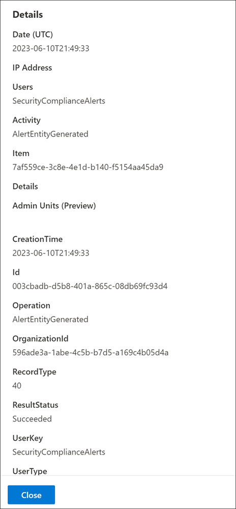

# Audit New Search

Your organization requires access to critical audit log event data to gain insight and further investigate user activities. Previously, your search jobs in the Microsoft Purview compliance portal were limited to creating concurrent audit search jobs and reviewing historical search jobs. These critical audit search jobs also had a dependency on the browser window remaining open in order to complete.

The Audit New Search builds upon the existing search functionalities and includes the following key improvements:

- Search jobs initiated via the compliance portal no longer require the web browser window to remain open in order to complete. These jobs will continue to run even after the browser window is closed.
- Completed search jobs are now stored for 30 days, giving you the ability to reference historical audit searches.
- Each admin Audit account user can have a maximum of 10 concurrent search jobs in progress with a maximum of one unfiltered search job.

[!INCLUDE [purview-preview](../includes/purview-preview.md)]

## Before you begin

- Review the following Microsoft Purview Audit articles for activity detail information. Search job creation and export functionality are highly dependent the nuances of the audit log data.

  - [Audit log activities](audit-log-search.md)
  - [Detailed properties in the audit log](audit-log-detailed-properties.md)
  - [Export, configure, and view audit log records](audit-log-export-records.md)

- Searching via an Exchange Online PowerShell session using the [Search-UnifiedAuditLog](/powershell/module/exchange/search-unifiedauditlog) cmdlet isn't currently compatible with the New Search.

## Get started with audit new search

Complete the following steps to get started with the Audit New Search:

1. Sign into the [Microsoft Purview compliance portal](https://compliance.microsoft.com).
2. Select the **Audit** tab on the left panel of the homepage to navigate to the Audit tool.
3. Select **New Search** tab at the top of the **Audit** page.

      

4. On the **New Search** tab, configure the following search criteria as applicable:

   1. **Start date** and **End date**: The last seven days are selected by default. Select a date and time range to display the events that occurred within that period. The date and time are presented in Coordinated Universal Time (UTC). The maximum date range that you can specify is 90 days. An error is displayed if the selected date range is greater than 90 days.

      > [!TIP]
      > If you're using the maximum date range of 90 days, select the current time for the **Start date**. Otherwise, you'll receive an error saying that the start date is earlier than the end date. If you've turned on auditing within the last 90 days, the maximum date range can't start before the date that auditing was turned on.

   2. **Keyword Search**: Enter a keyword or phrase to search for in the audit log. The keyword or phrase is searched for in the audit log or in the file, folder, or sites (if specified) for the search. To search for text that contains special characters, replace the special characters with an asterisk(\*) in your keyword search. For example, to search for *test_search_document*, use *test\*search\*document*.

        > [!IMPORTANT]
        > Terms entered in the **Keyword Search** field are only searched within indexed content (content within the Audit *common schema*). Audit *data content* in the audit log isn't searched for these keywords.

   3. **Admin Units (preview)**:  Select the drop-down list to display the [administrative units](/microsoft-365/compliance/microsoft-365-compliance-center-permissions#administrative-units-preview) you want the audited activities scoped to for your search. You can select one or more administrative units to scope your search to. Leave this box blank to return entries for all administrative units in your organization.

   4. **Activities - friendly names**: Select the drop-down list to display the friendly names for audited activities that you can search for. Friendly names for user and admin activities are organized into groups of related activities. Using friendly names, you can select specific audited activities or you can select the activity group name to select all activities in the group. You can also select a selected activity to clear the selection. To search for a friendly name for the activities in the list, use the search box above the list.

   5. **Activities - operations names (preview)**: Enter the exact operation names to search for audited activities to include in your search results. You can enter one or more operation names, separated by commas. This search criterion is similar to previous searches only available in PowerShell and provides greater flexibility helping you find the data that you need.

        > [!IMPORTANT]
        > Operation names must be entered exactly as they are named. If operation names are entered incorrectly, no results are returned.

        For example, to search for all activities related to enabling and disabling information barriers for a SharePoint site in your organization, you would:

        - Review the [audit activities](/microsoft-365/compliance/audit-log-activities) article to find the exact operation name for the information barriers activities you want to search for. In this [example](/microsoft-365/compliance/audit-log-activities#information-barriers-activities), the operation names are *SPOIBIsEnabled* and *SPOIBIsDisabled*.
        - Enter *SPOIBIsEnabled,SPOIBIsDisabled* in operation search field. We recommend copying and pasting the operation names directly from the article to the operation search field to ensure that they're entered correctly and without typos.

   6. **Record types**: Select the drop-down list to display the record types for audited activities that you can search for. You can select one or more record types to search for. To search for a record type in the list, use the search box above the list.   Specific [record types](/microsoft-365/compliance/audit-log-search#microsoft-365-services-that-support-auditing) are associated with specific Microsoft services and applications. For example, if you wanted to scope your search for specific record types associated with sensitivity labels in Microsoft Purview Information Protection (MIP), you could select the *MIPLabel*, *MipAutoLabelExchangeItem*, *MipAutoLabelSharePointItem*, and *MipAutoLabelSharePointPolicyLocation* record types from the list.

   7. **Search name**: Enter in a custom name for your search job. This name is used to identify your search job in the search job history. If you don't enter a name, the search job is automatically named using a combination of the date and time defined for the search and other defined search criteria values.

   8. **Users**: Select this field and choose the names one or more users to display search results for. The audit log entries for the selected activity performed by the users you select in this box are displayed in the list of results. Leave this box blank to return entries for all users (and service accounts) in your organization.

   9. **File, folder, or site**: Enter some or all of a file or folder name to search for activity related to the file of folder that contains the specified keyword. This search criterion returns all related results for corresponding file, folders, and sites. You can also specify a URL of a file or folder. If you use a URL, be sure the type the full URL path or if you type a portion of the URL, don't include any special characters or spaces (however, using the wildcard character (\*) is supported). Leave this box blank to return entries for all files and folders in your organization.

5. Select **Search** to start your search job. A maximum of 10 search jobs can be run in parallel for one user account. If a user requires more than 10 search jobs, they must wait for an *In progress* job to finish or delete a search job.

## Search job dashboard

Active and completed search jobs are displayed in the search job dashboard. The dashboard displays the following information for each search job:

- **Search name**: The name of the search job. The full search name for a job can be seen by hovering the cursor over the search job name.
- **Job status**: The status of the search job. The status can be *Queued*, *In Progress*, or *Completed*.
- **Progress (%)**: The percentage of the search job that has been completed.
- **Search time**: The total running time that elapsed to complete the search job.
- **Total results**: The total number of results returned by the search job.
- **Creation time**: The date and time the search job was created in UTC.
- **Search performed by**: The user account that created the search job.

Delete search jobs by selecting the job and then selecting **Delete** on the command bar. Deleting a search job doesn't delete the backend data associated with search. It only deletes the search job definition and the associated search result.

To copy the search criteria for an existing search job, select the job and then select **Copy this search** on the command bar. The search criteria are copied to the search page and you can modify the search criteria as needed for a new search.

## Search job details dashboard

To view details about a search job, select the search job. The total number of items in the job is included at the top of the dashboard. The total result number deducts duplicates, which is why it might be less than the number of items in the search job dashboard.

The search job details dashboard displays following information about the individual items gathered in the search job results:

- **Date (UTC)**: The date and time the activity occurred.
- **IP Address**: The IP address of the device that was used to perform the activity.
- **User**: The user account that performed the activity.
- **Record type**: The record type associated with the activity.
- **Activity**: The friendly name of the activity that was performed.
- **Item**: The name of the file, folder, or site that the activity was acted on.
- **Admin Units (preview)**: The admin unit that the user account that performed the activity belongs to.
- **Details**: Additional details about the activity.

You can sort the search job items using the column headers or create a custom filter using the filter pane. Use the filter to filter the search job items for specific values for any of the dashboard column criteria. To export all search job items to a .csv file, select **Export** on the command bar. Export supports results up to 50 KB for Audit (Standard) and up to 500 KB (500,000 rows) for Audit (Premium).

Select a specific activity to see more details about the activity in a fly-out window. The fly-out window displays the additional information about the activity.

