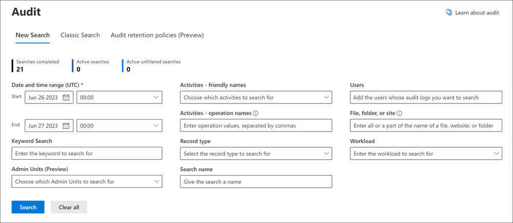

# Audit New Search (preview)

Your organization requires access to critical audit log event data to gain insight and further investigate user activities. Previously, your search jobs in the Microsoft Purview compliance portal UI were limited in their ability to create concurrent audit search jobs and review historical search jobs. These critical audit search jobs also had a dependency on the browser window remaining open in order to complete.

The Audit New Search (preview) builds upon the existing search functionalities and includes the following key improvements:

- Search jobs initiated via the compliance portal UI no longer require the web browser window to remain open in order to complete. These jobs will continue to run even after the browser window is closed.
- Completed search jobs are now stored for 30 days, giving customers the ability to reference historical audit searches. These search jobs are presented in the UI, listing the search name, search job status, progress %, Number of results, Creation Time, and Searched by.
- Each admin Audit account user can have a maximum of 10 concurrent search jobs in progress at a time with a maximum of one unfiltered search job.

[!INCLUDE [purview-preview](../includes/purview-preview.md)]

## Information to get started

View the available Microsoft Purview Audit documentation as the search job creation and export experiences have many parallels with the current search experience:

- [Search the audit log in the Microsoft Purview compliance portal](search-the-audit-log-in-security-and-compliance.md) (note that PowerShell isn't yet compatible with Audit Search V2)
- [Detailed properties in the audit log](detailed-properties-in-the-office-365-audit-log.md)
- [Export, configure, and view audit log records](export-view-audit-log-records.md)

Additional information:

- Searching via an EXO PowerShell session using the Search-UnifiedAuditLog cmdlet isn't compatible with the New Search at this time.
- Search jobs can take in the following criteria: Date Range, Time Range, Search Job Name, Activities, Users, Files, Folders, and Sites.
- Searching and filtering using date, time, search name, activities, and users are all fully functional
- Audit Log data will be stored for the defined retention period, regardless of a search job being deleted
- Searches created during the Private Preview period may not be retained for future reference once the New Search feature moves into Public Preview.

## Get started with audit new search

Follow the below steps to test and validate the Audit New Search experience:

1. Sign into the [Microsoft Purview compliance portal](https://compliance.microsoft.com)
2. Select the **Audit** tab on the left panel of the homepage to navigate to the Audit tool
3. Select **New Search (Preview)** tab at the top of the **Audit** page

      

4. Test different search jobs in the Audit New Search tool using various search criteria.
Some examples of different searches include the following criteria. Explore these different search methods while performing searches on the audit log.

    - Search across different time frames.
      - One day
      - Week
      - Month
      - Several Months
    - Search across selected users
    - Scoping the search using the activities field
    - Adding a specific file, folder, or site

  

5. Initiate another 2-9 searches in the compliance portal. A maximum of 10 search jobs can be run in parallel in one account.
6. Explore the search job history and select different search jobs to get their corresponding data from the search job results. Results can be sorted by their creation time by selecting the corresponding button at the top of the table.

  

7. Select a search job to see the results of the job displayed in a line-item format. Explore the various functionalities in the UI, including:

    - Referencing the complete search query at the top of the page, which includes all search criteria entered when completing the original search
    - Selecting various results for more information in the fly-out window
    - Filtering across the search job using IP address, User, Activity, Date, Item, and Details.
    - Exporting both unfiltered and filtered searches
    - Sorting the results by clicking the corresponding buttons on the top of the table including Date, IP Address (when applicable), User, Activity, Item, and Detail (when applicable).

  

## Audit search job overview

- Search jobs can take in the following criteria: Date Range, Time Range, Search Job Name, Activities, Users, Files, Folders, and Sites.
- File, folder, or site search text box will return all related results for corresponding file, folders, and sites
- The search jobs will run at the bottom of the search page.
  - Search jobs can be *Queued*, *In Progress*, and *Completed*
  - A maximum of 10 *In Progress* search jobs can be completed simultaneously per user
- Full search names for jobs can be seen by hovering the cursor over the search job
- Search jobs will display the Search Name, Status, Progress %, Number of results, creation time, and searched by

## Audit search results overview

- Search results are displayed in a line-item once a search job is selected
- The search query is displayed on the top of the search job results page for reference and the total number of items
  > [!NOTE]
  > The total result number deducts duplicates, which is why it might be less than the number of items in the main Audit search window
- Information about the date, IP Address, User, Activity, and Item can be found in the search job results page for each item
- Select an activity to see a fly-out window with more details about the activity
- The filtering feature for search job results can help to parse through results.
- Export is fully functional and exports all search job items to a .csv file. Export supports results up to 50KB.

## Frequently asked questions

- **Is there a maximum number of search jobs per user?**
  There's a maximum of 10 *In progress* search jobs per user. If a user requires more than 10 search jobs, they must wait for an *In progress* job to finish or delete a search job. We would appreciate your feedback on this limit.
- **Does deletion of a search job delete the back-end data?**
  No, the deletion of the search job will only delete the search job definition and the associated search result.
