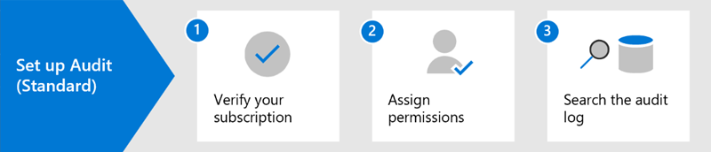
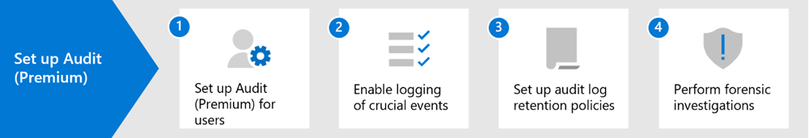

# Auditing solutions in Microsoft Purview

Microsoft Purview auditing solutions provide an integrated solution to help organizations effectively respond to security events, forensic investigations, internal investigations, and compliance obligations. Thousands of user and admin operations performed in dozens of Microsoft 365 services and solutions are captured, recorded, and retained in your organization's unified audit log. Audit records for these events are searchable by security ops, IT admins, insider risk teams, and compliance and legal investigators in your organization. This capability provides visibility into the activities performed across your Microsoft 365 organization.

[!INCLUDE [purview-preview](../includes/purview-preview.md)]

## Audit (Standard)

Microsoft Purview Audit (Standard) provides with you with the ability to log and search for audited activities and power your forensic, IT, compliance, and legal investigations.

- **Enabled by default**. Audit (Standard) is turned on by default for all organizations with the appropriate subscription. That means records for audited activities will be captured and searchable. The only setup that required is to assign the necessary permissions to access the audit log search tool (and the corresponding cmdlet) and make sure that user's are assigned the right license for Microsoft Purview Audit (Premium) features.
- **Thousands of searchable audit events**. You can search for a wide-range of audited activities that occur is most of the Microsoft 365 services in your organization. For a list of the activities you can search for, see [Audit log activities](audit-log-activities.md). For a list of the services and features that support audited activities, see [Audit log record type](/office/office-365-management-api/office-365-management-activity-api-schema#auditlogrecordtype).
- **Audit search tool in the Microsoft Purview compliance portal**. Use the Audit log search tool in the compliance portal to search for audit records. You can search for specific activities, for activities performed by specific users, and activities that occurred with a date range.

- **Search-UnifiedAuditLog cmdlet**. You can also use the **Search-UnifiedAuditLog** cmdlet in Exchange Online PowerShell (the underlying cmdlet for the search tool) to search for audit events or to use in a script. For more information, see:

  - [Search-UnifiedAuditLog cmdlet reference](/powershell/module/exchange/search-unifiedauditlog)
  - [Use a PowerShell script to search the audit log](audit-log-search-script.md)

- **Export audit records to a CSV file**. After running the Audit log search tool in the compliance portal, you can export the audit records returned by the search to a CSV file. This lets you use Microsoft Excel sort and filter on different audit record properties. You can also use Excel Power Query transform functionality to split each property in the AuditData JSON object into its own column. This lets you effectively view and compare similar data for different events. For more information, see [Export, configure, and view audit log records](audit-log-export-records.md).
- **Access to audit logs via Office 365 Management Activity API**. A third method for accessing and retrieving audit records is to use the Office 365 Management Activity API. This lets organizations retain auditing data for longer periods than the default 90 days and lets them import their auditing data to a SIEM solution. For more information, see [Office 365 Management Activity API reference](/office/office-365-management-api/office-365-management-activity-api-reference).
- **90-day audit log retention**. When an audited activity is performed by a user or admin, an audit record is generated and stored in the audit log for your organization. In Audit (Standard), records are retained for 90 days, which means you can search for activities that occurred within the past three months.

> [!IMPORTANT]
> Starting October 2023, Classic Search will be retired in place of [New Search](audit-new-search.md), which includes enhancements such as faster search times, additional search options, ability to save searches, and more.

## Audit (Premium)

Audit (Premium) builds on the capabilities of Audit (Standard) by providing audit log retention policies, longer retention of audit records, high-value intelligent insights, and higher bandwidth access to the Office 365 Management Activity API.

- **Audit log retention policies**. You can create customized audit log retention policies to retain audit records for longer periods of time up to one year (and up to 10 years for users with required add-on license). You can create a policy to retain audit records based the service where the audited activities occur, specific audited activities, or the user who performs an audited activity.
- **Longer retention of audit records**. Azure Active Directory, Exchange, OneDrive, and SharePoint audit records are retained for one year by default. Audit records for all other activities are retained for 90 days by default, or you can use audit log retention policies to configure longer retention periods.
- **Audit (Premium) intelligent insights**. Audit records for intelligent insights can help your organization conduct forensic and compliance investigations by providing visibility to events such as when mail items were accessed, or when mail items were replied to and forwarded, or when and what a user searched for in Exchange Online and SharePoint Online. These intelligent insights can help you investigate possible breaches and determine the scope of compromise.
- **Higher bandwidth to the Office 365 Management Activity API**. Audit (Premium) provides organizations with more bandwidth to access auditing logs through the Office 365 Management Activity API. Although all organizations (that have Audit (Standard) or Audit (Premium)) are initially allocated a baseline of 2,000 requests per minute, this limit will dynamically increase depending on an organization's seat count and their licensing subscription. This results in organizations with Audit (Premium) getting about twice the bandwidth as organizations with Audit (Standard).

For more detailed information about Audit (Premium) features, see [Audit (Premium) in Microsoft 365](audit-premium.md).

## Comparison of key capabilities

The following table compares the key capabilities available in Audit (Standard) and Audit (Premium). All Audit (Standard) functionality is included in Audit (Premium).

|Capability|Audit (Standard)|Audit (Premium)|
|:------|:-------------|:-------------|
|Enabled by default|||
|Thousands of searchable audit events|||
|Audit search tool in the compliance portal|||
|Search-UnifiedAuditLog cmdlet|||
|Export audit records to CSV file|||
|Access to audit logs via Office 365 Management Activity API 1|||
|90-day audit log retention|||
|1-year audit log retention|||
|10-year audit log retention 2|||
|Audit log retention policies|||
|Intelligent insights|||

> [!NOTE]
> 1 Audit (Premium) includes higher bandwidth access to the Office 365 Management Activity API, which provides faster access to audit data. 2 In addition to the required licensing for Audit (Premium) (described in the next section), a user must be assigned a 10-Year Audit Log Retention add-on license to retain their audit records for 10 years.

## Microsoft 365 services that support auditing

You can search the unified audit log for activities performed in different Microsoft 365 services. The following table lists the Microsoft 365 services, apps, and features that are supported by the unified audit log.

|Microsoft 365 service or feature|Record types|
|:-------------------------------|:-----------|
|Azure Active Directory|AzureActiveDirectory, AzureActiveDirectoryAccountLogon, AzureActiveDirectoryStsLogon|
|Azure Information Protection|AipDiscover, AipSensitivityLabelAction, AipProtectionAction, AipFileDeleted, AipHeartBeat|
|Communication compliance|ComplianceSupervisionExchange|
|Content explorer|LabelContentExplorer|
|Data connectors|ComplianceConnector|
|Data loss prevention (DLP)|ComplianceDLPSharePoint, ComplianceDLPExchange, DLPEndpoint|
|Dynamics 365|CRM|
|eDiscovery (Standard + Premium)|Discovery, AeD|
|Encrypted message portal|OMEPortal|
|Exact Data Match|MipExactDataMatch|
|Exchange Online|ExchangeAdmin, ExchangeItem, ExchangeItemAggregated|
|Forms|MicrosoftForms|
|Information barriers|InformationBarrierPolicyApplication|
|Microsoft 365 Defender|AirInvestigation, AirManualInvestigation, AirAdminActionInvestigation, MS365DCustomDetection|
|Microsoft Defender Experts|DefenderExpertsforXDRAdmin|
|Microsoft Defender for Identity (MDI)|MicrosoftDefenderForIdentityAudit|
|Microsoft Planner|PlannerCopyPlan, PlannerPlan, PlannerPlanList, PlannerRoster, PlannerRosterSensitivityLabel, PlannerTask, PlannerTaskList, PlannerTenantSettings |
|Microsoft Project for the web|ProjectAccessed, ProjectCreated, ProjectDeleted, ProjectTenantSettingsUpdated, ProjectUpdated, RoadmapAccessed,RoadmapCreated, RoadmapDeleted, RoadmapItemAccessed,RoadmapItemCreated,RoadmapItemDeleted, RoadmapItemUpdated, RoadmapTenantSettingsUpdated, RoadmapUpdated, TaskAccessed, TaskCreated,TaskDeleted, TaskUpdated|
|Microsoft Purview Information Protection (MIP) labels|MIPLabel, MipAutoLabelExchangeItem, MipAutoLabelSharePointItem, MipAutoLabelSharePointPolicyLocation|
|Microsoft Teams|MicrosoftTeams|
|Microsoft To Do|MicrosoftToDo, MicrosoftToDoAudit|
|MyAnalytics|MyAnalyticsSettings|
|OneDrive for Business|OneDrive|
|Power Apps|PowerAppsApp, PowerAppsPlan|
|Power Automate|MicrosoftFlow|
|Power BI|PowerBIAudit|
|Quarantine|Quarantine|
|Sensitive information types|DlpSensitiveInformationType|
|Sensitivity labels|MIPLabel, SensitivityLabelAction, SensitivityLabeledFileAction, SensitivityLabelPolicyMatch|
|SharePoint Online|SharePoint, SharePointFileOperation,SharePointSharingOperation, SharePointListOperation, SharePointCommentOperation|
|Stream|MicrosoftStream|
|SystemSync|DataShareCreated, DataShareDeleted, GenerateCopyOfLakeData, DownloadCopyOfLakeData|
|Threat Intelligence|ThreatIntelligence, ThreatIntelligenceUrl, ThreatFinder, ThreatIntelligenceAtpContent|
|Viva Goals|VivaGoals|
|Viva Insights|VivaInsights|
|Yammer|Yammer|

For more information about the operations that are audited in each of the services listed in the previous table, see the [Audit log activities](audit-log-activities.md) article.

The previous table also identifies the record type value to use to search the audit log for activities in the corresponding service using the **Search-UnifiedAuditLog** cmdlet in Exchange Online PowerShell or by using a PowerShell script. Some services have multiple record types for different types of activities within the same service. For a more complete list of auditing record types, see [Office 365 Management Activity API schema](/office/office-365-management-api/office-365-management-activity-api-schema#auditlogrecordtype).

 For more information about using PowerShell to search the audit log, see:

- [Search-UnifiedAuditLog](/powershell/module/exchange/search-unifiedauditlog)
- [Use a PowerShell script to search the audit log](audit-log-search-script.md)

## Licensing requirements

### Audit (Standard)

- Microsoft Business Basic/Standard subscriptions
- Microsoft 365 Apps for Business subscription
- Microsoft 365 Enterprise E3 subscription
- Microsoft 365 Business Premium
- Microsoft 365 Education A3 subscription
- Microsoft 365 Government G1/G3 subscriptions
- Microsoft 365 Frontline F1 or F3 subscription, or F5 Security add-on
- Office 365 Enterprise E1/E3 subscription
- Office 365 Education A1/A3 subscriptions

### Audit (Premium)

Microsoft Purview Audit (Premium) capabilities are included with Microsoft Purview. The licensing requirements may vary even within capabilities, depending on configuration options. For licensing requirements, guidance, and options, see the [Microsoft 365 guidance for security & compliance](/office365/servicedescriptions/microsoft-365-service-descriptions/microsoft-365-tenantlevel-services-licensing-guidance/microsoft-365-security-compliance-licensing-guidance#microsoft-purview-audit-premium).

## Set up Microsoft Purview auditing solutions

To get started using the auditing solutions in Microsoft Purview, see the following setup guidance.

### Set up Audit (Standard)

The first step is to set up Audit (Standard) and then start running audit log searches.

1. Verify that your organization has a subscription that supports Audit (Standard) and if applicable, a subscription that supports Audit (Premium).

2. Assign permissions in Exchange Online to people in your organization who will use the audit log search tool in the compliance portal or use the **Search-UnifiedAuditLog** cmdlet. Specifically, users must be assigned the *View-Only Audit Logs* or *Audit Logs* role in Exchange Online.

3. Search the audit log. After completing step 1 and step 2, users in your organization can use the audit log search tool (or corresponding cmdlet) to search for audited activities.

For more detailed instructions, see [Set up Audit (Standard)](audit-standard-setup.md).

### Set up Audit (Premium)

If your organization has a subscription that supports Audit (Premium), perform the following steps to set up and use the additional capabilities in Audit (Premium).

1. Set up Audit (Premium) for users. This step consists of the following tasks:

   - Verifying that users are assigned the appropriate license or add-on license for Audit (Premium).
   - Turning on the Audit (Premium) app/service plan must be for those users.
   - Enabling the auditing of intelligent insights and then turning on the Audit (Premium) app/service plan for those users.

2. Enable Audit (Premium) events to be logged when users perform searches in Exchange Online and SharePoint Online.

3. Set up audit log retention policies. In addition to the default policy that retains Exchange, SharePoint, and Azure AD audit records for one year, you can create additional audit log retention policies to meet the requirements of your organization's security operations, IT, and compliance teams.

4. Search for crucial Audit (Premium) events and other activities when conducting forensic investigations. After completing step 1 and step 2, you can search the audit log for Audit (Premium) events and other activities during forensic investigations of compromised accounts and other types of security or compliance investigations.

For more detailed instructions, see [Set up Audit (Premium)](audit-premium-setup.md).

<!--
## Encrypt audit records using Customer Key

You can enable Customer Key encryption for audit records. Auditing builds on the [Service encryption with Customer Key](customer-key-overview.md) to encrypt sensitive information in your organization's auditing data. Implementing Customer Key provides extra protection by preventing unauthorized systems or Microsoft data center personnel from viewing your auditing data in the auditing pipeline and at rest. Using Customer Key to encrypt your auditing data also helps you meet regulatory or compliance obligations because your organization provides and controls the encryption keys.

To implement Customer Key for auditing, you have to create a multi-workload Data Encryption Policy (DEP), which defines the encryption hierarchy. For detailed step-by-step instructions, see [Set up Customer Key](customer-key-set-up.md).

> [!NOTE]
> Not all audit records in your organization are encrypted. The Microsoft Purview service that generates specific audit records for activity in that service defines whether the audit record is encrypted or not.
-->

## Training

Training your security operations team, IT administrators, and compliance investigators team in the fundamentals for Audit (Standard) and Audit (Premium) can help your organization get started more quickly using auditing to help with your investigations. Microsoft Purview provides the following resource to help these users in your organization getting started with auditing: [Describe the eDiscovery and audit capabilities of Microsoft Purview](/training/modules/describe-ediscovery-capabilities-of-microsoft-365).
